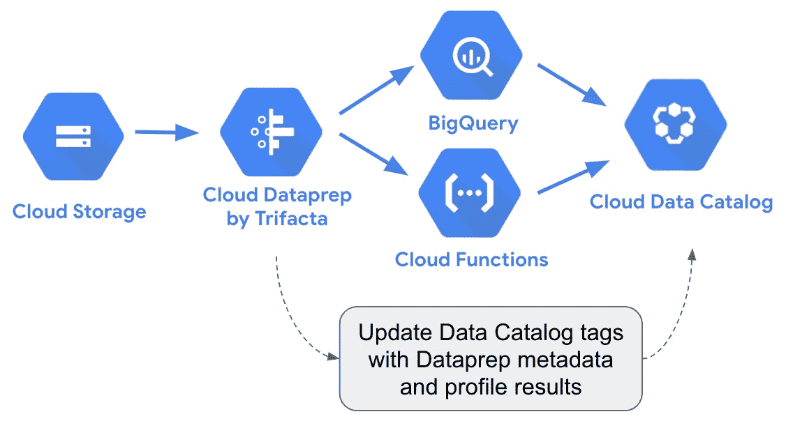
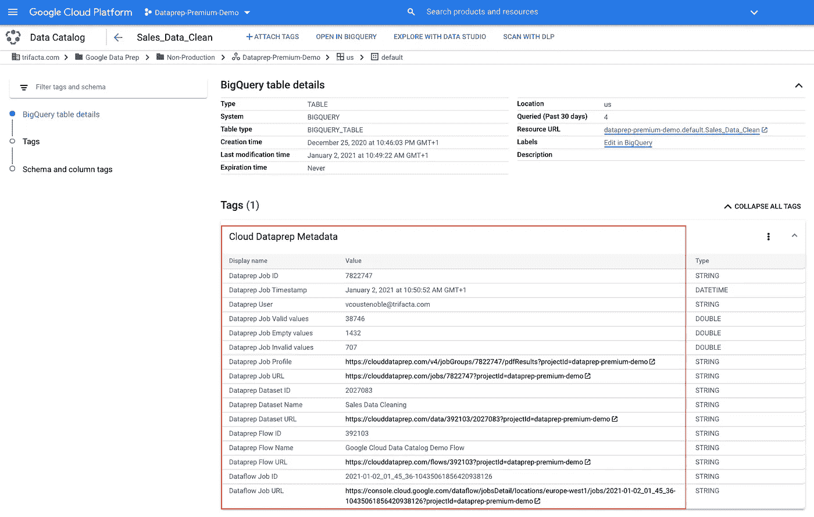
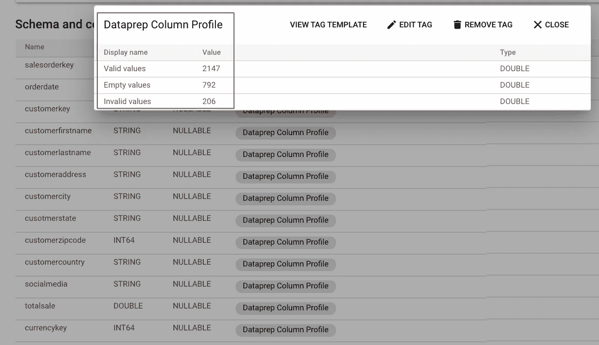
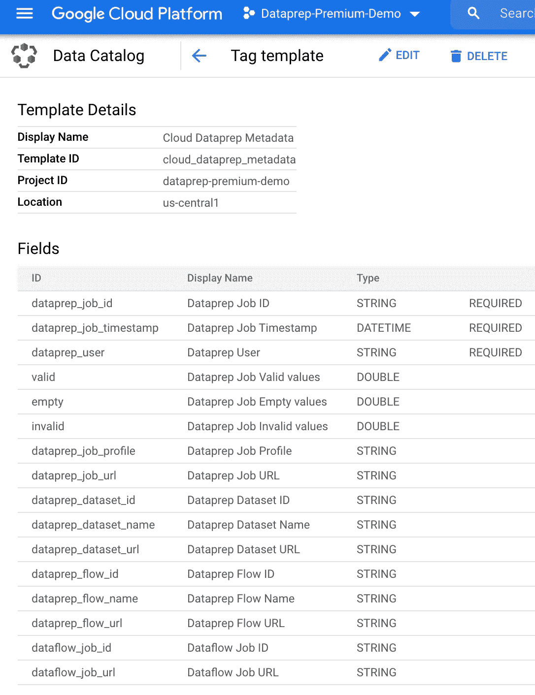
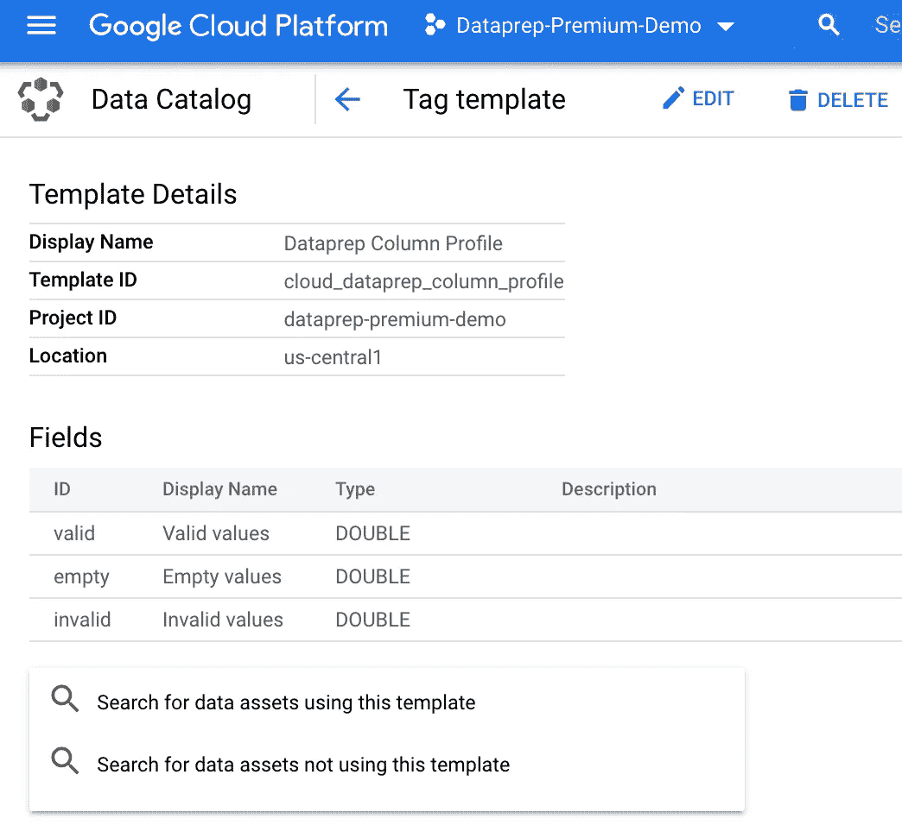
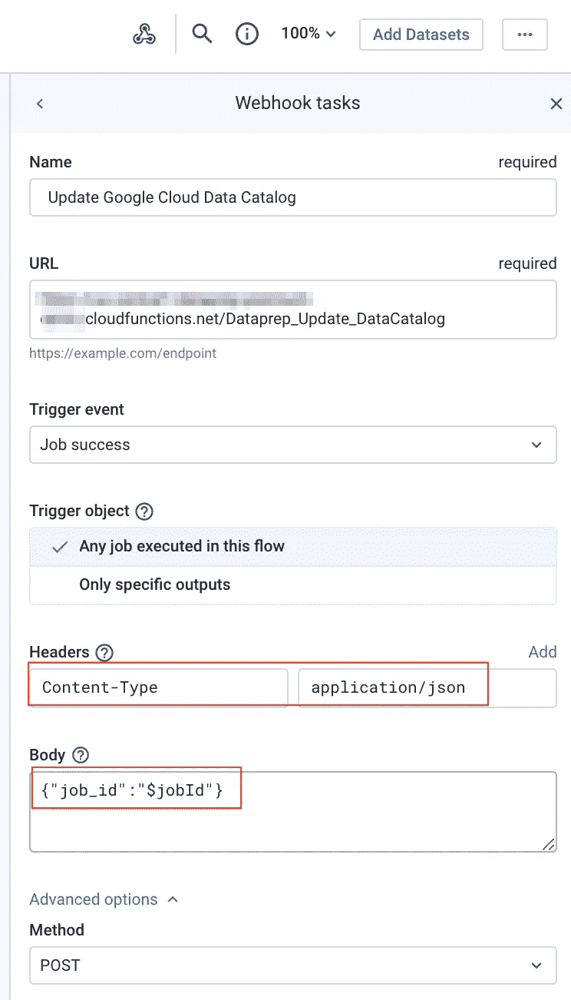
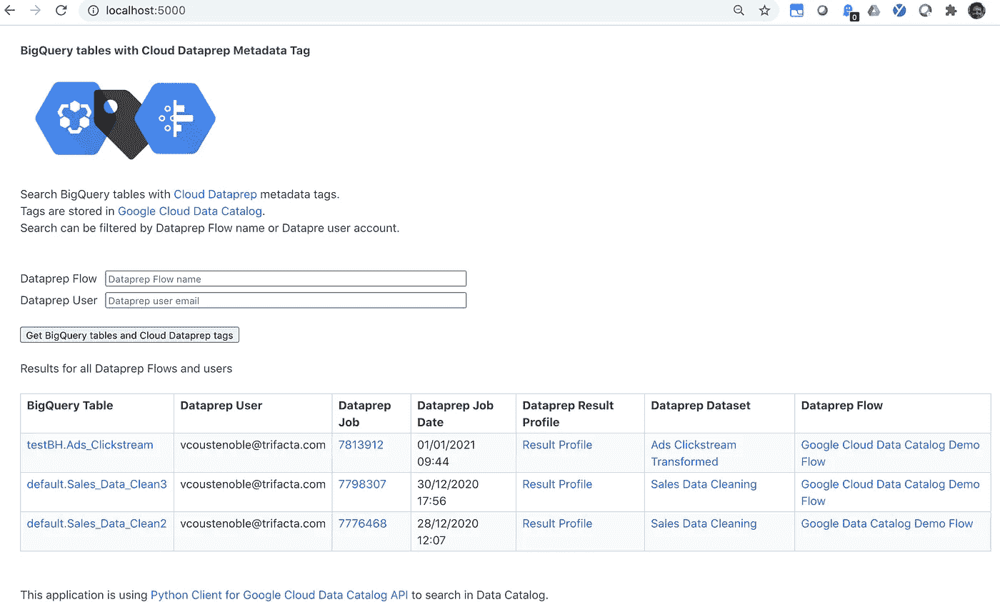

# 用云数据准备元数据更新 Google 数据目录标签

> 原文：<https://medium.com/google-cloud/update-google-data-catalog-tags-with-cloud-dataprep-metadata-db74e6ee04c8?source=collection_archive---------2----------------------->

这篇文章链接到 Github 存储库[https://Github . com/victor couse/Google-Data-Catalog-Data prep](https://github.com/victorcouste/google-data-catalog-dataprep)解释了如何通过 Python [云函数](https://cloud.google.com/functions)使用 [Cloud Dataprep](https://cloud.google.com/dataprep) 元数据和列的配置文件在 BigQuery 表上创建或更新 [Google Cloud Data Catalog](https://cloud.google.com/data-catalog/) 标签。

创建或更新的 2 个数据目录标记:

*   [**Dataprep 作业元数据**](https://github.com/victorcouste/google-data-catalog-dataprep/blob/main/tag_templates/dataprep_metadata_tag_template.txt) 标签，附加到 BigQuery 表，包含来自 Dataprep 作业的信息，用于创建或更新 BigQuery 表:用户、Dataprep 作业(id、名称、url、时间戳)、Dataprep 数据集(id、名称、url)、Dataprep 流(id、名称、url)、作业配置文件(url 和有效、无效空值的数量)以及数据流作业(id、url)。

数据目录中的云 Dataprep 元数据标记示例

*   [**Dataprep 作业列的 Profile**](https://github.com/victorcouste/google-data-catalog-dataprep/blob/main/tag_templates/dataprep_column_profile_tag_template.txt) 标记附加到所有 BigQuery 表列，包含每列的有效、无效和空值的数量。

数据目录中云数据准备列配置文件标记的示例

要激活、学习和使用云数据目录，请前往[https://cloud.google.com/data-catalog](https://cloud.google.com/data-catalog)和[https://console.cloud.google.com/datacatalog](https://console.cloud.google.com/datacatalog)。

Github 存储库包含从 [Dataprep Webhook](https://docs.trifacta.com/display/DP/Create+Flow+Webhook+Task) 触发的云函数 Python 代码，用于创建或更新 2 个数据目录标签。

该云函数使用:

*   [用于谷歌云数据目录 API 的 Python 客户端](https://googleapis.dev/python/datacatalog/latest/index.html#)
*   [云数据准备 REST API](https://api.trifacta.com/dataprep-premium/index.html)

在您的云功能中，您需要 5 个文件:

*   [main.py](https://github.com/victorcouste/google-data-catalog-dataprep/blob/main/main.py)
*   [config.py](https://github.com/victorcouste/google-data-catalog-dataprep/blob/main/config.py) 在这里你需要更新你的 **GCP 项目名**(在这里创建标签模板)和 [**Dataprep 访问令牌**](https://docs.trifacta.com/display/DP/Access+Tokens+Page) (使用 Dataprep API)。如果需要，还可以更新 2 个标记模板 ID。
*   [Data Catalog _ functions . py](https://github.com/victorcouste/google-data-catalog-dataprep/blob/main/datacatalog_functions.py)获取或更新数据目录对象。
*   [dataprep_metadata.py](https://github.com/victorcouste/google-data-catalog-dataprep/blob/main/dataprep_metadata.py) 获取云 dataprep 元数据。
*   [requirements.txt](https://github.com/victorcouste/google-data-catalog-dataprep/blob/main/requirements.txt)

在运行云功能(并创建或更新标签)之前，您需要为 Dataprep 创建两个数据目录标签模板([作业元数据](https://github.com/victorcouste/google-data-catalog-dataprep/blob/main/tag_templates/dataprep_metadata_tag_template.txt)和[作业列概要文件](https://github.com/victorcouste/google-data-catalog-dataprep/blob/main/tag_templates/dataprep_column_profile_tag_template.txt))。

云数据准备元数据标记模板

云数据准备列配置文件标记模板

对于此操作，您可以使用:

*   **云控制台**，在这里你可以[管理你的标签模板](https://console.cloud.google.com/datacatalog?q=type%3DTAG_TEMPLATE)。
*   **gcloud** 和命令`gcloud data-catalog tag-templates create.` 你可以在[g cloud _ tag-templates _ create . sh](https://github.com/victorcouste/google-data-catalog-dataprep/blob/main/tag_templates/gcloud_tag-templates_create.sh)中找到完整的命令行，更多细节在 GCP 文档中有和[示例](https://cloud.google.com/data-catalog/docs/quickstart-tagging#data-catalog-quickstart-gcloud)和[参考](https://cloud.google.com/sdk/gcloud/reference/data-catalog/tag-templates/create)。但是请注意，使用 gcloud 命令行，您无法管理模板标签字段的顺序，字段将按字母顺序排列。
*   **REST API** 带有 2 个标签模板 json 文件[data prep _ metadata _ tag _ template . JSON](https://github.com/victorcouste/google-data-catalog-dataprep/blob/main/tag_templates/dataprep_metadata_tag_template.json)和[data prep _ column _ profile _ tag _ template . JSON](https://github.com/victorcouste/google-data-catalog-dataprep/blob/main/tag_templates/dataprep_column_profile_tag_template.json)。GCP 文档中使用 REST API 的说明和细节，带有示例[和参考](https://cloud.google.com/data-catalog/docs/quickstart-tagging#data-catalog-quickstart-drest)和参考。

然后，当云函数被创建后，要使用它，您只需以 JSON 格式传递 Dataprep 作业 ID，如`{"job_id":"7827359"}`。

为了从云 Dataprep 流中触发它，您可以在云函数端点上使用一个 [Webhook](https://docs.trifacta.com/display/DP/Create+Flow+Webhook+Task) ，在 POST 主体中使用`{"job_id":"$jobId"}`。

Cloud Dataprep Webhook 来调用数据目录云函数

当创建数据目录模板标签时，以及当在 BigQuery 表上创建或更新标签时，您可以从 https://console.cloud.google.com/datacatalog 的 GCP 控制台界面[中找到所有结果。](https://console.cloud.google.com/datacatalog)

最后，您还可以在云数据目录中搜索带有 Dataprep 标记的 BigQuery 表，该标记来自您自己的应用程序，如[https://github . com/victorcouste/Data prep-Data Catalog-explorer](https://github.com/victorcouste/dataprep-datacatalog-explorer)

快乐的争吵和快乐的标记！