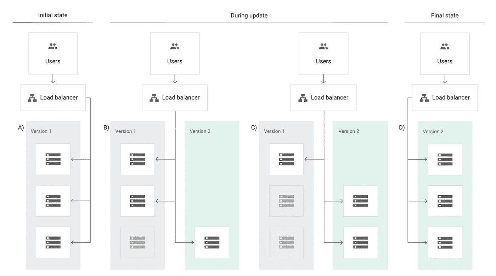
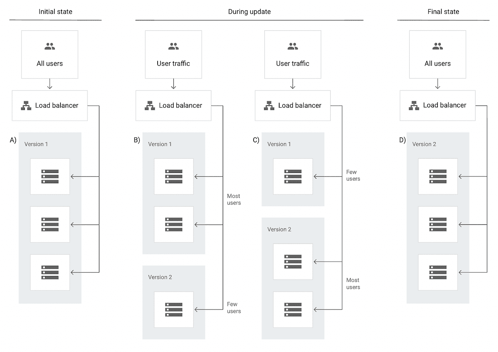
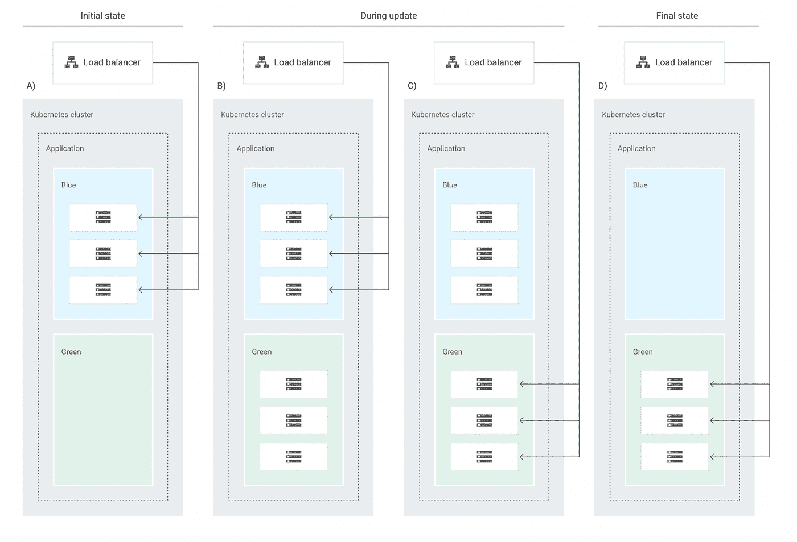
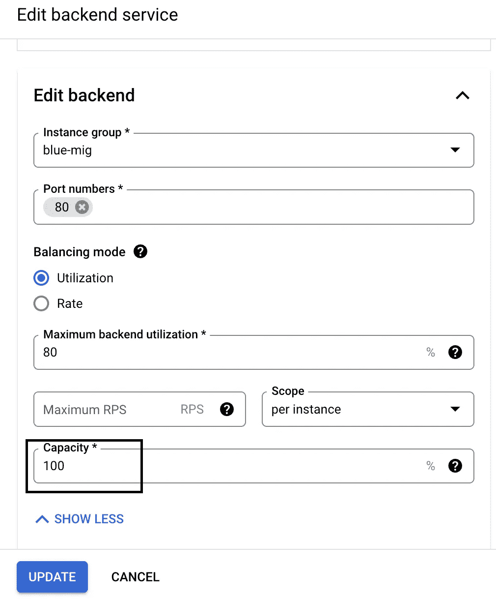
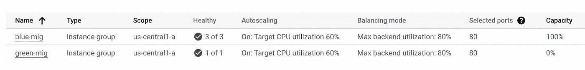

# 云负载均衡器后运行 MIG 的更新策略

> 原文：<https://medium.com/google-cloud/update-strategies-for-mig-running-behind-cloud-load-balancer-90a3898b5cb3?source=collection_archive---------6----------------------->

本文描述了在云负载均衡器后面运行的 MIG 中更新实例模板版本的不同策略。

计算引擎根据实例模板中指定的配置在 MIG 中维护虚拟机。

假设您有一个新版本的实例模板，并且希望将这个新版本的实例模板用于 MIG 中的所有虚拟机，本文档描述了三种不同的策略来升级 MIG 中的虚拟机。

*   滚动更新
*   金丝雀更新
*   蓝色/绿色更新

## 滚动更新

基本滚动更新是逐渐应用于 MIG 中所有实例的更新，直到所有实例都更新到最新的预期配置。滚动更新会自动跳过已经处于最新配置中的实例。

滚动更新

[在 MIG 中自动应用虚拟机配置更新|计算引擎文档|谷歌云](https://cloud.google.com/compute/docs/instance-groups/rolling-out-updates-to-managed-instance-groups#starting_a_basic_rolling_update)

## 金丝雀更新

canary 更新是应用于组中实例子集的更新。使用 canary update，您可以在随机的实例子集上测试新功能或升级，而不是对所有实例进行潜在的破坏性更新。如果更新进展不顺利，您只需要回滚实例的子集，将对用户的干扰降到最低。

金丝雀更新

[在 MIG 中自动应用虚拟机配置更新|计算引擎文档|谷歌云](https://cloud.google.com/compute/docs/instance-groups/rolling-out-updates-to-managed-instance-groups#canary_updates)

## **蓝/绿更新**

蓝/绿更新是一种更新，其中新版本的 MIG 使用最新的启动模板，MIG 中的实例数量与现有 MIG 的容量相等。

因为这是一个蓝/绿更新，所以您不是更新 MIG 中的实例，而是在负载平衡器后面更改整个 MIG。

蓝色/绿色

使用蓝/绿更新来更新 MIG 的步骤:

*   最初创建一个负载平衡器
*   制造一架米格飞机(蓝色)
*   给蓝色米格战机发送 100%的流量。

蓝色米格

*   使用新的实例模板旋转新的 MIG(绿色)。
*   最初更新负载平衡器的后端配置，以向该 MIG 发送 0%的流量。

*   MIG 稳定后，更新负载平衡器的后端，将 100%的流量发送给绿色 MIG，并删除蓝色 MIG。

> 在滚动/淡黄色更新中，MIG 中的虚拟机更新到新的实例模板版本，而在蓝色/绿色中，整个 MIG 更新到新的实例模板版本并连接到负载平衡器。