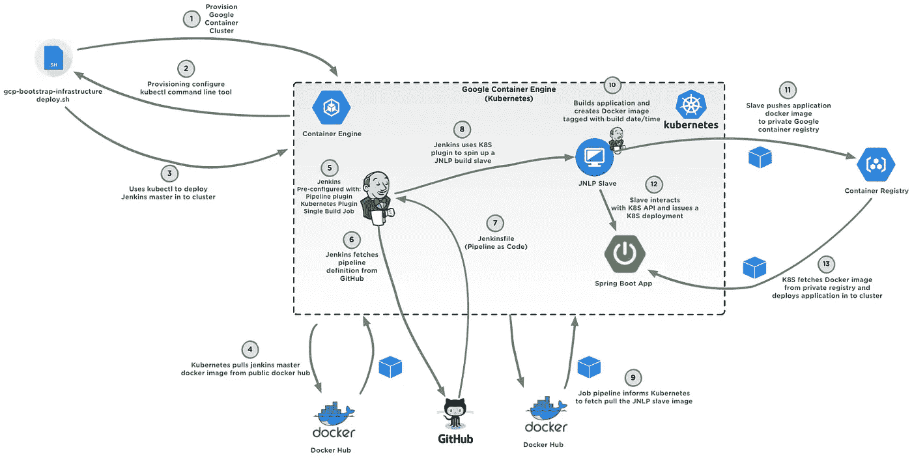

# 更新:GCP 从零到连续交货

> 原文：<https://medium.com/google-cloud/updated-zero-to-continuous-delivery-with-gcp-10a1de80454c?source=collection_archive---------0----------------------->

似乎人们已经发现我的[零到持续交付教程](/google-cloud/zero-to-continuous-delivery-with-google-cloud-platform-8e3bf1312fb5#.5bz9j7oyz)和指南很有用。感谢所有分享评论、提供反馈和分享代码库的人。

本周，我更新了代码库，以便与最新的 GKE (Kubernetes)版本 1.5.2 一起工作——因此， [bash 脚本现在指定](https://github.com/eggsy84/gcp-bootstrap-infrastructure/blob/master/bootstrap/deploy.sh#L39)在 GKE 上运行 [Kubernetes](http://kubernetes.io) 版本。

代码也进行了更新，以反映 Jenkins Kubernetes 插件中的更新。例如, [Jenkins JNLP 从属服务器现在定义在应用程序 Jenkinsfile 中，而不是 Jenkins config.xml 的](https://github.com/eggsy84/gcp-spring-boot-app/blob/master/Jenkinsfile#L1),并且很好地将更多的基础设施定义为代码。

根据反馈，我还花了一些时间添加了一个图表，概述了尝试的过程，并对各种活动部件进行了更多的说明。

GCP 零到光盘