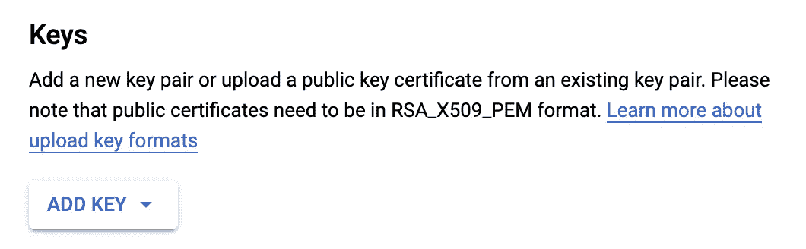
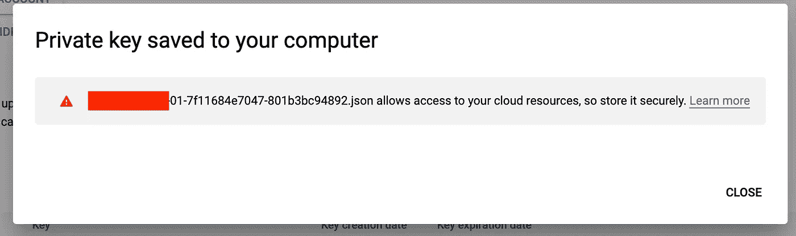
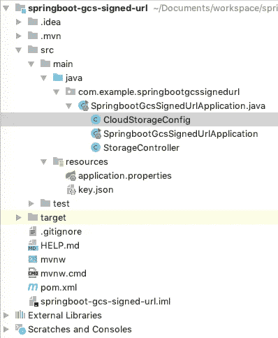
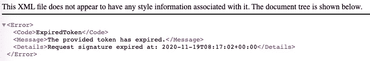

# 将文件上传到 GCS，通过使用 Spring Cloud 过期的 URL 访问

> 原文：<https://medium.com/google-cloud/upload-file-to-gcs-create-url-which-expires-using-spring-cloud-f58d132aac74?source=collection_archive---------1----------------------->

如果你想上传一个文件到谷歌云存储(GCS)——无论是在 GCP 境内还是境外——并通过一个过期的 URL 访问上传的文件，这就是你要找的。


我们将结合 Spring Cloud libs 使用 Spring Boot 反应库 Webflux 来访问 Google 云存储。

我们将创建一个存储桶和一个私钥来访问该存储桶。然后，我们使用这个密钥从 GCP 外部访问这个桶。

# 履行

**第 1 部分:创建 bucket，从服务帐户下载密钥**

登录您的 GCP 控制台。打开 Google Shell 并创建一个 Bucket。

```
gsutil mb gs://some-bucket
```

确保创建了存储桶后，导航到服务帐户部分。


查找与新创建的存储桶相关联的服务帐户。

添加新密钥:



该密钥将自动下载到浏览器中。



json 的内容看起来会像这样。

```
{
  **"type"**: **"service_account"**,
  **"project_id"**: **"someaccount-gcp-01-7f11684e7047"**,
  **"private_key_id"**: **"..."**,
  **"private_key"**: **"..."**,
  **"client_email"**: **"someaccount-gcp-01-7f11684e7047@someaccount-gcp-01-7f11684e7047.iam.gserviceaccount.com"**,
  **"client_id"**: **"..."**,
  **"auth_uri"**: **"https://accounts.google.com/o/oauth2/auth"**,
  **"token_uri"**: **"https://oauth2.googleapis.com/token"**,
  **"auth_provider_x509_cert_url"**: **"https://www.googleapis.com/oauth2/v1/certs"**,
  **"client_x509_cert_url"**: **"https://www.googleapis.com/robot/v1/metadata/x509/someaccount-gcp-01-7f11684e7047%40someaccount-gcp-01-7f11684e7047.iam.gserviceaccount.com"** }
```

**第二部分:创建一个 Spring Boot 应用**

pom.xml

```
*<?***xml version="1.0" encoding="UTF-8"***?>* <**project  xmlns:xsi="http://www.w3.org/2001/XMLSchema-instance"
   xsi:schemaLocation="http://maven.apache.org/POM/4.0.0 https://maven.apache.org/xsd/maven-4.0.0.xsd"**>
   <**modelVersion**>4.0.0</**modelVersion**>
   <**parent**>
      <**groupId**>org.springframework.boot</**groupId**>
      <**artifactId**>spring-boot-starter-parent</**artifactId**>
      <**version**>2.3.5.RELEASE</**version**>
      <**relativePath**/> *<!-- lookup parent from repository -->* </**parent**>
   <**groupId**>com.example</**groupId**>
   <**artifactId**>springboot-gcs-signed-url</**artifactId**>
   <**version**>0.0.1-SNAPSHOT</**version**>
   <**name**>springboot-gcs-signed-url</**name**>
   <**description**>To upload a document to GCS and create a signed URL from it</**description**> <**properties**>
      <**java.version**>1.8</**java.version**>
      <**spring-cloud.version**>Hoxton.SR9</**spring-cloud.version**>
   </**properties**> <**dependencies**>
      <**dependency**>
         <**groupId**>org.springframework.boot</**groupId**>
         <**artifactId**>spring-boot-starter-webflux</**artifactId**>
      </**dependency**>
      <**dependency**>
         <**groupId**>org.springframework.cloud</**groupId**>
         <**artifactId**>spring-cloud-gcp-starter-storage</**artifactId**>
      </**dependency**> <**dependency**>
         <**groupId**>org.springframework.boot</**groupId**>
         <**artifactId**>spring-boot-starter-test</**artifactId**>
         <**scope**>test</**scope**>
         <**exclusions**>
            <**exclusion**>
               <**groupId**>org.junit.vintage</**groupId**>
               <**artifactId**>junit-vintage-engine</**artifactId**>
            </**exclusion**>
         </**exclusions**>
      </**dependency**>
      <**dependency**>
         <**groupId**>io.projectreactor</**groupId**>
         <**artifactId**>reactor-test</**artifactId**>
         <**scope**>test</**scope**>
      </**dependency**>
      <**dependency**>
         <**groupId**>org.projectlombok</**groupId**>
         <**artifactId**>lombok</**artifactId**>
      </**dependency**>
   </**dependencies**> <**dependencyManagement**>
      <**dependencies**>
         <**dependency**>
            <**groupId**>org.springframework.cloud</**groupId**>
            <**artifactId**>spring-cloud-dependencies</**artifactId**>
            <**version**>${spring-cloud.version}</**version**>
            <**type**>pom</**type**>
            <**scope**>import</**scope**>
         </**dependency**>
      </**dependencies**>
   </**dependencyManagement**> <**build**>
      <**plugins**>
         <**plugin**>
            <**groupId**>org.springframework.boot</**groupId**>
            <**artifactId**>spring-boot-maven-plugin</**artifactId**>
         </**plugin**>
      </**plugins**>
   </**build**></**project**>
```

这里的关键库是:

```
spring-cloud-gcp-starter-storage
```

在 resources 文件夹中创建文件 key.json，并添加在第 1 部分的浏览器中下载的文件的内容。

告诉 GCP 库像这样从 key.json 加载凭证:

```
**spring.cloud.gcp.credentials.location**=classpath:key.json
```

创建 StorageController。

```
@RestController
@Slf4j
**class** StorageController {

    @Getter(AccessLevel.***PROTECTED***)
    @Setter(AccessLevel.***PROTECTED***)
    @Autowired
    **private** Storage **storage**;

    @Value(**"bucketname"**)
    String **bucketName**;
    @Value(**"subdirectory"**)
    String **subdirectory**;

    @PostMapping(value = **"/upload"**, consumes = MediaType.***MULTIPART_FORM_DATA_VALUE***)
    **public** Mono<URL> uploadFile(@RequestPart(**"file"**) FilePart filePart) {
        *//Convert the file to a byte array* **final byte**[] byteArray = convertToByteArray(filePart);

        *//Prepare the blobId
        //BlobId is a combination of bucketName + subdirectiory(optional) + fileName* **final** BlobId blobId = constructBlobId(**bucketName**, **subdirectory**, filePart.filename());

        **return** Mono.*just*(blobId)
                *//Create the blobInfo* .map(bId -> BlobInfo.*newBuilder*(blobId)
                        .setContentType(**"text/plain"**)
                        .build())
                *//Upload the blob to GCS* .doOnNext(blobInfo -> getStorage().create(blobInfo, byteArray))
                *//Create a Signed "Path Style" URL to access the newly created Blob
                //Set the URL expiry to 10 Minutes* .map(blobInfo -> createSignedPathStyleUrl(blobInfo, 10, TimeUnit.***MINUTES***));
    }

    **private** URL createSignedPathStyleUrl(BlobInfo blobInfo,
                                         **int** duration, TimeUnit timeUnit) {
        **return** getStorage()
                .signUrl(blobInfo, duration, timeUnit, Storage.SignUrlOption.*withPathStyle*());
    }

    */**
     * Construct Blob ID
     *
     ** ***@param bucketName*** *** ***@param subdirectory*** *optional
     ** ***@param fileName*** *** ***@return*** **/* **private** BlobId constructBlobId(String bucketName, @Nullable String subdirectory,
                                   String fileName) {
        **return** Optional.*ofNullable*(subdirectory)
                .map(s -> BlobId.*of*(bucketName, subdirectory + **"/"** + fileName))
                .orElse(BlobId.*of*(bucketName, fileName));
    }

    */**
     * Here, we convert the file to a byte array to be sent to GCS Libraries
     *
     ** ***@param filePart*** *File to be used
     ** ***@return*** *Byte Array with all the contents of the file
     */* @SneakyThrows
    **private byte**[] convertToByteArray(FilePart filePart) {
        **try** (ByteArrayOutputStream bos = **new** ByteArrayOutputStream()) {
            filePart.content()
                    .subscribe(dataBuffer -> {
                        **byte**[] bytes = **new byte**[dataBuffer.readableByteCount()];
                        ***log***.trace(**"readable byte count:"** + dataBuffer.readableByteCount());
                        dataBuffer.read(bytes);
                        DataBufferUtils.*release*(dataBuffer);
                        **try** {
                            bos.write(bytes);
                        } **catch** (IOException e) {
                            ***log***.error(**"read request body error..."**, e);
                        }
                    });

            **return** bos.toByteArray();
        }
    }

}
```

让我们分解上面的代码，理解每一部分。

首先，我们将 FilePart 文件转换成一个字节数组。

```
*/**
 * Here, we convert the file to a byte array to be sent to GCS Libraries
 *
 ** ***@param filePart*** *File to be used
 ** ***@return*** *Byte Array with all the contents of the file
 */* @SneakyThrows
**private byte**[] convertToByteArray(FilePart filePart) {
    **try** (ByteArrayOutputStream bos = **new** ByteArrayOutputStream()) {
        filePart.content()
                .subscribe(dataBuffer -> {
                    **byte**[] bytes = **new byte**[dataBuffer.readableByteCount()];
                    ***log***.trace(**"readable byte count:"** + dataBuffer.readableByteCount());
                    dataBuffer.read(bytes);
                    DataBufferUtils.*release*(dataBuffer);
                    **try** {
                        bos.write(bytes);
                    } **catch** (IOException e) {
                        ***log***.error(**"read request body error..."**, e);
                    }
                });

        **return** bos.toByteArray();
    }
}
```

然后，我们构造 BlobId。

```
*/**
 * Construct Blob ID
 *
 ** ***@param bucketName*** *** ***@param subdirectory*** *optional
 ** ***@param fileName*** *** ***@return*** **/* **private** BlobId constructBlobId(String bucketName, @Nullable String subdirectory,
                               String fileName) {
    **return** Optional.*ofNullable*(subdirectory)
            .map(s -> BlobId.*of*(bucketName, subdirectory + **"/"** + fileName))
            .orElse(BlobId.*of*(bucketName, fileName));
}
```

这个 BlobId 用于创建 BlobInfo。这个 BlobInfo 用于将文件上传到 GCS。

```
Mono.*just*(blobId)
        *//Create the blobInfo* .map(bId -> BlobInfo.*newBuilder*(blobId)
                .setContentType(**"text/plain"**)
                .build())
        *//Upload the blob to GCS* .doOnNext(blobInfo -> getStorage().create(blobInfo, byteArray))
        *//Create a Signed "Path Style" URL to access the newly created Blob
        //Set the URL expiry to 10 Minutes* .map(blobInfo -> createSignedPathStyleUrl(blobInfo, 10, TimeUnit.***MINUTES***));
```

然后，我们继续创建一个设置了到期时间的 URL。

```
**private** URL createSignedPathStyleUrl(BlobInfo blobInfo,
                                     **int** duration, TimeUnit timeUnit) {
    **return** getStorage()
            .signUrl(blobInfo, duration, timeUnit, **Storage.SignUrlOption.*withPathStyle*()**);
}
```

注意:我们正在使用“路径样式”创建一个 URL。

```
Storage.SignUrlOption.*withPathStyle*()
```

生成一个路径样式的 URL，它将桶名放在 URL 的路径部分，而不是主机名中，例如'[https://storage.googleapis.com/mybucket/...'](https://storage.googleapis.com/mybucket/...')。

或者，您可以使用其他样式，如虚拟托管样式，它将存储桶添加到 URI 的主机部分，而不是路径中，例如'[https://mybucket.storage.googleapis.com/...'](https://mybucket.storage.googleapis.com/...')

最后，在 application.properties 中添加以下属性

```
**bucketname**=bucketName **subdirectory**=media **spring.cloud.gcp.credentials.location**=classpath:key.json
```

包的结构将是这样的。



我们现在可以运行应用程序并执行下面的 curl。

```
curl — location — request POST ‘[http://localhost:8080/upload'](http://localhost:8080/upload') \
 — form ‘file=@/Users/Sample.txt’
```

你会得到一个“路径风格”的网址。

```
[https://storage.googleapis.com/some-bucket/media/ad7313fc-0c54-4de4-9371-e3990bd2f7b4?GoogleAccessId=sa-gcs-someaccount@some-project.iam.gserviceaccount.com&Expires=1605773822&Signature=FwQjidH9lryP9UjnKMixOsKVzksowirRIYNnthbcL%2FyVmQ8DkLvBXhMGoXys3qAVAuYQAPHEnl2KvetB%2FyVwF5kdHR4o3UeB3AyGvL1zJRjNq2Ymf%2F%2FTOue3bBmZJ6pal4bpxwryWECIzxhJm8CCnAZ1d6TIZtcoU7SzJBILlLwzGTT7n%2FOFthWdbvA7mjMKw%2Fg%2BnlQA8Ltr4mlTIBpfCsmw5Hl2jm%2FbI8zaOJc7%2BtpWhGTdiZww3hgjpEqIZe%2F2r9ZRDQRDPgEntZSymoV3xuI1WBAheYkY0ov7QbRrWi9eH8vGjnBRmwT7znUmS9rj3nUwVKsKfCRziCsOf3jdgw%3D%3D](https://storage.googleapis.com/clwcirsomni-cart-podoc-stage/podocs/ad7313fc-0c54-4de4-9371-e3990bd2f7b4?GoogleAccessId=sa-gcs-omni-cart-podoc-stage@gcp-ushi-carbon-svcs-stage.iam.gserviceaccount.com&Expires=1605773822&Signature=FwQjidH9lryP9UjnKMixOsKVzksowirRIYNnthbcL%2FyVmQ8DkLvBXhMGoXys3qAVAuYQAPHEnl2KvetB%2FyVwF5kdHR4o3UeB3AyGvL1zJRjNq2Ymf%2F%2FTOue3bBmZJ6pal4bpxwryWECIzxhJm8CCnAZ1d6TIZtcoU7SzJBILlLwzGTT7n%2FOFthWdbvA7mjMKw%2Fg%2BnlQA8Ltr4mlTIBpfCsmw5Hl2jm%2FbI8zaOJc7%2BtpWhGTdiZww3hgjpEqIZe%2F2r9ZRDQRDPgEntZSymoV3xuI1WBAheYkY0ov7QbRrWi9eH8vGjnBRmwT7znUmS9rj3nUwVKsKfCRziCsOf3jdgw%3D%3D)
```

将它粘贴到浏览器中，您就可以下载该文件了。

等待 10 分钟，让 URL 过期，然后再次尝试访问该 URL。您将得到一个错误。



你可以在 GitHub [中找到完整的项目。](https://github.com/anoophp777/springboot-gcs-signed-url)