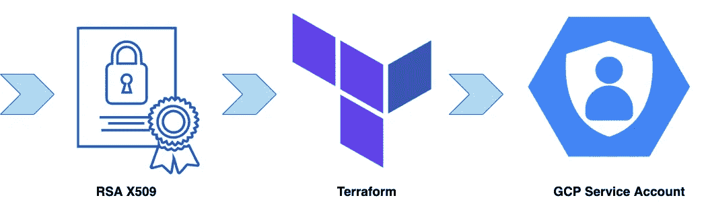

# 使用 terraform 上传 GCP 服务帐户的公钥

> 原文：<https://medium.com/google-cloud/upload-public-keys-for-gcp-service-accounts-with-terraform-e1c87fca816e?source=collection_archive---------1----------------------->

希望你已经看过一篇很棒的文章，作者是[瑞安·坎迪](https://medium.com/u/5a967609ab69?source=post_page-----e1c87fca816e--------------------------------) [停止下载谷歌云服务账户密钥](https://jryancanty.medium.com/stop-downloading-google-cloud-service-account-keys-1811d44a97d9)，如今有很多[替代创建服务账户密钥](https://cloud.google.com/iam/docs/best-practices-for-managing-service-account-keys#alternatives)。

但是，假设您处于云采用的早期阶段，您还没有准备好涉及 OIDC 提供商和[工作负载身份池](https://cloud.google.com/iam/docs/workload-identity-federation#pools)。同时，本地应用程序/服务器需要一种方法来验证 Google Cloud APIs。最不安全的方法是允许工程师生成服务帐户密钥，这可能导致这些密钥通过内部信使或邮箱从一个用户传到另一个用户。稍微好一点的方法是集中密钥生成，只允许通过 GitOps + Terraform 提供密钥，这样您就有了“集成”服务帐户管理的清晰历史。但是这种方法仍然有一些警告:

*   密钥没有到期时间
*   关键材料以地形状态写入
*   需要将密钥传输到终端应用程序/服务器
*   每个能接触到 terraform 管道的人都能接触到钥匙

有一个更好的方法可以处理以上所有问题！



## 通过 terraform 上传公共 RSA 密钥来管理服务帐户密钥

这个例子展示了如何通过使用 [OpenSSL](https://www.openssl.org/) 手动生成密钥对并将密钥的公共部分上传到 GCP 来管理 IAM 服务帐户密钥。它有以下好处:

*   没有[在用户](https://cloud.google.com/iam/docs/best-practices-for-managing-service-account-keys#pass-between-users)或系统之间传递密钥
*   没有私钥存储在 terraform 状态中(只有密钥的公共部分在该状态中)
*   让密钥[自动过期](https://cloud.google.com/iam/docs/best-practices-for-managing-service-account-keys#key-expiryhaving)

## 部署

要运行这个示例，首先克隆[存储库](https://github.com/terraform-google-modules/cloud-foundation-fabric)并切换到示例文件夹。如果你喜欢使用云 Shell，[这个链接](https://ssh.cloud.google.com/cloudshell/editor?cloudshell_git_repo=https%3A%2F%2Fgithub.com%2FGoogleCloudPlatform%2Fcloud-foundation-fabric&cloudshell_print=cloud-shell-readme.txt&cloudshell_working_dir=examples%2Fcloud-operations%2Fonprem-sa-key-management&cloudshell_open_in_editor=cloudshell_open%2Fcloud-foundation-fabric%2Fexamples%2Fcloud-operations%2Fonprem-sa-key-management%2Fvariables.tf)将为你运行 Git 克隆，并切换到正确的文件夹，这样你就可以跳过下面的初始步骤。

```
git clone [https://github.com/GoogleCloudPlatform/cloud-foundation-fabric.git](https://github.com/GoogleCloudPlatform/cloud-foundation-fabric.git)
cd [cloud-foundation-fabric](https://github.com/GoogleCloudPlatform/cloud-foundation-fabric.git)/examples/cloud-operations/[onprem-sa-key-management](https://github.com/GoogleCloudPlatform/cloud-foundation-fabric/tree/master/examples/cloud-operations/onprem-sa-key-management)
```

清理示例键。

```
rm -f /public-keys/data-uploader/
rm -f /public-keys/prisma-security/
```

为服务帐户生成新密钥。

```
mkdir keys && cd keys
openssl req -x509 -nodes -newkey rsa:2048 -days 30 \
    -keyout data_uploader_private_key.pem \
    -out ../public-keys/data-uploader/public_key.pem \
    -subj "/CN=unused"
openssl req -x509 -nodes -newkey rsa:2048 -days 30 \
    -keyout prisma_security_private_key.pem \
    -out ../public-keys/prisma-security/public_key.pem \
    -subj "/CN=unused"
```

部署服务帐户和密钥。

*注意:我们只使用密钥的公共部分进行部署，理想情况下，密钥的私有部分不应该离开生成和使用它的服务器。*

```
cd ..
terraform init
terraform apply -var project_id=$GOOGLE_CLOUD_PROJECT
```

从 terraform 输出中提取 JSON 凭证模板，并将密钥的私有部分放入模板中。

```
terraform show -json | jq '.values.outputs."sa-credentials".value."data-uploader"."public_key.pem" | fromjson' > data-uploader.json
terraform show -json | jq '.values.outputs."sa-credentials".value."prisma-security"."public_key.pem" | fromjson' > prisma-security.json

contents=$(jq --arg key "$(cat keys/data_uploader_private_key.pem)" '.private_key=$key' data-uploader.json) && echo "$contents" > data-uploader.json
contents=$(jq --arg key "$(cat keys/prisma_security_private_key.pem)" '.private_key=$key' prisma-security.json) && echo "$contents" > prisma-security.json
```

## 测试

验证服务帐户 json 凭据是否有效。

```
gcloud auth activate-service-account --key-file prisma-security.json
gcloud auth activate-service-account --key-file data-uploader.json
```

打扫卫生。

```
terraform destroy -var project_id=$GOOGLE_CLOUD_PROJECT
```

避免使用服务帐户密钥总是更好，但是在现实生活中，我们仍然不得不依赖它们。通过本文中所示的方法，我们缓解了与服务帐户密钥管理相关的大部分安全问题，例如:

*   密钥生成并存储在消费者服务器上，永远不会离开它
*   密钥的到期时间由用户设置
*   密钥的私有部分不存储在地形状态或代码中
*   GitOps 和 terraform 提供了一个中央平面的玻璃上的“集成”密钥管理