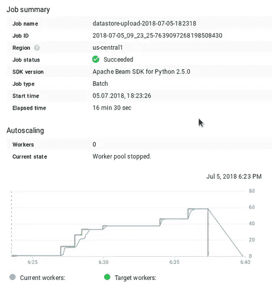

# 使用数据流将数据上传到云数据存储

> 原文：<https://medium.com/google-cloud/uploading-data-to-cloud-datastore-using-dataflow-26c2588b9a8d?source=collection_archive---------0----------------------->

在我之前的一篇[文章](/google-cloud/search-on-google-cloud-platform-cloud-datastore-615c14cb1bb)中，我从 csv 文件上传了 120 万条记录到云数据库。我正在读取文件，列出 200 个解析过的行，然后把它们作为 json 顺序发布到 web 服务器上(这里的[是完整的脚本)。当然，这相当慢，也就是说，这个过程需要大约 2.5 个小时才能完成。只是后来我想起有一个更快的方法，那就是使用云数据流，所以只是为了好玩，我写了管道从 csv 文件上传数据到数据存储。](https://github.com/zdenulo/gcp-search/blob/master/cloud_datastore/upload.py)

Dataflow 是 Google 云平台的无服务器服务，使用 Apache Beam 框架运行数据处理。这意味着你只需要写数据处理管道和定义一些设置，仅此而已。它与 Google 云产品有很好的集成，比如云存储、BigQuery、BigTable、Datastore、Pub/Sub。数据流将创建虚拟机，虚拟机将执行作业，作业完成后，它将关闭一切。很简单。

我用全部代码(Python)【https://github.com/zdenulo/upload-data-datastore-dataflow】T4 创建了 Github 知识库，我将解释它是如何完成的。

最重要的文件是 upload.py，其中定义了所有内容。注意:Apache Beam for Python 目前只支持 Python 2.7(不是 3.x)。

```
import csv
import datetime

import apache_beam as beam
from apache_beam.options.pipeline_options import PipelineOptions
from apache_beam.io.gcp.datastore.v1.datastoreio import WriteToDatastore
from google.cloud.proto.datastore.v1 import entity_pb2
from googledatastore import helper as datastore_helper

from settings import PROJECT, BUCKET, INPUT_FILENAME

class CSVtoDict(beam.DoFn):
    """Converts line into dictionary"""
    def process(self, element, headers):
        rec = ""
        element = element.encode('utf-8')
        try:
            for line in csv.reader([element]):
                rec = line

            if len(rec) == len(headers):
                data = {header.strip(): val.strip() for header, val in zip(headers, rec)}
                return [data]
            else:
                print "bad: {}".format(rec)
        except Exception:
            pass

class CreateEntities(beam.DoFn):
    """Creates Datastore entity"""
    def process(self, element):
        entity = entity_pb2.Entity()
        sku = int(element.pop('sku'))
        element['regularPrice'] = float(element['regularPrice'])
        element['salePrice'] = float(element['salePrice'])
        element['name'] = unicode(element['name'].decode('utf-8'))
        element['type'] = unicode(element['type'].decode('utf-8'))
        element['url'] = unicode(element['url'].decode('utf-8'))
        element['image'] = unicode(element['image'].decode('utf-8'))
        element['inStoreAvailability'] = unicode(element['inStoreAvailability'])

        datastore_helper.add_key_path(entity.key, 'Productx', sku)
        datastore_helper.add_properties(entity, element)
        return [entity]

def dataflow(run_local):
    if run_local:
        input_file_path = 'sample.csv'
    else:
        input_file_path = 'gs://' + BUCKET + '/' + INPUT_FILENAME

    JOB_NAME = 'datastore-upload-{}'.format(datetime.datetime.now().strftime('%Y-%m-%d-%H%M%S'))

    pipeline_options = {
        'project': PROJECT,
        'staging_location': 'gs://' + BUCKET + '/staging',
        'runner': 'DataflowRunner',
        'job_name': JOB_NAME,
        'disk_size_gb': 100,
        'temp_location': 'gs://' + BUCKET + '/temp',
        'save_main_session': True
    }

    if run_local:
        pipeline_options['runner'] = 'DirectRunner'

    options = PipelineOptions.from_dictionary(pipeline_options)
    with beam.Pipeline(options=options) as p:

        (p | 'Reading input file' >> beam.io.ReadFromText(input_file_path)
         | 'Converting from csv to dict' >> beam.ParDo(CSVtoDict(),
                                                       ['sku', 'name', 'regularPrice', 'salePrice', 'type', 'url', 'image',
                                                        'inStoreAvailability'])
         | 'Create entities' >> beam.ParDo(CreateEntities())
         | 'Write entities into Datastore' >> WriteToDatastore(PROJECT)
         )

if __name__ == '__main__':
    run_locally = False
    dataflow(run_locally)
```

数据流功能包含定义选项的主要部分以及完成工作的管道。它包括 4 个步骤:

1.  读取输入文件(从谷歌云存储桶)
2.  根据标题列名，将 csv 行解析到字典中
3.  创建数据存储实体(不保存)
4.  将实体保存到数据存储中

有两种自定义转换:

*   csv 字典—将 CSV 行转换为字典
*   CreateEntities —基于字典创建实体—将发送到 WriteToDatastore 转换的原始缓冲区消息

使用 run_locally 变量，您可以定义是本地运行管道还是使用数据流运行管道。

在安装 apache beam 库之前，可以使用以下命令执行作业:

```
python upload.py
```

以下是一些截图:

这是管道在数据流用户界面中的外观


和一些统计数据。



可以看出，整个工作花费了 16.5 分钟(其中还包括虚拟机的调配)。图中显示了处理数据的工作人员(VM)数量，该数量随着时间的推移而增加，并在工作完成前达到峰值(60 个工作人员)。下图显示了消耗的资源。稍加努力，可以计算出这一执行成本约为 0.5 美元加上数据存储成本。


现在，只需几行代码，就可以编写数据管道，将数据从 csv 文件加载到数据存储中。其他一切都由谷歌云管理。实际上有一个模板[将文本从云存储上传到云数据存储](https://cloud.google.com/dataflow/docs/templates/provided-templates#gcstexttodatastore)，但在这种情况下，每一行都应该编码为 json，并基于它创建数据存储实体。