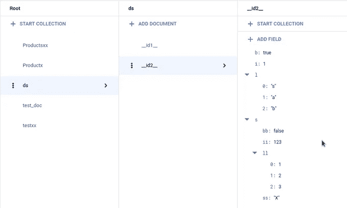
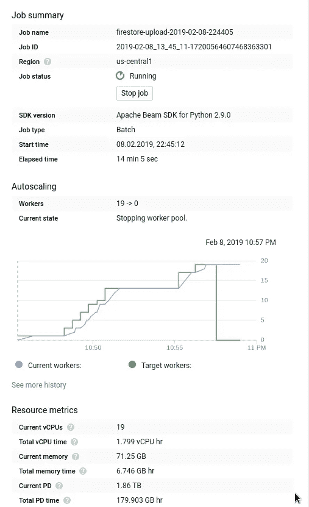

# 使用数据流将数据上传到 Firestore

> 原文：<https://medium.com/google-cloud/uploading-data-to-firestore-using-dataflow-67ebecabf3b8?source=collection_archive---------0----------------------->

Firestore 是谷歌云平台上的下一代 NoSQL 数据库，增加了对云数据存储的各种改进，如实时更新、强一致性查询等。它最近被提升为全面可用，所以是时候深入了解它了。

Firestore 有两种风格。一个是本机模式，类似于新 Firestore 的所有功能，而第二个是数据存储模式，适合希望继续使用数据存储(向后兼容)和属性的用户，尽管是在 Firestore 上运行的引擎盖下。

Firestore 通过 [Cloud SDK](https://firebase.google.com/docs/firestore/manage-data/export-import) 提供数据导出/导入，但是如果你需要初始批量导入来加载数据到 Firestore 呢？

基于我之前的例子[使用数据流](/google-cloud/uploading-data-to-cloud-datastore-using-dataflow-26c2588b9a8d)上传数据到云数据库，我想再次使用 Apache Beam 运行在数据流上。从这个意义上说，数据流是伟大，它足以为管道编写代码，它自动为批处理作业提供服务器(工人),当它完成时，它清理一切。

由于 Firestore 相对较新，并不是所有地方都支持 Firestore，这也与 Apache Beam 有关，但情况并不那么糟糕。我将描述我使用 Beam 向 Firestore Native 上传批量数据的两种方式。仅给出背景，我将上传 120 万条包含基于 Best Buy 数据集的产品信息的记录。Python (2.7)代码在 [Github](https://github.com/zdenulo/upload-data-firestore-dataflow) 上。

## 1.使用 datastoreio

由于没有将数据写入 Firestore 的本机转换，出于好奇，我尝试使用相同的数据存储。在我的数据存储示例中，我创建了自定义 DoFn 来创建数据存储实体，我在本例中也使用了该实体。

整个管道看起来像这样:

```
with beam.Pipeline(options=options) as p:
        (p | 'Reading input file' >> beam.io.ReadFromText(input_file_path)
         | 'Converting from csv to dict' >> beam.ParDo(CSVtoDict(),['sku', 'name', 'regularPrice',  'salePrice', 'type', 'url', 'image',                                 'inStoreAvailability'])
         | 'Create entities' >> beam.ParDo(CreateEntities())
         | 'Write entities into Datastore' >> WriteToDatastore(PROJECT)
         )
```

在 csvtoDict 中，我将 CSV 行解析为 Python 字典，CreateEntities 转换如下所示:

```
class CreateEntities(beam.DoFn):
    """Creates Datastore entity"""
    def process(self, element):
        entity = entity_pb2.Entity()
        sku = int(element.pop('sku'))
        element['regularPrice'] = float(element['regularPrice'])
        element['salePrice'] = float(element['salePrice'])
        element['name'] = unicode(element['name'].decode('utf-8'))
        element['type'] = unicode(element['type'].decode('utf-8'))
        element['url'] = unicode(element['url'].decode('utf-8'))
        element['image'] = unicode(element['image'].decode('utf-8'))
        element['inStoreAvailability'] = unicode(element['inStoreAvailability'])

        datastore_helper.add_key_path(entity.key, 'Product', sku)
        datastore_helper.add_properties(entity, element)
        return [entity]
```

同样，在我的项目中，我在本地模式下使用 Firestore，它上传数据没有任何问题。我注意到的唯一不寻常的事情是密钥被更改了，例如，如果我将 id 设置为 1，在 Firestore 文档中 id 是 __id1__，即，它在我的 id“__ id”之前和“_ _”之后添加，不知道为什么。

这种方法感觉有点像欺骗，因为据我所知，应该不可能将数据存储 API 与 Firestore Native 一起使用(反之亦然)，尽管这一切都归结于协议缓冲区，或者这可能是一些过渡状态，我很好奇更深入的解释。

一句话:如果你可以忍受修改的 id，并且不上传一些非常复杂的——多次嵌套的文档，这应该没问题。

下面是用其他支持的字段类型创建的代码示例

```
class CreateEntities(beam.DoFn):
    """Creates Datastore entity with different types of fields, just to verify what is possible"""

    def process(self, idx):
        entity = entity_pb2.Entity()
        embed = entity_pb2.Entity()  # embedded document
        ss = {
            'ss': unicode('X'),  # string
            'bb': False,  # boolean
            'll': [1, 2, 3],  # list of integers
            'ii': 123  # integer
        }
        datastore_helper.add_properties(embed, ss)  # setting properties for embedded document
        element = dict()
        element['s'] = unicode('String')  # string
        element['b'] = True  # boolean
        element['l'] = [unicode('s'), unicode('a'), unicode('b')]  # list of strings
        element['i'] = 1  # integer
        element['e'] = embed  # embedded document
        datastore_helper.add_key_path(entity.key, 'ds', idx)  # setting id for document
        datastore_helper.add_properties(entity, element)  # setting properties for document
        return [entity]
```

在 Firestore UI 中，它看起来像这样:



## 2.使用 Firestore 客户端库

当你不知道什么的时候，你谷歌一下，如果它与软件开发有关，第一个答案来自于 [StackOverflow](https://stackoverflow.com/questions/52637894/write-data-into-google-firestore-in-pipeline) ，这启发了我使用 [Python 的 Firestore 客户端库](https://googleapis.github.io/google-cloud-python/latest/firestore/index.html)来创建我自己的简单转换。

```
class FirestoreWriteDoFn(beam.DoFn):
    MAX_DOCUMENTS = 200

    def __init__(self, project, collection):
        self._project = project
        self._collection = collection
        super(FirestoreWriteDoFn, self).__init__()

    def start_bundle(self):
        self._mutations = []

    def finish_bundle(self):
        if self._mutations:
            self._flush_batch()

    def process(self, element, *args, **kwargs):
        self._mutations.append(element)
        if len(self._mutations) > self.MAX_DOCUMENTS:
            self._flush_batch()

    def _flush_batch(self):
        db = firestore.Client(project=self._project)
        batch = db.batch()
        for mutation in self._mutations:
            if len(mutation) == 1:
                # autogenerate document_id
                ref = db.collection(self._collection).document()
                batch.set(ref, mutation)
            else:
                ref = db.collection(self._collection).document(mutation[0])
                batch.set(ref, mutation[1])
        r = batch.commit()
        logging.debug(r)
        self._mutations = []
```

这是受 [datastoreio](https://github.com/apache/beam/blob/master/sdks/python/apache_beam/io/gcp/datastore/v1/datastoreio.py) 模块的启发，该模块更加复杂和强大，即它具有重试、根据延迟自动调整写入等功能。

虽然 Firestore 支持每次批量写入最多 500 个文档或每次调用 10MB，但为了安全起见，我使用了 200 个。在 _flush_batch 方法中，我添加了文档上传时没有 id 的情况，虽然我没有使用。

整个管道的步骤与之前的步骤相同，只是在引擎盖下有一些变化:

```
with beam.Pipeline(options=options) as *p*:
    (*p* | 'Reading input file' >> beam.io.ReadFromText(input_file_path)
     | 'Converting from csv to dict' >> beam.ParDo(CSVtoDict(),
                                                   ['sku', 'name', 'regularPrice', 'salePrice', 'type', 'url', 'image',
                                                    'inStoreAvailability'])
     | 'Create entities' >> beam.ParDo(CreateEntities())
     | 'Write entities into Firestore' >> WriteToDatastore(*PROJECT*)
     )
```

在 CreateEntities 转换中，我提取数据并准备写入:

```
class CreateEntities(beam.DoFn):
    """Creates Datastore entity"""

    def process(self, element):
        document_id = unicode(element.pop('sku'))
        element['regularPrice'] = float(element['regularPrice'])
        element['salePrice'] = float(element['salePrice'])
        element['name'] = unicode(element['name'].decode('utf-8'))
        element['type'] = unicode(element['type'].decode('utf-8'))
        element['url'] = unicode(element['url'].decode('utf-8'))
        element['image'] = unicode(element['image'].decode('utf-8'))
        element['inStoreAvailability'] = unicode(element['inStoreAvailability'])
        return [(document_id, element)]
```

以下是数据流作业的详细信息。



整个工作需要 14–15 分钟(包括资源调配)。数据流成本为 0.12 美元，Firebase 成本为 2.26 美元(约 120 万次写操作)。在工作完成之前，工人人数增加到 19 人。时间与我的数据存储上传作业类似，尽管在这种情况下，它使用的工作线程数量较少(数据存储作业为 19 对 60)。