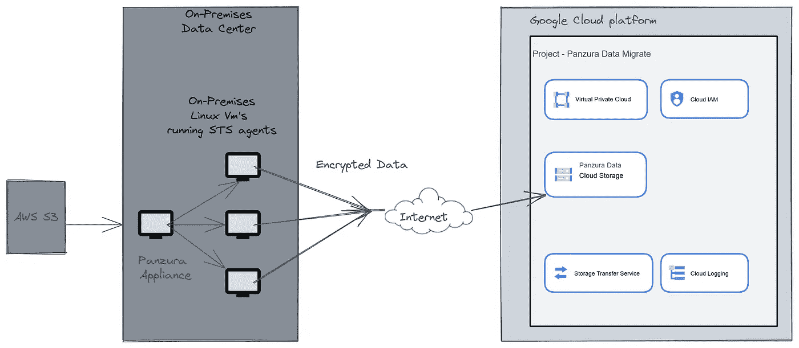

# 用例 1:使用数据传输服务将数据从 Panzura 迁移到 Google 云存储

> 原文：<https://medium.com/google-cloud/use-case-data-migration-from-panzura-to-google-cloud-storage-using-data-transfer-service-d1b7f4e5a876?source=collection_archive---------5----------------------->

**问题陈述—**

我们要求将大约 240 TB 的数据从 Panzura 迁移到 Google 云存储，并在迁移后停止使用 Panzura。Panzura 设备安装在内部数据中心，接收来自内部应用程序的文件，将其压缩并以其专有格式保存在 AWS S3 存储桶中。我们无法使用 Google Cloud Transfer appliance 服务，因为 Panzura appliance 将需要在迁移后解压缩文件。

**术语-**

**Panzura** 是一个基于云的文件存储和协作平台，允许用户随时随地访问、共享和协作文件。

**谷歌云数据传输服务**允许用户通过安全的高带宽网络连接将数据从内部系统传输到谷歌云存储。这对于快速高效地传输大量数据特别有用。

**谷歌云存储**是一种基于云的对象存储服务，允许用户从谷歌的基础设施中存储和检索数据。

在本文中，我们将了解如何使用数据传输服务将数据从 Panzura 传输到 Google 云存储，以便通过高可用性虚拟专用网络(HA VPN)连接将数据从本地传输到 Google 云存储。

**解决方案架构—**

图 1 —将数据从 Panzura 内部迁移到 Google 云存储的高级架构

**先决条件**

*   潘祖拉账户
*   谷歌云账户
*   将 Panzura 设备文件路径作为共享驱动器装载到本地虚拟机
*   将数据传输代理作为数据源安装到本地虚拟机。
*   在您的内部系统和 Google Cloud 之间建立高可用性 VPN 连接

**第一步:设置谷歌云存储桶**

第一步是创建一个 Google 云存储桶，用于存储从 Panzura 传输的数据。为此，请按照下列步骤操作:

1.登录[谷歌云控制台](https://console.cloud.google.com/)。

2.单击顶部栏中的项目下拉列表，并选择要用于存储桶的项目。

3.点击汉堡菜单，选择“存储”

4.单击“创建存储桶”按钮。

5.在“创建存储桶”表单中，输入存储桶的唯一名称，选择存储类别和位置，然后单击“创建”。

**步骤 2:设置数据传输服务**

数据传输服务允许您通过高可用性 VPN 连接将数据从本地系统传输到 Google 云存储。要设置它，请按照下列步骤操作:

1.  在谷歌云控制台中，进入[数据传输服务页面](https://console.cloud.google.com/transfer)。
2.  单击“创建传输作业”按钮。
3.  在“创建传输作业”表单中，输入传输作业的名称，并选择“内部”作为源，选择“Google 云存储”作为目标。
4.  点击“继续”按钮。
5.  在“指定传输细节”页面上，选择您在步骤 1 中创建的 Google 云存储桶作为传输数据的目的地。
6.  输入本地系统上要传输的数据的路径。
7.  选择传输作业的时间表。您可以选择一次性传输数据或重复传输数据。
8.  单击“创建”按钮创建传输作业。

**第三步:监控传输**

设置传输作业后，数据传输服务将开始通过 HA VPN 连接将数据从您的内部系统传输到 Google 云存储。您可以在 Google Cloud 控制台的数据传输服务页面中监控传输进度。

**挑战**

1.  **网络带宽问题** —最初数据传输速率非常低( **~100 Kbps** )，因为 Panzura 设备和本地虚拟机使用不同的物理网络，因此它们必须通过多个防火墙和安全规则。

**解决方案** —将本地虚拟机迁移到安装了 Panzura 设备的同一网络后，**网络带宽**增加了 **200 倍**达到 **~200 Mbps** 。仍然没有得到预期的 1.5 Gbps-2 Gbps 的带宽。

进一步分析这个问题，我们发现 Panzura 装置启用了网络带宽限制，一旦我们禁用它，我们看到数据传输速率急剧 **1000 倍**增加到 **1 Gbps** 。

2.**由于文件大小导致的传输速率限制—** 尽管现在我们能够实现 1000 倍的网络吞吐量，但仍有优化的空间，因为总可用带宽为 2 Gbps

**解决方案—** 经过几天的努力，我们解决了这个问题，为小于 500 KB 的文件创建了不同的数据集，并在多个虚拟机上使用多个数据传输代理进行并行传输，从而将传输速率优化到 1.8 Gbps (~ 2 Gbps)。大于 500 KB 的文件在单个虚拟机上处理，因为它以大约 1.5 Gbps 到 1.9 Gbps 的速度运行

**总结**

在本文中，我们研究了如何使用数据传输服务将数据从 Panzura 传输到 Google 云存储。通过遵循本文中概述的步骤，我们能够将大约 240 TB 的数据从 Panzura 迁移到 Google 云存储，并利用 Google 基于云的对象存储服务的可伸缩性、可靠性和安全性。

当我们开始数据迁移时，预计的完成时间是 18 个月到 24 个月，但我只用了 3 个月就完成了。

这在经济上帮助了客户很多美元，因为他们可以停止支付使用 Panzura 服务的许可费用。

**关于我** —我是多云认证云架构师；目前的工作任务集中在谷歌云平台上。过去 18 个月我写了 17+云认证(9+ GCP)，最近通过了 GCP-专业网络工程师认证。

如果你有任何问题，可以通过 [**LinkedIn**](https://www.linkedin.com/in/jitu028/) 和 Twitter[**@ jitu 028**](https://twitter.com/jitu028)和 DM 联系我，我很乐意帮忙！！