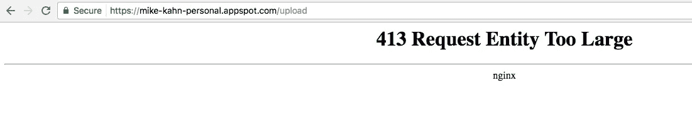
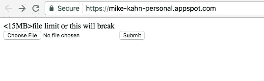
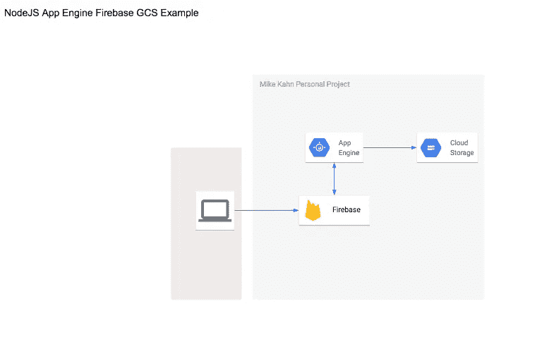
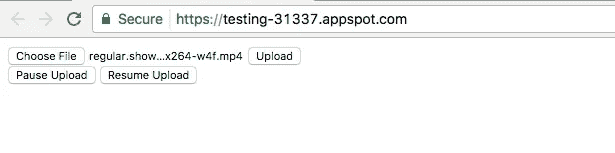
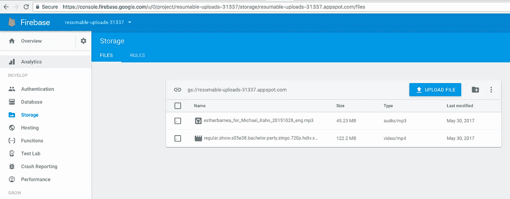
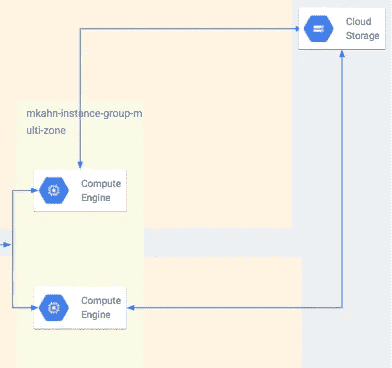
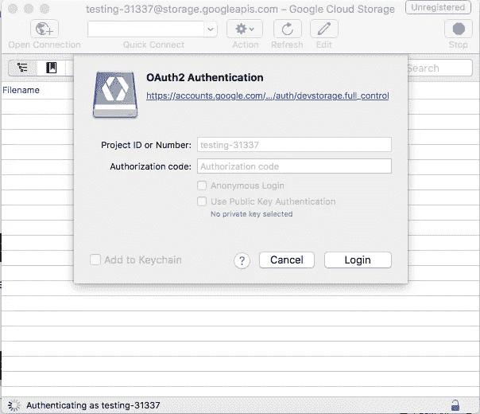
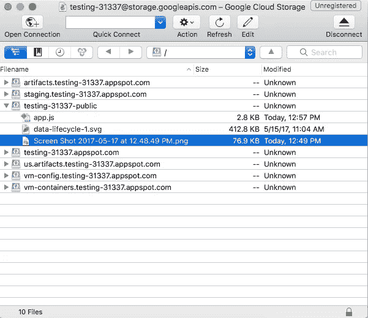
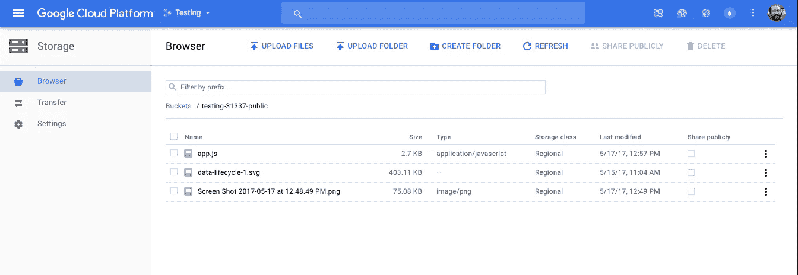

# 将文件放入 Google 云存储的使用案例和不同方式

> 原文：<https://medium.com/google-cloud/use-cases-and-a-few-different-ways-to-get-files-into-google-cloud-storage-c8dce8f4f25a?source=collection_archive---------0----------------------->

*包括带 Firebase 的 AppEngine 可恢复上传*

在这篇文章中，我将分解一些与 Google 云存储(GCS)交互的不同方式。GCP 文档陈述了以下上传数据的方式:通过 UI，通过 gsutil CLI 工具，或者通过各种语言的 JSON API。下面我将介绍几个具体的用例以及 GCS 入口选项的方法。

**1。使用 JSON api** *在 Google App Engine (GAE)上上传表单用例:公共上传门户(小文件)* **2 .使用 JSON api** *在 GAE 上用 firebase 上传表单用例:公共上传门户(大文件)，手机 app 内上传* **3 .gsutil 命令行与 cron** *等脚本或调度程序集成用例:备份/归档、与脚本集成、迁移* **4 .S3 / GCP 兼容的文件管理程序，如 Cyberduck** *使用案例:通过桌面进行云存储管理，迁移* **5。云函数(GCF)** *用例:集成、桶的变化、HTTP 请求* **6。云控制台** *用例:通过桌面、迁移进行云存储管理*

# **1。带有 JSON API 的应用引擎 nodejs 适用于较小的文件**

你可以在 GAE 上启动一个小的 nodejs 应用程序，非常容易地直接接受较小的文件到 GCS ~20MB。我从 GCP github 账户[的 the nodejs GCS 示例开始。](https://github.com/GoogleCloudPlatform/nodejs-docs-samples/tree/master/appengine/storage)

对于整合 20MB 左右的上传，这是一个很好的解决方案。请记住，GAE 背后的 nginx 服务器有文件上传限制。因此，如果你尝试上传大约 50MB 的东西，你会收到一个 nginx 错误:☹️



Nginx 文件上传错误

你可以尝试在 js 文件中上传文件大小限制，但 GAE 背后的网络服务器仍然会有文件上传的限制。因此，如果您计划在 App Engine 上创建上传表单，请确保在您的 UI 中有一个文件大小限制。



小文件的 Nodejs 上传表单——我可能会在某个时候关闭这个应用程序。

# **2。应用程序引擎节点 js Firebase 与 JSON API 和可恢复的大文件上传**

由于前面的例子只适用于较小的文件，我想知道我们如何解决上传较大的文件，如 100MB 或 1GB？我从 nodejs 应用引擎存储示例[开始，这里是](https://github.com/mkahn5/nodejs-docs-samples/tree/master/appengine/storage)。

在尝试用 [TUS](https://github.com/tus) 在 GCS API 中使用[可恢复上传](https://cloud.google.com/storage/docs/json_api/v1/how-tos/resumable-upload)失败后，我向我的朋友内森@ [www.incline.digital](http://www.incline.digital) 寻求帮助，寻求另一种方法。

在 Nathan 的帮助下，我们将可恢复上传与 firebase SDK 集成在一起。代码可以在这里找到
[https://github.com/mkahn5/gcloud-resumable-uploads](https://github.com/mkahn5/gcloud-resumable-uploads)。

参考:[https://firebase.google.com/docs/storage/web/upload-files](https://firebase.google.com/docs/storage/web/upload-files)



用户与基于 Firebase 的 GAE 上传表单的交互

虽然没有状态栏或任何花哨的东西，这种解决方案并不十分优雅，但它确实适用于从网上上传大文件。🙌🏻



GAE 上的可恢复文件上传表单——我可能会在某个时候关闭这个应用程序。



Firebase UI 中的 GC

# **3。来自本地或远程的 gsutil**

gsutil 使得将文件复制到云存储桶和从云存储桶复制文件变得容易

只要确保你的工作站或远程服务器上有 Google cloud SDK([https://cloud.google.com/sdk/downloads](https://cloud.google.com/sdk/downloads))，设置项目并认证就行了。

```
mkahnucf@meanstack-3-vm:~$ **gsutil ls**
gs://artifacts.testing-31337.appspot.com/
gs://staging.testing-31337.appspot.com/
gs://testing-31337-public/
gs://testing-31337.appspot.com/
gs://us.artifacts.testing-31337.appspot.com/
gs://vm-config.testing-31337.appspot.com/
gs://vm-containers.testing-31337.appspot.com/mkahnucf@meanstack-3-vm:~/nodejs-docs-samples/appengine/storage$ **gsutil cp app.js gs://testing-31337-public**Copying file://app.js [Content-Type=application/javascript].../ [1 files][  2.7 KiB/  2.7 KiB]Operation completed over 1 objects/2.7 KiB.
```

更多详情[此处](https://cloud.google.com/storage/docs/quickstart-gsutil#upload_an_object_into_your_bucket)。

gsutil 使自动化目录备份、同步目录中的更改、备份数据库转储变得非常容易，并且可以轻松地与应用程序或调度程序集成，将脚本文件上传到 GCS。

下面是我的云存储桶的 rsync cron 和我博客上的 html 文件。这样，如果我决定通过 www 或 GCS UI 上传文件，我的 GCS bucket 和我的 GCE 实例之间就有了一致性。



在 GCP 上使用 gsutil 备份和同步 GCS 文件

```
root@mkahncom-instance-group-multizone-kr5q:~# crontab -l*/2 * * * * **gsutil rsync -r /var/www/html gs://mkahnarchive/mkahncombackup***/2 * * * * **gsutil rsync -r gs://mkahnarchive/mkahncombackup /var/www/html**
```

# **4。Cyberduck (MacOS)或任何具有 s3 接口的应用程序**

在 MacOS for GCS 上使用 Cyberduck 享受客户端 ftp 类型的体验。

Cyberduck 具有非常好的 oauth 集成，可以连接到内置在接口中的 GCS API。



通过 oauth 认证后，你可以浏览你所有的桶，并通过 cyberduck 应用程序上传。将许多目录或文件夹移动到多个存储桶中是一个不错的选择。

更多关于赛博鸭的信息请点击这里。

# **5。云功能**

您还可以配置 Google Cloud Function (GCF ),将文件从远程或本地位置上传到 GCS。下面这个教程只是为了把一个目录下的文件上传到 GCS。运行云函数，它压缩本地目录文件，并将压缩文件放入 GCS stage bucket。

试教程:
[https://cloud.google.com/functions/docs/tutorials/storage](https://cloud.google.com/functions/docs/tutorials/storage)

```
Michaels-iMac:gcf_gcs mkahnimac$ **gcloud beta functions deploy helloGCS -stage-bucket mike-kahn-functions -trigger-bucket mikekahn-public-upload**
Copying file:///var/folders/kq/5kq2pt090nx3ghp667nwygz80000gn/T/tmp6PXJmJ/fun.zip [Content-Type=application/zip]…
- [1 files][ 634.0 B/ 634.0 B]
Operation completed over 1 objects/634.0 B.
Deploying function (may take a while — up to 2 minutes)…done.
availableMemoryMb: 256
entryPoint: helloGCS
eventTrigger:
eventType: providers/cloud.storage/eventTypes/object.change
resource: projects/_/buckets/mikekahn-public-upload
latestOperation: operations/bWlrZS1rYWhuLXBlcnNvbmFsL3VzLWNlbnRyYWwxL2hlbGxvR0NTL1VFNmhlY1RZQV9j
name: projects/mike-kahn-personal/locations/us-central1/functions/helloGCS
serviceAccount: mike-kahn-personal@appspot.gserviceaccount.com
sourceArchiveUrl: gs://mike-kahn-functions/us-central1-helloGCS-wghzlmkeemix.zip
status: READY
timeout: 60s
updateTime: ‘2017–05–31T03:08:05Z’
```

您还可以使用创建的云函数来显示存储桶日志。下面显示了一个通过我的公共上传表单上传并通过控制台用户界面删除的文件。这对于发布/订阅通知或报告非常方便。

```
Michaels-iMac:gcf_gcs mkahnimac$ **gcloud beta functions logs read helloGCS**LEVEL  NAME      EXECUTION_ID     TIME_UTC                 LOGD      helloGCS  127516914299587  2017-05-31 03:46:19.412  Function execution started
I      helloGCS  127516914299587  2017-05-31 03:46:19.502  File FLIGHTS BANGKOK.xlsx metadata updated.
D      helloGCS  127516914299587  2017-05-31 03:46:19.523  Function execution took 113 ms, finished with status: 'ok'
D      helloGCS  127581619801475  2017-05-31 18:31:00.156  Function execution started
I      helloGCS  127581619801475  2017-05-31 18:31:00.379  File FLIGHTS BANGKOK.xlsx deleted.
D      helloGCS  127581619801475  2017-05-31 18:31:00.478  Function execution took 323 ms, finished with status: 'ok'
```

对于后台任务，例如 GCP 基础设施上的事件或 HTTP 应用程序上的活动的定期维护，云函数可以派上用场。点击查看如何编写和部署云功能的指南[。](https://cloud.google.com/functions/docs/how-to)

# **6。云控制台 UI**

UI 对于 GCS 管理来说非常有用。GCP 甚至为 AWS 上的 s3 桶或其他地方的 S3 桶上的文件提供传输服务。目前门户中缺少的一个东西是对象生命周期管理。对于不经常访问的文件或存储桶中超过一定年限的文件，这非常适合自动归档到 coldline 廉价对象存储。现在你只能通过 gsutil 或者 API 来修改对象的生命周期。像大多数 GCP 特性一样，它们从函数/API 级别开始，然后进入门户(这应该是 IMO 的方式)，我对此很满意。我希望在未来的某个时候，对象生命周期规则能够被应用到 GCP 门户网站中。😃



GCS 用户界面

总的来说，我使用了一些 GCP 的例子和教程，可以用不同的方式将文件显示到 GCS 上。GCS 非常灵活，有许多入口选项，可以很容易地集成到系统或应用程序中！2017 年，对象存储的用例非常丰富，GCP 使在 GCS 中发送和接收文件变得非常容易。

请对我可能错过的或者我们应该探索的任何有趣的 GCS 用例发表评论。谢谢！

查看[我的博客](http://www.mkahn.com/)了解更多更新。