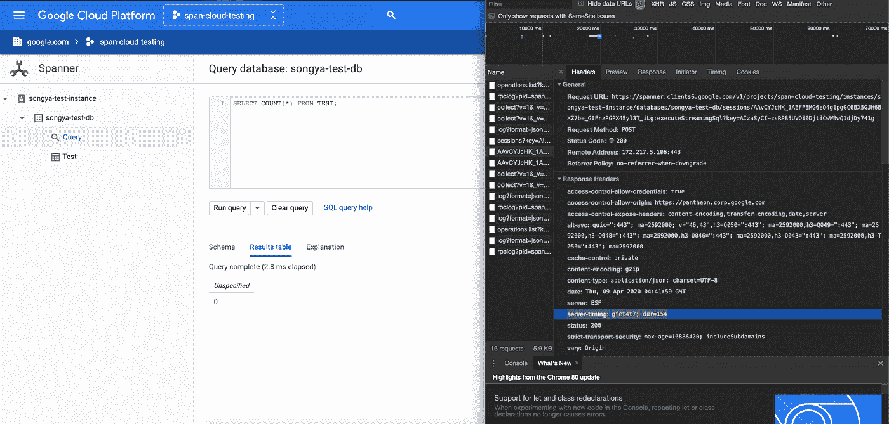
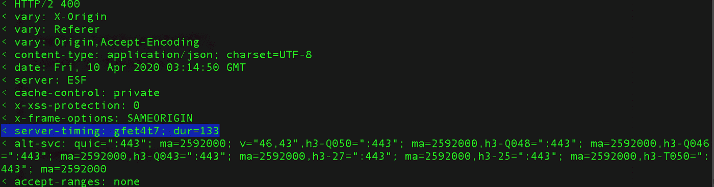
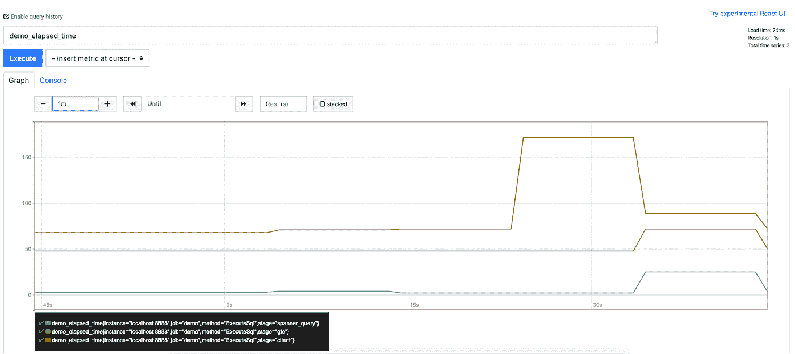
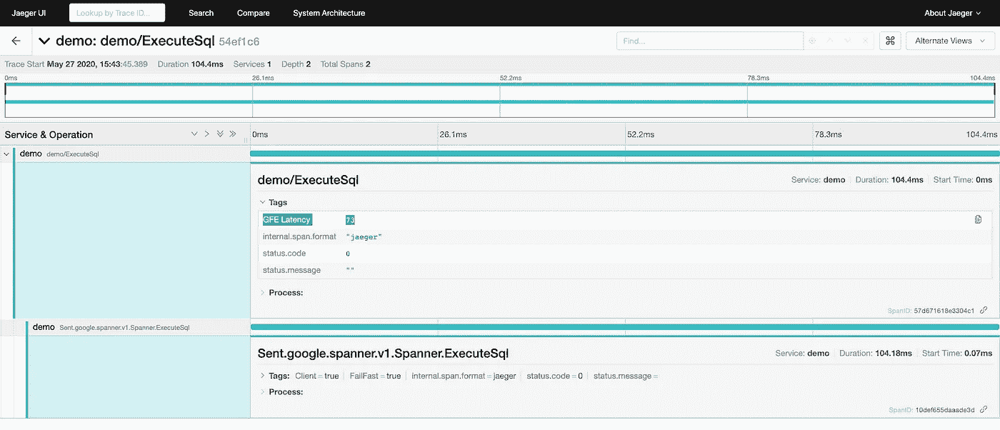

# 在云扳手调试中使用 GFE 服务器定时头

> 原文：<https://medium.com/google-cloud/use-gfe-server-timing-header-in-cloud-spanner-debugging-d7d891a50642?source=collection_archive---------2----------------------->

# **概述**

GFE 服务器定时头最近已经在所有云扳手 API 中启用。这意味着 Spanner 用户现在可以在 [GFE](https://cloud.google.com/security/infrastructure/design#google_front_end_service) 上检索每个云 Spanner 响应的延迟指标。它有助于更好地区分客户端、网络、GFE 和扳手后端之间的延迟来源。

# **背景**

*   如今，云客户可以通过使用客户端库中的 OpenCensus 来查看客户端 RPC 的延迟度量和跟踪范围。(参见[公开普查指南](https://opencensus.io/integrations/google_cloud/google_cloud_spanner/)。)
*   Spanner 请求的延迟被自动捕获，并作为 Stackdriver [系统指标](https://cloud.google.com/monitoring/api/metrics_gcp#gcp-spanner)"spanner.googleapis.com/api/request_latencies"公开。
*   此外，如果 QueryMode 设置为 [Profile](https://github.com/googleapis/googleapis/blob/master/google/spanner/v1/spanner.proto#L456) ，则响应中的扳手 [QueryStats](https://cloud.google.com/spanner/docs/reference/rest/v1/ResultSetStats) 可用。它包括查询执行所用的时间。
*   然而，在延迟分解中仍然有一个缺失的部分，那就是谷歌前端(GFE)的延迟。没有 GFE 延迟，很难调试高延迟问题，因为可能有多种原因(例如，客户端应用程序离 GFE 太远)，但没有足够的信息来区分。

# **格式**

现在，对于来自 Cloud Spanner 的每个响应，无论是 REST 还是 gRPC，都会有一个额外的头，其中包含 GFE 上的总运行时间。格式是

```
server-timing: gfet4t7; dur=[GFE latency in ms]
```

用户可以以各种方式利用 GFE 延迟信息。

请注意，该标头与 GFE 响应相关联，因此在某些错误情况下，如果没有收到 GFE 响应(例如，客户端取消了请求或 GFE 不可用)，标头将会丢失。

# **一次性调试**

最简单的方法是在 web 浏览器上调试查询。下面的例子使用了 Chrome 开发工具:



如果用户更习惯 curl 或 gcloud CLI，他们还可以从命令行检查 REST 响应中的 GFE 延迟:



# 以编程方式调试

接下来，让我们研究如何以编程方式使用这个头。我们将在下面的例子中使用 Spanner Go、Java 和 Python 客户端。

## 去

在 Go 客户端中，调用 Spanner APIs 时，只需提供一个 [gRPC 头调用选项](https://godoc.org/google.golang.org/grpc#Header)。它将捕获传出 RPC 的标头:

更多细节参见 [gRPC 元数据文档](https://github.com/grpc/grpc-go/blob/master/Documentation/grpc-metadata.md)。

## Java 语言(一种计算机语言，尤用于创建网站)

在 Java 客户端中，用户需要实现 ClientInterceptor 接口并拦截传出的 RPC，以便检索头:

然后在实例化 Spanner 客户端时，提供 HeaderClientInterceptor:

## 计算机编程语言

在 Python 客户机中，事情稍微复杂一些。这是因为 Spanner Python APIs 是由 [google-api-core](https://pypi.org/project/google-api-core/) 包装的，而 google-api-core 并没有公开一个客户端选项来操纵头部。为了绕过这个约束，我们需要直接调用[原始生成的扳手 API](https://github.com/googleapis/python-spanner/tree/master/google/cloud/spanner_v1/proto)，然后从 call.initial_metadata 中检索头:

# 聚合、可视化和调试

在检索 GFE 延迟指标后，高级用户可以在监控工具上导出、聚合和可视化延迟数据，并并排比较客户端应用延迟、GFE 延迟和扳手查询执行延迟:



(这个例子用的是 Spanner Go 客户端，OpenCensus 和 Prometheus。代码片段可以在[这里](https://gist.github.com/songy23/37fe8747d48577ca21be65ca9e388b84)找到。)

或者，用户可以将 GFE 延迟作为一个属性链接到跟踪跨度:



(这个例子用的是 Spanner Go 客户端，OpenCensus 和 Jaeger。代码片段可以在[这里](https://gist.github.com/songy23/001102b91293572fb3913dcfd4a84b17)找到。)

通过比较客户端、GFE 和 Spanner 查询执行之间的延迟，用户和支持工程师现在应该能够缩小 Spanner 操作缓慢的原因。举个例子，

*   如果查询执行延迟很高，用户可以专注于优化模式、索引和查询以获得更好的性能。
*   如果 GFE 延迟较高，而扳手延迟较低，则可能是 GFE 有问题。用户可以将此信息包括在支持票据中，以便支持工程师可以专注于 GFE 故障排除。
*   如果客户端延迟较高，而 GFE 和扳手延迟较低，则客户端和区域 GFE 之间可能存在网络问题。用户可能需要修复他们的网络路由。

# 参考

W3C 服务器-定时规格:[www.w3.org/TR/server-timing/](https://www.w3.org/TR/server-timing/)

Google 前端(GFE)设计概述:[cloud . Google . com/security/infra structure/Design # Google _ Front _ End _ service](https://cloud.google.com/security/infrastructure/design#google_front_end_service)