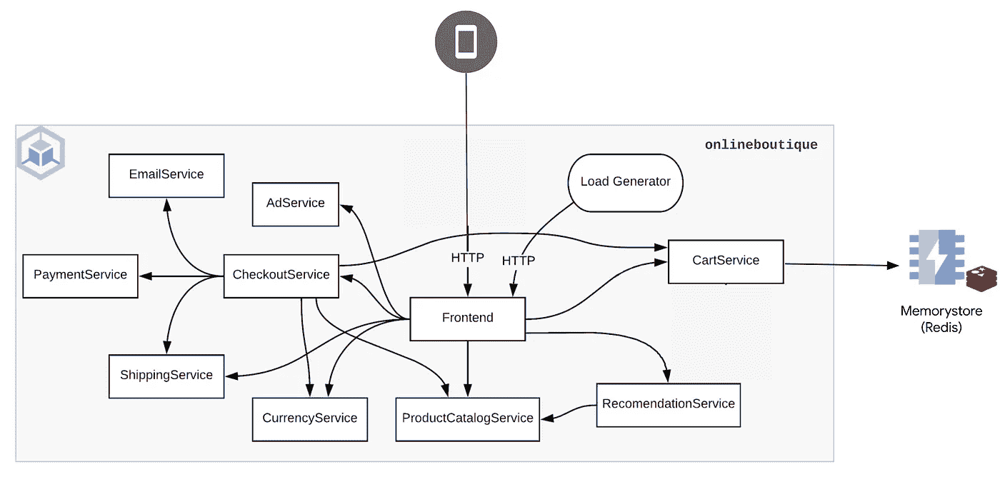

# 使用谷歌云存储(Redis)和 GKE 的在线精品样本

> 原文：<https://medium.com/google-cloud/use-google-cloud-memorystore-redis-with-the-online-boutique-sample-on-gke-82f7879a900d?source=collection_archive---------2----------------------->

默认情况下，在线精品样本的`cartservice`将其数据存储在集群内 Redis 数据库中。在您的 GKE 集群之外使用完全托管的数据库服务，比如 [Memorystore (Redis)](https://cloud.google.com/memorystore) 可以带来更高的弹性、可伸缩性和安全性。

> *利用 Redis 的可扩展、安全且高度可用的内存服务减少延迟。*

在本文中，让我们看看如何将 GKE 集群上的在线精品样本连接到 Google Cloud Memorystore (Redis)。



使用 Memorystore (Redis)的在线精品示例应用程序架构

# 目标

*   创建一个 Google Kubernetes 引擎(GKE)集群
*   设置内存存储(Redis)实例
*   部署连接到 Memorystore (Redis)实例的在线精品示例

# 费用

本教程使用 Google Cloud 的付费组件，包括:

*   [Kubernetes 发动机](https://cloud.google.com/kubernetes-engine/pricing)
*   [Memorystore (Redis)](https://cloud.google.com/memorystore/docs/redis/pricing)

使用[定价计算器](https://cloud.google.com/products/calculator)根据您的预计使用量生成成本估算。

# 开始之前

本指南假设您拥有 Google Cloud 项目的所有者 IAM 权限。在生产中，您不需要所有者许可。

1.  [选择或创建一个谷歌云项目](https://console.cloud.google.com/projectselector2)。
2.  [验证您的项目是否启用了计费](https://cloud.google.com/billing/docs/how-to/modify-project)。

# 设置您的环境

初始化本教程中使用的通用变量:

```
PROJECT_ID=FIXME-WITH-YOUR-PROJECT-ID
REGION=us-east5
ZONE=us-east5-a
```

为了避免在整个教程中重复命令中的`--project`，让我们设置当前项目:

```
gcloud config set project ${PROJECT_ID}
```

# 在项目中启用所需的 API

```
gcloud services enable \
    redis.googleapis.com \
    container.googleapis.com
```

# 创建 GKE 集群

```
CLUSTER=memorystore-with-onlineboutique
gcloud container clusters create ${CLUSTER} \
    --zone ${ZONE} \
    --machine-type=e2-standard-4 \
    --num-nodes 4 \
    --network default
```

# 设置 Memorystore (Redis)实例

```
REDIS_NAME=memorystore-with-onlineboutique
gcloud redis instances create ${REDIS_NAME} \
    --size 1 \
    --region ${REGION} \
    --zone ${ZONE} \
    --redis-version redis_6_x \
    --network default
```

注意事项:

*   您可以从位于同一区域的 GKE 集群连接到 Memorystore (Redis)实例，并使用与您的实例相同的网络。
*   如果未启用 VPC 本地/IP 别名，则无法从 GKE 集群连接到 Memorystore (Redis)实例。

等待 Memorystore (Redis)实例成功预配，然后获取连接信息(专用 IP 地址和端口):

```
REDIS_IP=$(gcloud redis instances describe ${REDIS_NAME} \
    --region ${REGION} \
    --format 'get(host)')
REDIS_PORT=$(gcloud redis instances describe ${REDIS_NAME} \
    --region ${REGION} \
    --format 'get(port)')
```

# 部署连接到 Memorystore (Redis)实例的在线精品商店

部署没有默认集群内 Redis 数据库的在线精品示例应用程序，现在指向 Memorystore (Redis)实例:

```
NAMESPACE=onlineboutique
helm upgrade onlineboutique oci://us-docker.pkg.dev/online-boutique-ci/charts/onlineboutique \
    --install \
    --create-namespace \
    -n ${NAMESPACE} \
    --set cartDatabase.inClusterRedis.create=false \
    --set cartDatabase.connectionString=${REDIS_IP}:${REDIS_PORT}
```

成功部署所有应用程序后，您可以通过点击以下链接导航至在线精品网站:

```
echo -n "http://" && kubectl get svc frontend-external -n ${NAMESPACE} -o json | jq -r '.status.loadBalancer.ingress[0].ip'
```

瞧，你可以轻松地将你的在线精品示例应用程序连接到一个 Memorystore (Redis)数据库，恭喜你！

# 清理

为了避免向您的 Google Cloud 帐户收取费用，您可以删除本教程中使用的资源。

删除 GKE 群集:

```
gcloud container clusters delete ${CLUSTER} \
    --zone ${ZONE}
```

删除 Memorystore (redis)实例:

```
gcloud redis instances delete ${REDIS_NAME}
```

# 结论

将数据库放在 GKE 集群之外，并提供托管服务，比如谷歌云存储(Redis)，可以为您带来更高的弹性、可伸缩性和安全性。这种设置允许复杂的场景，比如将应用程序分布在多个集群中，等等。

# 更多资源

*   [Google Cloud memory store for Redis 最佳实践——高性能无忧部署技巧](https://cloud.google.com/blog/products/databases/best-pactices-for-cloud-memorystore-for-redis/)
*   [无缝加密从网格中任何应用到 Memorystore (Redis)的流量](/google-cloud/seamlessly-encrypt-traffic-from-any-apps-in-your-mesh-to-memorystore-redis-64b71969318d)

*原帖*[*Mathieu-Benoit . github . io*](https://mathieu-benoit.github.io/)*。*