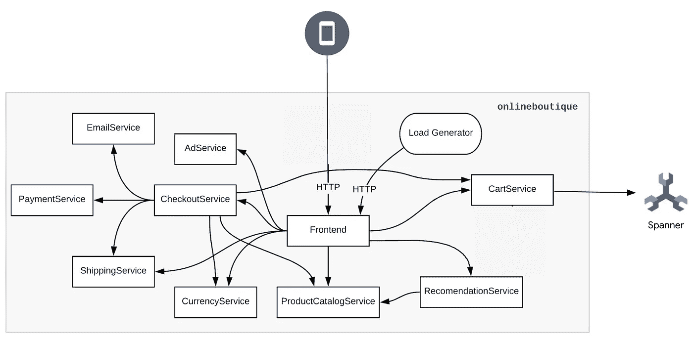

# 使用谷歌云扳手与在线精品样本

> 原文：<https://medium.com/google-cloud/use-google-cloud-spanner-with-the-online-boutique-sample-apps-f7248e077339?source=collection_archive---------2----------------------->

*于 2022 年 12 月 8 日更新，通过其* [*掌舵图*](/google-cloud/246119e46d53) *部署线上精品。*

默认情况下，[在线精品样本](https://github.com/GoogleCloudPlatform/microservices-demo)的`cartservice`将其数据存储在集群内 Redis 数据库中。然而，在你的 Google Kubernetes 引擎(GKE)集群之外使用一个完全托管的数据库服务，比如 [Memorystore (Redis)](/google-cloud/64b71969318d) 可以带来更大的弹性和更高的安全性。

从最近的 [v0.4.0 版本](https://github.com/GoogleCloudPlatform/microservices-demo/releases/tag/v0.4.0)开始，在线精品样本现在可以将其数据存储在 [Google Cloud Spanner](https://cloud.google.com/spanner) 中。

> *Cloud Spanner 是一款全托管的关系数据库，规模不限，一致性强，可用性高达 99.999%。*

在本教程中，让我们看看如何将在线精品示例连接到 Google Cloud Spanner。



# 目标

*   创建一个带有工作负载标识的 Google Kubernetes 引擎(GKE)集群
*   为扳手数据库提供一个[自由扳手实例](https://cloud.google.com/blog/products/spanner/try-cloud-spanner-databases)
*   授予`cartservice`的服务帐户以最低权限角色分配访问扳手数据库的权限
*   部署连接到扳手数据库的在线精品样本及其舵图

# 费用

本教程使用 Google Cloud 的付费组件，包括:

*   [Kubernetes 发动机](https://cloud.google.com/kubernetes-engine/pricing)
*   [扳手](https://cloud.google.com/spanner/pricing)(在本教程中，我们将利用[自由扳手实例](https://cloud.google.com/blog/products/spanner/try-cloud-spanner-databases))。

使用[定价计算器](https://cloud.google.com/products/calculator)根据您的预计使用量生成成本估算。

# 开始之前

本指南假设您拥有 Google Cloud 项目的所有者 IAM 权限。在生产中，您不需要所有者许可。

1.  [选择或创建一个谷歌云项目](https://console.cloud.google.com/projectselector2)。
2.  [验证您的项目是否启用了计费](https://cloud.google.com/billing/docs/how-to/modify-project)。

# 设置您的环境

初始化本教程中使用的通用变量:

```
PROJECT_ID=FIXME-WITH-YOUR-PROJECT-ID
REGION=us-east5
ZONE=us-east5-a
```

为了避免在整个教程中重复命令中的`--project`,让我们设置当前项目:

```
gcloud config set project ${PROJECT_ID}
```

# 在项目中启用所需的 API

在项目中启用所需的 API:

```
gcloud services enable \
    spanner.googleapis.com \
    container.googleapis.com
```

# 创建 GKE 集群

创建启用了工作负荷标识的 GKE 集群:

```
CLUSTER=spanner-with-onlineboutique
gcloud container clusters create ${CLUSTER} \
    --zone ${ZONE} \
    --machine-type=e2-standard-4 \
    --num-nodes 4 \
    --workload-pool ${PROJECT_ID}.svc.id.goog
```

# 提供扳手数据库

设置扳手实例:

```
SPANNER_REGION_CONFIG=regional-${REGION}
SPANNER_INSTANCE_NAME=onlineboutiquegcloud spanner instances create ${SPANNER_INSTANCE_NAME} \
    --description="online boutique shopping cart" \
    --instance-type free-instance \
    --config ${SPANNER_REGION_CONFIG}
```

*注意:使用最新版本的 gcloud，我们可以提供一个* [*自由扳手实例*](https://cloud.google.com/blog/products/spanner/try-cloud-spanner-databases) *。*

提供扳手数据库:

```
SPANNER_DATABASE_NAME=cartsgcloud spanner databases create ${SPANNER_DATABASE_NAME} \
    --instance ${SPANNER_INSTANCE_NAME} \
    --database-dialect GOOGLE_STANDARD_SQL \
    --ddl "CREATE TABLE CartItems (userId STRING(1024), productId STRING(1024), quantity INT64) PRIMARY KEY (userId, productId); CREATE INDEX CartItemsByUserId ON CartItems(userId);"
```

# 授予`cartservice`的服务帐户访问扳手数据库的权限

创建一个专用的最低权限 Google 服务帐户，允许`cartservice`的 Kubernetes 服务帐户与 Spanner 数据库通信；

```
SPANNER_DB_USER_GSA_NAME=spanner-db-user-sa
SPANNER_DB_USER_GSA_ID=${SPANNER_DB_USER_GSA_NAME}@${PROJECT_ID}.iam.gserviceaccount.com
ONLINEBOUTIQUE_NAMESPACE=onlineboutique
CARTSERVICE_KSA_NAME=cartservicegcloud iam service-accounts create ${SPANNER_DB_USER_GSA_NAME} \
    --display-name=${SPANNER_DB_USER_GSA_NAME}gcloud spanner databases add-iam-policy-binding ${SPANNER_DATABASE_NAME} \
    --instance ${SPANNER_INSTANCE_NAME} \
    --member "serviceAccount:${SPANNER_DB_USER_GSA_ID}" \
    --role roles/spanner.databaseUsergcloud iam service-accounts add-iam-policy-binding ${SPANNER_DB_USER_GSA_ID} \
    --member "serviceAccount:${PROJECT_ID}.svc.id.goog[${ONLINEBOUTIQUE_NAMESPACE}/${CARTSERVICE_KSA_NAME}]" \
    --role roles/iam.workloadIdentityUser
```

# 部署连接到扳手数据库的在线精品

为了自动部署与 Spanner 集成的在线精品，我们将利用其相关的 Helm 图表:

```
SPANNER_CONNECTION_STRING=projects/${PROJECT_ID}/instances/${SPANNER_INSTANCE_NAME}/databases/${SPANNER_DATABASE_NAME}helm upgrade onlineboutique oci://us-docker.pkg.dev/online-boutique-ci/charts/onlineboutique \
    --install \
    --create-namespace \
    -n onlineboutique \
    --set cartDatabase.inClusterRedis.create=false \
    --set cartDatabase.type=spanner \
    --set cartDatabase.connectionString=${SPANNER_CONNECTION_STRING} \
    --set serviceAccounts.create=true \
    --set serviceAccounts.annotationsOnlyForCartservice=true \
    --set "serviceAccounts.annotations.iam\.gke\.io/gcp-service-account=${SPANNER_DB_USER_GSA_ID}"
```

所有应用程序成功部署后，您可以点击以下链接导航至在线精品网站:

```
echo -n "http://" && kubectl get svc frontend-external -n ${ONLINEBOUTIQUE_NAMESPACE} -o json | jq -r '.status.loadBalancer.ingress[0].ip'
```

从在线精品网站，您可以在购物车中添加一些产品，然后点击下面的链接，查看您和`loadgenerator`应用程序在扳手数据库中序列化的所有数据:

```
echo -e "https://console.cloud.google.com/spanner/instances/${SPANNER_INSTANCE_NAME}/databases/${SPANNER_DATABASE_NAME}/tables/CartItems/details/data?project=${PROJECT_ID}"
```

瞧。这就是你将在线精品样品连接到扳手数据库的简单方法，恭喜你！

# 清理

为了避免向您的 Google Cloud 帐户收取费用，您可以删除本教程中使用的资源。

删除 GKE 群集:

```
gcloud container clusters delete ${CLUSTER} \
    --zone ${ZONE}
```

删除扳手数据库:

```
gcloud spanner instances delete ${SPANNER_INSTANCE_NAME}
```

# 结论

通过托管服务将数据库部署在 GKE 集群之外，可以为您带来更高的弹性和安全性，而借助这一新的云扳手选项，在线精品店将变得更加高度可用。这种设置允许复杂的场景，比如将应用程序分布在多个集群中，等等。

由于最初实现了 [Daniel Quinlan](https://www.linkedin.com/in/%F0%9F%8C%8Ddaniel-quinlan-51126016/) ，这个新的扳手选项现在在线精品 GitHub 资源库中的每个人都可以使用，请随意尝试一下[头盔图](https://github.com/GoogleCloudPlatform/microservices-demo/blob/main/helm-chart/values.yaml#L109)或 [Kustomize 叠加图](https://github.com/GoogleCloudPlatform/microservices-demo/tree/main/kustomize/components/spanner)！

一帆风顺，干杯！

*原帖*[*Mathieu-Benoit . github . io*](https://mathieu-benoit.github.io/)*。*