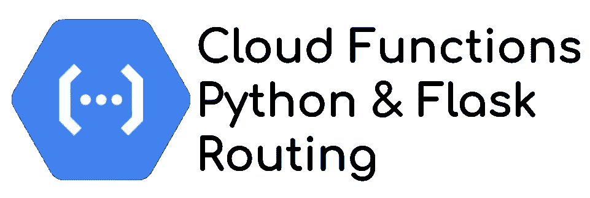

# 在云函数、Python 和 Flask 中使用多路径

> 原文：<https://medium.com/google-cloud/use-multiple-paths-in-cloud-functions-python-and-flask-fc6780e560d3?source=collection_archive---------0----------------------->



功能即服务，或 FaaS，一直是应用程序开发的基石。由于 AWS Lambda 服务的普及，所有主要的云提供商都提供了自己的版本，具有不同的功能。他们还将这一原则扩展到容器，例如在谷歌云上运行的[云。](https://cloud.google.com/run/docs)

在 Google Cloud 上， [Cloud Functions 是 FaaS 服务](https://cloud.google.com/functions/docs)，要使用它，你必须执行预定义的代码结构。在 Python 中，为了处理 HTTP 请求，函数签名如下

```
def my_function(request):
  ...
  return "response", 200 #http code
```

# FaaS 常见问题

当你部署一个功能时，它“只有一个功能”，只完成一个任务。这种固执己见的设计允许更好的可伸缩性和关注点分离。

这种选择的结果可以在调用该函数的可用 URL 中看到

```
https://<region>-<projectID>.cloudfunctions.net/<functionName>
```

*只有一条路径合适。没有子路径配置，没有路径路由定义。*

然而，有时，你想做更多，即使这不是一个好模式，你需要(或想要)使用 REST API 定义来访问资源，通过使用路径参数。
*例如:* `*/<functionName>/user/<userId>*`

# Flask 路由和云函数限制

Flask framework 提出了一种惯用的方法来实现这一点。你定义你的 Flask App，你的路线，就这些 *(* [*你可以在任何教程/入门*](https://flask.palletsprojects.com/en/1.1.x/quickstart/) *)*

```
from flask import Flask, request

app = Flask("internal")

@app.route('/user/<string:id>', methods=['GET', 'POST'])
def users(id):
    <do something>
    print(id)
    return id, 200
```

可悲的是，对于云函数，即使[云函数基于 Flask 请求定义](https://cloud.google.com/functions/docs/concepts/exec#functions-concepts-stateless-python)，你也不能，因为你不管理 Flask root app，只管理云函数端点，仅此而已！！

为了更好地理解，实现类似于

```
############### MANAGED BY GOOGLE ####################from flask import Flask, request

app = Flask("google_managed")

@app.route('/my_function', methods=['GET', 'POST'])
def common_cloud_functions_function():
    return my_function(request)############### MANAGED AND PROVIDED BY YOU ####################
def my_function(request):
  ...
  return "response", 200 #http code
```

> 如何在不管理 Flask 服务器的情况下执行基于路径的路由？

# 手动烧瓶调用

Flask 是一个执行两个主要任务的框架

*   基于 URL 映射执行路由
*   监听并服务于网络服务器

原则是只重用路由部分，不重用监听和服务；这一部分由云函数运行时执行。这个解决方案的主要兴趣是重用 Flask 惯用路径规则定义的能力，以及保持开发人员熟悉的环境。

因此，当收到请求时，我们必须:

*   创建新的上下文
*   复制请求的主要值(数据、头、路径等)
*   分派和处理请求

所以，让我们编码吧！

```
from flask import Flask, request#Define an internal Flask app
app = Flask("internal")#Define the internal path, idiomatic Flask definition
@app.route('/user/<string:id>', methods=['GET', 'POST'])
def users(id):
    print(id)
    return id, 200#Comply with Cloud Functions code structure for entry point
def my_function(request):
    #Create a new app context for the internal app
    internal_ctx = app.test_request_context(path=request.full_path,
                                            method=request.method)

    #Copy main request data from original request
    #According to your context, parts can be missing. Adapt here!
    internal_ctx.request.data = request.data
    internal_ctx.request.headers = request.headers

    #Activate the context
    internal_ctx.push()
    #Dispatch the request to the internal app and get the result 
    return_value = app.full_dispatch_request()
    #Offload the context
    internal_ctx.pop()

    #Return the result of the internal app routing and processing      
    return return_value
```

云功能照常部署，并提供相同的端点。但是，这一次，您可以请求您的新路径。尝试这个请求

```
curl https://<region>-<projectID>.cloudfunctions.net/<functionName>/user/123# The return is 123
```

# 解锁云功能限制…..还是不要！！

该解决方案允许您释放云功能的路由能力，并实现不止一个目的的端点。您可以获得一致性和效率(部署更少的功能)

然而，请记住，这只是一种变通方法，甚至是一种黑客行为，云函数并不是为此目的而设计的。

如果您想要创建一个 API 后端，在同一个实例上处理并发请求，拥有一个开发人员友好的环境(用于测试、打包、可移植性等)，Cloud Run 是一个更适合的产品！

*免责声明:我不是 Python 开发者，一些代码部分可以改进得更地道。请不吝赐教，改进这些代码示例！*