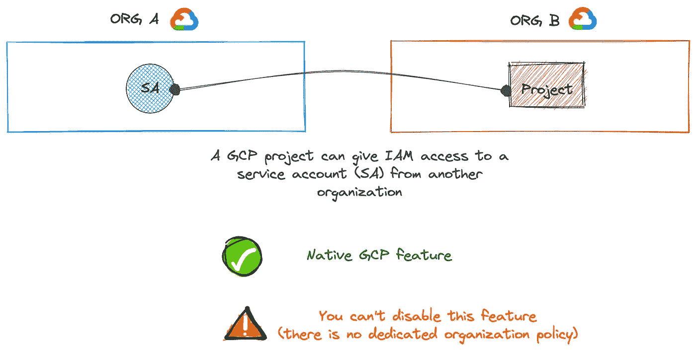
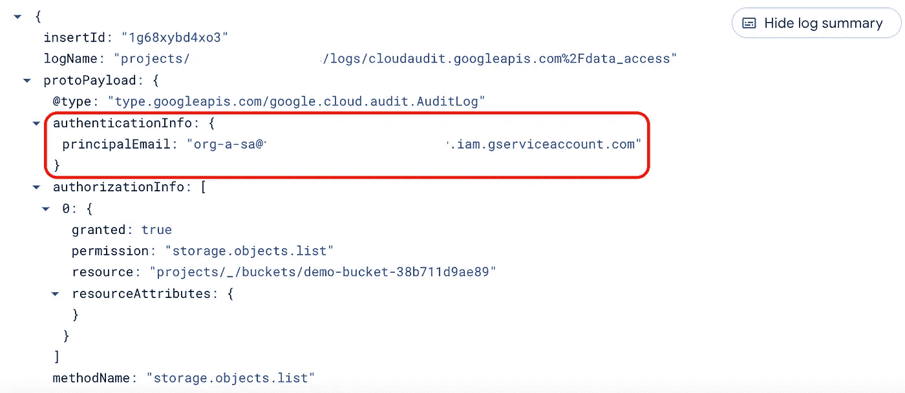
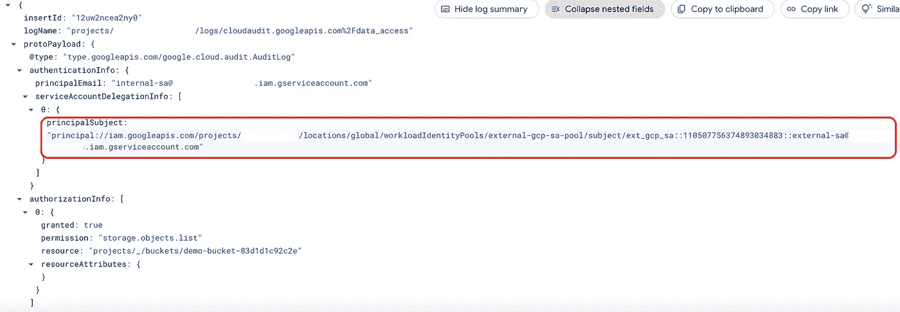
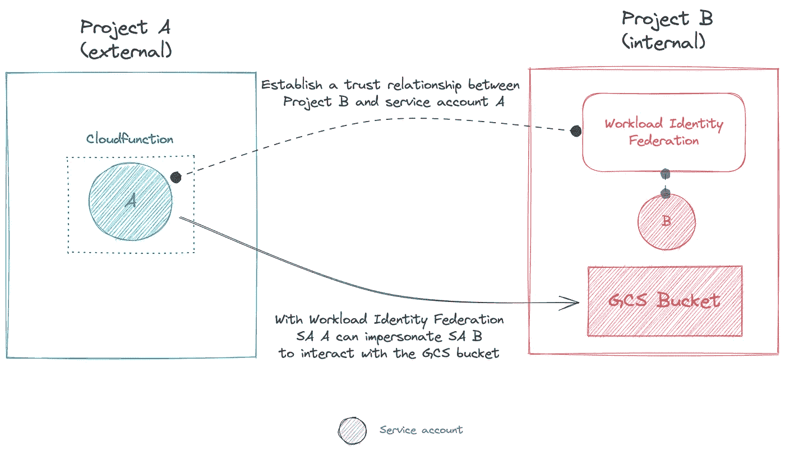
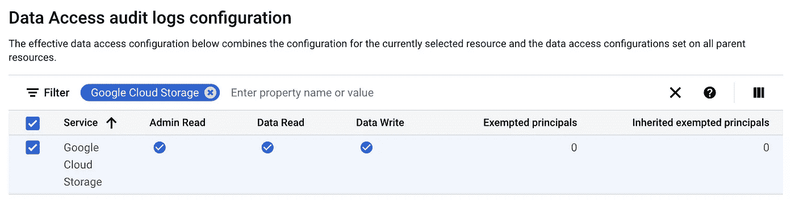
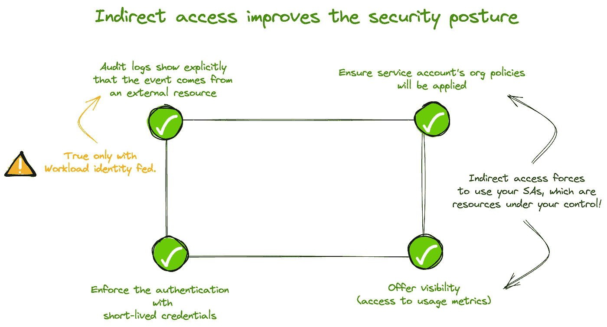

# 将工作量标识联合用于另一个 GCP 项目

> 原文：<https://medium.com/google-cloud/use-workload-identity-federation-with-another-gcp-project-98dc3b1c236c?source=collection_archive---------0----------------------->


克劳迪奥·施瓦茨拍摄的照片

自 2021 年 4 月[日](https://cloud.google.com/iam/docs/release-notes#April_09_2021)起，GCP 允许为外部工作负载建立身份联盟。在[官方文档](https://cloud.google.com/iam/docs/workload-identity-federation)中提到:

> 使用身份联合，您可以授予内部或多云工作负载对 Google 云资源的访问权限，而无需使用服务帐户密钥。

在这里，术语*外部*似乎包含了所有在 GCP 之外运行的进程(例如 AWS、Azure、on-prem、SaaS 等)。).事实上，Workload Identity Federation 试图解决的主要问题是长期凭证的使用，服务帐户密钥很好地体现了这一点。

在我看来，一个*外部*工作量就是在一个 GCP 组织 之外 ***运行的一切。***

话虽如此，当两个 GCP 组织需要一起工作时会发生什么呢？



从您知道另一个组织拥有的服务帐户的电子邮件的那一刻起，您可以通过以下方式授予它对您的资源的权限:

*   `**Direct Access**`
*   `**Indirect Access**`:允许后者冒充你的一个服务账号

知道外部服务帐户在 GCP 上运行，它可以受益于环境凭据而不是密钥。

```
**Definition***Ambient credentials are credentials that the application can obtain without having to perform any additional authentication.**For example, in GCP it's provided thanks to a runtime service account + metadata server*
```

考虑到这一点，在这种用例中使用工作负载身份联合可能听起来很傻或者有些过火😵。

然而，让我们看看它是如何有用的！

# GCP 项目的工作负载身份联合并非毫无意义

我们开门见山吧！当您以*本机方式*访问外部 SA 时，主要缺点是它将 ***不可察觉*** 在您的审计日志中。



使用本机 IAM 策略的审计日志示例(直接访问)

换句话说，审计日志不会突出一个`***service account DOESN'T belong to your org***`的事实！

***注意*** *:我观察到了一个模仿(间接访问)的相同行为。*

为了获得这些信息，您必须解析日志(例如*从电子邮件*中提取项目 id 或项目编号)并与您的参考(例如[云资产清单](https://cloud.google.com/asset-inventory/docs/overview))进行比较，这需要时间和资源。

另一方面，如果您使用工作负载身份联邦，那么 ***将明确*** 某个身份在您的领域之外。



使用工作负载身份联合的审计日志示例

在我的例子中，主体遵循这个任意的模式`***ext_gcp_sa::<sa_id>::<sa_email>***`。现在，如果您的组织遵守命名约定，您的安全团队将能够跟踪外部身份足迹，而无需数据转换！

此外，以同样的方式对待所有外部身份提供了一致性(如流程、日志格式)，从而降低了总体复杂性。

现在，我会告诉你如何设置这个⬇️

# 具体的例子

首先，下面描述的所有内容在这个 [***资源库***](https://github.com/LoicSikidi/workload-identity-federation-with-gcp-project) 中也是可用的。

我们将创建这样的东西:



***注意*** *:为了简单起见，我们将所有资源创建在同一个项目中。*

## 魔法是如何运作的？

1.  信任关系依赖于两个前提条件:
    a)OIDC 令牌*必须由*https://accounts.google.com*
    颁发*b)OIDC 令牌中代表服务帐户 ID 的声明(此处为`sub`)*必须在我们的允许列表中。信任基于 SA ID，因为该值随时间推移是唯一的(例如*如果服务帐户被删除，然后用同一电子邮件重新创建，后者将被拒绝，因为 ID 将不同*)*
2.  *[*外部帐户凭证*](https://google.aip.dev/auth/4117) (由应用程序默认凭证解释)看起来像这样:*

```
*{
  "type": "external_account",
  "audience": "<AUDIENCE>",
  "subject_token_type": "urn:ietf:params:oauth:token-type:jwt",
  "token_url": "[https://sts.googleapis.com/v1/token](https://sts.googleapis.com/v1/token)",
  "**credential_source**": {
    "**url**": "http://metadata.google.internal/computeMetadata/v1/instance/service-accounts/default/identity?audience=<AUDIENCE>",
    "**headers**": {
      "Metadata-Flavor": "Google"
    }
  },
  "service_account_impersonation_url": "[https://iamcredentials.googleapis.com/v1/projects/-/serviceAccounts/<SA_EMAIL>:generateAccessToken](https://iamcredentials.googleapis.com/v1/projects/-/serviceAccounts/internal-sa@test-wif-qsfqsf.iam.gserviceaccount.com:generateAccessToken)"
}*
```

*[subject_token](https://www.rfc-editor.org/rfc/rfc8693#section-2.1-4.12) 直接从元数据服务器中检索。*

## *设置*

*第一步是启用云存储审计日志。*

**

*然后，运行以下命令:*

## *试验*

```
**# Call the cloudfunction to produce audit logs***for** i **in** {1..10}
**do** curl -sS -H "Authorization: Bearer $(gcloud auth print-identity-token)" $CF_URL
**done***
```

*现在，使用这个查询`protoPayload.serviceName="storage.googleapis.com"`检查*云日志*以查看审计日志并检查 IAM 委托细节。*

## *打扫*

*从上面的脚本中取消对*清理*部分的注释，以便删除创建的资源。*

*如果需要，禁用云存储审核日志。*

# ***结论***

*如您所见，在另一个 GCP 项目中使用 Workload Identity Federation 是有意义的。该功能可以在您的 GCP 组织中带来更好的可见性，而这并不需要很大的努力。可见性可以帮助您的不同团队(开发人员、安全与合规、高层管理人员等)。)在他们的日常任务中。*

*一般来说，如果你必须给出一个外部服务帐户的访问权限，总是选择`**indirect access**`而不是`**direct access**`。*

**

*我对不同方法的评分如下:*

1.  ****工作负载身份联合*** :提供最佳特性覆盖的解决方案。*
2.  ****常规冒充*** :权衡好但是审计日志少*上下文感知*。*
3.  ****直接访问*** :不允许强制执行任何安全策略(例如，组织策略、从[策略智能](https://cloud.google.com/policy-intelligence/docs/service-account-usage-tools)中获取洞察等)。)由您的组织定义。用这种方法，你完全依赖于你的伴侣的善意。*

*今天到此为止。*

*我希望这个反思对你们中的一些人有用！*