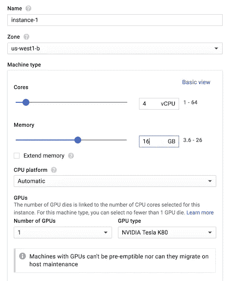
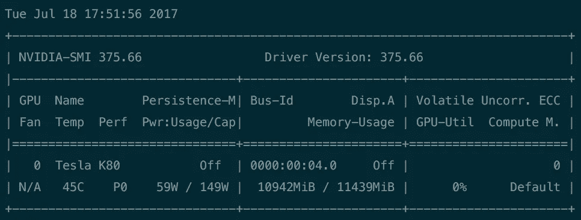

# 在 Google 云平台上使用 GPU & TensorFlow

> 原文：<https://medium.com/google-cloud/using-a-gpu-tensorflow-on-google-cloud-platform-1a2458f42b0?source=collection_archive---------0----------------------->

阅读此文之前的警告:我很高兴这个博客对很多人有用。因为它已经有一年多的历史了，一些命令是基于旧版本的软件。为了简化设置，您现在可能需要使用谷歌云优化计算映像:

我推荐阅读维亚切斯拉夫·科瓦列夫斯基的[这篇博客，而不是继续看这篇。](https://blog.kovalevskyi.com/deep-learning-images-for-google-cloud-engine-the-definitive-guide-bc74f5fb02bc)

*这篇博客的作者:*

*   *Ubuntu 16.04*
*   *CUDA 8*
*   *TensorFlow 1.4.0*

谷歌有一些很好的文档[在这里](https://cloud.google.com/compute/docs/gpus/add-gpus#install-gpu-driver)但是我需要采取一些额外的步骤。所以，让我们从头开始:

## GPU 实例

有两种方法来设置实例:1)使用 Google Cloud 提供的命令行界面，或者 2)使用他们非常友好的 web ui 来帮助你。因为我是谷歌云网络界面的忠实粉丝，这就是我要做的。设置服务器非常简单。



指向并单击以设置 GPU 实例

在谷歌云平台中，确保您已经创建了一个项目，然后导航到**计算引擎。**系统会询问您是否要创建一个新实例，一旦您看到左侧所示的弹出对话框，您可以配置内核数量、内存(RAM)和一个小选项“GPU”。点击这个和额外的选项显示出来，这将允许你指出是否和多少 GPU 你想使用。然后我选择 **Ubuntu 16.04** 作为启动盘，其他选项保持不变，然后点击 *Create* 启动实例。

一旦实例准备好了，你就可以通过使用 Google Cloud 提供的 web-shell 或者从你自己的命令行复制 *gcloud* 命令来连接它。

## 安装 CUDA

现在我们在我们需要为 GPU 安装一些驱动程序。Google Cloud 上的 GPU 都是 NVIDIA 卡，需要安装 CUDA。为了安装 CUDA 8.0，我对 Ubuntu 16.04 使用了以下命令(摘自[谷歌云文档](https://cloud.google.com/compute/docs/gpus/add-gpus#install-gpu-driver)):

```
sudo su#!/bin/bash
echo "Checking for CUDA and installing."
# Check for CUDA and try to install.
if ! dpkg-query -W cuda; then
  # The 16.04 installer works with 16.10.
  curl -O [http://developer.download.nvidia.com/compute/cuda/repos/ubuntu1604/x86_64/cuda-repo-ubuntu1604_8.0.61-1_amd64.deb](http://developer.download.nvidia.com/compute/cuda/repos/ubuntu1604/x86_64/cuda-repo-ubuntu1604_8.0.61-1_amd64.deb)
  dpkg -i ./cuda-repo-ubuntu1604_8.0.61-1_amd64.deb
  apt-get update
  # apt-get install cuda -y
  sudo apt-get install cuda-8-0
fi
```

要验证其工作是否正常，请运行下面的命令，这将显示 GPU 已被识别并正确设置。

```
nvidia-smi
```



耶！它是存在的，并且正在得到承认。我们还需要为 CUDA 设置一些环境变量:

```
echo 'export CUDA_HOME=/usr/local/cuda' >> ~/.bashrc
echo 'export PATH=$PATH:$CUDA_HOME/bin' >> ~/.bashrc
echo 'export LD_LIBRARY_PATH=$CUDA_HOME/lib64' >> ~/.bashrcsource ~/.bashrc
```

## 安装 cuDNN

NVIDIA 提供了 **cuDNN** 库来优化他们卡上的神经网络计算。他们将其描述为:

> NVIDIA CUDA 深度神经网络库(cuDNN)是一个针对[深度神经网络](https://developer.nvidia.com/deep-learning)的 GPU 加速原语库。cuDNN 为标准例程提供了高度优化的实现，例如前向和后向卷积、池化、规范化和激活层。cuDNN 是[英伟达深度学习 SDK](https://developer.nvidia.com/deep-learning-sdk) 的一部分。
> 
> 全球深度学习研究人员和框架开发人员依赖 cuDNN 进行高性能 GPU 加速。这使得他们可以专注于训练神经网络和开发软件应用程序，而不是花时间在低级别的 GPU 性能调优上。

总结:他们做了很多工作来让你的生活变得更容易…你需要注册 [NVIDIA 开发者计划](https://developer.nvidia.com/developer-program)，然后你就可以下载最新版本的软件了。在这种情况下，我下载了 CUDA 8.0 的 5.1 版本(我刚刚注意到一个更新的 6.0 版本也可用)。下载完成后，使用 SCP 或通过 Google 云存储将其转移到实例中。

一旦它在实例上，使用以下命令安装它:

```
cd $HOMEtar xzvf cudnn-8.0-linux-x64-v5.1.tgzsudo cp cuda/lib64/* /usr/local/cuda/lib64/
sudo cp cuda/include/cudnn.h /usr/local/cuda/include/rm -rf ~/cuda
rm cudnn-8.0-linux-x64-v5.1.tgz
```

## 安装 TensorFlow

因此，GPU 实例正在运行，驱动程序也已就绪，剩下的工作就是安装 TensorFlow 来运行 GPU。你可以看到，谷歌正试图让这一切变得超级简单，因为你真的需要行来完成这最后一步:

```
sudo apt-get install python-dev python-pip libcupti-dev
sudo pip install --upgrade tensorflow-gpu==1.4.0
```

安装 *tensorflow-gpu* 可以确保它在需要的地方默认使用 gpu 进行操作。只要你愿意，你仍然可以手动将某些东西转移到 CPU 中。让我们测试一下是否一切正常…

## 测试设置

现在，要测试是否全部成功，您可以使用下面的 python 代码。它将两个变量和一个操作分配给 cpu，将另外两个变量和一个操作分配给 GPU。当启动会话时，我们通过 ConfigProto 告诉它记录变量/操作的位置，您应该看到它在放置变量/操作的命令行打印出来。

```
import tensorflow as tf with tf.device('/cpu:0'):
    a_c = tf.constant([1.0, 2.0, 3.0, 4.0, 5.0, 6.0], shape=[2, 3], name='a-cpu')
    b_c = tf.constant([1.0, 2.0, 3.0, 4.0, 5.0, 6.0], shape=[3, 2], name='b-cpu')
    c_c = tf.matmul(a_c, b_c, name='c-cpu') with tf.device('/gpu:0'):
    a_g = tf.constant([1.0, 2.0, 3.0, 4.0, 5.0, 6.0], shape=[2, 3], name='a-gpu')
    b_g = tf.constant([1.0, 2.0, 3.0, 4.0, 5.0, 6.0], shape=[3, 2], name='b-gpu')
    c_g = tf.matmul(a_g, b_g, name='c-gpu') with tf.Session(config=tf.ConfigProto(log_device_placement=True)) as sess:
    print (sess.run(c_c))
    print (sess.run(c_g)) print 'DONE!'
```

就这些…

## ***更新(2018 年 3 月 7 日)

根据 ChrisAMancuso 的反馈，我已经替换了这条线

```
apt-get install cuda -y
```

随着

```
sudo apt-get install cuda-8–0
```

以确保其安装 CUDA 8.0(tensor flow 支持/不支持 CUDA 9.0)。