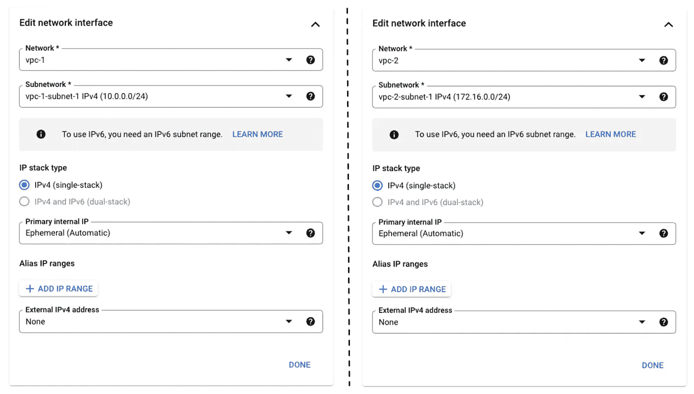

# 使用多网卡虚拟机作为 Google Cloud 中 VPC 之间的网关

> 原文：<https://medium.com/google-cloud/using-a-multi-nic-vm-to-connect-vpcs-in-google-cloud-d84aa533538?source=collection_archive---------2----------------------->

想象一下，有一个 GCP 项目设置，其中有多个 VPC 网络和计算引擎实例托管在其中。默认情况下，一个 VPC 中的实例无法通过私有 IP 与其他 VPC 中的实例通信。

要让不同 VPC 中的实例在不使用公共互联网的情况下相互通信，使用 VPC 对等似乎是显而易见的。

VPC 对等是这种情况下的完美解决方案，但有时组织或客户可能会有一些复杂的要求，使您无法使用 VPC 对等。

在您无法使用 VPC 对等、私有服务连接等现成服务，并且需要构建自定义内容的情况下，在多个 VPC 网络中部署一个连接了多个网络接口的计算引擎虚拟机可以完成这项工作。

假设我们现在只有 2 个 VPC。我们的想法是创建一个虚拟机，在第一个 VPC 中有一个网络接口，在第二个 VPC 中有另一个网络接口。让我们称之为网关虚拟机。我们将使用`iptables`将来自第一个 VPC 实例的流量转发到第二个。

类似地，对于成功的请求，我们需要对反向流进行相同的设置。

这就是它可以被形象化的方式。


由 [Devashish Patil](https://medium.com/u/3b9a10f61d50?source=post_page-----d84aa533538--------------------------------) 设计

# 设置

让我们看看如何设置它。

## VPC

创建 2 个名为`vpc-1`和`vpc-2`的 VPC，每个 VPC 至少有一个子网。请注意，这些 VPC 不能有重叠的 IP 地址范围。在示例中，`vpc-1`中的子网具有`10.0.0.0/24`地址空间，而`vpc-2`中的子网具有`172.16.0.0/24`地址空间。

## 计算引擎

除了默认配置之外，客户端和服务器虚拟机的创建都不需要额外的配置。在这个例子中，使用了基于 Debian 的映像。在`vpc-1`中创建`client`，在`vpc-1`中创建`server`。请记住，不要为这些虚拟机分配任何公共 IP 地址

> 确保分配正确的网络标记和防火墙规则，以允许特定端口上的流量。对于这个例子，使用了 HTTP 请求。

对于网关虚拟机，在创建过程中需要注意一些事情。让我们看看还需要做些什么。

从门户创建网关实例时，在高级选项下，单击网络，可以看到 IP 转发复选框。这需要启用。


完成后，导航到网络接口部分，需要添加 2 个网络接口，如下例所示。确保删除外部 IPv4 地址。

> 网络接口的数量受到实例中的 vCPUs 的限制。有关这方面的更多信息，请参考这篇文章。



就这样，点击创建。一旦所有 3 个实例都在运行，可以看到客户端和服务器有一个私有 IP 地址，而网关有 2 个。


对于快速连接测试，SSH 进入所有 3 个实例并执行以下操作。

*   从`Client`ping`Gateway`，就可以了。
*   从`Gateway`ping`Server`，它会工作
*   Ping `Server` from `Client`，行不通

这些步骤的逆过程也是如此。可以看出，`gateway`实例能够到达`client`和`server`实例。

## IPTables

现在到了需要配置网关实例的部分，来自`nic0`上`client`的请求需要通过`gateway`实例的`nic1`转发到`server`实例。

为此，SSH 进入`gateway`实例并执行以下步骤。

**第一步:允许 IP 转发**

```
sudo sysctl -w net.ipv4.ip_forward=1
```

**第二步:创建 IP 表规则:**

让我们理解下面提到的命令背后的逻辑。

*   所有到达`nic0`上的`gateway`实例的请求都以`nic0` IP 地址为目的地。
*   当请求到达`gateway`实例时，在预路由规则中，目的地被修改为`server`实例。
*   现在请求将能够到达`server`，但是请求中的源仍然是`client`的 IP 地址。因此，在响应流程中，`server`将无法直接与`client`通信。
*   但是`server`可以在`nic1`上将响应发送回网关。
*   因此，作为 POSTROUTING 规则，请求中的源被更改为`gateway`实例的`nic1` IP 地址，从而完成请求-响应循环。

```
#Prerouting Rule
sudo iptables --table nat --append PREROUTING --protocol tcp --destination 10.0.0.3 --jump DNAT --to-destination 172.16.0.2

#PostRouting Rule
sudo iptables --table nat --append POSTROUTING --protocol tcp --destination 172.16.0.2 --jump SNAT --to-source 172.16.0.3
```

在这里，所有的 TCP 流量都被转发。为了测试这一点，可以在`server`实例中托管一个简单的 HTTP 服务器。SSH 到`server`实例，下面是如何用 Python 监听端口 80。

```
sudo python3 -m http.server 80
```

现在，为了测试这一点，SSH 进入客户机实例，用这个简单的 curl 命令点击网关实例 nic0 IP。

```
curl 10.0.0.3
```

这里需要一个 HTML 响应(带有服务器实例目录列表)来获得成功的结果。例如:

```
<!DOCTYPE HTML PUBLIC "-//W3C//DTD HTML 4.01//EN" "http://www.w3.org/TR/html4/strict.dtd">
<html>
<head>
<meta http-equiv="Content-Type" content="text/html; charset=utf-8">
<title>Directory listing for /</title>
</head>
<body>
<h1>Directory listing for /</h1>
<hr>
<ul>
<li><a href=".bash_logout">.bash_logout</a></li>
<li><a href=".bashrc">.bashrc</a></li>
<li><a href=".profile">.profile</a></li>
<li><a href=".ssh/">.ssh/</a></li>
</ul>
<hr>
</body>
</html>
```

您可以在实现 IPTables 之前和之后尝试这样做，以确保流程。

这就是如何使用多 NIC 实例作为 2 个或更多 VPC 之间的网关。

## 结束注释和参考

*   这只是 IP 转发的一个非常简单的用例，但还可以有更多。一个主要的用例是当需要自定义流量过滤时，可以使用这种方法。
*   这里只使用了一个网关实例，但是为了获得更高的可伸缩性，可以使用负载平衡器和托管实例组的组合。
*   IP 表的基础知识在本文中没有涉及，要详细了解[这个视频可以参考。](https://www.youtube.com/watch?v=NAdJojxENEU)