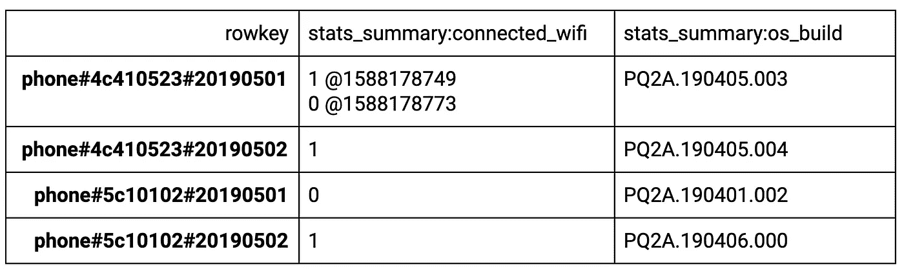

# 使用 Bigtable 的监控工具，意味着一个 Pb 级的数据库，来…制作艺术

> 原文：<https://medium.com/google-cloud/using-a-petabyte-scale-databases-monitoring-tools-to-make-art-8aa8eb17234?source=collection_archive---------0----------------------->

两年来，我一直在为谷歌的云 Bigtable 处理开发者关系。这是一个旨在处理数 Pb 数据的数据库，为许多核心谷歌服务提供支持，包括搜索、分析、地图和 Gmail。然而，我创建的最大的表大约是 100 MB——甚至不接近 Bigtable 所能支持的。

Bigtable 团队最近推出了他们的监控工具 [Key Visualizer](https://cloud.google.com/blog/products/databases/cloud-database-monitoring-for-bigtable) 的改进版本，并且最近获得了一些额外的空闲时间，现在似乎是尝试加载大量数据并使用更新工具的好时机。

最后，我写了 10TB 的数据，并发现我可以对关键的可视化工具进行逆向工程，以创建艺术作品。

# 什么是 Bigtable

云 Bigtable 是[谷歌的 NoSQL 大数据数据库服务](https://cloud.google.com/bigtable)。它非常适合运行大型分析工作负载和构建低延迟应用程序。

如果您试图获得 Bigtable 的心理模型，有行和列，每个行/列交叉点是一个单元格。单元格中可以有多个值存储为版本，因此 Bigtable 表是一个包含行、列和版本的三维表。Bigtable 是一个相当低级的数据库，所以它可以提供很好的 QPS 和可伸缩性，但是它提供了非常基本的查询功能，这些功能主要集中在行键上。您可以通过 rowkey 获取单行或扫描一系列行。

一个关于移动设备的示例数据库。第一个单元具有多个时间版本，带有 connected_wifi 值的时间戳。

对于[如何组织数据](https://cloud.google.com/bigtable/docs/schema-design)，有许多潜在的安排，但基本上，你不希望过于频繁地查询同一个行键或一系列行键，这会导致性能问题。这就是关键可视化工具的用武之地。它允许您查看哪些行键或行键组被过于频繁地查询。

我看到 key visualizer 可以基于读取吞吐量生成如下图所示的详细图像，所以我想知道*我是否可以颠倒这个过程，得出一组可以生成特定图像的读取结果？*

# 将 10TB 的数据加载到 Bigtable 中(不要在家里尝试)

我使用 Bigtable key visualizer 的第一步是创建并填充一个数据库。我想加载 1pb，但这似乎有点过分，并且不想占用太多可用于关键业务的资源。

Github 上提供了所有使用的代码和关于如何运行它的说明，所以我将给出代码做什么的高层次概述，但不会在这篇文章中进入太多的细节。

通过云控制台创建和扩展 Bigtable 实例非常容易。对于 10TB，我可以使用 8 个节点，这为我提供了足够的存储和吞吐量来快速加载我的数据。

通过用户界面创建 Bigtable 实例。

你可能会在侧边栏上注意到这是相当昂贵的，所以不要在家里尝试！对于在家尝试的更便宜的替代方法，您可以创建一个单节点实例，完成后应该关闭它。

创建实例后，我使用数据流将每行 100MB 的随机字节写入表中。总共 10TB 和每行 100MB 意味着我们将写入 100，000 行。为了避免[顺序写入](https://cloud.google.com/bigtable/docs/schema-design#sequential_numeric_ids)的任何问题，我使用了一个 rowkey，它反转迭代次数并用零填充。

运行数据流作业以加载数据

我在数据流作业增加时对其进行了监控(左图),并在 Bigtable 监控工具中看到了类似的活动增加(右图)

反向行键有所帮助，但我最终添加了一些节点，以保持在最大 CPU 利用率之下。数据加载后，我减少了节点。

# 创建将激活 KeyViz 中像素的查询

现在数据已经在表中了，我可以开始使用 key visualizer 来监控使用模式。

由加载数据作业生成的可视化效果。

我发现，如果我不断地对某些细胞进行范围扫描，它们会在关键可视化器中激活。我写了一个数据流作业，可以根据输入的 CSV 执行范围扫描。我开始画了一个简单的笑脸。

这让我知道，一旦我用那种格式写了图像，我就能画出各种各样的图像，但我想知道我是否能给图像增加更多的深度，并通过比其他区域更频繁地扫描某些区域来使用渐变。关键可视化提供 15 分钟的窗口输出。如果我的作业有一个范围的输入. 7，它将有 70%的机会扫描该范围。由于每个窗口都有数百次扫描，我希望应用程序会做出相应的响应。我试着用下面的 CSV 扫描，很高兴看到我能够在我的图像中包含深度。

一旦我知道了 key visualizer 的功能，我做了一点数学和脚本来获取任何图像并将其转换成所需的 CSV。为此，我写了一个[的便捷代码笔](https://codepen.io/billyjacobson/pen/OJVxVzO)，这样我就可以方便地添加更多的图片。我还添加了一个小时数的输入，它决定了生成的图像的质量。

一旦我创建了图像并上传到[公共桶](https://cloud.google.com/storage/docs/access-control/making-data-public)，我就运行一个管道来完成以下工作:

1.  下载图像 CSV
2.  根据 CSV 的尺寸平均分配所有行键
3.  基于多个行键范围创建扫描–为了在 visualizer 中获得不同的强度/深度，使用 CSV 中的像素值有条件地使用特定范围
4.  扫描桌子
5.  每秒重复一次，每 15 分钟移动到下一列(每次监控更新的最小宽度)

您还可以从 Github 查看和运行 ReadData 管道。

# 大结局！

然后…我等着！为了获得最高质量的图像，需要在几天内生成图像。关键可视化工具以 15 分钟的间隔给出更新，图像宽度的每个额外像素花费 15 分钟。图像高度由平板电脑的数量决定，大约是每千兆字节存储 1 个平板电脑，这相当大，所以在这里不是一个很大的限制。如果你在家里用一个更小的桌子，你的图像质量会更低，但仍然可以辨认。

我设置了几个表和作业同时运行，这样我可以得到更多的结果，如下所示:

有几个参数可以使用。亮度会改变图像的缩放比例，如果您想要深入查看较小的区域，这会很有帮助。

您还可以调整显示哪个指标。“读取字节客户端”似乎产生平滑的图像，而“Ops”产生更多线条的图像，在某些图像上看起来真的很酷。

最后，如果你和我一样是[变装和露波变装比赛的狂热爱好者，那么你就会明白为什么我也必须在关键的可视化工具中让变装皇后永垂不朽。](http://twitter.com/theannalytical)

