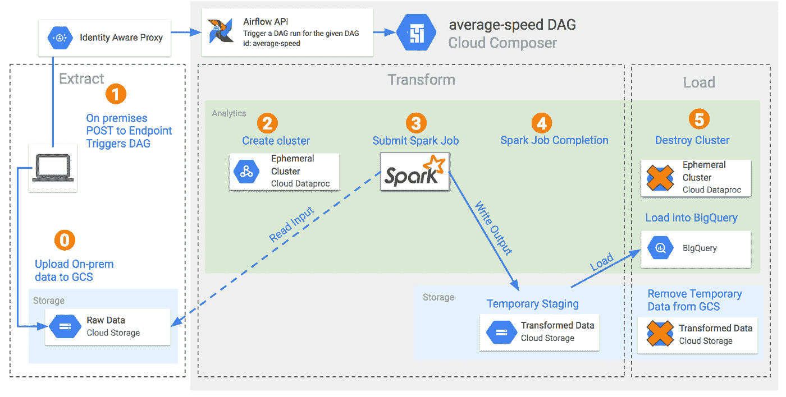
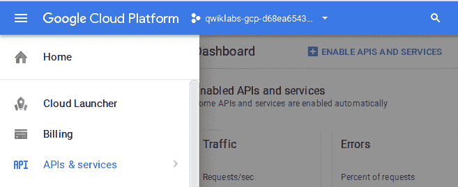
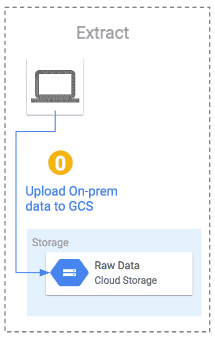
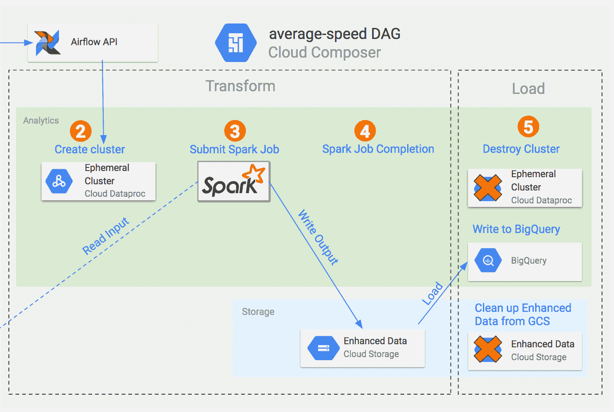
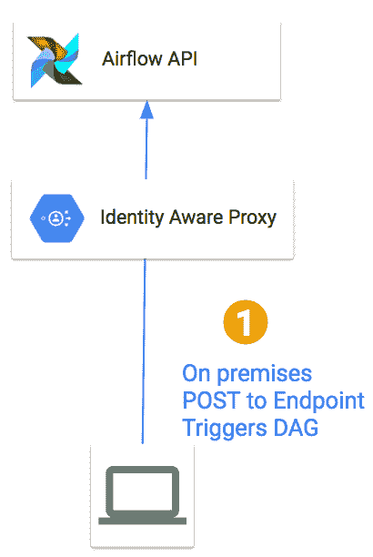
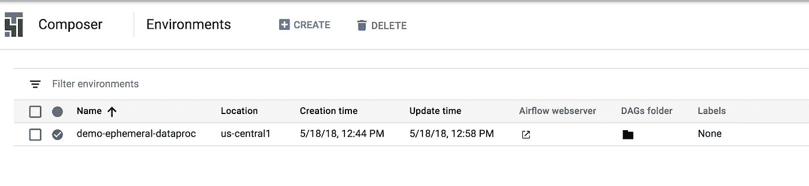
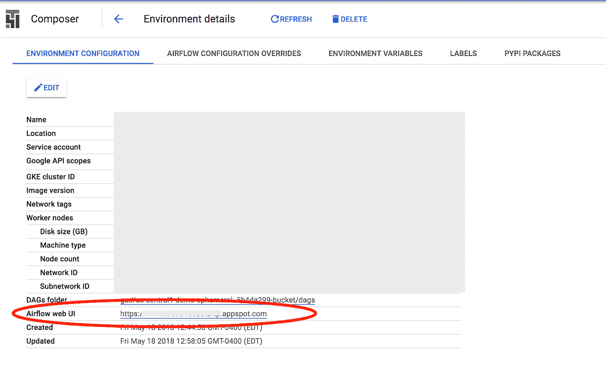
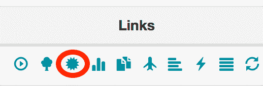
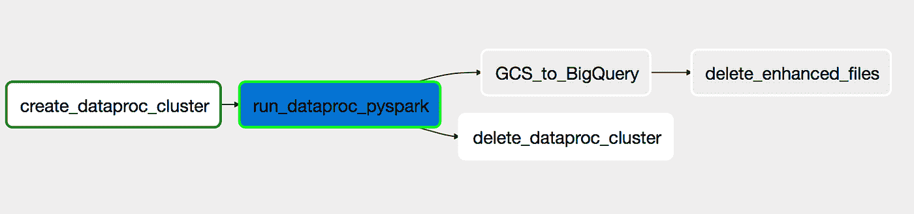
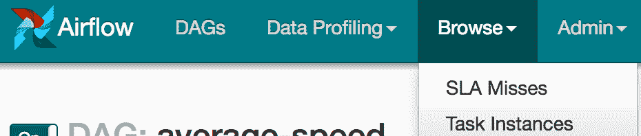

# 在 Google 云平台上使用气流实验 Rest API:Cloud Composer 和 IAP

> 原文：<https://medium.com/google-cloud/using-airflow-experimental-rest-api-on-google-cloud-platform-cloud-composer-and-iap-9bd0260f095a?source=collection_archive---------1----------------------->

# 无论何时你这么说

因此，您已经开始使用 Apache Airflow，并且您已经迷上了它，或者您正在研究 Airflow 可以如何帮助您，但是您的需求并不完全符合[我们希望迁移我们的 cron 调度](/videoamp/what-we-learned-migrating-off-cron-to-airflow-b391841a0da4)或[只要有文件进入桶中](https://cloud.google.com/composer/docs/how-to/using/triggering-with-gcf)就行。唉，你需要你的狗在你说的任何时候跑*。嗯，我有消息告诉你！Airflow 有一个[实验性的 REST API](https://airflow.apache.org/api.html) ，您可以使用它来触发 Dag。因此，当您的上游系统完成一些事情时，您可以调用一个简单的 python 脚本[来处理与](https://github.com/GoogleCloudPlatform/python-docs-samples/blob/master/iap/make_iap_request.py) [Google 身份感知代理](https://cloud.google.com/iap/)的认证，并向您的 Airflow 端点发出一个 HTTP 请求。本文将带您建立一个 [Cloud Composer](https://cloud.google.com/composer/) 环境来实现这一点！*

# *你将建造什么*

*因此，获取最新版本的 [Google Cloud SDK](https://cloud.google.com/sdk/) ，让我们使用 Google Cloud Composer 来自动化 ETL 数据管道的转换和加载步骤！管道将创建一个 Dataproc 集群，对提取的数据执行转换(通过 PySpark 作业)，然后将结果上传到 BigQuery。然后，您将通过使用 Google Identity Aware Proxy (IAP)进行身份验证并发布到 DAG 的 Airflow 端点来触发这个管道。*

**

*使用 HTTP POST 到端点来触发 Airlfow DAG 的架构图，该 DAG 自动启动/关闭 Dataproc 集群以运行 Spark 作业来增强数据并将增强的数据写入 BigQuery。*

# *正在设置*

## *项目设置*

*从您的 Google 云平台控制台页面打开云外壳:*

*查看来自[谷歌云平台专业服务 Github](https://github.com/GoogleCloudPlatform/professional-services/blob/master/examples/cloud-composer-examples/composer_http_post_example/README.md) 的代码。*

```
*# Contains source code for pyspark job and DAG.
git clone https://github.com/GoogleCloudPlatform/professional-services.git ~/professional-services*
```

*为方便起见，设置一个与项目 ID 相等的变量:*

```
*export PROJECT=**<REPLACE-THIS-WITH-YOUR-PROJECT-ID>** gcloud config set project $PROJECT*
```

## *启用 Google 云平台 API*

*使用此[助手链接](https://console.cloud.google.com/flows/enableapi?apiid=dataflow,compute_component,logging,storage_component,storage_api,bigquery,pubsub,dataproc)启用 BigQuery、计算引擎、Dataproc、Composer 和 Google 云存储 API(如果尚未启用)。啜饮你的咖啡，这将需要几分钟。*

**

## *创建云存储桶*

*使用 make bucket 命令在项目中的 us-central1 中创建新的区域存储桶。*

```
*gsutil mb -c regional -l us-central1 gs://$PROJECT
gsutil mb -c regional -l us-central1 gs://$PROJECT-dataproc-staging*
```

## *创建 BigQuery 数据集*

*在 BigQuery 中创建数据集。这是 BigQuery 中所有表的加载位置。*

```
*bq mk ComposerDemo*
```

## *导出数据*

**

*在本教程中，您将使用 BigQuery 公共表转储作为上游数据源。您将使用[纽约市黄色出租车数据](https://bigquery.cloud.google.com/table/nyc-tlc:yellow.trips?pli=1)。跟随[这个链接](https://cloud.google.com/bigquery/public-data/nyc-tlc-trips)了解更多关于数据的信息，然后使用下面的 gcloud 命令将表格导出为换行符分隔的 JSON 格式。您将为数据添加时间戳以避免冲突。注意，本实验后面的 dag_trigger.py 依赖于这个 **$EXPORT_TIMESTAMP** bash 环境变量。*

```
*export EXPORT_TS=`date “+%Y-%m-%dT%H%M%S”`&& bq extract \
--destination_format=NEWLINE_DELIMITED_JSON \
nyc-tlc:yellow.trips \
gs://$PROJECT/cloud-composer-lab/new-$EXPORT_TS/nyc-tlc-yellow-*.json*
```

*接下来，从这个公共云存储桶中复制为您的增强数据准备的模式文件:*

```
*gsutil cp gs://python-dataflow-example/schemas/nyc-tlc-yellow.json gs://$PROJECT/schemas/nyc-tlc-yellow.json*
```

# *创建一个编写器环境*

**

*[为此 DAG 创建一个 Cloud Composer 环境](https://cloud.google.com/composer/docs/how-to/managing/creating)。这将增加托管 DAG 和安装必要软件所需的计算资源。*

*在云 Shell 中，使用 gcloud 命令创建环境。请注意，env-variables 采用了一个对该环境中的所有 Dag 都可用的变量[列表。再次啜饮你的咖啡，这也需要几分钟。](https://airflow.apache.org/concepts.html#variables)*

```
*gcloud composer environments create demo-ephemeral-dataproc1 \
--location us-central1 \
--zone us-central1-b \
--machine-type n1-standard-2 \
--disk-size 20 # Set Airflow Variables in the Composer Environment we just created.
gcloud composer environments run \
demo-ephemeral-dataproc1 \
--location=us-central1 variables -- \
--set gcp_project $PROJECTgcloud composer environments run demo-ephemeral-dataproc1 \
--location=us-central1 variables -- \
--set gce_zone us-central1-bgcloud composer environments run demo-ephemeral-dataproc1 \
--location=us-central1 variables -- \
--set gcs_bucket $PROJECTgcloud composer environments run demo-ephemeral-dataproc1 \
--location=us-central1 variables -- \
--set bq_output_table $PROJECT:ComposerDemo.nyc_tlc_yellow_tripsgcloud composer environments run demo-ephemeral-dataproc1 \
--location=us-central1 variables -- \
--set dataproc_bucket $PROJECT-dataproc-staging*
```

## *请注意作曲家 DAG 文件夹*

*单击新 composer 环境的 DAG 文件夹图标。记下存储桶名称。(类似于:us-central 1-demo-短命—* * * * * * * * * *-bucket)*

**

# *准备 IAP 认证*

**

*触发 DAG 的端点将位于身份识别代理之后，需要使用服务帐户进行调用。*

## *获取用于发出 IAP 请求的最新 Python 代码*

*首先，您需要获得用于发出 IAP 请求的最新 python 脚本，并安装它的需求。*

```
*# Install necessary requirements for making iap requests with
# dag_trigger.py
(curl https://raw.githubusercontent.com/GoogleCloudPlatform/python-docs-samples/master/iap/requirements.txt; echo 'tzlocal>=1.5.1') >> ~/professional-services/examples/cloud-composer-examples/composer_http_post_example/iap_requirements.txt# Get latest version of make_iap_request from python-docs-samples.
curl [https://raw.githubusercontent.com/GoogleCloudPlatform/python-docs-samples/master/iap/make_iap_request.py](https://raw.githubusercontent.com/GoogleCloudPlatform/python-docs-samples/master/iap/make_iap_request.py) >> ~/professional-services/examples/cloud-composer-examples/composer_http_post_example/make_iap_request.py*
```

## *为 POST 触发器创建服务帐户*

*您需要创建一个服务帐户，以便通过发送到端点来触发 DAG。*

```
*gcloud iam service-accounts create dag-trigger# Give service account permissions to create tokens for 
# iap requests.
gcloud projects add-iam-policy-binding $PROJECT \
--member \
serviceAccount:dag-trigger@$PROJECT.iam.gserviceaccount.com \
--role roles/iam.serviceAccountTokenCreatorgcloud projects add-iam-policy-binding $PROJECT \
--member \
serviceAccount:dag-trigger@$PROJECT.iam.gserviceaccount.com \
--role roles/iam.serviceAccountActor# Service account also needs to be authorized to use Composer.
gcloud projects add-iam-policy-binding $PROJECT \
--member \
serviceAccount:dag-trigger@$PROJECT.iam.gserviceaccount.com \
--role roles/composer.user# We need a service account key to trigger the dag.
gcloud iam service-accounts keys create ~/$PROJECT-dag-trigger-key.json \
--iam-account=dag-trigger@$PROJECT.iam.gserviceaccount.comexport GOOGLE_APPLICATION_CREDENTIALS=~/$PROJECT-dag-trigger-key.json*
```

# *触发 DAG*

## *Python 设置*

*首先，您将为所需的 python 库做一些设置。*

```
*cd professional-services/examples/cloud-composer-example# Here you set up the python environment.
# Pip is a tool, similar to maven in the java world
pip install — upgrade virtualenv
pip install -U pip
virtualenv composer-env
source composer-env/bin/activate# By default one of Airflow's dependencies installs a GPL dependency
#(unidecode). To avoid this dependency set
# SLUGIFY_USES_TEXT_UNIDECODE=yes in your environment when you
# install or upgrade Airflow.
export SLUGIFY_USES_TEXT_UNIDECODE=yes# Install requirements for this and other examples in 
# cloud-composer-examples
pip install -r requirements.txt# Required for dag_trigger.py
pip install -r iap_requirements.txt# (Optional for testing spark code locally).
# pip install pyspark>=2.3.1*
```

## *正在获取 Airflow web 服务器 URL*

*接下来，您需要找到这个 DAG 的 Airflow API 的 url 和 Airflow 的客户端 id。*

*在控制台中，使用 hamburger stack 导航到 Cloud Composer。您应该看到这个:*

**

*单击您的环境的名称，并将 web 服务器的 url 复制到一个注释中，您稍后会用到它。*

**

# *获取气流客户端 ID*

*在匿名窗口访问气流网址[https://**YOUR _ UNIQUE _ ID**. appspot . com](https://YOUR_UNIQUE_ID.appspot.com)(你在上一步中注明的)，不要登录。在 IAP Auth 的第一个登录页面中，地址栏的 url 中有客户端 id:*

```
*curl https://raw.githubusercontent.com/GoogleCloudPlatform/python-docs-samples/master/composer/rest/get_client_id.py >> ~/professional-services/examples/cloud-composer-examples/composer_http_post_example/get_client_id.pyCLIENT_ID=`python get_client_id.py $PROJECT us-central1 demo-ephemeral-dataproc`*
```

## *构造端点 URL 并触发 DAG*

*触发 DAG 的端点具有以下结构:*

*https:// **< airflow web 服务器 URL>**/API/experimental/DAGs/**<Dag-id>**/Dag _ runs*

## ***关于 DAG 代码的一些注释***

*这个例子中的 spark 作业实际上只是一个占位符。然而，DAG 是在`ephemeral_dataproc_spark_dag.py`中定义的，也是这篇文章的主要兴趣所在。关于此 DAG，需要了解的两件重要事情是:*

1.  *`schedule_interval`属性被设置为`None`,这样这个 DAG 只在有到端点的 post 时运行。*
2.  *我们的 DAG 通过 DAG 每次运行时创建的`dag_run`对象的`conf`属性读取 HTTP POST 有效负载的内容。注意，帖子里还应该有唯一的`run_id`。*

## *在 GCS 中暂存代码*

*审查完代码后，您需要将我们的 DAG 上传到 Cloud Composer 为我们创建的 DAG 文件夹中，并将我们的 spark 作业源代码上传到 Google 云存储中。再次啜饮您的咖啡，Cloud Composer 需要 5 分钟来处理您的 DAG 并将更改级联到气流环境中。*

```
*gsutil cp ~/professional-services/examples/cloud-composer-examples/composer_http_post_example/ephemeral_dataproc_spark_dag.py gs://**<dag-folder>**/dagsgsutil cp ~/professional-services/examples/cloud-composer-examples/composer_http_post_example/spark_avg_speed.py gs://$PROJECT/spark-jobs/*
```

## *使用方便的 Python 脚本触发端点*

*`dag_trigger.py`中的代码将构造一个 HTTP POST 请求，其中包含您希望增强的新文件的 Google 云存储路径。我们的 DAG 可以使用`dag_run`对象的`conf`属性读取 post 消息的内容。*

```
*AIRFLOW_URI=`gcloud composer environments describe demo-ephemeral-dataproc --location us-central1 --format="get(config.airflowUri)"`python dag_trigger.py \
--url=https://${AIRFLOW_URI}/api/experimental/dags/average-speed/dag_runs \
--iapClientId=${CLIENT_ID} \
--raw_path=gs://$PROJECT/cloud-composer-lab/new-$EXPORT_TS*
```

# *观察气流做它的事*

## *导航到气流用户界面*

*你将登陆 DAGs 页面。在平均速度行中，单击“图表视图”图标。*

**

*在这里，您可以查看 DAG 的结构以及工作流程中每个操作员的状态。*

**

## *导航至浏览>任务实例*

**

*在这里，您可以看到在此环境中运行的任务实例的历史记录。通过单击一个任务实例，您可以深入研究相关的元数据、日志、呈现的模板和在执行该任务实例期间记录的 XComs。这在调试 DAG 时非常有用。*

# *从控制台监控您的 GCP 资源*

*当 DAG 执行时，坐下来看着这些资源被创建和销毁是一件非常有趣的事情。*

*首先，导航到 [Dataproc 集群](https://console.cloud.google.com/dataproc/clusters)并观察集群的创建。(90 秒)*

*接下来，跳转到 [Dataproc 作业](https://console.cloud.google.com/dataproc/jobs)，查看 DAG 提交 PySpark 作业以向数据添加 average_speed 字段并转换为 CSV。通过点击您的工作，您可以监控日志。(40 分钟)*

*导航到 [Google 云存储](https://console.cloud.google.com/storage/browser)选择您的项目存储桶和，查看累积在带有时间戳的 GCS 文件夹中的增强数据。*

*接下来，您可以看到 DAG 清理了 GCS 中的增强文件(10 秒钟)*

*然后导航到 BigQuery 控制台，看到增强的数据被写入 BigQuery 表，并导航回 [Dataproc Clusters](https://console.cloud.google.com/dataproc/clusters) ，看到集群被拆除。(2 分钟)*

# *打扫*

*当 DAG 为您拆除 Dataproc 集群时，其他资源将消耗您的免费信用或更糟地从您的信用卡中收费。为了避免这种情况，请确保删除您在本教程中创建的云存储桶、Composer 环境和 BigQuery 数据集。*

```
*yes -Y | gcloud composer environments delete **<your-composer-environment-name>**gsutil rm -r gs://$PROJECTbq rm -r -f -d $PROJECT:ComposerDemo*
```

# *结束语*

*当您开始使用气流时，需要考虑很多问题，Composer 为您简化了很多。只需对这个非常简单的 DAG 进行一些修改，您就可以将现有的 Spark 作业迁移到 Dataproc，并且只在作业运行时支付计算费用，并且只在向 airflow 端点提交 HTTP POST 请求时运行它。*

## *安全考虑*

*如果不提到 Composer 在一个公共 URL 上设置了 Airflow UI 和 REST API 端点，那将是我的疏忽。虽然 Google 身份识别代理是一种强大的身份验证方法，但这可能不符合您公司的安全协议。*