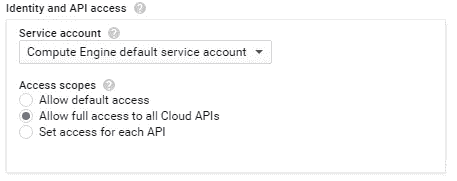
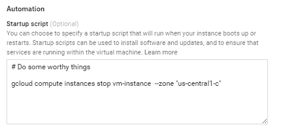

# 使用应用引擎启动计算引擎虚拟机

> 原文：<https://medium.com/google-cloud/using-app-engine-to-start-a-compute-engine-vm-be713c98d6a?source=collection_archive---------0----------------------->


有时我们不希望(或不需要)计算引擎实例每天 24 小时运行，但我们需要定期运行任务。为了解决这个问题，我们可以使用 **cron 服务**运行一个 **app 引擎任务**来启动 **VM 实例**。一旦 VM 启动，它可以有一个启动脚本来运行它需要的实际任务，然后停止机器。

# 虚拟机启动

我们希望每天运行一次计划任务(比如说在午夜)以便启动。我将调用任务 url */vm/start* ，但是它可以是您想要的任何名称。以下是 cron 文件:

## cron.yaml

```
cron:
- description: run instance
  url: /vm/start
  schedule: every day 00:00
```

## 端点处理程序

一旦设置好，我们需要在 appengine 应用程序上调用 url。我使用的是 Flask framework，但它应该可以与您正在使用的任何东西一起工作:

```
**@app.route('/vm/start')**
**def start_vm**():
    credentials = AppAssertionCredentials(scope='https://www.googleapis.com/auth/compute')
    http = credentials.authorize(httplib2.Http(memcache))
    compute = discovery.build('compute', 'v1', http=http)

    # Start the VM!
    result = compute.instances().start(instance=INSTANCE_NAME, zone=INSTANCE_ZONE, project=PROJECT).execute() logging.debug(result)
    **return** json.dumps(result, indent=4)
```

首先你需要获得证书。由于我们是在 GCP 境内拨打电话，因此我们可以使用 app engine 服务帐户(您可以在此[了解更多信息](https://developers.google.com/api-client-library/python/guide/google_app_engine#service-accounts))。然后我们使用 google api 客户端来构建和使用计算引擎 api。就像调用实例开始方法一样简单。

## 配置访问

如果您尝试按原样运行代码，您将在日志中发现一条*遇到 403 禁止，原因为“accessNotConfigured”*的消息。我们需要为我们的项目启用计算引擎 API。为此，转到 **API 管理器** > **库** > **计算引擎 API** 并点击*启用*

此外，在创建虚拟机时，我们需要设置对云 API 的访问权限



设置 API 访问权限。

这是启动虚拟机所需要的。一旦部署了一个简单的调用[http://your-project.appspot.com/vm/start](http://your-project.appspot.com/vm/start)就会启动虚拟机。

# 虚拟机停止

现在，启动脚本应该运行一些进程来完成您希望在此实例上完成的工作，然后最后一行应该像这样:

```
gcloud compute instances stop vm-instance --zone "YOUR-VM-ZONE"
```

这需要在创建虚拟机时进行配置:



设置启动脚本

如果你想看这个例子的所有代码，你可以查看这个 github repo。