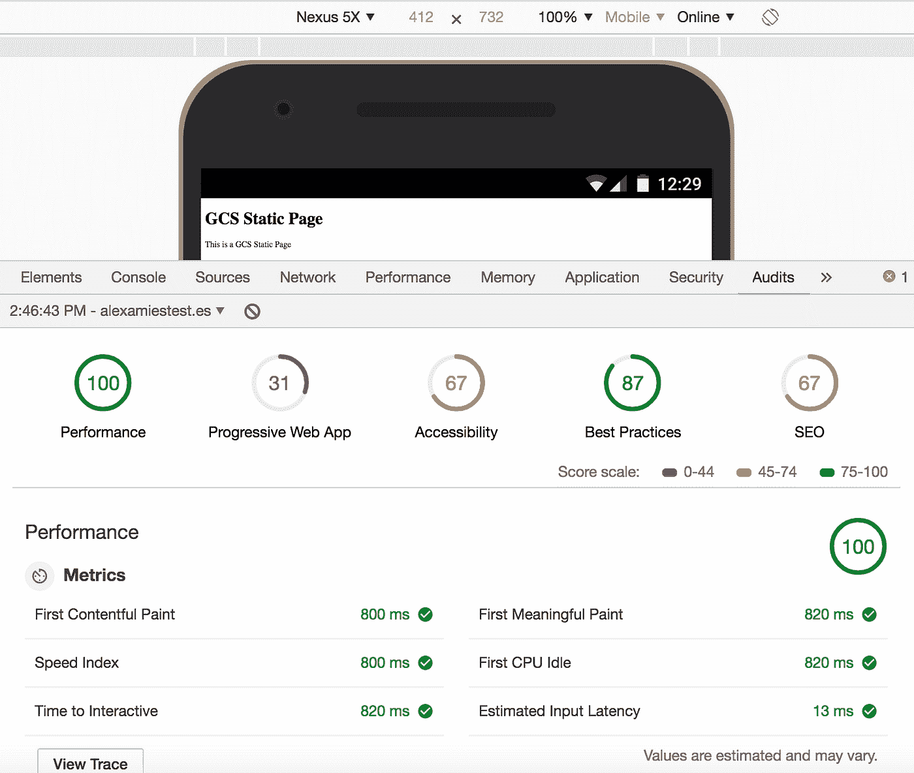
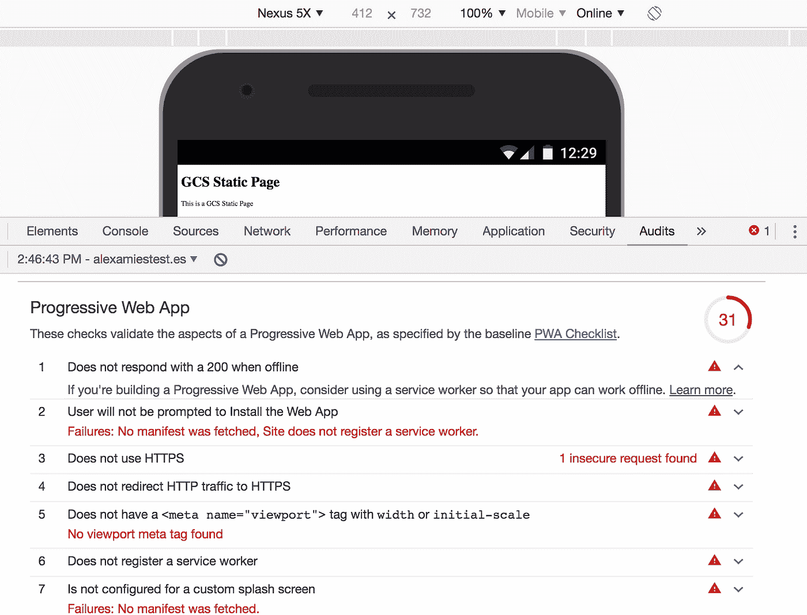
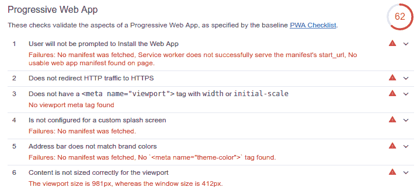
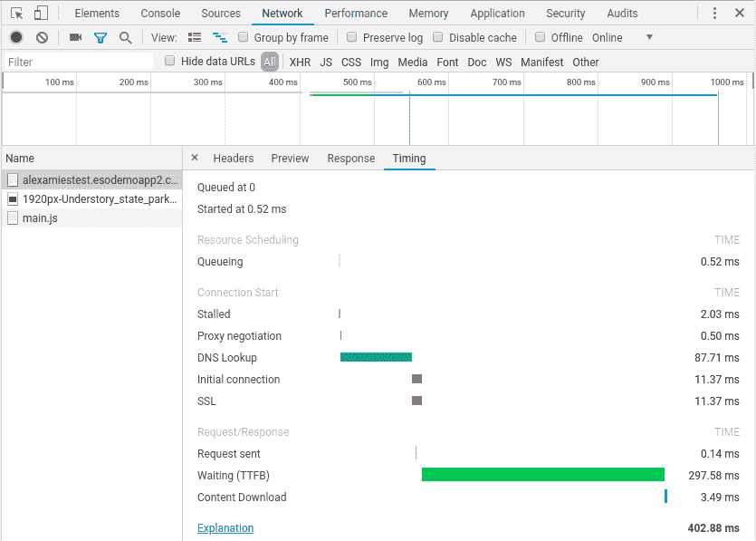
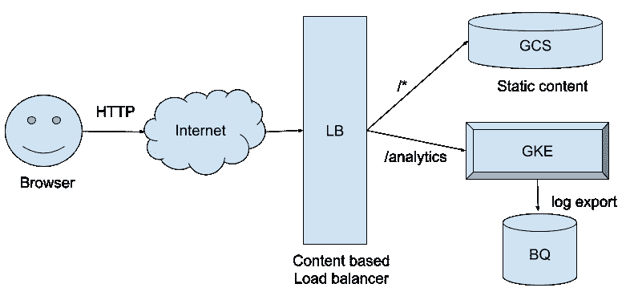

# 在谷歌云上使用 Chrome 开发工具

> 原文：<https://medium.com/google-cloud/using-chrome-dev-tools-with-google-cloud-50c20f230d61?source=collection_archive---------1----------------------->

一些谷歌云客户有非常大量的静态内容，他们希望提供给用户。通常，许多视频和图像媒体带有一些文本。他们想要的解决方案是:

1.  易于更新内容
2.  可靠的
3.  快的
4.  移动友好

在[服务网站](https://cloud.google.com/solutions/web-serving-overview)页面中总结了在谷歌云平台(GCP)上提供网页内容的选项。对于这个用例，Google 云存储(GCS)是一个很好的选择。使用 [gsutil](https://cloud.google.com/storage/docs/gsutil) 命令行实用程序和客户端 API 很容易更新 GCS 中的内容。它非常可靠，具有 99.95%的 SLA[。通过选择 GCS 解决了前两个需求后，本文将讨论如何使用 Google](https://cloud.google.com/storage/sla) [Tools for Web，Developers](https://developers.google.com/web/tools/) ，包括 [Chrome DevTools](https://developers.google.com/web/tools/chrome-devtools/) 和 [Lighthouse](https://developers.google.com/web/tools/lighthouse/) 来优化速度和移动友好性。附带的[要点](https://gist.github.com/alexamies/db324bfdf8a7cd25493bce47be0fdc5d)提供代码来测试使用 GCS 的静态网站的服务，添加一个通过 HTTPS 提供服务的负载平衡器，开发 JavaScript 以使内容离线可用，并收集用户体验的性能数据。

对于一个完整的电子商务网站或社交媒体应用程序，你需要许多其他元素来支持支付、订单履行、账户管理和用户参与分析。为此所需的各种其他云服务将不会在本文中讨论。许多相同的原则适用于托管媒体以支持移动应用程序。

# 在谷歌云存储上建立一个静态网站

首先，让我们来看看如何使用 GCS 的[托管静态网站](https://cloud.google.com/storage/docs/hosting-static-website)的特性在 GCP 上轻松托管静态内容。您将需要一个域，并使用 CNAME 记录将它指向云存储。在安装了 [gcloud](https://cloud.google.com/sdk/gcloud/) 的 Linux shell 中执行以下命令。

检查是否将正确的项目设置为默认项目

```
PROJECT=[Your project]
gcloud config set project $PROJECT
```

要创建匹配域的 bucket，您需要执行[域名 Bucket 验证](https://cloud.google.com/storage/docs/domain-name-verification)。完成之后，使用以下命令创建 bucket

```
BUCKET=[Your domain]
gsutil mb gs://${BUCKET}
```

复制网站文件

```
gsutil cp *.html gs://${BUCKET}
gsutil cp *.js gs://${BUCKET}
```

将存储桶作为网站启用

```
gsutil web set -m index.html -e notfound.html gs://${BUCKET}
```

公开 [GCS 对象](https://cloud.google.com/storage/docs/access-control/making-data-public#buckets):

```
gsutil iam ch allUsers:objectViewer gs://${BUCKET}
gsutil acl ch -u AllUsers:R gs://${BUCKET}
```

测试网站

```
curl [http://${BUCKET}/index1.html](/${BUCKET}/index1.html)
```

# 用灯塔分析网站

在 Chrome 开发者工具中点击审计标签打开[灯塔](https://developers.google.com/web/tools/lighthouse/)，然后点击“运行审计”按钮运行分析。截图如下。



**Chrome 开发工具中的初始性能计时**

除了性能测量之外，还有许多其他建议。渐进式网站推荐列表中的前几个如下所示。



**Chrome 开发工具中的初步分析**

列表中的第一项是“脱机时不回复 200”您可以通过使用[服务工作器](https://developers.google.com/web/fundamentals/primers/service-workers/)在浏览器的[应用程序缓存](https://www.html5rocks.com/en/tutorials/appcache/beginner/)中缓存和检索内容，使静态网站能够被离线访问。gist 中的 index2.html 和 main2.js 文件实现了这一点。然而，服务人员[需要 HTTPS](https://developers.google.com/web/fundamentals/primers/service-workers/#you_need_https) 。此外，这是灯塔审计清单上的第三项:“不使用 HTTPS。”所以我们的首要任务是让 HTTPS。

为了支持移动应用程序，同样的原理也适用，但是不是为服务人员使用 JavaScript，而是使用应用程序代码在设备上缓存经常访问的媒体。

# 为静态网站启用 HTTPS

您可以在 GCS 存储桶前面添加一个 L7 负载平衡器，以提供 HTTPS。这在页面[创建基于内容的负载平衡](https://cloud.google.com/load-balancing/docs/https/content-based-example)中有所描述。当我说 HTTPS 时，我指的是更快的 [QUIC](https://en.wikipedia.org/wiki/QUIC) 。如果设置一个负载均衡器对你的用例来说似乎有点大材小用，那么你应该探索 App Engine 或 [Firebase hosting](https://firebase.google.com/docs/hosting/) 作为用 HTTPS 托管应用的替代方法。

# 添加 L7 负载平衡器

创建全局静态 IP 地址:

```
IP_NAME=lb-ip
gcloud compute addresses create $IP_NAME \
 --ip-version=IPV4 \
 --global
```

现在，使用将一个[云存储桶后端](https://cloud.google.com/load-balancing/docs/https/adding-a-backend-bucket-to-content-based-load-balancing)添加到负载平衡器

[gcloud 计算后端-存储桶创建](https://cloud.google.com/sdk/gcloud/reference/compute/backend-buckets/create)命令:

```
BACKEND_BUCKET_NAME=static-bucket
gcloud compute backend-buckets create $BACKEND_BUCKET_NAME \
 --gcs-bucket-name $BUCKET
```

使用[g cloud compute URL-maps create](https://cloud.google.com/sdk/gcloud/reference/compute/url-maps/create)命令为基于内容的负载平衡创建 URL 映射:

```
URL_MAP_NAME=web-map
gcloud compute url-maps create $URL_MAP_NAME \
 --default-backend-bucket=$BACKEND_BUCKET_NAME
```

使用[g cloud compute URL-maps add-path-matcher](https://cloud.google.com/sdk/gcloud/reference/compute/url-maps/add-path-matcher)命令添加路径匹配器:

```
PATH_MATCHER_NAME=bucket-matcher
gcloud compute url-maps add-path-matcher $URL_MAP_NAME \
 --default-backend-bucket=$BACKEND_BUCKET_NAME \
 --path-matcher-name $PATH_MATCHER_NAME \
```

使用[g cloud beta compute SSL-certificates create](https://cloud.google.com/sdk/gcloud/reference/beta/compute/ssl-certificates/create)命令创建一个 Google 托管的 TLS 证书:

```
CERT_NAME=${PROJECT}-cert
DOMAIN=[Your domain]
gcloud beta compute ssl-certificates create $CERT_NAME \
 --domains $DOMAIN
```

使用[g cloud compute target-https-proxy create](https://cloud.google.com/sdk/gcloud/reference/compute/target-https-proxies/create)命令创建一个目标代理

```
PROXY_NAME=https-lb-proxy
gcloud compute target-https-proxies create $PROXY_NAME \
 --url-map $URL_MAP_NAME — ssl-certificates $CERT_NAME
```

为代理启用 QUIC

```
gcloud compute target-https-proxies update $PROXY_NAME \
 --quic-override=ENABLE
```

使用[g cloud compute forwarding-rules create](https://cloud.google.com/sdk/gcloud/reference/compute/forwarding-rules/create)命令创建转发规则:

```
FWD_NAME=https-content-rule
gcloud compute forwarding-rules create $FWD_NAME \
 --address $IP_NAME \
 --global \
 --target-https-proxy $PROXY_NAME \
 --ports 443
```

既然您正在为站点使用负载平衡器，请将 DNS 记录更改为 A 记录，该记录引用负载平衡器使用的静态 IP 地址。您可能需要等待一段时间才能生效，这取决于您的 DNS TTL。

向负载平衡器发送流量

```
curl [https://$DOMAIN/index2.html](/$DOMAIN/index1.html)
```

IPv6:对于一个健壮的网站，添加 IPv6 支持，如[创建基于内容的负载平衡](https://cloud.google.com/load-balancing/docs/https/content-based-example)中所述。

在 Chrome 开发工具中再次运行分析。你应该会发现№1(没有 200 离线)和№3(没有 HTTPS)问题现在已经不在渐进式 Web App 问题列表中了。渐进式 web 应用程序审核如下图所示。



**Chrome 开发工具中的更新分析**

现在最大的问题是“不会提示用户安装网络应用”这可以通过提供 [web 应用清单](https://developers.google.com/web/fundamentals/web-app-manifest/)和[中描述的一些其他 Web 资源来解决，用户可以被提示安装 Web 应用](https://developers.google.com/web/tools/lighthouse/audits/install-prompt)。其他可能的问题在 [Lighthouse](https://developers.google.com/web/tools/lighthouse/) 参考指南中描述。

# 网路性能

到目前为止，我们的网络性能看起来相当不错。这是因为我们的应用程序中没有大文件。HTML 和 JavaScript 文件既少又小。然而，随着代码库的增长，应用程序通常会带来性能问题，并且随着业务的增长会收集更多的资产。 [Lighthouse](https://developers.google.com/web/tools/lighthouse/audits/text-compression) 参考有一个改进性能的建议列表，它与 Chrome 开发工具中报告的测量相关。

建议改进的一个常见例子是[启用文本压缩](https://developers.google.com/web/tools/lighthouse/audits/text-compression)。文件可以压缩，然后保存到 GCS。您需要设置适当的 GCS 元数据，让浏览器知道要解压缩它。详见[gzip 压缩文件的转码](https://cloud.google.com/storage/docs/transcoding)。参见[Google Cloud 上的 HTTP 数据压缩](/google-cloud/compression-of-data-over-http-on-google-cloud-9833d183b2ba)了解提供压缩动态页面的详细信息，以及使用 Brotli 实现比 gzip 更高的压缩。

Chrome Dev Tools 中的网络选项卡包含检索不同资源的指标。下面的屏幕截图显示了一个没有服务人员的页面版本的示例，以避免本地缓存。



**Chrome 开发工具中的网络标签**

显示的指标在[网络分析参考](https://developers.google.com/web/tools/chrome-devtools/network-performance/reference#timing-explanation)中有解释。

如[评估现实生活中导航和资源计时的加载性能](https://developers.google.com/web/fundamentals/performance/navigation-and-resource-timing/)中所述，从您自己的浏览器加载的这些值应被视为[实验室数据](https://developers.google.com/web/fundamentals/performance/speed-tools/#lab_data)。这些数据有助于开发您的应用程序，但并不代表真实世界的用户，他们可能远离数据中心，在慢速移动网络上使用功能较弱的设备。要收集真实用户体验的计时数据，您需要对您的网页(或移动应用程序)进行检测。

您可以使用[导航计时 API](https://www.w3.org/TR/navigation-timing-2/) 用 JavaScript 在浏览器中收集计时数据。举个例子，

```
let pageNav = performance.getEntriesByType(“navigation”)[0];
let dnsTime = pageNav.domainLookupEnd — pageNav.domainLookupStart;
let connectTime = pageNav.connectEnd — pageNav.connectStart;
let ttfb = pageNav.responseStart — pageNav.requestStart;
let dt = pageNav.responseEnd — pageNav.responseStart;
```

gist 中的 JavaScript 文件 main.js 演示了这一点，它是从 index.html 加载的。从浏览器中，您可以将数据发送回您的服务器进行存储。到目前为止，这个示例是一个托管在 GCS 上的静态站点，但是您需要一个动态处理程序来接收和保存数据。您可以通过在负载均衡器后面添加 GCE 实例或云端点或 Google Kubernetes 引擎集群来实现这一点。这方面的粗略图表如下所示。



**收集和保存客户端性能数据的架构**

概念流程是

1.  浏览器将时间测量值发送回服务器，比如在 JSON at /analytics 中
2.  使用基于内容的负载平衡，负载平衡器将请求定向到由 GKE 管理的托管实例组
3.  分析数据被转储到日志中
4.  云日志[日志导出](https://cloud.google.com/logging/docs/export/configure_export_v2#errors_exporting_to_bigquery)用于将数据存储到 BigQuery。

这个流程还有其他的变体，可能同样适合你。有关资源计时的更多信息，请参见页面[资源计时实践](https://nicj.net/resourcetiming-in-practice/)。如果保存客户端性能分析对您来说似乎工作量太大，那么您可以考虑像 [New Relic](https://newrelic.com/solutions/topic/digital-customer-experience) 这样的托管服务。