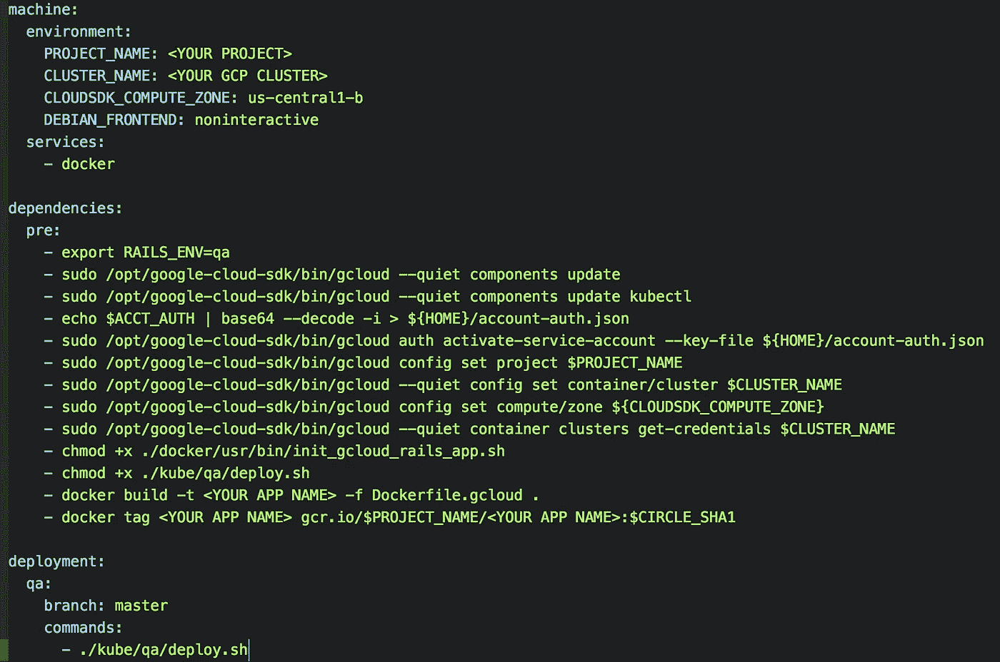
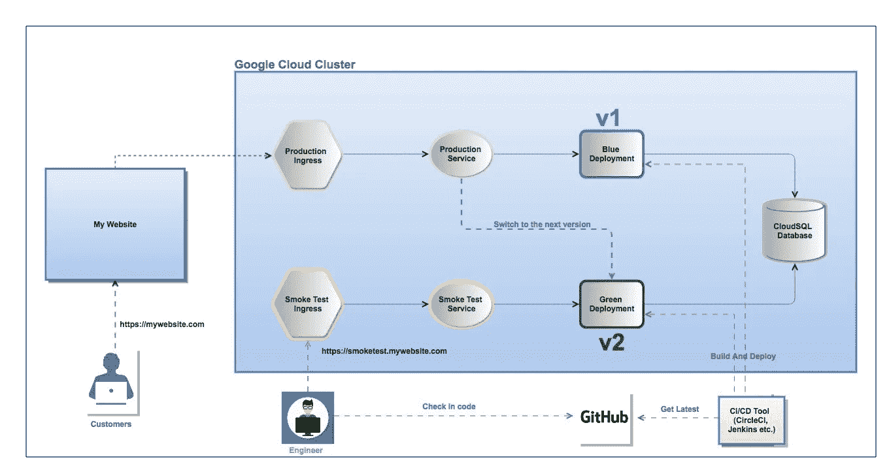
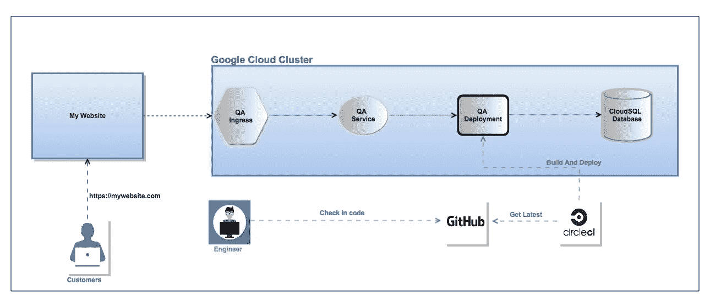
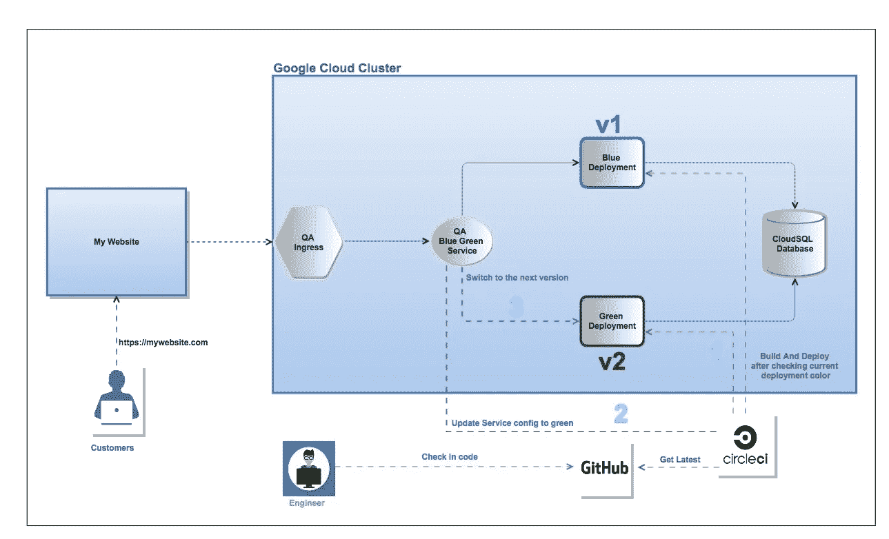
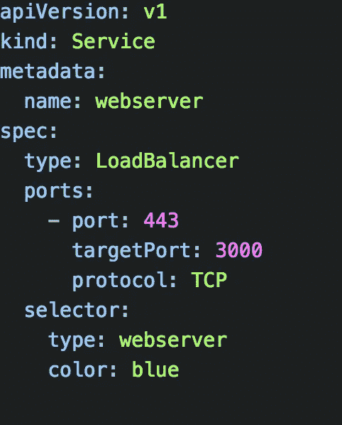
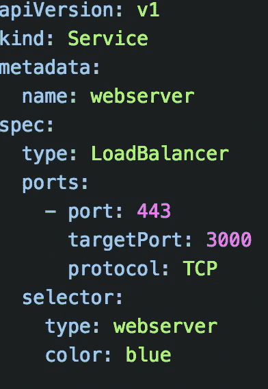
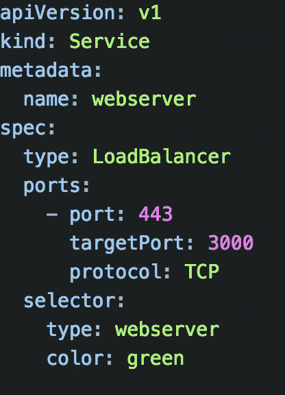
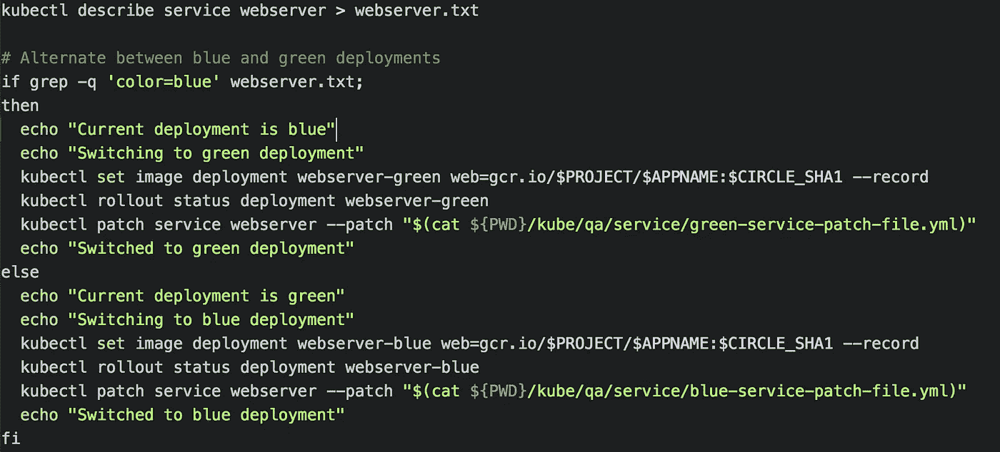

# 使用 CircleCI 和 Kubernetes 实现到 Google 容器引擎的无缝部署

> 原文：<https://medium.com/google-cloud/using-circleci-and-kubernetes-to-achieve-seamless-deployments-to-google-container-engine-8b26abc04846?source=collection_archive---------1----------------------->

在过去的一篇文章中，我详细描述了对谷歌容器引擎(GKE)进行蓝/绿部署的过程。在那篇文章中，我提到了我们如何通过 CircleCI、Jenkins 等 CI/CD 工具在蓝绿部署之间手动切换**或**。(下图 1)。

> [**CircleCI**](https://circleci.com/) 是一个 CI/CD 平台，可以很容易地与 GitHub 集成，并且可以很好地适应我们的构建/测试/部署需求。它还具有分析代码库和自动运行单元测试的智能。配置它部署到谷歌云平台(GCP)非常顺利。

**Circle CI 详细信息**:[Circle CI 的 1.0 版](https://circleci.com/docs/1.0/)已在本例中使用。它包含一个 **circle.yml** 文件，该文件位于我们应用程序的根目录下。该文件用于设置环境、向 GCP 认证、构建我们的 Rails 应用程序的 Docker 映像并对其进行标记。当代码合并到主分支时，调用“deploy.sh”将应用程序部署到 GKE。在本文的结尾，我们将看到 deploy.sh 所做的更多内容。



示例 circle.yml

> **注意** : [CircleCI 2.0](https://circleci.com/docs/2.0/) 已经发布，具有一些令人兴奋的新特性，包括更快的构建和更好的配置。下的一个示例 config.yml 文件。circleci 文件夹

```
version: 2
jobs:
  build:
    environment:
      DEBIAN_FRONTEND: noninteractive
    docker:
      - image: circleci/ruby:2.4.2-node-browsers
    steps:
      - checkout
      # Download and cache dependencies
      - restore_cache:
          keys:
          - v1-dependencies-{{ checksum "Gemfile.lock" }}
          # fallback to using the latest cache if no exact match is found
          - v1-dependencies-
      - run:
          name: install dependencies
          command: |
            bundle install --jobs=4 --retry=3 --path vendor/bundle
      - save_cache:
          paths:
            - ./vendor/bundle
          key: v1-dependencies-{{ checksum "Gemfile.lock" }}parallelism: 1# push to Google Container Registry (GCR)
  push-dev-server:
    docker:
      - image: turbinelabs/gcloud-build:0.12.4
    environment:
      DEBIAN_FRONTEND: noninteractive
    steps:
      - checkout
      - setup_remote_docker
      - run: openrc boot
      - run: docker build -t <YOUR APP NAME> -f ./Dockerfile.gcloud .
      - run: docker tag <YOUR APP NAME> gcr.io/<GCP PROJECT>/<YOUR APP NAME>:$CIRCLE_SHA1
      - run: gcloud docker -- push gcr.io/<GCP PROJECT>/<YOUR APP NAME>:$CIRCLE_SHA1# Deploy to GKE
  deploy-dev-server:
    docker:
      - image: turbinelabs/gcloud-build:0.12.4
    steps:
      - checkout
      - run: openrc boot
      - run: chmod +x ./.circleci/deploy_qa.sh   #IN THIS FILE, YOU WILL HAVE YOUR kubectl deploy logic
      - run: ./.circleci/deploy_qa.shworkflows:
  version: 2
  build:
    jobs:
      - build:
          filters:
            branches:
              only:
                - <ADD YOUR BRANCHING TAGS HERE>
              ignore:
                - develop
                - master
  dev_deploy:
    jobs:
      - build:
          filters:
            branches:
              only: develop
              ignore: /.*/
            tags:
              only: <ADD YOUR BRANCHING TAGS HERE>
      - push-dev-server:
          filters:
            branches:
              only: develop
              ignore: /.*/
            tags:
              only: <ADD YOUR BRANCHING TAGS HERE>
      - deploy-dev-server:
          requires:
            - build
            - push-dev-server
          filters:
            branches:
              only: develop
              ignore: /.*/
            tags:
              only: <ADD YOUR BRANCHING TAGS HERE>
```

**这篇文章讨论了到 GKE 的无缝部署。让我们看看如何实现这一点。**

作为复习，这里有一个在**生产**中的蓝/绿部署示例(来自上一篇文章)。

> **蓝/绿部署**(如下图 1 所示)是减少用户生产停机时间的经典方式，同时还能升级到应用程序的新版本。这是通过让我们的应用程序的多个版本并行运行并在它们之间切换来实现的。



图 1:生产中的蓝/绿部署

**QA 环境:**当我们开始 CI/CD 流程时，我们在 QA 环境中使用了**而不是**蓝/绿部署模型。任何对 GitHub 的 Pull 请求(PR)都会启动 CircleCI 构建和测试周期。一旦测试通过，PR 将被合并到我们的主分支机构。这反过来将启动我们在 GKE 的 QA 服务器的部署。冲洗并重复。一切都很好。(下图 2)



图 2:使用 CircleCI 的 QA 中的示例部署

> ***问题*** *:只要部署不太频繁，上述方法就非常有效。然而，每次我们部署到我们的 QA 服务器时，它都被视为完全部署，当 Kubernetes pods 更新为新映像时，会有大约 5 分钟的延迟。*

很快，我们有了许多并行构建的功能，并导致大量 PR 合并到我们的主分支。我们开始看到 QA 停机时间变长了。依赖我们的 QA 服务器的各种团队(UX、产品和其他)将不得不等待服务器“恢复运行”。我们的自动化运行得有点太好了。

**解决方案**:我们决定使用一种**类似于**我们在生产中使用的蓝/绿部署的方法。下面的图 3 显示了新的方法。



图 3

**进场**:

步骤 1: CircleCI 将创建一个新的构建，检查 Kubernetes 服务中我们部署的当前“颜色”,然后部署到另一个“颜色”部署。例如，如果当前部署为蓝色，则新部署将为绿色，反之亦然。

步骤 2: CircleCI 然后会通过更改服务文件内容来更新 Kubernetes 服务，以指向这个新的颜色(部署)

步骤 3:用户现在可以访问新版本了

**详情**

1.  我们创建了两个 Kubernetes 部署(蓝色、绿色),代表我们的应用程序的当前版本和新版本

2.我们有一个 Kubernetes 服务(BlueGreen Service)可以在这两个部署之间切换。



指向蓝色部署的 web-service-blue-green.yml

> ***注意*** *:与生产环境(上面的图 1)不同，我们* ***没有*** *创建冒烟测试服务和冒烟测试入口，因为我们希望我们的应用能够快速部署到我们的 QA 服务器，在那里测试新特性*

3.我们有 1 个入口(QA 入口)，用于从互联网访问我们的应用程序。

> 我们必须想办法让 CircleCI 知道我们当前的部署版本是什么，以及如何切换到“其他”版本。

为了解决这个问题，我们创建了两个相同的服务文件(除了主文件之外),分别代表用于“修补”的蓝色和绿色部署(下图中的颜色:蓝色和绿色)



蓝色服务补丁



绿色服务补丁. yml

在我们的 CircleCI 部署 shell 脚本(deploy.sh)中，我们添加了从 kubernetes 服务本身获取蓝色/绿色版本的逻辑，并将我们的最新版本部署到“其他”部署，并通过“kubernetes patch”命令更新服务，如下图所示



通过 CircleCI 识别蓝/绿部署并自动切换

**总结**:通过使用上述方法，我们能够将 QA 中的应用程序版本切换时间减少到不到 40 秒，同时确保整个构建/测试/部署流程完全自动化。

**资源**:

1.  马丁·福勒关于蓝/绿部署的文章:【https://martinfowler.com/bliki/BlueGreenDeployment.html 
2.  滚动更新:[https://taching Chen . com/blog/Kubernetes-Rolling-Update-with-Deployment/](https://tachingchen.com/blog/Kubernetes-Rolling-Update-with-Deployment/)
3.  关于这个话题的一篇优秀的 CloudNative 文章:[https://cloudnative.io/docs/blue-green-deployment/](https://cloudnative.io/docs/blue-green-deployment/)
4.  蓝绿部署:[https://medium . com/@ nithinmallya 4/blue-Green-Deployments-for-a-rails-app-in-Google-container-engine-gke-49 ddcc 1b 002](/@nithinmallya4/blue-green-deployments-for-a-rails-app-in-google-container-engine-gke-49ddcc1b002)