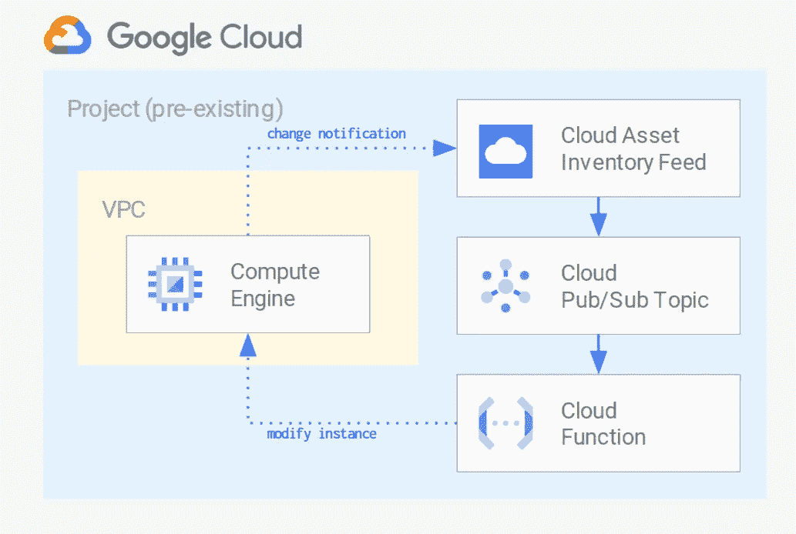

# 使用云资产清单馈送进行动态配置和策略实施

> 原文：<https://medium.com/google-cloud/using-cloud-asset-inventory-feeds-for-dynamic-configuration-and-policy-enforcement-c37b6a590c49?source=collection_archive---------2----------------------->


[云资产清单](https://cloud.google.com/asset-inventory/docs/overview)的一个未被重视的功能是[源](https://cloud.google.com/asset-inventory/docs/monitoring-asset-changes)，它通过发布到 PubSub 队列的一系列事件实时监控资源和策略的变化。

它们连接到云功能，在每个消息中公开完整的资源属性集，允许使用最少的代码进行简单的资源跟踪、动态配置或策略实施，并可用于解决一些常见的用例:

*   根据资源变化更新远程数据源，例如企业 CMDB
*   管理相关资源，例如实例和转发规则的自定义云 DNS 记录
*   对关键资源或 IAM 绑定的更改触发警报
*   在特定资源的配置上实施预定义的策略，例如后端服务上的云防护策略

此处显示的代码属于最后一类，通过近乎实时地检测和恢复不合规的更改，在虚拟机网络标记上实施预定义的策略。当使用标记来确定防火墙规则的范围时，这是一种灵活而简单的方法来添加额外的控制措施。

该示例被设计为最小化和自包含的，在实际使用中当然需要一些更改:将云功能的 feed 和 IAM 自定义角色/绑定的范围限定到组织或文件夹；调整函数的重试和错误处理；并采用单独的方式定期运行全面检查(可能使用云资产导出)。

这是示例代码将创建的资源的高级概述:



要运行这个例子，首先克隆[存储库](https://github.com/terraform-google-modules/cloud-foundation-fabric)，并切换到 example 文件夹。如果您喜欢使用云 Shell，[这个链接](https://ssh.cloud.google.com/cloudshell/editor?cloudshell_git_repo=https%3A%2F%2Fgithub.com%2Fterraform-google-modules%2Fcloud-foundation-fabric&cloudshell_print=cloud-shell-readme.txt&cloudshell_working_dir=examples%2Fcloud-operations%2Fasset-inventory-feed-remediation)将为您运行 Git 克隆，并切换到正确的文件夹，以便您可以跳过下面的初始步骤。

```
git clone [https://github.com/terraform-google-modules/cloud-foundation-fabric.git](https://github.com/terraform-google-modules/cloud-foundation-fabric.git)
cd examples/cloud-operations/asset-inventory-feed-remediation
```

一旦在正确的文件夹中，运行 Terraform，只需提供将在其中创建所需资源的项目 id(我们稍后会清理，不要担心)。以下命令中的`$GOOGLE_PROJECT_ID`变量由云壳设置为云控制台中的当前项目，如果您不在云壳中或想要使用不同的项目，请将其替换为实际的项目 id。

```
terraform init
# answer 'yes' when prompted after running apply
terraform apply -var project_id=$GOOGLE_PROJECT_ID
```

当 Terraform 完成运行时，它将打印测试所需的几个`gcloud`命令，以及创建 Google Terraform provider 尚不支持的 feed 的命令(如果您滚动过这些命令，请运行`terraform output`在屏幕上再次打印这些命令)。

复制并运行`feed_create`输出中的命令，应该类似于这样(不要从这里复制粘贴！):

```
gcloud asset feeds create feeds-test \
  --pubsub-topic projects/feeds-test/topics/feeds-test \
  --asset-types compute.googleapis.com/Instance \
  --content-type resource \
  --project feeds-test
```

我们现在准备测试这个例子。

首先，下面是标签策略在云函数中是如何实现的:

*   每次一个实例被创建或改变(状态改变不是`RUNNING`或`TERMINATED`)时，云函数检查它的标签
*   它会丢弃任何不以预设前缀(`shared-`或`gke-cluster-`)或项目 id 开头的标签
*   然后将过滤后的标签与实例上的标签进行比较，如果发现差异，它会调用`setTags`计算引擎 API 方法来删除不符合的标签

为了测试该功能，通过控制台或使用 Terraform 输出中显示的`tag_add`命令，向实例添加一个不兼容的标签。然后再次通过控制台或 Terraform 输出中的`cf_logs`命令检查云函数日志。

您应该看到两个独立的函数调用:第一个更改添加了不兼容的标记，第二个更改由函数删除它。这些是来自同一个函数的实际日志条目，顺序相反(`gcloud logging read`命令默认为降序排序),为了清楚起见，稍微做了编辑:

```
DEBUG Function execution started
INFO  parsing event data
INFO  checking [https://www.googleapis.com/.../feeds-test-1](https://www.googleapis.com/compute/v1/projects/xxxxx/zones/europe-west1-b/instances/feeds-test-1)
INFO  tags **['foobar', 'shared-test-feed', 'xxxxx-test-feed']**
INFO  **modify tags** xxxxx europe-west1-b feeds-test-1 XrN1ewa5m98= **['shared-test-feed', 'tf-playground-simple-test-feed']**
DEBUG Function execution took 6153 ms, finished with status: 'ok'DEBUG Function execution started
INFO  parsing event data
INFO  checking [https://www.googleapis.com/.../feeds-test-1](https://www.googleapis.com/compute/v1/projects/xxxxx/zones/europe-west1-b/instances/feeds-test-1)
INFO  **tags ['shared-test-feed', 'xxxxx-test-feed']**
INFO  **all tags are valid**
DEBUG Function execution took 14 ms, finished with status: 'ok'
```

您可以通过使用`tag show`命令查看实例细节来确认该函数执行的更改是否成功:

```
tags:
  fingerprint: HwowTSTO_e8=
  items:
  - shared-test-feed
  - xxxxx-test-feed
```

当您完成测试后，只需运行`terraform destroy`删除所有创建资源，然后使用`gcloud asset feeds delete [feed name] --project [project id]`手动删除提要。

我希望这个简短的例子足以展示云资产提要的强大功能，并为您使用它们提供一个良好的开端。