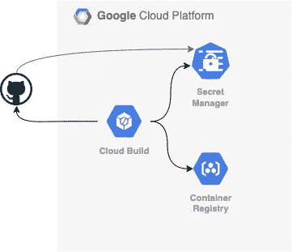

# 通过多阶段 Docker 构建文件和私有回购使用云构建

> 原文：<https://medium.com/google-cloud/using-cloud-build-with-a-multi-stage-docker-build-file-and-a-private-repo-82d15da3461a?source=collection_archive---------0----------------------->



使用多阶段 Docker 文件是使用容器来构建 Go 应用程序或服务，然后将生成的二进制文件打包到尽可能最小的容器映像中的一种好方法。有很多[伟大的](/@chemidy/create-the-smallest-and-secured-golang-docker-image-based-on-scratch-4752223b7324) [例子](https://fabianlee.org/2020/01/26/golang-using-multi-stage-builds-to-create-clean-docker-images/)，但是这里有一个让我想起过去的概念，[为静态 Go 二进制文件构建 Docker 映像|作者 Kelsey Hightower](/@kelseyhightower/optimizing-docker-images-for-static-binaries-b5696e26eb07) 。

云构建是一个非常棒的托管构建管道流程，具有很大的灵活性…所以让我们将两者结合起来！哦，让我们也加入一个转折，这就是这篇笔记的真正意义:多阶段构建使用了一个位于私有 git repo 中的模块。

为此，我将几个不同的概念放在一起，以实现以下目标:

*   使用云构建创建 Go 服务，其中…
*   Go 服务依赖于私有 git repo 中的一个模块，通过…
*   多级 Docker 构建文件

归根结底，我需要一种安全的方式来提供对私钥的多阶段容器构建过程访问。

**云构建的文档…**

Cloud Build 的文档中有一篇关于如何使用 Secret Manager 中存储的密钥访问私有 GitHub 存储库的[文章，提供了所有必需的设置和一个有用的简单构建配置示例。](https://cloud.google.com/cloud-build/docs/access-private-github-repos)

概括一下那篇文章，建立一个密钥对，将公钥应用于特定 Github 存储库的部署设置(一个密钥用于单个存储库，一个[部署密钥](https://docs.github.com/en/developers/overview/managing-deploy-keys#deploy-keys)),然后将私钥上传到 Secret Manager。该密钥将在基于临时容器的构建过程的云构建步骤期间被访问，并指出提供云构建服务帐户以访问秘密的适当角色，秘密管理器秘密访问器(`roles/secretmanager.secretAccessor`)。从 Secret Manager 检索的密钥不会存储在正在构建的最终映像的任何层中。该文章以一个云构建配置结束，该配置将私有 repo 的内容克隆到本地构建工作区，在云构建管道中构建代码。很好，但是我们有一个多阶段的 docker 文件，它将用于构建。

**使用秘密管理器通过 SSH with 在 docker 文件中**

使用 [Go 模块](https://blog.golang.org/using-go-modules)，构建 Go 应用将首先下载指定的依赖模块。这就是棘手的地方——Go 需要知道如何通过 SSH 在容器中访问私有 git repo。

Go 通常使用 HTTPS 来访问 git repos，但是要在多级 docker 文件中使用 SSH 密钥，必须做一些事情:

*   在主机上有一个密钥可以提供给多级容器
*   通过构建时 ARG 变量使密钥在容器中可用
*   将 Go 配置为对目标 git repo 使用 SSH 而不是 HTTPS

最后，通过 docker build 的——build-ARG 参数传入构建时 ARG 变量(ssh 私有密钥)。

第一部分很简单，上面有记录:使用 Secret Manager 获取密钥并写入文件。在这种情况下，主机是构建过程，临时存储该密钥的地方是卷装载。

其次，我修改了 Dockerfile，引入了特殊的环境变量，作为 build-arg 传递给`docker build` [ARG](https://docs.docker.com/engine/reference/builder/#arg) ，然后是一些命令，以确保构建容器注册了 SSH 密钥，并使[从 HTTPS(默认)全局切换到 SSH](https://golang.org/doc/faq#git_https) 以访问 git repo，在本例中是 GitHub。人们可以使用 gitlab、bitbucket 等其他 git repos 切换到 SSH 访问。也是。由于我在这里使用 GitHub，所以我没有添加任何其他的回复。

配置 Go 使用私有存储库的下一步是添加`[GOPRIVATE](https://golang.org/cmd/go/#hdr-Module_configuration_for_non_public_modules)` env 变量来包含私有存储库的前缀。

这是完整的文档:

```
# Start by building the application.
FROM golang:1.15-buster as buildARG SSH_PRIVATE_KEYWORKDIR /root/src/app
ADD . /root/src/app# import the private key
# note: intermediary images are deleted and not present in final image layers
RUN mkdir -p ~/.ssh && umask 0077 && echo "${SSH_PRIVATE_KEY}" > ~/.ssh/id_rsa \
&& git config --global url."git@github.com:".insteadOf https://github.com/ \
&& ssh-keyscan github.com >> ~/.ssh/known_hosts# [https://golang.org/cmd/go/#hdr-Module_configuration_for_non_public_modules](https://golang.org/cmd/go/#hdr-Module_configuration_for_non_public_modules)
ENV GOPRIVATE github.com/ghchinoy/robotreadmeRUN go get -d -v ./...
RUN go build -o /root/bin/app# Now copy it into our base image.
FROM gcr.io/distroless/base-debian10
COPY --from=build /root/bin/app /
CMD ["/app"]
```

# **一路走来学到的东西**

**云建造的逃生舱:码头工人**

*   使用一个基本构建器和[入口点参数](https://cloud.google.com/cloud-build/docs/build-config#entrypoint)允许在使用参数时有更大的灵活性——您不受限于构建器入口点可以接受的参数。我对此有些纠结，因为默认参数没有正确地进行 shell 替换(我想在私钥中进行`cat`)。一旦我这么做了，我有了一个小小的发现，所有的[云构建者](https://cloud.google.com/cloud-build/docs/cloud-builders)都可以像其他容器一样被对待。
*   容器构建步骤中使用的 docker 映像不挂载卷。通常，如果您使用默认的 cloud builder，您会看到如下示例，即使您要添加卷装载，也不会在 args 参数中指示如何访问卷。通过入口点，用户可以引用挂载卷，在本例中，ssh 密钥就在这里。

使用 docker cloud builder 的典型构建步骤，这里没有什么特别的

```
- name: 'gcr.io/cloud-builders/docker'
  args: ['build', '-t', 'gcr.io/$PROJECT_ID/$_SERVICE/v1, '.']
```

取而代之的是两个步骤，第一步是从 Secret Manager 中检索密钥(其中密钥被命名为`my-github-deploy-key`)并将其作为卷添加到构建器的工作区，第二步是使用入口点和包含密钥的卷构建映像。

```
# Access the id_github file from Secret Manager
- name: gcr.io/cloud-builders/gcloud
  entrypoint: 'bash'
  args: [ '-c', 'gcloud secrets versions access latest --secret=my-github-deploy-key > /root/.ssh/id_github' ]
  volumes:
  - name: 'ssh'
    path: /root/.ssh# Build the container image
- name: 'docker'
  entrypoint: 'sh'
  args: [ '-c', 'docker build --build-arg SSH_PRIVATE_KEY="$(cat /root/.ssh/id_github)" -t gcr.io/$PROJECT_ID/$_SERVICE .' ]
  volumes:
  - name: 'ssh'
    path: /root/.ssh
```

**谷歌云秘密管理器和云 KMS**

管理机密的替代方案是使用[云 KMS](https://cloud.google.com/kms/docs) 。有很多使用云 KMS 的例子，这让我觉得没有太多人使用云秘密管理器来达到这个目的。本文很好地概括了 Secret Manager 和云 KMS 之间的差异: [Secret Manager 概念概述| Secret Manager 文档](https://cloud.google.com/secret-manager/docs/overview)

*   [https://github . com/Google cloud platform/cloud-builders/issues/44](https://github.com/GoogleCloudPlatform/cloud-builders/issues/44)
*   [https://medium . com/@ lestr rat/taming-Google-container-builder-22 a6 dded 155 c](/@lestrrat/taming-google-container-builder-22a6dded155c)

**云构建的工作空间** —它是云构建管道在步骤之间的共享临时空间，可用于步骤之间的状态。虽然我在最后一个例子中没有使用它，但在我创建它的时候，它确实很有帮助。

*   [https://cloud.google.com/cloud-build/docs/build-config#dir](https://cloud.google.com/cloud-build/docs/build-config#dir)
*   [https://github . com/Google cloud platform/cloud-builders/issues/372](https://github.com/GoogleCloudPlatform/cloud-builders/issues/372)
*   [https://medium . com/Google-cloud/how-to-pass-data-between-cloud-build-steps-de 5c 9 ebc 4c DD](/google-cloud/how-to-pass-data-between-cloud-build-steps-de5c9ebc4cdd)