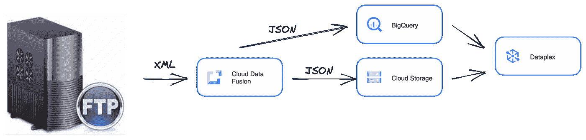
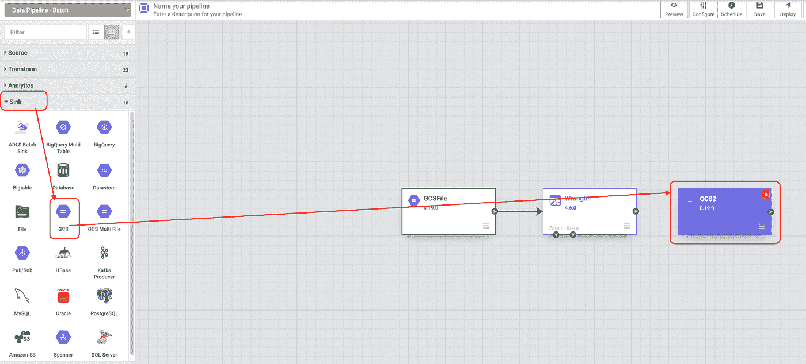

# 使用云 CDF 将 XML 转换成 JSON

> 原文：<https://medium.com/google-cloud/using-cloud-cdf-to-transform-xml-to-json-6033c785b844?source=collection_archive---------0----------------------->

到目前为止，Dataplex 只允许您存储和组织来自云存储 buckets & BigQuery 的数据。Dataplex 支持诸如 Parquet、Avro、ORC、JSON & CSV 等格式。

但是像 XML 这样的格式呢？或者，如果一个人将所有文件都存储在 SFTP 服务器上，而不是 BigQuery 或云存储中，会怎么样？Dataplex 将如何支持(记住 Dataplex 只支持 BQ 或云存储)。

在这些情况下，方法之一是使用谷歌云数据融合(CDF)。Google CDF 是一个可视化的点击式解决方案，用于构建 ELT/ETL 数据管道。CDF 是由 CDAP 提供支持的托管解决方案。这些集成或管道可以手动触发，也可以预定/自动触发。您可以在下面给出的文档链接中了解更多信息。

最近，我和一个客户一起工作，他一直在探索 Dataplex，但是他们的很多数据都以 XML 格式存储在 Sftp 服务器上。我们想设计一个管道，从这个 SFTP 服务器读取数据，将其转换为 JSON &然后写入 Google 云存储或 BigQuery。本文将向您展示使用云数据流来构建这样一个管道是多么容易。

**先决条件**

1.  云数据融合
2.  具有凭据的 SFTP 服务器
3.  带有示例 XML 文件的临时 GCS 存储桶
4.  Google 云存储中的目标 GCS 存储桶

**从集线器部署 FTP 连接器**

1.  在云数据融合主页上，单击 HUB
2.  搜索 FTP &点击 FTP 插件 v 3.0.0。这将部署 FTP 连接器，您可以稍后使用它来构建您的 ETL 过程。

**构建 ETL 流程**

1.  从谷歌云数据融合选择争论。可以把 Wrangler 看作一个带有预定义解析器的转换工具。
2.  从 GCS 中选择 Cloud Storage Default，并选择保存示例 XML 文件的临时存储桶&从存储桶中选择一个示例 XML 文件。

3.将数据类型更改为字符串。默认情况下，当您选择示例文件时，默认格式是 byte。解析器接受 String 作为数据类型，这就是我们将类型改为 String 的原因

4.在同一个选项卡上，也选择解析-> XML 到 JSON &选择“深度”为 1。云数据融合有许多内置的解析器。您不仅可以将 XML 转换为 JSON，还可以解析 CSV，将数据转换为大写/小写，处理日期等。

5.点击创建管道->批处理管道。还要注意，在这个阶段，您应该能够看到您选择的样本 XML 的相应 JSON。

6.从接收器中选择“GCS ”,从源中选择“FTP”。

7.删除现有的源，即 GCS 文件，并将 FTP 设置为源。完成布线。在这个阶段，你的画布应该是这样的。

8.点击源 FTP 并在属性中提供您的 SFTP 详细信息。为了简单起见，我给出了我希望转换的 xml 文件的完整路径(例如:sftp://username:password @ hostname:22/path/to/xmlfile . XML ),然后单击 Validate

9.回到画布，点击牧马人属性。您应该看到该指令被自动设置为将类型设置为 String &将 XML 解析为 Json。还要注意，输出模式应该是 XML 要转换到的 JSON 模式。

10.回到画布上，单击 Sink 上的云存储。提供诸如需要上传 JSON 的存储桶路径、格式为 JSON 和内容类型为 application/json 的信息

11.在画布上单击 Preview->Run，现在您应该能够将 XML 转换成 JSON，它的源是 SFTP

## 摘要

您可以看到，在用户界面中点击几下，构建这样的管道是多么容易。云数据融合提供了 150 多个连接器，可用于实现各种 ELT/ETL 用例。首先，你可以使用谷歌云数据融合或者在你的笔记本电脑上安装 CDAP 框架。我推荐使用本地安装进行开发，因为它更加灵活，并且允许您调试复杂的流程。开发完成后，您可以随时导出和导入项目。

以下是提供更多信息的一些链接

1.  [CDAP 开源框架](https://cdap.io/get-started/) —
2.  [谷歌云数据融合文档](https://cloud.google.com/data-fusion/) —
3.  [Google Dataplex 文档](https://cloud.google.com/dataplex) —