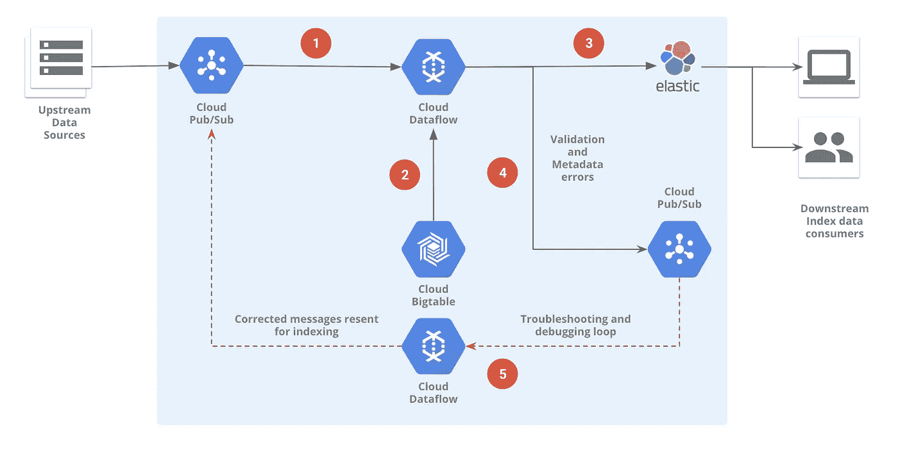

# 使用云数据流将文档索引到弹性搜索中

> 原文：<https://medium.com/google-cloud/using-cloud-dataflow-to-index-documents-into-elasticsearch-b3a31e999dfc?source=collection_archive---------0----------------------->

您的系统中有大量数据，但您的客户仍然抱怨他们找不到任何东西！听起来很熟悉？如果是这样，也许是时候给你的技术堆栈添加一个可扩展的分布式搜索引擎了，比如 [**Elasticsearch**](https://www.elastic.co/blog/found-uses-of-elasticsearch#you-know-for-search-and-counting) 。


Elasticsearch [很容易部署在谷歌云平台](https://www.elastic.co/about/partners/google-cloud-platform)上，你可以很快地设置它。下一步是弄清楚如何对您添加到环境中的所有这些数据进行索引，或使其可搜索。

进入**云数据流**！

[云数据流(Cloud Dataflow)是一个完全托管的服务](https://cloud.google.com/dataflow/)来执行用*[*Apache Beam*](https://beam.apache.org/)编写的数据管道(批处理或流式)。幸运的是，Apache Beam 的 Java SDK 提供了一个[便捷的连接器，用于向 Elasticsearch](https://beam.apache.org/documentation/sdks/javadoc/2.6.0/org/apache/beam/sdk/io/elasticsearch/ElasticsearchIO.html) 写入(和读取)文档。您可以做一些事情，比如验证您想要索引的数据，甚至用一些外部数据集增强它——所有这些都是同一个数据管道的一部分。*

*这篇博客和 Github 上附带的样本代码[将试图把拼图拼在一起，并演示所有这些如何作为运行在云数据流上的单一管道的一部分工作。](https://github.com/GoogleCloudPlatform/professional-services/tree/master/examples/dataflow-elasticsearch-indexer)*

**

*将文档索引到 Elasticsearch 的数据流管道*

*上图中进行了大量工作，因此以下步骤深入研究了所有这些组件如何协同工作:*

1.  *云发布/订阅是将数据传输到环境中的一种极佳方式，云数据流可以轻松地从云发布/订阅中读取，这使其成为这种方法中的首选数据流工具。*
2.  *云 Bigtable 非常适合专门的低延迟查找，并且非常适合存储增强动态文档所需的任何外部数据。*
3.  *使用 Apache Beam 的 ElasticsearchIO Java 连接器可以非常容易地将文档写入(索引)到 Elasticsearch 中。*
4.  *未通过验证的文档在重新处理之前可能需要一些手动(或自动)干预。在这种方法中，这些文档被发布到不同的云发布/订阅主题。*
5.  *可选地，纠正错误并使失败的文档可用于重新处理的过程可以自动化——当然是使用云数据流！*

*另外一个好处是，[通过设置几个标志，可以轻松地为流式管道](https://cloud.google.com/dataflow/service/dataflow-service-desc#autoscaling)启用自动缩放:*

```
*--autoscalingAlgorithm=THROUGHPUT_BASED
--maxNumWorkers=<N>*
```

*这使得 Cloud Dataflow 可以根据需要处理的积压量来调整工作人员的数量——仅在需要时使用资源！*

****太棒了！但是我们如何处理系统中已经存在的数据呢？****

*对管道进行简单的修改，从 Google 云存储桶*而不是云发布/订阅的*读取输入应该是管道中唯一需要改变的事情。*

****那么，我们能否将这种方法用于最新最棒的 Elasticsearch 版本呢？****

**

*几乎…不完全是..*

*嗯— *差不多*:)目前 Apache Beam 的 ElasticsearchIO 支持 Elasticsearch v5.x(和 v2.x)开箱即用。然而，Apache Beam 社区也在积极支持 Elasticsearch v6.x。一个临时的解决方案是使用一个定制的转换，通过他们的 Java 高级 REST 客户端与 Elasticsearch 6.x 对话。*

***准备好工作样品了吗？***

**

*开始使用此管道和示例数据进行快速演示(谁不喜欢演示呢！)再简单不过了——把你的浏览器指向伴随 Github repo 的并跟随它吧！*