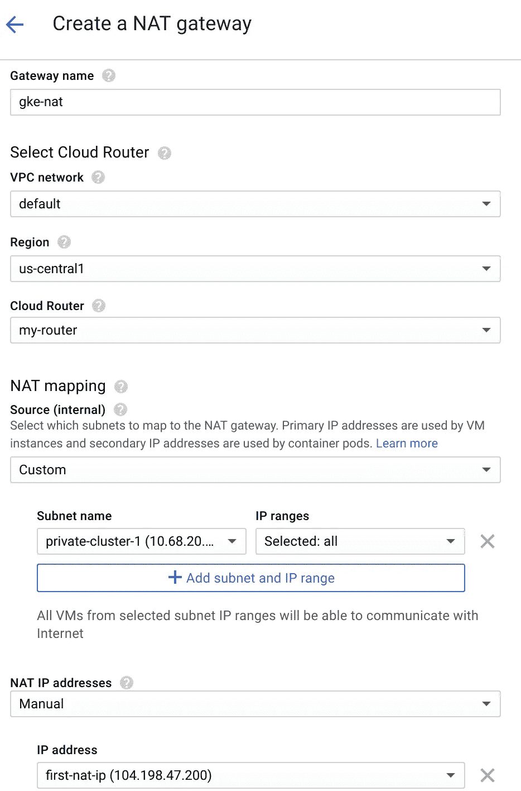
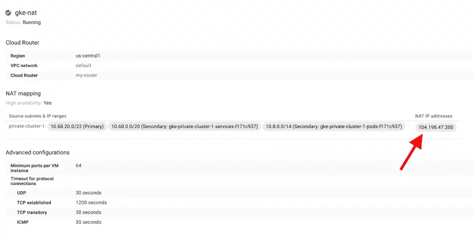

# 通过 GKE 集群使用云 NAT

> 原文：<https://medium.com/google-cloud/using-cloud-nat-with-gke-cluster-c82364546d9e?source=collection_archive---------0----------------------->

*构建 NAT 计算引擎实例并通过路由将私有 GKE 集群连接到互联网的时代已经一去不复返。但是如果我们将公共 ip 分配给集群节点，我的* [*上一篇关于使用 NAT 的文章*](/@dwdraju/prevent-exposing-gke-node-ip-to-the-world-5942189b2836) *仍然适用。*

随着[云 NAT](https://cloud.google.com/nat/docs/overview) (测试版)的推出，没有公共 ip(即私有实例)的计算引擎实例和 GKE 集群节点可以使用静态或动态 ip 地址通过云 NAT 连接到互联网。NAT 网关是区域资源，可以配置为用于区域中的所有子网或选定子网。


*图片:ciobulletin.com*

在本帖中，我们将介绍创建专用集群、创建 NAT 网关、测试连接和确认网关 IP。

## 创建专用 GKE 集群

我们将在`us-central1-b`区域创建名为`private-cluster`的群集。专用集群的主机应配备授权网络，否则我们无法连接到 api 服务器，即无法运行`kubectl`命令。

我们用云壳 ip 做授权网吧。用`curl checkip.amazonaws.com`获取 cloudshell 的 IP 地址，并保存在下面的`[cloudshell-ip-address]`变量中。此外，根据需要调整其他参数。

```
gcloud container clusters create private-cluster \
    --create-subnetwork name=private-cluster \
    --enable-ip-alias \
    --enable-private-nodes \
    --master-ipv4-cidr 172.16.0.0/28 \
    --enable-master-authorized-networks \
    --master-authorized-networks [cloudshell-ip-address]
    --no-enable-basic-auth \
    --no-issue-client-certificate
```

启动并运行集群需要几分钟时间。前往 [kubernetes 列表页面](https://console.cloud.google.com/kubernetes/list)，点击**连接**新创建的集群，然后在云壳中运行。这将使用以下命令打开云外壳:

`gcloud container clusters get-credentials private-cluster --zone us-central1-b`

## 尝试不使用 NAT 连接到互联网

创建一个简单的 curl 部署来获取用于连接公共互联网的 ip 地址。

```
kubectl run test-deploy --image dwdraju/alpine-curl-jq
```

如果创建了 pod，请签出

```
kubectl get pods
NAME                           READY     STATUS         RESTARTS   AGEtest-deploy-7857c9c7c9-ffpsl   0/1       ErrImagePull   0          18s
```

这意味着我们无法将任何映像拉至集群，因为没有任何节点拥有外部 ip 来连接 docker registry。但是如果有权限的话，可以拉取[云注册表](https://cloud.google.com/container-registry/)的镜像。

## 创建云 NAT 网关

云 NAT 是谷歌云平台(GCP)提供的**网络服务**之一。转到 NAT 创建[页面](https://console.cloud.google.com/net-services/nat/add)并开始添加细节。



如果您没有云路由器，请从 NAT 添加页面添加一个，同时添加子网、区域。对于 NAT 映射，选择**自定义**并选择我们创建私有集群的子网，**选择:全部**或选择 IP 范围。

对于 NAT ip 地址，选择“自动”可以自由地向 GCP 平台添加 ip 地址，或者在同一区域创建新的静态 IP 以使用预定义的 IP 地址。点击**创建**并等待一段时间让 NAT 网关准备好。

创建新部署以检查集群是否可以从 docker hub 注册表中提取映像。

```
kubectl run nat-deploy --image dwdraju/alpine-curl-jq
kubectl get pods
```

将会看到标有**完成**的 pod 状态。

**获取 NAT 的 IP 地址，确认其工作状态**

运行一个 pod `get-ip-address`作为交互外壳

```
kubectl run -i --tty get-ip-address --image=dwdraju/alpine-curl-jq --restart=Never
```

在交互终端上，输入`curl checkip.amazonaws.com`,它将输出我们创建的 NAT 网关的 ip 地址。

```
kubectl run -i --tty get-ip-address --image=dwdraju/alpine-curl-jq --restart=Never
If you don't see a command prompt, try pressing enter.
/ # curl checkip.amazonaws.com
104.198.47.200
```



仅此而已！！通过这种方式，我们有了一个安全的集群，它不会被外界截获，但是我们的节点可以使用 NAT IP 地址获得公共互联网资源。如果您必须将 kubernetes 资源(pod)想要连接到的资源的 ip 地址列入白名单，这也很有帮助。

*为了让计费不吓到你，删除集群和 NAT 网关:)*