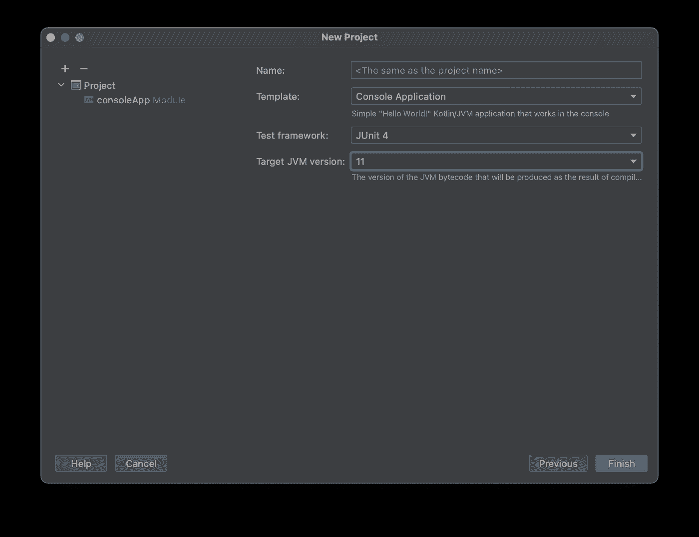

# 使用 Kotlin 的云发布/订阅

> 原文：<https://medium.com/google-cloud/using-cloud-pub-sub-from-kotlin-d501f7d65e24?source=collection_archive---------0----------------------->

# 为什么 Kotlin 在服务器端？

关于谷歌产品， [Kotlin](https://kotlinlang.org/) 似乎是最知名的构建 Android 应用程序的语言。但是 Kotlin 可爱的类型安全和代码简洁特性在服务器端也非常有效。因为它在 JVM 上编译和运行，所以很容易把它放到任何运行 Java 应用程序的地方。

谢天谢地，使用现有的为 Java 编写的发布/订阅库也很容易。

*(请注意，目前这还没有得到官方支持，但是如果你正在尝试的话，希望这能让你上手！)*

# 项目设置

可以创建使用 Maven 和 Gradle 构建的 Kotlin 项目，但是 Gradle 是 Kotlin 的首选和“本地”选择，所以我将继续这样做。

第一步是使用 [IntelliJ IDEA](https://www.jetbrains.com/idea/) 或 [Android Studio](https://developer.android.com/studio) 创建一个用 Gradle 构建的 Kotlin 命令行项目。确保制作一个控制台应用程序，并设置一个 JDK。(不一定要 11。)

第二页没有太多变化:

要使用发布/订阅库，我们必须将它们添加到我们的 Gradle 构建配置中。编辑 **build.gradle.kts** 文件，添加如下**实现**行:

当然，这是截至本文的当前版本；您可能应该访问[发布/订阅库](https://mvnrepository.com/artifact/com.google.cloud/google-cloud-pubsub)的 Maven 中心条目，并查看最新版本。

*(如果您有 Gradle 构建错误，请注意最近的 IntelliJ 更新导致了其中一些错误；确保你在 2020.3.1+上。)*

现在，您应该能够调用 Java 发布/订阅库了，如下所示:

编译应该会成功，尽管现在还做不了多少！

# 与发布/订阅接口

现在你的基本项目已经就绪，你可以使用 Java APIs 了，但是要保持 Kotlin 的简洁和类型安全，这是我们所熟悉和喜爱的。例如，该函数将开始监听订阅，为收到的每条消息调用消息接收方，直到发生异常。

您可以在类似下面的示例中使用该函数，它将简单地接收和确认消息，并偶尔(每 10 秒一次)打印已接收消息的数量:

# 后续步骤

从这里，您可以开始为您的消息模式创建流畅的数据类。我上面给出的例子也非常简单，可能不太地道(抱歉有点生疏了！)它们或许可以使用科特林流运算符等进行改进。Kotlin 延续也可以很好地用于处理异步通信。

参见[一个在本地仿真器上运行的完整示例](https://github.com/feywind/kotlin-pubsub)。

你在服务器端用过 Kotlin 吗？请随时对这篇文章发表评论，或者对你在谷歌云平台上发现的关于 Kotlin 的有趣/有前途的事情发表评论！