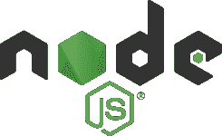
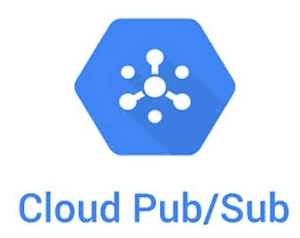

# 在 Elm 的 Node.js 上使用云发布/订阅

> 原文：<https://medium.com/google-cloud/using-cloud-pub-sub-on-node-js-from-elm-2a769731c097?source=collection_archive---------0----------------------->



# 为什么是榆树？

[Elm](https://elm-lang.org/) 是一种纯粹的函数式语言，语法类似于 [Haskell](https://www.haskell.org/) ，但是针对编写前端 web 应用程序进行了优化。它有一个 transpiler，可以将 Elm 模块转换成 JavaScript，还有一个非常小而快速的运行时，可以与浏览器交互。

Elm 相当稳固地定位为前端工具，为浏览器开发动态的单页面应用程序。但是在[榆树节点包](https://www.npmjs.com/package/elm-node)的帮助下，更多的事情成为可能！

# 警告

本文将带您构建一个在 Node.js 中运行的 Elm 应用程序，并使用 Node.js 发布/订阅库与 [Google Cloud 发布/订阅](https://cloud.google.com/pubsub)通信。请注意**我们不建议此时为您的生产工作执行此操作**；这篇文章主要是为了好奇！

# 为什么是“纯功能性”？

我们很多人都熟悉基本的[函数模式](https://en.wikipedia.org/wiki/Functional_programming)，比如在 JavaScript 中将 lambda 函数传递给 *map()* 。

[**纯函数式**](https://en.wikipedia.org/wiki/Purely_functional_programming) 指的是以声明的方式描述你想要弄清楚的东西的程序。大多数程序都是以命令的方式编写的，也就是说，作为程序员，你告诉计算机采取什么步骤，以什么顺序，并管理程序的状态。这给程序员带来了很大的负担，因为他们必须经常考虑如何维护状态的一致性，以及在处理未知副作用带来的意外错误时可能会出现什么问题。

JavaScript 工具已经被开发出来，至少可以帮助解决状态问题，比如 [Redux](https://redux.js.org/) ，其模型[受到了 Elm](https://redux.js.org/understanding/history-and-design/prior-art#elm) 的启发。Redux 允许您将程序的状态声明为不可变的结构，并使用 mutators 进行更新。然而，许多事情在运行时仍然可能出错，因为编译器没有帮助你理解逻辑中可能的流程。

真正纯粹的函数式语言没有流控制。不需要运行任何步骤，因为你的程序基本上是一个数学方程，编译器能够完全理解它，并在编译时捕捉大多数逻辑错误。事实上，甚至可以[写关于纯函数程序的证明](https://www.cs.princeton.edu/~dpw/courses/cos326-12/notes/reasoning.php)。

# 榆树…在节点上？

因为 Elm 只是一个 transpiler，所以也可以使用 Node.js 运行时而不是浏览器来运行结果代码。这使您能够使用 npm/yarn 中所有现有的节点兼容库来构建非常轻量级的服务器进程，同时在 Elm 中运行尽可能多的应用程序。Elm 没有副作用也意味着许多逻辑和数据结构模块可以在客户机和服务器之间共享。

本文将带您构建一个运行在 Node.js 中的 Elm 应用程序，并使用 [Node.js 发布/订阅库](https://github.com/googleapis/nodejs-pubsub/)与 [Google Cloud 发布/订阅库](https://cloud.google.com/pubsub)进行通信。

> **我的“使用 Pub/Sub From”系列文章:** [使用 Kotlin 的 Cloud Pub/Sub](/google-cloud/using-cloud-pub-sub-from-kotlin-d501f7d65e24)
> [使用 Kotlin/JS 的 Node.js 上的 Cloud Pub/Sub](/google-cloud/using-cloud-pub-sub-on-node-js-from-kotlin-js-46ad79739bbf)
> 
> **也感兴趣:**
> [我希望了解的关于谷歌云的事情发布/订阅:第 1 部分](/google-cloud/things-i-wish-i-knew-about-google-cloud-pub-sub-852fac1ffbc6)

# 项目设置

首先安装一个最新版本的 [Node.js](https://nodejs.org/en/) 。(或者使用 [nvm](https://github.com/nvm-sh/nvm) ！)

您还需要 Elm 和 elm-node 的命令，所以要全局安装它们:

```
npm install -g elm elm-node
```

然后，您可以创建一个 elm 节点项目:

```
elm init
elm-node --example-elm > src/Main.elm
elm-node --example-js > src/index.js
elm-node --js src/index.js src/Main.elm
```

马上发现生成的样例代码中有一个错误——**index . js**需要引用 *Elm。主*，非*榆。MainWithJs* 。这些类型的错误可能会在您尝试时得到修复。

生成的程序非常简单。一些程序声明是在 Elm 中进行的，包括一个与 JavaScript 对话的**端口**。JavaScript 代码然后订阅端口并响应调用。

# 应用程序设计

因为 Elm 和 JavaScript 跨两种非常不同的编码接口，我们需要考虑它们将如何通信。《T2 榆树指南》详细讨论了这一点。建议本质上是尽量避免通过管道将每个 JavaScript 调用传递给 Elm。而是做一个在 Elm 中有意义的接口。这也有助于 Elm/JavaScript 转换，它依赖于传递不比 JSON 更复杂的东西。(没有对象句柄什么的。)

对于这个非常简单的例子，我选择向 Elm 公开一个接口，让 Elm 代码请求发送或确认消息，然后能够以事件驱动的方式接收消息。对于一个实际的应用程序，您可能需要更复杂的东西，比如传递数字或 JSON 来引用特定的主题或订阅，并在 JavaScript 端缓存这些内容。

Elm 设计者的最终建议是在本机 Elm 中重写客户端库，但是考虑到节点发布/订阅库的大小和复杂性，这在目前可能是不可行的。所以我们要用端口！

# 端口定义

我们必须从定义我们的端口开始。为了定义我们的端口，我们必须首先决定在 Elm 端需要什么样的功能和接口。有多少将在 Elm 中声明，有多少将驻留在 JavaScript/TypeScript 中？

让我们简单地把它拆开一点！

首先，我们有将要来回传递的消息的定义。在这个例子中，我们的消息有效负载将是一个简单的字符串，所以 *MessageToSend* 将只是*字符串*的别名。当接收消息时，我们还必须知道发布/订阅消息 ID，因此 *MessageReceived* 既有有效载荷又有 ID。

端口本身基本上是可以在 Elm 和 JavaScript 之间传递的消息的声明。 *log* 端口让我们打印日志消息， *publish* 让我们请求发送消息， *receive* 从 JavaScript 到 Elm 获取接收到的消息， *ack* 让我们确认发布/订阅消息。需要注意的一点是，我选择让参数*发布*一个**记录**，而不仅仅是一个字符串。这是为了方便以后添加更多的参数，如果我们想要的话。

您可以看到从 Elm 到 JavaScript 的消息是返回类型 *Cmd msg* 的函数。这是一个通用类型，它指定了 Elm 程序为了到达下一个状态而请求的命令。从 JavaScript 到 Elm 的消息使用*子消息*，这是一个返回类型*子消息*的函数。这意味着我们订阅了参数类型为 *MessageReceived* 的消息，并将使用这些消息来触发状态更新。

# Elm 模型

现在我们已经定义了我们的端口，让我们定义我们的 Elm 端模型。

在这种情况下，我们非常简单的例子是一次只发送这个句子中的一个单词(因此*发送*剩余要发送的内容，而*接收到的消息*表示我们已经收到的内容)。此外，我们在这里将 *Msg* 定义为我们将用来触发状态更新的类型。在这种情况下，我们将收到的唯一消息是 *Received* ，带有类型为 *MessageReceived* 的参数。但是在更复杂的应用程序中可能还有其他的。

# 榆树街

如果这看起来更像一个数据结构而不是一个程序，你就不会错了！在榆树，他们是同一个。

我们在这个 Elm 模块中导出的主符号是 *main* ，它将是一个 *worker* 程序(没有 UI)。 *init* 函数将指定初始状态。*订阅*功能会列出我们愿意接收的消息。并且*更新*将定义如何从接收到的消息中获得更新的状态，以及进一步的动作。

这定义了 *init* 函数，该函数返回一个**元组**。这包括初始状态(*发送的*除了第一个字之外都有，而*收到的消息*还没有收到)以及接下来要采取的步骤。函数构建了一个以任何顺序执行的命令数组，可能是一次全部执行。注意，这些是我们上面的**端口**。

这个很简单！我们只是说我们能够接收消息类型 *Received* (上面定义为*消息*的一部分)。

这是 Elm app 中逻辑的核心。基本上，当 Elm 应用程序被传递时，type *Received* 带有一条消息(同样，如上所述)和一个先前的状态模型，我们将返回一个新的模型。该模型将更新*发送*比以前的模型少一个字；我们还会将新收到的单词添加到*已收到的消息*中。(注意这些更新不是就地完成的，但这是返回一个*新的*模型；因此，如果我们想要立即得到这些值，我们必须使用 **let** 。)最后， *Cmd* 批处理将打印出我们收到的内容，确认 Pub/Sub 中的消息，并可能发布下一个单词。(所有这些都可能以任何顺序同时发生。)如果没有剩下要发送的内容，则不会发出进一步的命令。

# 运行应用程序

毫无疑问，您的流程在这里会有所不同，但是对于完整的示例，我已经创建了一个 ***npm run*** 脚本，您可以使用它来启动它。您应该会看到类似这样的内容:

```
> npm run run
[…]
Use Ctrl+C to exit.
Elm starting Pub/Sub Elm test
JS publishing: Mary
JS: received: 1 : Mary
Elm received so far: ‘Mary’
JS publishing: had
JS acking: 1
JS: received: 2 : had
Elm received so far: ‘Mary had’
[…etc…]
```

请注意，因为我们的应用程序是按顺序发布消息的，所以最终的消息字符串将总是有序的。对读者来说，一个很好的练习是让它一次发布多条消息(每个单词一条)，你可以看到它们可能是无序的。从那里开始，你可以把它们按顺序重新组装起来，等等。

# 后续步骤

查看在发布/订阅模拟器上运行的完整工作示例:

[https://github.com/feywind/elm-node-pubsub](https://github.com/feywind/elm-node-pubsub)

用 Node.js 在服务器端用过 Elm 吗？你觉得这很有趣并希望听到更多吗？关于 Elm on Google Cloud Platform，请随时对这篇文章或您觉得有趣/有前途的事情发表评论！