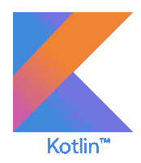
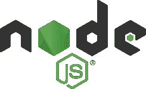
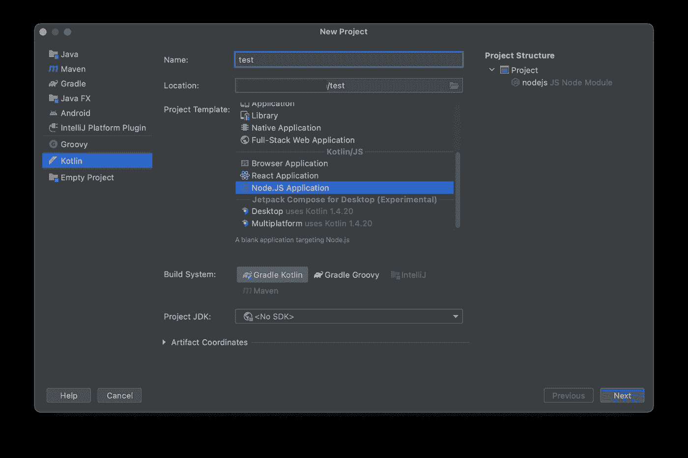
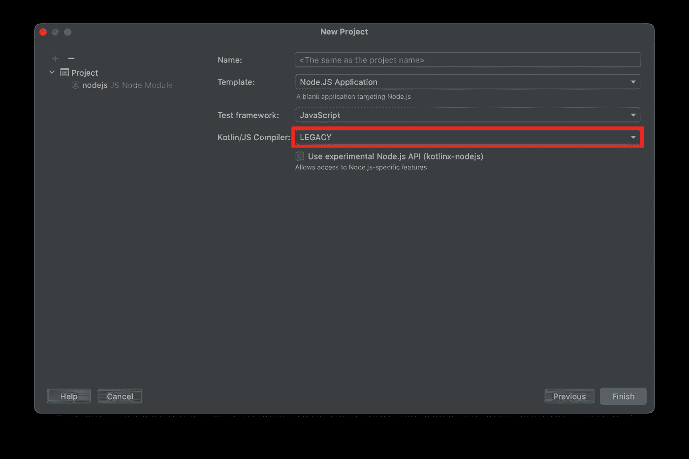

# 在 Kotlin/JS 的 Node.js 上使用云发布/订阅

> 原文：<https://medium.com/google-cloud/using-cloud-pub-sub-on-node-js-from-kotlin-js-46ad79739bbf?source=collection_archive---------1----------------------->

# 为什么是 Kotlin/JS？

Kotlin 通常用于前端 JVM 工作，但是正如前面关于 Kotlin 和 JVM 的文章所示，Kotlin 在服务器端也可以很好地工作。为了在 web 应用程序中维护完整的 Kotlin 堆栈，开发了 [Kotlin/JS](https://kotlinlang.org/docs/reference/js-overview.html) 。

Kotlin/JS 基本上是一个标准的 Kotlin 编译器，但它不是写入 JVM 字节码，而是将 files *转换成 JavaScript。在这种情况下，它的作用与 TypeScript 差不多，为一些常见的操作提供类型安全和语法糖。像 TypeScript 一样，它也为 JavaScript 库提供了外部类型的概念。使用 Dukat 实用程序，还可以将 TypeScript 类型转换为 Kotlin 类型，这使得在 Kotlin/JS 应用程序中获得完全的类型安全变得非常容易。

> * Transpilation 类似于编译，但从一种人类可读语言转换为另一种语言，而不是二进制代码。

Kotlin 位于客户端和服务器端，通常分别使用 React 和 JVM，可以直接共享一些代码，比如通用业务逻辑和数据类。开发垂直应用程序堆栈的团队也可以利用 Kotlin 中现有的能力。

# Kotlin/JS …在 Node 上？

是的，是真的！因为 Kotlin/JS 只是一个 transpiler，所以也可以使用 Node.js 运行时来运行结果代码。这使您能够使用 npm/yarn 中所有现有的节点兼容库**构建非常轻量级的服务器进程，同时在 Kotlin 中运行整个应用程序**。

# 警告

本文将带您构建一个运行在 Node.js 中的 Kotlin/JS 应用程序，并使用 Node.js 发布/订阅库与 [Google Cloud 发布/订阅](https://cloud.google.com/pubsub)通信。请注意**我们不建议此时为您的生产工作执行此操作**；这篇文章主要是为了好奇！

# 项目设置

首先安装一个最新版本的 [Node.js](https://nodejs.org/) 。您也可以使用 [nvm](https://github.com/nvm-sh/nvm) 安装它，但是您需要在下面的项目设置中设置 npm 的路径。

打开 [IntelliJ IDEA](https://www.jetbrains.com/idea/) 或 [Android Studio](https://developer.android.com/studio) 并创建一个针对 Node.js 的 Kotlin/JS 项目。截至目前，新的 **IR** 编译器仍处于试验阶段，因此我建议使用**传统的**以保持简单。(当你读到这里时，情况可能并非如此。)

要使用发布/订阅库，我们必须将它们添加到我们的 Gradle 构建配置中。编辑 **build.gradle.kts** 文件，并添加以下行:

正如评论所建议的，您通常可以启用 generateExternals，它会调用 Dukat 来自动转换 **@google-cloud/pubsub** 中的任何 TypeScript 类型。不幸的是，[它目前正在失败](https://github.com/Kotlin/dukat/issues/426)，所以我们将做我们自己的非常简单的打字！

# 科特林/JS 打字

为了以类型安全的方式调用[发布/订阅库](https://github.com/googleapis/nodejs-pubsub)，我们需要添加一些类型。我喜欢创建一个与 TypeScript 具有相同命名约定的文件，比如 **pubsub.d.kt** ，但您的喜好可能会有所不同。

像这样开始文件 **pubsub.d.kt** :

这告诉编译器几件事:

*   这个文件包含了 **@google-cloud/pubsub** 图书馆的类型
*   这些类型可以在 Kotlin/JS 模块设置之外使用
*   描述的项目应该有一个 Kotlin 名称空间 **google.cloud.pubsub**

我们的类型将使用 JavaScript**Promise<>**对象，所以我们还需要导入那些类型:

最后，实际的打字。你可以在这里找到完整的例子，例如，对于 PubSub 类:

我还喜欢为我们通常会传入的 JSON blobs 创建一个 Kotlin 惯用的数据类。这些不能在同一个文件中，你必须为其创建一个单独的非外部文件。

在 JavaScript 中，这将变成一个标准的 **{ projectId: null，apiEndpoint: null }** 对象。

# 与发布/订阅接口

我们现在可以用或多或少正常的方式调用 Node.js 发布/订阅库。此示例使用模拟器:

这太好了！ **subClient.on()** 调用变成了类似“use”的 Kotlin 运算符。

# Kotlin/JS 和协同程序

让我们来看看另一个可能常见的操作:

可惜这返回的是一个**承诺< >** ，不是我们想要的值。您可以用普通的 JavaScript 方式与它交互:

同样，由于 Kotlin lambda 参数语法，这看起来相当不错。但是我们可以做得更好。

在 TypeScript 中，你可以简单地使用**异步**和**等待**。Kotlin/JS 目前不支持 JavaScript 原生**异步**和**等待**。但是，它确实提供了 Kotlin 协程！而且事实证明[把两个](https://discuss.kotlinlang.org/t/async-await-on-the-client-javascript/2412)联系起来也不是太难。这个讨论是不久前的事了，协程已经从实验阶段出来了，所以还需要一点工作来更新它。

首先，我们需要一个 JavaScript**Promise<>**和 Kotlin 协程之间的适配器。这个扩展函数将让您调用**。await()** on 任一**承诺< >** ，调用变为**暂停**函数调用:

由于 Kotlin/JS 没有在 JVM 上运行，我们不能使用 JVM 本地操作，比如 [runBlocking](https://kotlinlang.org/docs/coroutines-basics.html#bridging-blocking-and-non-blocking-worlds) 。因此，这实现了从非**挂起**代码到**挂起**函数的桥梁，有点像在 JavaScript 中调用**异步**函数，而没有**等待**:

现在我们可以做这样的事情:

嘿，实际上，看起来不错！我们又回到了 TypeScript **async** 和 **await** 的易用性，但我们也在编写 Kotlin。这将优雅地转换成一个无需 JVM 就可以在 Node.js 上运行的应用程序。

# 后续步骤

查看在发布/订阅仿真器上运行的[完整工作示例。](https://github.com/feywind/kotlinjs-pubsub)

用 Node.js 在服务器端用过 Kotlin/JS 吗？你觉得这很有趣并希望听到更多吗？请随意对这篇文章发表评论，或者对你在 Google 云平台上发现的关于 Kotlin 和 Kotlin/JS 的有趣/有前途的事情发表评论！