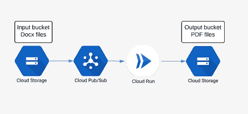

# 将云运行服务用作异步工作器

> 原文：<https://medium.com/google-cloud/using-cloud-run-service-as-async-worker-cf5b1b3fd226?source=collection_archive---------1----------------------->

在我的[上一篇文章](/google-cloud/making-requests-to-cloud-run-with-the-service-account-620014dc1486)中，我描述了部署私有云运行服务，然后使用服务帐户向它发出请求的过程。有了这些属性，就可以很好地将 Cloud Run 用作异步任务工作器，我将在本文中对其进行描述。

我将使用上一篇文章中的一个服务示例，使用 Libreoffice 将 Microsoft Word Docx 转换为 PDF，但不是直接向 service 发出请求，而是由 PubSub 触发 service。例如，假设您有一个云存储桶，您将 MS Word docx 文件上传到其中，并且您希望每次 docx 文件上传到桶时自动转换为 PDF。

要自动做到这一点，需要以下步骤:

*   需要设置输入桶，以便在上传(创建)某个文件时向 PubSub 主题发出通知
*   PubSub 订阅是在前面的 raw 中使用 HTTP 目标为主题创建的，在我们的例子中是云运行服务的 URL
*   云运行服务将文件从 Docx 转换为 PDF，并将结果文件保存到输出桶

这是这个过程的示意图。



一个细节是，云服务将是私有的(不对互联网开放)，因此 PubSub 订阅将需要在一个服务帐户下运行。

## 设置管道

让我们来看看如何建立这样的管道的实际步骤。

## 云存储发布订阅通知

第一步是在云存储桶上设置一个通知。(目前)唯一的方法是使用谷歌云 SDK 的 **gsutil** 工具:

```
>gsutil notification create -t projects/<PROJECT-ID>/topics/gcs-cloud-run -f json -e OBJECT_FINALIZE gs://<BUCKET-NAME>
Created notification config projects/_/buckets/adventures-on-gcp.appspot.com/notificationConfigs/3
```

选项 OBJECT_FINALIZE 意味着当在桶中创建了一个新对象(或覆盖了一个新对象)时将触发通知，-f json 标志意味着通知将以 json 格式发送，gcs-cloud-run 是 PubSub 主题的名称，因此在执行该命令后，应该创建 PubSub 主题 *gcs-cloud-run* 。

这是此类 PubSub 消息的外观:

```
{u'message': {u'attributes': {u'bucketId': u'adventures-on-gcp.appspot.com',
                              u'eventTime': u'2019-04-23T20:34:34.333805Z',
                              u'eventType': u'OBJECT_FINALIZE',
                              u'notificationConfig': u'projects/_/buckets/adventures-on-gcp.appspot.com/notificationConfigs/3',
                              u'objectGeneration': u'1556051674333936',
                              u'objectId': u'demo.docx',
                              u'overwroteGeneration': u'1556050819479767',
                              u'payloadFormat': u'JSON_API_V1'},
              u'data': u'ewogICJraW5kIjogIn==',
              u'messageId': u'526259585534714',
              u'message_id': u'526259585534714',
              u'publishTime': u'2019-04-23T20:34:34.678Z',
              u'publish_time': u'2019-04-23T20:34:34.678Z'},
 u'subscription': u'projects/adventures-on-gcp/subscriptions/cloud-run-ps-gcs'}
```

对于示例中的情况，我们需要字段 **bucketId** 和 **objectId** ，它们对应于创建的 bucket 名称和文件名(路径)。

## 网络应用

示例云运行服务是用 Python 编写的，完整代码可以在 Github[https://Github . com/zde nulo/GCP-docx 2 pdf/tree/master/Cloud _ Run _ pubsub](https://github.com/zdenulo/gcp-docx2pdf/tree/master/cloud_run_pubsub)上找到。

如上所述，Web 应用程序接受 HTTP POST JSON 消息，将文件从 bucket 下载到服务环境，然后进行转换，创建 PDF 文件并将 PDF 文件上传到输出 bucket 并删除本地文件(Docx 和 PDF ),因为在云运行服务中存储数据会影响 RAM 内存容量，也就是说，如果服务实例会一直运行，并且文件不会被删除，它最终会崩溃，因为它不会有更多的可用内存。

web 应用程序本身包含在文件夹应用程序中，我使用 Cloud Build 来构建 Docker 映像并将其部署在 Cloud Run 上。云构建配置在文件 [cloudbuild.yaml](https://github.com/zdenulo/gcp-docx2pdf/blob/master/cloud_run_pubsub/cloudbuild.yaml) 中定义，可以通过以下命令执行:

```
>gcloud builds submit --config=cloudbuild.yaml --substitutions=_SERVICE_NAME="ps-run",TAG_NAME="v0.1",_ENV_VARIABLES="OUTPUT_BUCKET=gcs-upload-test"
```

服务名称是云运行服务的名称

TAG_NAME 是图像标签

OUTPUT_BUCKET 是输出桶(输出文件将保存在这里),它将作为环境变量传递给 Docker image。

在部署期间的构建日志中，将打印服务的 URL，或者我们可以使用以下命令获取它:

```
>gcloud beta run services describe <SERVICE-NAME> --format="json(status[address])"
{
  "status": 
    "address": {
      "hostname": "https://ps-run-sxl5nibnhq-uc.a.run.app"
    }
  }
}
```

## 发布订阅设置

下一步是创建服务帐户。正如我在开始时所写的，我们希望这个云运行服务是私有的，为了访问它，我们需要为这个服务帐户设置适当的 IAM 角色。此服务帐户将绑定到 PubSub 订阅，它将作为一个身份，以便云运行可以允许访问私有服务。向服务发出请求的角色是 **roles/run.invoker** 。

使用 **gcloud** 命令，可以创建服务帐户:

```
>gcloud iam service-accounts create cr-ps-test --display-name="Cloud Run PubSub"
Created service account [cr-ps-test].
```

并允许此服务帐户访问云运行服务:

```
>gcloud beta run services add-iam-policy-binding ps-run --member=serviceAccount:cr-ps-test@adventures-on-gcp.iam.gserviceaccount.com --role=roles/run.invoker
Updated IAM policy for service [ps-run].
bindings:
- members:
  - serviceAccount:cr-ps-test@adventures-on-gcp.iam.gserviceaccount.com
  role: roles/run.invoker
etag: BwWHghIlfxk=
```

最后一步是创建 PubSub 主题的 PubSub 订阅，该订阅将使用创建的服务帐户进行标识，并设置 HTTP 目标，该目标将是云运行服务 URL。

```
gcloud beta pubsub subscriptions create <SUBSCRIPTION-NAME> --push-endpoint=<SERVICE-URL> --push-auth-service-account=<SERVICE-ACCOUNT>@<PROJECT-ID>.iam.gserviceaccount.com --topic projects/<PROJECT-ID>/topics/gcs-cloud-run
```

如果您想要测试流程，您可以使用 **gsutil** 命令将 demo.docx 文件从存储库中复制到您的输入桶中:

```
>gsutil cp demo.docx gs://<INPUT-BUCKET>
```

通过这个过程，您可以创建一个接收 PubSub 消息并进行进一步处理的私有云运行服务。