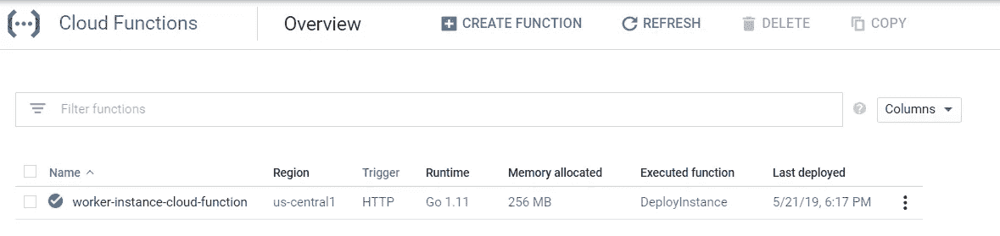

# 使用云调度程序和云功能部署定期计算引擎虚拟机工作程序。

> 原文：<https://medium.com/google-cloud/using-cloud-scheduler-and-cloud-functions-to-deploy-a-periodic-compute-engine-vm-worker-2b897ef68dc5?source=collection_archive---------0----------------------->

文章的架构图

在本文中，我们使用云调度器来定期启动和关闭计算引擎(GCE)工作器。云调度程序将定期轮询云功能，该云功能将实例化一个工作计算引擎虚拟机，该虚拟机将执行一些工作，直到调度程序通知云功能将其关闭。对于我们的例子，我们将让云调度程序每 10 分钟运行一次，轮询云函数来执行它的任务。

# 体系结构

**Cloud Scheduler:**Google Cloud Scheduler 是一个基于 cron 的解决方案，面向寻求在任何 GCP 服务中设置某种形式的 cron 功能的工程师。我们将手动创建一个 cron，它点击触发整个构建过程的云函数 HTTP 端点。
**云函数:**创建 GCE 实例的大部分逻辑将保存在云函数中。我们将使用 Golang GCP API 来执行这些调用；但是如果你不熟悉围棋，不要担心，我会对我的代码进行大量注释。这是我在文章结尾提供的。
**计算引擎实例:**云函数将创建一个执行一些工作的 GCE 实例。在我们这个简单的例子中，我们将把启动和关闭脚本附加到 VM 上，这样每当 VM 启动或停止时，它将写入根文件夹中的一个`**work.txt**`文件。这将让我们知道虚拟机实际上已经启动并做了一些工作。在您的情况下，它可以运行一些分析，或者您想要完成的任何批处理作业。我们的实例将被抢占以节省成本。

我们开始吧。

# 1.创建服务帐户

我们需要一个服务帐户(SA)，云功能使用它来代表我们*(用户)*管理虚拟机的创建、启动和停止。没有它，云功能将不会被授权这样做。在我的例子中，我称 SA 为`**compute-admin-sa**`，我给它一个描述以更好地识别它的角色*(图 1)* 。

**图 1:** 创建服务帐户

## 1.2 应用服务帐户权限。

在这一步中，我们定义服务帐户将拥有的权限。我给了它计算管理员角色，授予它对计算引擎的完全控制权。在您的情况下，您可以更加细化范围。在这一步之后，我们创建了云函数。

**图 2:** 将角色应用到服务帐户

# 2.创建云函数

导航到云函数页面。单击创建函数。

**图 3:** 创建云函数(名称、描述和触发器)

创建一个函数，我们给它一个描述性的名字。`**worker-instance-cloud-function**`。让我们确保触发器是 HTTP，因为我们将使用 Cloud Scheduler 调用这个 HTTP URL。
接下来复制提供的 URL。这将是云调度程序调用该函数的方式。

接下来，我们选择运行时。我喜欢我的函数逻辑，所以围棋 1.11 是合适的。

**图 4:** 创建云函数(区域和环境变量)

接下来，我们选择要执行的函数。在我的例子中，它叫做`**DeployInstance**` *(见页面底部的代码)*

让我们选择一个区域，通常我们应该选择一个靠近我们的云调度程序和计算引擎实例的区域，在我们的例子中，us-central1 起作用。

然后，让我们选择服务帐户。我们使用之前创建的那个。

在环境变量部分，我的代码使用了 4 个核心变量。`**PROJECT_ID**`、`**REGION**`、`**ZONE**`、`**INSTANCE_NAME**`、**、**用你想要的变量填充这些。确保它们是正确的。

最后**点击创建**

部署后，您应该有一个类似的 UI，如下面的图 5 所示

**图 5:** 云调度器在您创建了调度之后

# 创建云调度程序

是时候创建我们的调度器了*(图 6)* 。

**图 6:** 创建云计划

让我们提供一个独特的描述性名称以及令人信服的描述。我把它命名为`**worker-instance-batchwork-scheduler**` **。**

接下来，让我们将调度程序设置为每 10 分钟一次。云调度程序使用熟悉的 Linux Cron 语法。在我们的例子中，它是`***/10 * * * ***`

接下来，为了统一，将时区设置为与云函数区域相似的时区。

接下来，将目标设置为 HTTP，并粘贴到创建云函数时获得的云函数 URL 中。然后选择`**GET**`作为 HTTP 方法，因为我们只想调用函数，不传入任何数据。

# 运行时间表

我们可以运行该计划以查看它是否有效，在云计划程序页面上，单击立即运行*(图 7)* ，如果它尚未运行*(或者您可以等待 10 分钟)*

**图 7:** 云调度器当您创建了调度之后

如果调用成功，您应该看到右边的结果列显示成功*(图 8)*

**图 8:** 对云函数的成功调用

让我们导航到计算引擎页面。最初，您应该会在图 9 中看到以下内容

**图 9:** 最初没有计算引擎虚拟机

过了一会儿，我们应该看到我们的虚拟机出现了*(图 10)* ！

**图 10:** 片刻之后，worker-instance-01 正在创建

启动和关闭脚本会写入一个文件，并显示虚拟机处于`**STARTED**` 或`**STOPPED**`的时间。这一点我们可以借鉴。

我让时间表整夜运行，这是我们在查看云函数时得到的结果。我们可以看到每 10 分钟利用率的周期性峰值，显示我们的功能正在执行*(见图 11)*

**图 11:** 云功能周期性利用

这里是`**work.txt.**`的输出

**图 12:**work . txt 文件以及从开始到结束的所有日志以及时间

# 结论

我们已经有了，我们已经将云调度程序、云功能和计算引擎整合在一起。

## 密码

[GitHub 链接](https://github.com/martinomburajr/medium/blob/master/gcp/architecture/scheduler-functions-compute-startupscript/cloudfunctions/cloudfunctions.go)(太长，无法粘贴到本文档中)

# 附加链接

**启动脚本**

**可抢占的虚拟机**