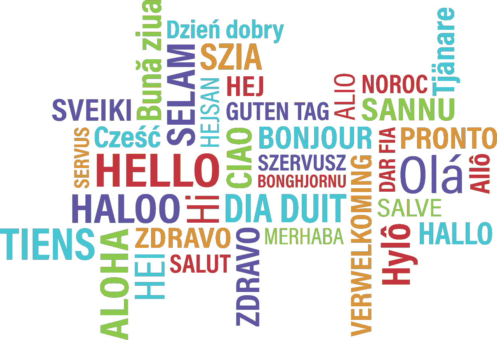
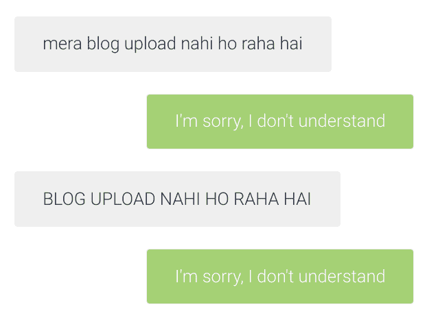

# 使用云翻译克服语言障碍

> 原文：<https://medium.com/google-cloud/using-cloud-translation-to-overcome-language-barriers-2d3a8c887bbe?source=collection_archive---------1----------------------->

## 语言是交流中常见的障碍。云翻译如何帮助克服这一问题？让我们找出答案

【来源:[pixabay.com](https://pixabay.com/vectors/hello-bonjour-hi-greeting-foreign-1502369/)([Pixabay 牌照](https://pixabay.com/service/license/))】

今天，我们将看到云翻译如何将这一障碍转变为桥梁。还提供了一个演示应用程序来测试它。

我们生活在一个多样化的世界。不同的地理位置、多元的文化和各种各样的语言是日常生活的一部分。但是语言在这些多样性中占有独特的地位。语言是我们交流的媒介，是不同地域和文化的人们建立共同点的一种方式。因此，难怪语言经常被视为交流的障碍，被视为成长型公司需要应对的挑战。

# 环境

想象一下，一个小的电子商务网站在一个小地方很有名气。他们现在正寻求成长为一个全国性品牌，在全国范围内建立自己的存在。人们喜欢这家商店的主要原因之一是他们的客户支持。所有客户问题都通过网站上的聊天窗口接收，并由支持人员迅速处理。

现在，虽然这对于小型商店来说很有效，但是为全国各地具有不同语言偏好的客户提供同等水平的支持变得越来越困难。我们如何确保顾客支持一如既往的友好？

我们如何改善这种体验？(提示:在标题里)[作者图片]

# 解决方案:云翻译

云翻译是 Google Cloud 的翻译服务。它支持 100 多种语言的翻译，每年都有更多的语言加入。使用云翻译，我们可以实时翻译客户支持信息，不再有障碍！

客户可以用他们喜欢的语言查看消息，而支持人员可以用他们选择的语言理解和回复消息。这实现了无缝的客户支持，而不管客户和支持人员之间的语言差异

# 它是如何工作的？

谷歌提供 SDK，用于将云翻译集成到各种编程语言的软件中。翻译可以以两种方式整合—

1.  在后端，当存储或检索消息时
2.  在前端，当消息显示在浏览器上时

演示应用程序采用后一种方法，因为它更容易与现有应用程序集成，而不会中断逻辑和功能。

使用云翻译 SDK 包括 4 个简单的步骤-

1.  如果源文本使用不同的文字，请将其音译为原始文字(例如，将英语化的印地语转换为梵文)。这是必需的，因为云翻译模型是在原始脚本的文本上训练的
2.  确定源语言和目标语言。如果源语言未知/未指定，云翻译将自动检测它
3.  用源文本、源语言和目标语言向 API 发送请求
4.  阅读翻译的结果

SDK 提供了几个其他特性和定制来提供您正在寻找的确切结果，所以查看[文档](https://cloud.google.com/translate/docs)以获得更多信息。

## 奖励:自动翻译

虽然云翻译非常适合各种应用程序，但您可能希望翻译特定领域的文本。别担心，AutoML Translate 会帮你搞定！使用 AutoML Translate，您可以使用您选择的语言和领域中的句子对来微调云翻译基础模型，从而改善该领域的翻译结果。您可以两全其美—云翻译的通用翻译和 AutoML Translate 的特定领域翻译！

# 演示应用程序

这个演示应用程序建立了一个 WordPress 站点(作为客户)和一个聊天支持站点(作为服务提供商)，并将聊天界面连接到一个使用云翻译和 AutoML 翻译构建的翻译 API。你可以在这里找到设置[的源代码和说明。](https://github.com/anihm136/chat-translation-demo)

# 后续步骤

[云翻译](https://cloud.google.com/translate)和 [AutoML 翻译](https://cloud.google.com/translate/automl/docs)文档包含快速入门指南以及关于它们提供的所有功能的深入文档。看一看，并创建自己的翻译项目！