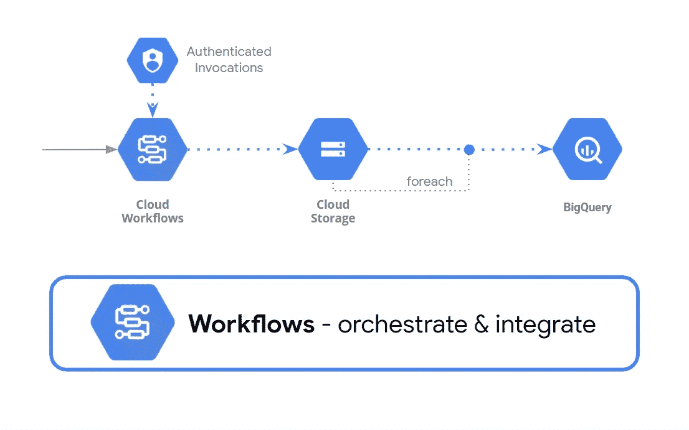

# 使用云工作流将云存储文件加载到 BigQuery 中

> 原文：<https://medium.com/google-cloud/using-cloud-workflows-to-load-cloud-storage-files-into-bigquery-54228d166a7d?source=collection_archive---------0----------------------->

使用云工作流将数据从云存储加载到 BigQuery。

在本文中，我们将通过*无服务器工作流*来协调和自动化谷歌云。

*我们将创建一个* ***云工作流*** *将数据从****Google Storage****加载到****big query****。* *这是一个关于如何使用工作流、连接任何 Google Cloud APIs、使用子工作流、数组、提取段以及调用 BigQuery 加载作业的完整指南。*