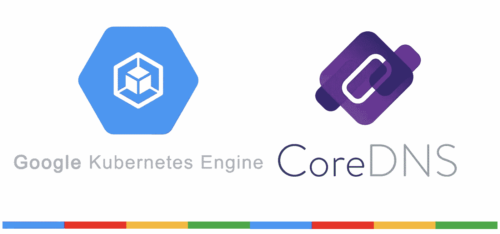

# 在 GKE 上使用 CoreDNS

> 原文：<https://medium.com/google-cloud/using-coredns-on-gke-3973598ab561?source=collection_archive---------0----------------------->

通过存根域克服 kube-dns 对 GKE 的限制

虽然早在 2018 年 1.11 版本以来，Kubernetes 的 [CoreDNS 就达到了 GA](https://kubernetes.io/blog/2018/07/10/coredns-ga-for-kubernetes-cluster-dns/) ，但谷歌 Kubernetes 引擎(GKE)用户即使在 1.17 版本的快速通道中也无法使用 kube-dns。你可以使用[迁移工具](https://github.com/coredns/deployment/tree/master/kubernetes)在现有的 Kubernetes 集群上轻松安装 CoreDNS，但 GKE 不会让你删除 kube-dns，因此查询最终会随机命中其中一个。