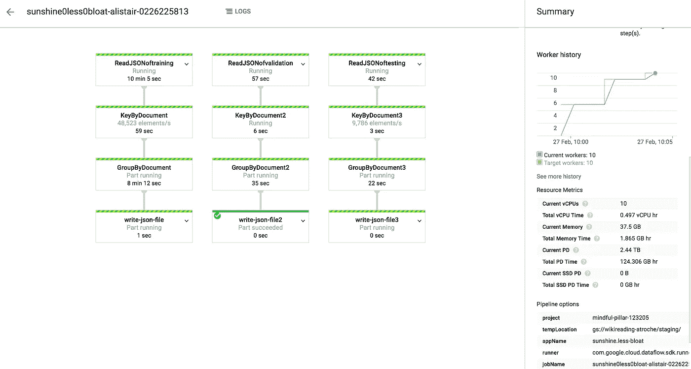
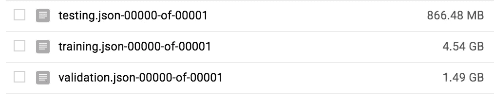

# 使用 Clojure 中的数据流来处理 Google 的新维基阅读数据集

> 原文：<https://medium.com/google-cloud/using-dataflow-in-clojure-to-process-googles-huge-new-wikireading-dataset-832af367539c?source=collection_archive---------0----------------------->

昨天，我在探索新的 WikiReading 数据集，并通过简化对象的结构——基本上删除了一些非规范化的字段——成功地将 208GB 的未压缩 JSON 压缩到 50GB。我使用了一个简单的命令行工具: [jq](https://stedolan.github.io/jq/) 。但这些文件还是太大了，无法在我的笔记本电脑上用 Clojure REPL 软件下载。

今天，我想从 1880 万个(文档、属性、值)三元组转移到大约 470 万个文档的映射，每个文档与一组(属性、值)元组相关联。这将再次大幅减小尺寸。

从技术上讲，我可以用 jq 来做，但是没有好的方法来并行操作，不像我们昨天做的映射(每一行都是一个单独的 JSON 对象，转换它只依赖于那一行)。要用 jq 对所有数据进行“分组”,我们必须将整个数据结构读入内存，然后在单个内核中处理它。我不得不在云计算上建立一个特殊的超高内存实例，而且仍然需要很长时间来处理。

这可能是对[云数据流](https://cloud.google.com/dataflow/)的一个很好的利用。有一个很棒的库叫做 [datasplash](https://github.com/ngrunwald/datasplash) ，它包含了数据流的 1.x SDK。尽管 Google 已经开始推荐 Apache Beam，但我还是使用了它，因为 clj-Beam[就是不存在:当我试图运行最基本的例子时，它由于神秘的互操作问题而失败了。此外，这个 API 远不如 datasplash 的高。](https://github.com/teddziuba/beam-clj)

我试图创建的管道非常简单:

*   读取给定子集(训练/验证/测试)的所有 JSON 文件，将它们转换成一个大的 Clojure 映射集合(带有键文档、属性、值)
*   按文档分组
*   为每个子集写入一个 JSON 文件

与我在过去几天里用 Dataflow 所做的相比，它很简单——线性的，只有几个步骤。看看 datasplash 的例子中一些更丰富的管道。

这里有一个被大量评论的要点:

我是这样运行的:

这是它运行时在监控界面中的样子:

这是花了多长时间:

这是云存储的输出结果:

我们已经从 208GB → 50GB → 6.8GB，而没有丢失复制论文结果所需的任何信息。好吧！我甚至可以在我的笔记本电脑上玩这个数据集。

不用写太多代码就能看到一堆电脑为你跳舞，这是一种满足感。数据流负责分布式计算的所有实现细节。我写的代码看起来类似于我为在单个内核、单个机器上运行而写的代码——主要区别是我使用了 datasplash 的 map、group-by 和 I/O 函数，而不是 Clojure 的内置函数。

我真希望管道的构建是基于组装数据结构(就像在 [Onyx](http://www.onyxplatform.org/) 中)而不是改变管道对象。事实上，我会使用 Onyx，只不过我必须自己完成所有的开发工作，并了解什么是 Apache Zookeeper。也许改天吧！或者也许有一天 Onyx 会像 Dataflow 一样拥有自己的全托管服务。

无论如何，我现在更接近于能够快速迭代我对维基阅读的探索。向前！