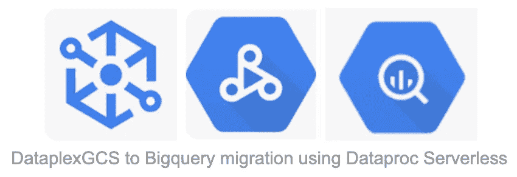

# 使用 Dataproc Serverless 将 Dataplex GCS 数据迁移到 Bigquery

> 原文：<https://medium.com/google-cloud/using-dataproc-serverless-to-migrate-your-dataplex-gcs-data-to-bigquery-1e47bc8de74c?source=collection_archive---------2----------------------->

我们可以使用 Dataproc Serverless 来运行 Spark batch 工作负载，而无需配置和管理我们自己的集群。我们可以指定工作负载参数，然后将工作负载提交给 Dataproc 无服务器服务。

[*Dataproc 无服务器*](https://cloud.google.com/dataproc-serverless/docs) *帮助用户完成整个基础设施管理工作—执行他们的*[*Apache Spark*](http://spark.apache.org/)*工作负载用户是* ***而不是*** ***需要*** *先创建一个集群才能执行任何操作。用户只需根据自己的使用情况选择一个模板，只需点击几下鼠标和几个命令，即可完成各自的工作。*



## 目标

这篇博客文章将分享关于如何使用“[data plex GCS to big query](https://github.com/GoogleCloudPlatform/dataproc-templates/blob/main/java/src/main/java/com/google/cloud/dataproc/templates/dataplex/README.md)data proc 无服务器模板”进行数据迁移的完整细节。该模板将数据从 Dataplex GCS 表中逐渐转移到 BigQuery 中。它将识别 Dataplex GCS 中的新分区，并将它们加载到 BigQuery 中。

*注意:如果 Dataplex GCS 表没有分区，那么将从 GCS 中读取整个表，并且目标 BigQuery 表将被覆盖。*

## 设置您的 GCP 项目和基础设施

1.  登录到您的 GCP 项目并启用 Dataproc API(如果它被禁用的话)
2.  确保子网启用了私有 Google 访问，如果您要使用 GCP 生成的“默认”VPC 网络，那么也必须启用私有访问，如下所示:


```
gcloud compute networks subnets update default --region=us-central1 --enable-private-ip-google-access
```

3.为 jar 文件创建一个 GCS 存储桶和暂存位置。

```
export GCS_STAGING_BUCKET=”my-gcs-staging-bucket”
gsutil mb gs://$GCS_STAGING_BUCKET
```

4.要配置 Dataproc 无服务器作业，您需要导出以下变量

`GCP_PROJECT`:运行 Dataproc 无服务器的 GCP 项目 id。

`REGION`:运行 Dataproc 无服务器的区域。

`GCS_STAGING_LOCATION` : GCS 暂存桶位置，Dataproc 将在此存储暂存资产(参见步骤 3)。

## 执行 Dataproc 模板的步骤

1.  克隆 Dataproc 模板库并导航到 Java 模板文件夹。

```
git clone https://github.com/GoogleCloudPlatform/dataproc-templates.git
cd dataproc-templates/java
```

2.获取身份验证凭据(以提交作业)。

```
gcloud auth application-default login
```

3.通过导出提交所需的变量来配置 Dataproc 无服务器作业(如下面*“设置您的 GCP 项目&”*的步骤 4 中所述)。

```
export GCP_PROJECT=<project_id> # your Google Cloud project
export REGION=<region> # your region for ex: us-central1
export SUBNET=<subnet> # optional if you are using default
# export GCS_STAGING_LOCATION=<gcs-staging-bucket-folder> # already done at step 3(Under Setup your GCP Project & Infra)
```

4.下载 Jar 和属性文件。

```
export GCS_STAGING_LOCATION=gs://bucket/path/to/staging/folder/
gsutil -u <billing-project-id> cp gs://dataplex-dataproc-templates-artifacts/dataproc-templates-1.0-SNAPSHOT.jar ${GCS_STAGING_LOCATION}
gsutil -u <billing-project-id> cp gs://dataplex-dataproc-templates-artifacts/log4j-spark-driver-template.properties ${GCS_STAGING_LOCATION}
```

5.收集以下参数的值:

`project.id`:目标 BigQuery 数据集和自定义 SQL 文件所在的 GCP 项目的 Id。

`dataplex.gcs.bq.target.dataset`:data plex GCS 资产将被迁移到的目标 BigQuery 数据集的名称。

`gcs.bigquery.temp.bucket.name`:在数据装载到 BigQuery 之前临时保存数据的 GCS 桶。

`dataplex.gcs.bq.save.mode`:指定如何处理 BigQuery 中的现有数据(如果存在)。可以是以下任意一种:`errorifexists`、`append`、`overwrite`、`ignore`。默认为`errorifexists`

`dataplex.gcs.bq.incremental.partition.copy`:指定模板是只复制新分区还是复制所有分区。如果设置为`no`现有分区，并且如果找到那么它将被覆盖。可以是以下任意一种`yes`、`no`。默认为`yes`

6.提供正确的论据:

`--dataplexEntity`:要加载到 BigQuery 的 Dataplex GCS 表
示例:`--dataplexEntityList "projects/{project_number}/locations/{location_id}/lakes/{lake_id}/zones/{zone_id}/entities/{entity_id_1}"`

`--partitionField`:如果该字段与`partitionType`一起指定，则该表按该字段分区。该字段应该是顶级时间戳或日期字段。

`--partitionType`:支持的类型有:`HOUR`、`DAY`、`MONTH`、`YEAR`

`--targetTableName`:指定要写入数据的表的名称。如果未指定此参数，实体的名称将用作表名。

7.执行以下命令:

```
gcloud dataplex tasks create <task-id> \
    --project=<project-id> \
    --location=<region> \
    --vpc-sub-network-name=<subnet> \
    --lake=<dataplex-lake> \
    --trigger-type=ON_DEMAND \
    --execution-service-account=<execution service account> \
    --spark-main-class="com.google.cloud.dataproc.templates.main.DataProcTemplate" \
    --spark-file-uris="${GCS_STAGING_LOCATION}log4j-spark-driver-template.properties" \
    --container-image-java-jars="${GCS_STAGING_LOCATION}dataproc-templates-1.0-SNAPSHOT.jar" \
    --execution-args=^::^TASK_ARGS="--template=DATAPLEXGCSTOBQ,\
        --templateProperty=project.id=<project-id>,\
        --templateProperty=dataplex.gcs.bq.target.dataset=<dataset_name>,\
        --templateProperty=gcs.bigquery.temp.bucket.name=<temp-bucket-name>,\
        --templateProperty=dataplex.gcs.bq.save.mode=append,\
        --templateProperty=dataplex.gcs.bq.incremental.partition.copy=yes,\
        --dataplexEntity=projects/{project_number}/locations/{location_id}/lakes/{lake_id}/zones/{zone_id}/entities/{entity_id_1},\
        --partitionField=<partition_field>,\
        --partitionType=<DAY>,\
        --targetTableName=<table_name>,\
        --customSqlGcsPath=<gs://bucket/path/to/custom_sql.sql>"
```

*注意:-可选地，可以提供一个自定义 SQL 来过滤将被复制到 BigQuery 的数据。
模板将从一个 GCS 文件中读取一个定制的 sql 字符串。该文件的路径必须提供选项* `--customSqlGcsPath` *。自定义 SQL 必须引用 FROM 子句中的* `__table__` *，如下例所示:*

```
SELECT 
    col1, col2
FROM
    __table__
WHERE 
    id > 100
```

*此外，如果您需要* [*指定 Dataproc 无服务器支持的 spark 属性*](https://cloud.google.com/dataproc-serverless/docs/concepts/properties) *，例如:调整驱动程序、内核、执行器等的数量，您可以编辑 start.sh 文件中的 OPT_PROPERTIES 值。*

6.监控 Spark 批处理作业

提交作业后，我们将能够在 [Dataproc 批处理 UI](https://console.cloud.google.com/dataproc/batches) 中看到它。从那里，我们可以查看作业的指标和日志。

## 参考

*   [Dataproc 无服务器](https://cloud.google.com/dataproc-serverless/docs/overview)
*   [Dataproc 模板库](https://github.com/GoogleCloudPlatform/dataproc-templates)

如有任何疑问/建议，请联系:dataproc-templates-support-external@googlegroups.com