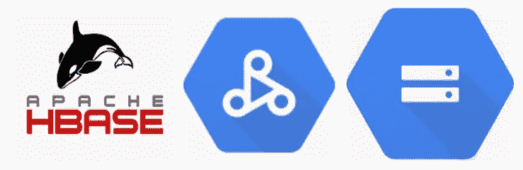
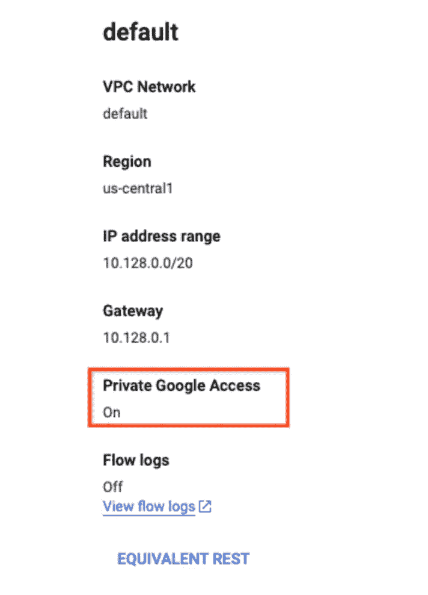

# 使用 Dataproc Serverless 将您的 Hbase 数据迁移到 GCS

> 原文：<https://medium.com/google-cloud/using-dataproc-serverless-to-migrate-your-hbase-data-to-gcs-bf1ccf4ab945?source=collection_archive---------5----------------------->

我们可以使用 Dataproc Serverless 来运行 Spark batch 工作负载，而无需配置和管理我们自己的集群。我们可以指定工作负载参数，然后将工作负载提交给 Dataproc 无服务器服务。

[*Dataproc 无服务器*](https://cloud.google.com/dataproc-serverless/docs) *帮助用户完成整个基础设施管理工作—执行他们的*[*Apache Spark*](http://spark.apache.org/)*工作负载用户是* ***而不是*** ***需要*** *先创建一个集群才能执行任何操作。用户只需根据自己的使用情况选择一个模板，只需点击几下鼠标和几个命令，即可完成各自的工作。*



使用 Dataproc 无服务器从 Hbase 迁移到 GCS

## 目标

这篇博客文章将分享关于如何使用“ [Hbase to GCS](https://github.com/GoogleCloudPlatform/dataproc-templates/tree/main/java/src/main/java/com/google/cloud/dataproc/templates/hbase) Dataproc 无服务器模板”进行数据迁移的完整细节。该模板将数据从 Hbase 表移动到 GCS 存储桶。

## 设置您的 GCP 项目和基础设施

1.  登录到您的 GCP 项目并启用 Dataproc API(如果它被禁用的话)
2.  确保子网启用了私有 Google 访问，如果您要使用 GCP 生成的“默认”VPC 网络，那么也必须启用私有访问，如下所示:



```
gcloud compute networks subnets update default --region=us-central1 --enable-private-ip-google-access
```

3.为 jar 文件创建一个 GCS 存储桶和暂存位置。

```
export GCS_STAGING_BUCKET="my-gcs-staging-bucket"
gsutil mb gs://$GCS_STAGING_BUCKET
```

4.要配置 Dataproc 无服务器作业，您需要导出以下变量

`GCP_PROJECT`:运行 Dataproc 无服务器的 GCP 项目 id。

`REGION`:运行 Dataproc 无服务器的区域。

`GCS_STAGING_LOCATION` : GCS 暂存桶位置，Dataproc 将在此存储暂存资产(参见步骤 3)。

## 执行 Dataproc 模板的步骤

1.  克隆 Dataproc 模板库并导航到 Java 模板文件夹。

```
git clone https://github.com/GoogleCloudPlatform/dataproc-templates.git
cd dataproc-templates/java
```

2.获取身份验证凭据(以提交作业)。

```
gcloud auth application-default login
```

3.通过导出提交所需的变量来配置 Dataproc 无服务器作业(如下面*“设置您的 GCP 项目&”*的步骤 4 所述)。

```
export GCP_PROJECT=<project_id> # your Google Cloud project
export REGION=<region> # your region for ex: us-central1
export SUBNET=<subnet> # optional if you are using default
# export GCS_STAGING_LOCATION=<gcs-staging-bucket-folder> # already done at step 3(Under Setup your GCP Project & Infra)
```

4.设置 HBase 依赖关系:-向 Dataproc Serverless 提交作业时，需要传递一些 HBase 依赖关系。当为 hbase 表配置设置了 CATALOG 环境变量时，脚本会自动设置这些依赖关系。如果不是，那么需要使用— jars 标志传递这些依赖关系，或者在使用 Dataproc 模板的情况下，使用 jars 环境变量。

[Apache h base Spark Connector](https://mvnrepository.com/artifact/org.apache.hbase.connectors.spark/hbase-spark)依赖项(这些已经安装在 Dataproc Serverless 中，所以可以使用 file://)引用它们:

*   file:///usr/lib/spark/external/h base-spark-protocol-shaded . jar
*   file:///usr/lib/spark/external/h base-spark . jar
*   一旦将 CATALOG 环境变量用于 hbase 表配置，就会自动下载并设置所有其他依赖项。库链接(用于参考):- hbase-client，hbase-shaded-mapreduce

5.将 [hbase-site.xml](https://github.com/GoogleCloudPlatform/dataproc-templates/blob/main/java/src/main/resources/hbase-site.xml) 传递给作业:-现在，有两种方法可以做到这一点。第一，通过自动过程，第二，通过手动为 dataproc 集群创建一个定制容器。这两种情况如下所示

I .创建定制容器的自动过程:-当设置环境变量 HBASE _ 站点 _ 路径时，该过程在启动脚本中自动完成。

二。手动配置 [hbase-site.xml](https://github.com/GoogleCloudPlatform/dataproc-templates/blob/main/java/src/main/resources/hbase-site.xml) 并创建一个容器。相同的步骤如下所述

*   hbase-site.xml 需要在 Dataproc Serverless 使用的容器映像的某个路径中可用。
*   通过为 hbase.rootdir 和 hbase.zookeeper.quorum 添加各自的值，可以使用引用 [hbase-site.xml](https://github.com/GoogleCloudPlatform/dataproc-templates/blob/main/java/src/main/resources/hbase-site.xml) 。
*   GCP 集装箱注册中心需要一个[定制集装箱图像](https://cloud.google.com/dataproc-serverless/docs/guides/custom-containers#submit_a_spark_batch_workload_using_a_custom_container_image)。参考[文档](https://github.com/GoogleCloudPlatform/dataproc-templates/blob/main/java/src/main/java/com/google/cloud/dataproc/templates/hbase/Dockerfile)进行参考。
*   将以下层添加到 Dockerfile，用于将您的本地 hbase-site.xml 复制到容器映像(下面的命令被添加到 [Dockerfile](https://github.com/GoogleCloudPlatform/dataproc-templates/blob/main/java/src/main/java/com/google/cloud/dataproc/templates/hbase/Dockerfile) 以供参考):

```
COPY hbase-site.xml /etc/hbase/conf/
```

您可以使用并修改上述指南中的 Dockerfile 文件，通过以下方式将其构建并推送到 GCP 集装箱注册中心:

```
IMAGE=gcr.io/<your_project>/<your_custom_image>:<your_version>
docker build -t "${IMAGE}" .
docker push "${IMAGE}"
```

6.执行以下命令:-

*注意:-在此设置目录环境变量以提供 hbase 连接并让脚本下载所需的依赖项是很重要的。*

```
export GCP_PROJECT=<gcp-project-id>
export REGION=<region>
export SUBNET=<subnet>
export GCS_STAGING_LOCATION=<gcs-staging-bucket-folder>
export IMAGE_NAME_VERSION=<name:version of image>
export HBASE_SITE_PATH=<path to hbase-site.xml>
export CATALOG=<catalog of hbase table>
export IMAGE=gcr.io/${GCP_PROJECT}/${IMAGE_NAME_VERSION} #use the image which was created to configure hbase-site.xml

bin/start.sh \
--container-image=$IMAGE \
--properties='spark.dataproc.driverEnv.SPARK_EXTRA_CLASSPATH=/etc/hbase/conf/'  \
-- --template HBASETOGCS \
--templateProperty hbasetogcs.output.fileformat=<avro|csv|parquet|json|orc>  \
--templateProperty hbasetogcs.output.savemode=<Append|Overwrite|ErrorIfExists|Ignore> \
--templateProperty hbasetogcs.output.path=<output-gcs-path>
--templateProperty hbasetogcs.table.catalog=$CATALOG
```

## 样本执行

请参考下面的执行示例:-

```
export GCP_PROJECT=myproject
export REGION=us-central1
export GCS_STAGING_LOCATION=gs://staging_bucket
export JOB_TYPE=SERVERLESS 
export SUBNET=projects/myproject/regions/us-central1/subnetworks/default
export IMAGE_NAME_VERSION=dataproc-hbase:1
export HBASE_SITE_PATH=src/main/resources/hbase-site.xml
export CATALOG='{"table":{"namespace":"default","name":"my_table"},"rowkey":"key","columns":{"key":{"cf":"rowkey","col":"key","type":"string"},"name":{"cf":"cf","col":"name","type":"string"}}}'
export IMAGE=gcr.io/${GCP_PROJECT}/${IMAGE_NAME_VERSION}  #set this to pass custom image during job submit

bin/start.sh \
--container-image=$IMAGE \
--properties='spark.dataproc.driverEnv.SPARK_EXTRA_CLASSPATH=/etc/hbase/conf/'  \
-- --template HBASETOGCS \
--templateProperty hbasetogcs.output.fileformat=csv \
--templateProperty hbasetogcs.output.savemode=append \
--templateProperty hbasetogcs.output.path=gs://myproject/output  \
--templateProperty hbasetogcs.table.catalog=$CATALOG
```

样本目录:-

```
{
   "table":{
      "namespace":"default",
      "name":"my_table"
   },
   "rowkey":"key",
   "columns":{
      "key":{
         "cf":"rowkey",
         "col":"key",
         "type":"string"
      },
      "name":{
         "cf":"cf",
         "col":"name",
         "type":"string"
      }
   }
}
```

*此外，如果您需要* [*指定 Dataproc Serverless 支持的 spark 属性*](https://cloud.google.com/dataproc-serverless/docs/concepts/properties) *，例如:调整驱动程序、内核、执行器等的数量，您可以编辑 start.sh 文件中的 OPT_PROPERTIES 值。*

7.监控 Spark 批处理作业

提交作业后，我们将能够在 [Dataproc 批处理 UI](https://console.cloud.google.com/dataproc/batches) 中看到它。从那里，我们可以查看作业的指标和日志。

## 参考

*   [Dataproc 无服务器](https://cloud.google.com/dataproc-serverless/docs/overview)
*   [Dataproc 模板库](https://github.com/GoogleCloudPlatform/dataproc-templates)

如有任何疑问/建议，请联系:dataproc-templates-support-external@googlegroups.com