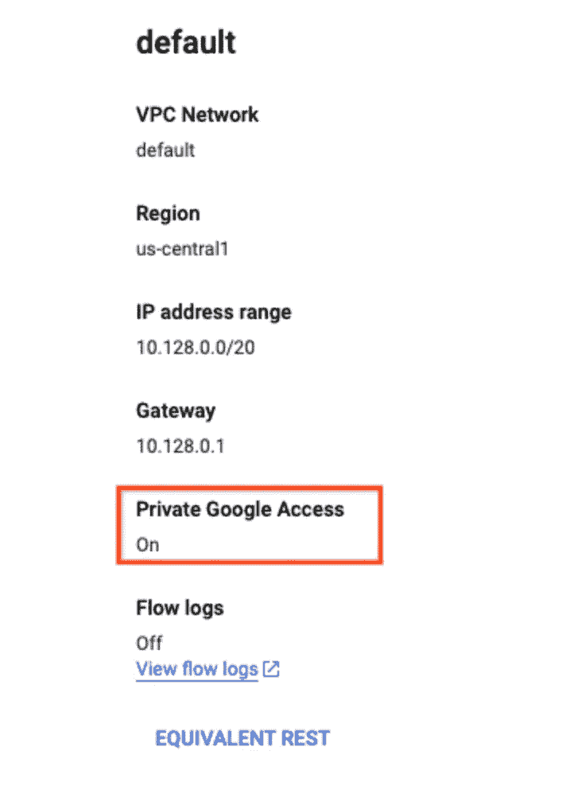

# 使用 Dataproc Serverless 将配置单元数据迁移到 Bigquery

> 原文：<https://medium.com/google-cloud/using-dataproc-serverless-to-migrate-your-hive-data-to-bigquery-8e2d4fcd1c24?source=collection_archive---------3----------------------->

我们可以使用 Dataproc Serverless 来运行 Spark batch 工作负载，而无需配置和管理我们自己的集群。我们可以指定工作负载参数，然后将工作负载提交给 Dataproc 无服务器服务。

[*Dataproc 无服务器*](https://cloud.google.com/dataproc-serverless/docs) *帮助用户完成整个基础设施管理工作—执行他们的*[*Apache Spark*](http://spark.apache.org/)*工作负载用户是* ***而不是*** ***需要*** *先创建一个集群才能执行任何操作。用户只需根据自己的使用情况选择一个模板，只需点击几下鼠标和几个命令，即可完成各自的工作。*


使用 Dataproc 无服务器从 Hive 到 Bigquery 的迁移

## 目标

这篇博客文章将分享关于如何使用“[Hive to big query](https://github.com/GoogleCloudPlatform/dataproc-templates/tree/main/java/src/main/java/com/google/cloud/dataproc/templates/hive)data proc 无服务器模板”进行数据迁移的完整细节。该模板将从 Apache Hive 表中读取数据，并将其写入 BigQuery 表。

## 设置您的 GCP 项目和基础设施

1.  登录到您的 GCP 项目并启用 Dataproc API(如果它被禁用的话)
2.  确保子网启用了私有 Google 访问，如果您要使用 GCP 生成的“默认”VPC 网络，那么也必须启用私有访问，如下所示:



```
gcloud compute networks subnets update default --region=us-central1 --enable-private-ip-google-access
```

3.为 jar 文件创建一个 GCS 存储桶和暂存位置。

```
export GCS_STAGING_BUCKET="my-gcs-staging-bucket"
gsutil mb gs://$GCS_STAGING_BUCKET
```

4.要配置 Dataproc 无服务器作业，您需要导出以下变量

`GCP_PROJECT`:运行 Dataproc 无服务器的 GCP 项目 id。

`REGION`:运行 Dataproc 无服务器的区域。

`GCS_STAGING_LOCATION` : GCS 暂存桶位置，Dataproc 将在此存储暂存资产(参见步骤 3)。

## 执行 Dataproc 模板的步骤

1.  克隆 Dataproc 模板库并导航到 Java 模板文件夹。

```
git clone https://github.com/GoogleCloudPlatform/dataproc-templates.git
cd dataproc-templates/java
```

2.获取身份验证凭据(以提交作业)。

```
gcloud auth application-default login
```

3.通过导出提交所需的变量来配置 Dataproc 无服务器作业(如*“设置您的 GCP 项目&”*中的步骤 4 所述)。

```
export GCP_PROJECT=<project_id> # your Google Cloud project
export REGION=<region> # your region for ex: us-central1
export JARS="gs://spark-lib/bigquery/spark-bigquery-latest_2.12.jar" # JAR dependencies
export SUBNET=<subnet> # optional if you are using default
# export GCS_STAGING_LOCATION=<gcs-staging-bucket-folder> # already done at step 3(Under Setup GCP Project & Infra)
```

4.执行以下命令:-

```
GCP_PROJECT=<gcp-project-id> \
REGION=<region>  \
SUBNET=<subnet>   \
GCS_STAGING_LOCATION=<gcs-staging-bucket-folder> \
HISTORY_SERVER_CLUSTER=<history-server> \
bin/start.sh \
--properties=spark.hadoop.hive.metastore.uris=thrift://<hostname-or-ip>:9083 \
-- --template HIVETOBIGQUERY \
--templateProperty hivetobq.bigquery.location=<required_bigquery destination> \
--templateProperty hivetobq.sql=<hive_sql> \
--templateProperty hivetobq.write.mode=<Append|Overwrite|ErrorIfExists|Ignore> \ 
--templateProperty hivetobq.temp.gcs.bucket=<gcs_bucket_path>
```

*注意:请用双引号将 SQL 查询括起来。对于 ex:*

```
--templateProperty  hivetobq.sql="select * from dbname.tablename"
```

*此外，还有两个可选属性以及“Hive to BigQuery”模板。请在下面找到他们的详细信息:-*

```
--templateProperty hivetobq.temp.table='temporary_view_name' 
--templateProperty hivetobq.temp.query='select * from global_temp.temporary_view_name'
```

这些属性负责在将数据加载到 BigQuery 之前应用一些 spark sql 转换。我们唯一需要记住的是，Spark 临时视图的名称和查询中的表名应该完全匹配。否则，将会出现如下错误:-"找不到表或视图:"

*除了以上，以防万一你需要* [*指定 Dataproc Serverless 支持的 spark 属性*](https://cloud.google.com/dataproc-serverless/docs/concepts/properties) *例如:调整驱动、内核、执行器等的数量——你可以编辑 start.sh 文件中的 OPT_PROPERTIES 值。*

5.监控 Spark 批处理作业

提交作业后，我们将能够在 [Dataproc 批处理 UI](https://console.cloud.google.com/dataproc/batches) 中看到它。从那里，我们可以查看作业的指标和日志。

## 参考

*   [Dataproc 无服务器](https://cloud.google.com/dataproc-serverless/docs/overview)
*   [Dataproc 模板库](https://github.com/GoogleCloudPlatform/dataproc-templates)

如有任何疑问/建议，请联系:dataproc-templates-support-external@googlegroups.com