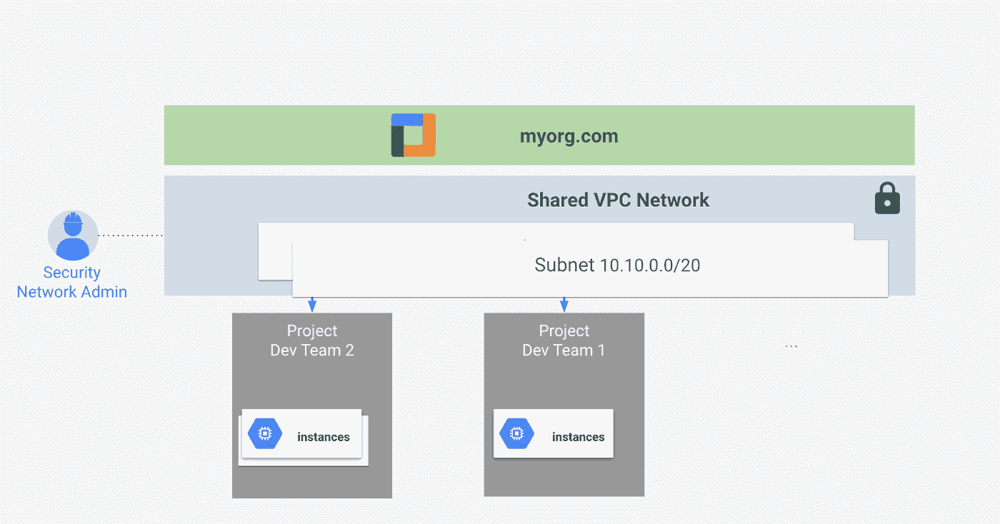

# 使用部署管理器自动创建 GCP 的共享 VPC

> 原文：<https://medium.com/google-cloud/using-deployment-manager-to-automate-the-creation-of-gcps-shared-vpc-1339e78d2545?source=collection_archive---------0----------------------->

GCP 有一个非常好的网络方式，我非常喜欢的一个功能是共享 VPC 的。共享 VPC 允许你创建一个相关项目可以使用的 VPC 网络。下图形象化了这个概念。



创建共享的 VPC 包括许多步骤，如这里的[文档所述。虽然一步一步地浏览所有内容是理解所有概念的好方法，但是当您开始构建 GCP 环境时，自动化创建是部署您的环境的万无一失的方法，因此您只需运行一两个 gcloud 命令。](https://cloud.google.com/compute/docs/shared-vpc/provisioning-shared-vpc)

GCP 的博客文章很好地介绍了[部署管理器项目创建模板](https://cloudplatform.googleblog.com/2017/04/automating-project-creation-with-Google-Cloud-Deployment-Manager.html)，在这篇文章中，我们将解释如何扩展它们，以便创建可重复的、一致的共享 VPC 环境。

您需要遵循的步骤是:

1.  使用 DM 项目创建模板可以

a.创建目标 VPC 主机和服务项目

b.启用所需的 API

c.向身份授予权限

2.创建一个模板，使项目成为 VPC 主机和服务项目

3.使用新创建的模板将项目启用为支持共享 VPC 的主机和服务项目。

# 使用部署管理器创建共享的 VPC 和服务项目

# 第一步:

这在[部署管理器项目创建模板](https://cloudplatform.googleblog.com/2017/04/automating-project-creation-with-Google-Cloud-Deployment-Manager.html)的帖子中有详细介绍。

使用模板创建宿主和服务项目，这些项目在本演练中被标识为:

主机共享 VPC 项目:my-xpn-host-myID

服务项目:service-xpn-myID

*注意:在我的例子中，myID 代表一个惟一的标识符，它被标记在一个更具描述性的项目名称上，以创建一个惟一的项目名称。您可以使用一个日期加上一些递增的数字来创建唯一的项目名称。*

在创建每个项目之前，需要对每个项目的项目创建配置 YAML 文件进行一些添加

*注意:如果您愿意，您可以将两个项目的配置细节保存在一个配置中。YAML 文件*

对于共享的 vpc 主机项目 yaml (my-xpn-host-myID)

确定要为其分配适当角色的成员，并在配置的 iam-policy 资源部分授予他们以下角色。YAML 文件:

*   roles/compute . xpn admin-这是负责管理 VPC 的身份
*   roles/compute.networkUser —这些是服务项目的成员，有权使用主机项目中所有现有和未来的子网

如果您希望限制服务项目可以利用的子网，则需要在子网级别设置权限

*注:会员是指用户或服务账户*

按照[自述文件](https://github.com/GoogleCloudPlatform/deploymentmanager-samples/tree/master/examples/v2/project_creation)中的描述创建项目。请特别注意设置允许部署管理器创建项目的权限所需的步骤。除了所描述的权限之外，您还需要将 roles/compute.xpnAdmin 授予在[自述文件](https://github.com/GoogleCloudPlatform/deploymentmanager-samples/tree/master/examples/v2/project_creation)中标识的服务帐户

# 第二步:

创建配置。定义您的 VPC 主机项目和服务项目的 YAML 文件

在下面的例子中，我们定义了两个资源

```
resources:- name: my-xpn-hosttype: compute.beta.xpnHostproperties:organization-id: “123456789”# organization’s billing accountbilling-account-name: billingAccounts/01234A-56789B-012345Cproject: my-xpn-host-myID- name: my-resourcetype: compute.beta.xpnResourceproperties:organization-id: “123456789”# organization’s billing accountbilling-account-name: billingAccounts/01234A-56789B-012345Cproject: my-xpn-host-myIDxpnResource:id: service-xpn-myIDtype: PROJECTmetadata:dependsOn:- my-xpn-host
```

VPC 主机项目由具有计算βxpn host 类型的名称 my-xpn-host 标识，而服务项目由具有计算βxpn resource 类型的名称 my-resource 标识。

# 第三步:

在我的示例中，要使用 gcloud 命令部署配置，该命令如下所示。

```
*gcloud deployment-manager deployments create xpn-project-assignments — config sharedvpc.yaml*
```

这将创建一个名为 *xpn-project-assignments* 的部署，将项目 my-xpn-host-myID 指定为共享的 VPC 主机项目，将项目 service-xpn-myID 指定为服务项目。

# 第四步:

最后一步是确保您共享的 VPC 主机项目不会被意外删除。

通过创建一个共享的 VPC 主机项目，将自动对该项目加锁(留置权)。默认情况下，宿主项目所有者可以删除此留置权，除非创建了组织级别的策略来阻止它。按照[保护共享的 VPC 主机项目不被删除](https://cloud.google.com/compute/docs/shared-vpc/provisioning-shared-vpc#protectsharedvpc)文档中详述的步骤，添加组织级策略，并针对主机 VPC 项目的意外删除提供更高级别的保险。

默认情况下，项目是用默认的自动模式 VPC 网络创建的。默认的自动模式 VPC 网络在每个区域都有一个子网，每个子网都有一个[预定义的 IP 范围](https://cloud.google.com/compute/docs/vpc/#ip-ranges)。在本演示中，默认设置是没问题的。

主机项目中的所有子网都与服务项目共享。在主机项目级别被授予 compute.networkUser 角色的任何身份都可以在主机项目的任何子网中启动实例。要限制特定子网，请在[子网级别](https://cloud.google.com/compute/docs/shared-vpc/provisioning-shared-vpc#networkuseratsubnet)授予 compute.networkUser 角色