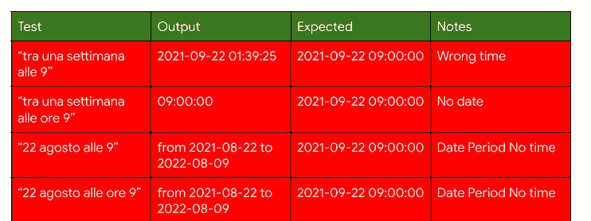
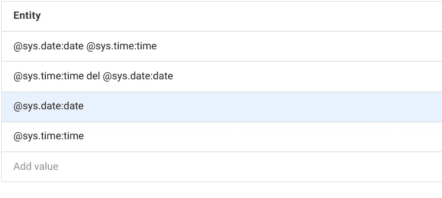
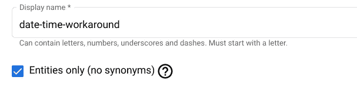
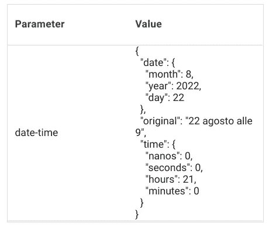
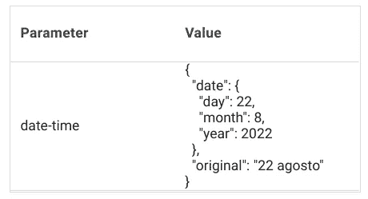

# 使用 Dialogflow CX 组合实体解决系统实体限制

> 原文：<https://medium.com/google-cloud/using-dialogflow-cx-composite-entities-to-work-around-system-entities-limitations-c6385df12f2b?source=collection_archive---------5----------------------->

Dialogflow CX 提供了许多系统实体*来从最终用户表达式中提取通用类型。对于大多数用例，系统实体提供的值工作良好，但是支持因语言和地区而异。某些系统实体类型在非美国和非全球地区尚不可用，而当前可用的其他系统实体类型对特定语言(如意大利语)有一些限制。这篇文章描述了如何将系统实体组合成定制的复合实体来克服其中的一些限制。*

让我们开始吧！


由 [Ashkan Forouzani](https://unsplash.com/@ashkfor121?utm_source=unsplash&utm_medium=referral&utm_content=creditCopyText) 在 [Unsplash](https://unsplash.com/s/photos/puzzle-pieces?utm_source=unsplash&utm_medium=referral&utm_content=creditCopyText) 上拍摄

前一段时间，我的一个客户发现了在意大利语中使用 **@sys.date-time** 的一个奇怪之处。我将在下面提供一些例子，如果你不会说意大利语，这是一个开始学习的好机会；-)



该表显示，像*“一周内上午 9 点”*或*“8 月 22 日上午 9 点”*这样的用户输入没有被正确解析。在第一种情况下，日期是正确的，但时间是错误的。在第二封信里，日期不见了。在第三和第四种情况下，系统实体将日期解析为日期周期，它与时间不匹配。

这些问题在西欧 1 以外的全球地区也会出现，当 NLU 团队测试所有案例时，他们发现输出的分数并不理想。更具体地说:

1.  *" tra una settimana alle 9 "-*输出既有今天上午 9 点/下午 9 点的日期时间点(正确)，也有日期时间标注“一周后”(错误)的标注，但后者得分更高。
2.  *“22 agosto all ore 9”-*同样，输出既有日期时间点 8 月 22 日上午 9 点(正确)，也有句点(错误)注释，但后者得分更高。

我发现解决这些问题的一个可能的方法是使用 **@sys.date** 和 **@sys.time** 的自定义复合实体。

[*复合实体*](https://cloud.google.com/dialogflow/cx/docs/concept/entity-options#comp) 是一种特殊的列表实体。列表实体的实体条目通常包含简单的单词或短语，但它们也可能包含其他实体类型。当一个实体类型在另一个实体类型中被引用时，该引用被称为*别名*。当列表实体包含其他实体类型的别名时，它被称为复合实体。

为了从用户输入中解析日期和时间，我们需要创建一个定制的复合实体，该实体包含以下实体条目，并且没有同义词:



复合实体条目



记得选中这个框

在复合实体中，对另一个实体类型(如@sys.date 和@sys.time)的引用称为*别名。*创建别名时，您需要提供被引用实体类型的名称和您选择的属性名称。您也可以在实体条目中使用多个实体别名。这正是我们在这里所做的。我们的自定义实体类型在一个条目中包含了系统实体类型`@sys.date`和系统实体类型`@sys.time`的别名。输入别名的格式为:

```
@entity-name:property-name
```

当在运行时匹配复合实体时，提取的值作为 JSON 对象返回，别名属性名用作 JSON 属性名。如果最终用户输入包含日期和时间，如" *22 agosto alle 9* "提取的值将作为 JSON 对象返回，如下所示:



运行时匹配的日期时间参数(日期和时间)

我想让你注意复合实体的第二个条目。

```
[@](http://twitter.com/sys)sys.time:time del [@](http://twitter.com/sys)sys.date:date
```

"***del***"(*of*)是日期之前的介词，它允许实体在时间和日期按此顺序传递时匹配它们。复合实体中使用的单词或短语非常强大。例如，考虑一个机票预订代理和下面的最终用户输入“*我需要预订一张从墨尔本到悉尼的机票*”。墨尔本和悉尼是位置，因此系统 entity @sys.location 可以提取它们，但是我们如何区分出发城市和目的地呢？这就是为什么我们需要在复合实体条目中包含介词“from”和“to”。

```
from [@](http://twitter.com/sys)sys.location:departure to [@](http://twitter.com/sys)sys.location:destination
```

回到日期和时间，您会注意到我还添加了@sys.date:date 和@sys.time:time 作为两个单独的条目。这允许复合实体匹配只包含日期或时间部分的最终用户输入。如果输入包含一个 *"22 agosto"* 部分，则匹配`date`实体类型，提取的值返回如下:



运行时匹配的日期时间参数(仅限日期)

为什么？根据合作原则，有效的交流依赖于会话参与者之间潜在的合作。研究表明，人们对技术的反应就像对另一个人的反应一样。我们的最终用户有可能只提供日期或时间，在人与人的对话中，这条信息肯定会被收集。一个人类助手会跟进问*“什么时间？”*如果只提供日期或*“星期几？”*如果时间允许。这正是我期望虚拟代理与用户交互的方式。

万岁，我们都准备好了！不是吗？不是杰特。:-)在意大利语中*“22 Agosto alle ore 9”*的意思是*“8 月 22 日上午 9 点”*，因为我们采用了 24 小时制。我说过，如果我在下午 4 点给一个朋友发信息，让她知道我们将在下午 6 点见面，我会写类似“vediamoci alle 6”而不是“vediamoci alle 18”。她知道我们会在两个小时内赶上，而不是明天早上 6 点，因为她有上下文。这里的上下文是我们想在晚餐而不是早餐时见面；-)

对话流 CX 的在线文档声明“`If there is ambiguity in end-user input due to missing date/time elements, the nearest matching future date/time is returned.`”。在复合实体中使用系统实体@sys.date 和@sys.time 而不是系统实体@sys.date-time 的缺点是，我们需要编写一些定制的业务逻辑来根据上下文区分用户实际上是指上午 9 点还是晚上 9 点。或者，匹配的时间将取决于当前时间，因为 Dialogflow 选择未来与给定输入匹配的最接近的时间。

总之，Dialogflow CX 复合实体提供了强大的数据匹配功能。事实上，许多系统实体都是复合实体。它们还可以用于克服系统实体的一些当前限制，以便从最终用户表达式中提取通用类型，因为系统实体支持因语言和地区而异。