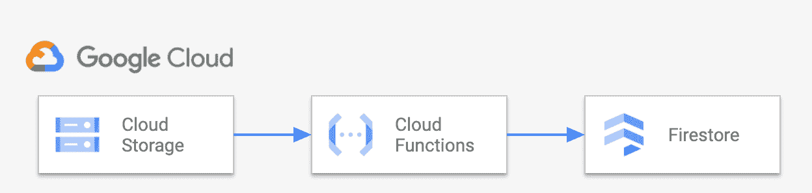
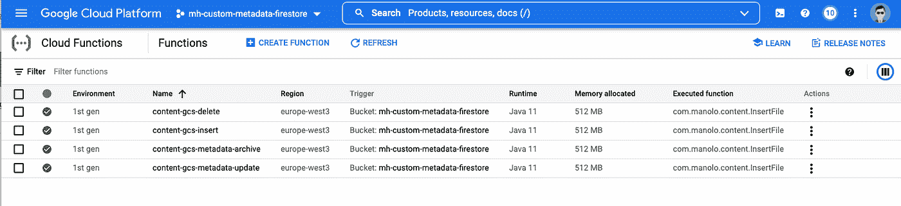

# 使用 Firestore 数据库访问您的云存储元数据

> 原文：<https://medium.com/google-cloud/using-firestore-database-to-access-your-cloud-storage-metadata-c4d1886e8885?source=collection_archive---------2----------------------->

云存储对象有关联的元数据，这些元数据保存对象的键值对。元数据有两种类型。固定键元数据，如*内容类型*、*内容编码*和[更多](https://cloud.google.com/storage/docs/metadata#mutable)。我们可以设置它的值，比如" *Content-Type=image/jpeg"*

但是我们也可以使用 [**自定义元数据**](https://cloud.google.com/storage/docs/metadata#custom-metadata) 。使用自定义元数据，我们可以设置自己的键值对。例如，如果我们正在处理像图像这样的媒体内容，我们可以定义像"*类别=运动"*或"*类别=动物*"这样的元数据。如果我们处理发票，也许我们可以使用像“*发票标识*”、“*客户标识*”或“*账单周期*”这样的元数据。

我们可以通过控制台、命令行、REST APIs 或代码来访问我们的对象元数据。这样，我们可以看到特定对象的元数据。但是，如果我们希望看到所有具有元数据值的文档，该怎么办呢？例如，给我某个客户 id 的所有发票？

这就是数据库发挥作用的地方。在这篇博客中，我们将看到 Firestore 是如何很好地适合访问和查询我们的自定义元数据。

## 为什么选择 Firestore？

Firestore 是一个全面管理的、可扩展的、无服务器的文档数据库。对于这个用例，它的一些特性非常有用:

*   **无模式**。我们不知道将使用什么元数据结构。如果需要，我们需要为对象添加新的属性，或者为不同的文档添加不同的值。
*   **轻松查询**。默认情况下，Firestore 具有自动索引功能，因此可以确保良好的性能。
*   **无服务器全托管**。我们不想在管理、调整和扩展上花费时间和精力。
*   无缝**谷歌云谷歌云服务集成**。我们不仅会使用 Firestore，还会使用云存储、云功能和数据库访问服务，如 Cloud Run 或 GKE。
*   **性价比**。Firestore 有一个慷慨的[免费层](https://cloud.google.com/firestore/pricing)可用，这足以让我们从开发环境的定制元数据数据库开始。

## 它是如何工作的？

我们不仅要注意接收新文档，还要保持同步，因此当文档被修改时还要更新自定义元数据值，或者当对象从云存储中删除时从 Firestore 中删除文档。

以下视频展示了该解决方案的实际应用。

## 体系结构

我们将使用这些谷歌云组件:



*   **云存储**。我们将使用一个存储桶作为对象的存储库。这些对象将在 Firestore 中保存它们的自定义元数据
*   **云功能**。我们将触发云功能来更新 Firestore 的云存储事件，因此每次添加、删除、修改或归档对象时，我们都会与 Firestore 同步。
*   **Firestore** 。用于保存和查询对象的自定义元数据值的数据库。

## 解决方案部署

完整的解决方案代码可以在[这个库](https://github.com/mahurtado/StorageCustomMetadataFirestore)中找到。

我们将使用云外壳来部署解决方案。首先，我们将设置一些环境变量:

```
REGION=europe-west3
BUCKET_NAME=`gcloud config list — format ‘value(core.project)’`
COLLECTION=content
```

在此示例中，我们将在区域 *europe-west3* 上进行部署，并将使用“ *content* ”作为 Firestore 中的集合名称。我们将创建一个与项目同名的存储桶。对所有这些都使用你自己的价值观。

接下来，在本机模式下创建 Firestore 数据库。如果出现提示，接受启用 API*appengine.googleapis.com*。

```
gcloud app create — region=$REGION
gcloud firestore databases create — region=$REGION
```

在同一地区创建一个云存储桶:

```
gsutil mb -l $REGION gs://$BUCKET_NAME
```

现在我们将从[这个](https://github.com/mahurtado/StorageCustomMetadataFirestore)回购的代码中创建云函数。首先，下载代码并构建:

```
git clone [https://github.com/mahurtado/StorageCustomMetadataFirestore](https://github.com/mahurtado/StorageCustomMetadataFirestore)
cd StorageCustomMetadataFirestore/CustomMetadataFirestoreCF
mvn package
```

下一步是部署云功能。请注意，我们将为每个事件部署一个函数:

*   **对象完成**(Google . storage . Object . Finalize)。在桶中创建新对象时发送。
*   **对象删除**(Google . storage . Object . Delete)。删除对象时发送。
*   **对象存档**(Google . storage . Object . Archive)。当对象的实时版本被存档或删除时发送。
*   **对象元数据更新**(Google . storage . Object . Metadata Update)当现有对象的元数据发生变化时发送。

```
gcloud services enable cloudbuild.googleapis.com

gcloud functions deploy content-gcs-insert \
 — set-env-vars COLLECTION=$COLLECTION \
 — region $REGION \
 — entry-point com.manolo.content.InsertFile \
 — runtime java11 \
 — memory 512MB \
 — trigger-resource $GOOGLE_CLOUD_PROJECT \
 — trigger-event google.storage.object.finalize \
 — source=target/deployment

gcloud functions deploy content-gcs-delete \
 — set-env-vars COLLECTION=$COLLECTION \
 — region $REGION \
 — entry-point com.manolo.content.InsertFile \
 — runtime java11 \
 — memory 512MB \
 — trigger-resource $GOOGLE_CLOUD_PROJECT \
 — trigger-event google.storage.object.delete \
 — source=target/deployment

gcloud functions deploy content-gcs-metadata-update \
 — set-env-vars COLLECTION=$COLLECTION \
 — region $REGION \
 — entry-point com.manolo.content.InsertFile \
 — runtime java11 \
 — memory 512MB \
 — trigger-resource $GOOGLE_CLOUD_PROJECT \
 — trigger-event google.storage.object.metadataUpdate \
 — source=target/deployment

gcloud functions deploy content-gcs-metadata-archive \
 — set-env-vars COLLECTION=$COLLECTION \
 — region $REGION \
 — entry-point com.manolo.content.InsertFile \
 — runtime java11 \
 — memory 512MB \
 — trigger-resource $GOOGLE_CLOUD_PROJECT \
 — trigger-event google.storage.object.archive \
 — source=target/deployment
```

在运行我们的功能之前，我们需要让他们访问 Firestore 和云存储:

```
gcloud projects add-iam-policy-binding ${GOOGLE_CLOUD_PROJECT} \ --member=serviceAccount:${[@appspot](mailto:GOOGLE_CLOUD_PROJECT}<a href=).gserviceaccount.com”>GOOGLE_CLOUD_PROJECT}[@appspot](http://twitter.com/appspot).gserviceaccount.com \
 --role=roles/storage.objectAdmin

gcloud projects add-iam-policy-binding ${GOOGLE_CLOUD_PROJECT} \ --member=serviceAccount:${[@appspot](mailto:GOOGLE_CLOUD_PROJECT}<a href=).gserviceaccount.com”>GOOGLE_CLOUD_PROJECT}[@appspot](http://twitter.com/appspot).gserviceaccount.com \
 --role=roles/datastore.user
```

作为检查点，在云控制台> IAM 中搜索:查找服务帐户[ *您的项目 name]@appspot.gserviceaccount.com*。它应该是这样的:


您还可以看到部署的云功能:



## 测试

至此，解决方案已经就绪。上传到您的存储桶的任何对象都将启动云功能，并将您的自定义元数据保存在 Firestore 中。

您可以使用控制台上传文件，如视频所示，或者使用命令行。使用自定义元数据关键字“ *key1* ”和值“ *value1* ”创建对象的示例如下所示:

```
gsutil -h “x-goog-meta-key1:value1” cp [path_to_your_file] gs://$GOOGLE_CLOUD_PROJECT
```

使用控制台访问 Firestore 并查看您的元数据！

## 看一看代码

最后，让我们看看用于云功能的 Java 代码(完整源代码[在这里](https://github.com/mahurtado/StorageCustomMetadataFirestore/blob/main/CustomMetadataFirestoreCF/src/main/java/com/manolo/content/InsertFile.java))。接收事件时要运行的代码是方法" *accept* "

在本例中，我们将对所有事件使用相同的代码，并将根据事件类型确定要执行的方法。注意我们是如何为对象创建和对象更新调用*dofinalize*方法的。

注意 **logEvent** 调用，它将为每个事件保存一个日志跟踪。考虑将其注释为大吞吐量场景。

同样，我们为对象删除和归档调用方法 *doDelete* 。

当创建或修改对象时，执行以下代码:

我们首先用自定义元数据构造一个文档，并将其写入 Firestore。更新的管理方式与插入相同。

作为文档密钥，我们使用完整的对象云存储名称，但我们必须用不同的名称来更改**路径分隔符**，比如“::”，因为 Firestore 不支持将其作为文档密钥的一部分。

下一段代码显示了如何管理文档删除:

## 关于无序处理

存储事件建立在发布/订阅消息的基础上。这意味着至少一次交付，因此我们必须处理给定事件执行多次的机会，如[公共文档](https://cloud.google.com/functions/docs/calling/storage#event_types)中所述。

为了管理这一点，我们实现了[条件写入](https://cloud.google.com/firestore/docs/samples/firestore-transaction-document-update-conditional)，使用**_ 更新的**字段来避免重复和无序写入。

## 结论

借助该解决方案，我们可以访问云存储对象的自定义元数据，包括使用 Firestore 功能的直接访问或复杂查询。