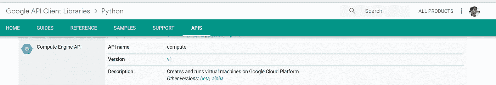

# 通过 Google 计算引擎使用 gcloud 和 Python 客户端库

> 原文：<https://medium.com/google-cloud/using-gcloud-and-python-client-library-with-google-compute-engine-eaf1b19d8099?source=collection_archive---------0----------------------->

在我之前的帖子([使用 gcloud 获取你需要的 Google 云平台数据](/google-cloud/using-gcloud-to-get-google-cloud-platform-data-you-need-c4985b416278))中，我们讨论了如何使用 gcloud 本身和 bash 脚本来获取你需要的 Google 云平台数据。尽管这在你想快速完成工作时很有用，但使用更高级的语言，比如 Python，会给你带来更大的灵活性、功能性和开发维护的便利性。在这篇文章中，我以两种方式使用 Python。首先是在 Python 脚本中使用 gcloud，其次是使用 Google 提供的 Python 客户端库。这篇文章中的所有例子和更多例子都可以在 https://github.com/shashyajoshi/code-samples 的**找到**

## **示例 1:使用 gcloud & Python 获取实例标签和元数据**

**在之前的[文章](/google-cloud/using-gcloud-to-get-google-cloud-platform-data-you-need-c4985b416278)中，我们看到了如何通过 bash 脚本使用 gcloud 来获取实例标签和元数据。以下是使用 gcloud 和 Python 来获取实例标签和元数据的方法:**

*   **使用子进程模块执行 gcloud 命令(可以使用 shlex 将 gcloud 命令转换为子进程模块要求的格式)**
*   **在变量中获取 gcloud 返回的 JSON 格式的数据**
*   **如你所愿处理数据**

**流程是这样的:**

*   **获取所有项目的列表**
*   **使用单个项目 id 来获取实例列表和其他详细信息**
*   **使用 JSON 结构解析必需的字段(例如，`instance_row[“name”], instance_row[“labels”][“app-name”]`等等)。实例元数据是一个嵌套字段，因此需要进一步处理)**
*   **在我的例子中，我获取了所有的数据，并将其添加到一个列表中，以便稍后打印到 stdout。**

**完整的示例脚本如下:
[**code-samples/g cloud-python/get _ instance _ data _ g cloud . py**](https://github.com/shashyajoshi/code-samples/blob/master/gcloud-python/get_instance_data_gcloud.py)**

## **示例 2:使用 Python 客户端库获取实例标签和元数据**

**与使用 gcloud 相比，在使用 Python 客户端库时，您将意识到的关键问题是，gcloud 会为您做很多繁重的工作。所以当你使用客户端库时，你有更多的事情要考虑和自己做。以下是我使用 Python 客户端库的方法:**

*   **使用应用程序默认凭据**
*   **执行一组 API 调用来获取数据**
*   **根据需要处理 JSON 格式的输出**

**流程如下:**

*   **使用`[Cloud Billing API . billingAccounts . list](https://developers.google.com/resources/api-libraries/documentation/cloudbilling/v1/python/latest/cloudbilling_v1.billingAccounts.html#list)`获得账单账户(为了使用 API 获得项目列表，您需要首先获得账单 ID)。如果您知道帐单帐户，您可以跳过这一步，将其作为命令行参数传递。**
*   **使用`[Cloud Billing API . billingAccounts . projects . list](https://developers.google.com/resources/api-libraries/documentation/cloudbilling/v1/python/latest/cloudbilling_v1.billingAccounts.projects.html#list)`获取账单 ID 的所有项目列表**
*   **为了获得每个项目的实例数据，首先需要使用`[Compute Engine API . zones . list](https://developers.google.com/resources/api-libraries/documentation/compute/v1/python/latest/compute_v1.zones.html#list)`获得*区域***
*   **使用`[Compute Engine API . instances . list](https://developers.google.com/resources/api-libraries/documentation/compute/v1/python/latest/compute_v1.instances.html#list)`获取每个区域的实例细节**
*   **对于每个包含实例的区域，使用 JSON 结构解析必需的字段(例如，`instance_row[“name”], instance_row[“labels”][“app-name”]`等等)。实例元数据是一个嵌套字段，因此需要进一步处理)**
*   **在我的例子中，我获取了所有的数据，并将其添加到一个列表中，以便打印到 stdout**

**完整的示例脚本如下:
[**code-samples/python-client-library/get _ instance _ data _ API . py**](https://github.com/shashyajoshi/code-samples/blob/master/python-client-library/get_instance_data_api.py)输出与上面的示例 1 完全相同。**

# **将所学应用到其他用例中**

**现在有了这些知识，您可以自动化不同的操作。您可以采用的方法如下:**

*   **研究您的用例所需的 [gcloud 文档](https://cloud.google.com/sdk/gcloud/reference/)或 [API 文档](https://developers.google.com/api-client-library/python/apis/)**
*   **首先了解先决条件/必填字段并对其进行研究**
*   **理解输出结构，以便根据需要处理输出**

**让我们再看几个例子:**

## **示例 3:基于标签值的启动/停止实例**

**您可能希望基于标签启动和停止一组实例。您可能有一堆开发环境，希望在每个工作日结束时或长周末前关闭。流程类似于前面的示例:**

*   **获取项目列表**
*   **获取实例列表，并检查标签键/值是否与所需值匹配**
*   **如果匹配，对实例执行操作(启动或停止)(实例操作命令也需要实例区域，因此您需要从实例数据输出中捕获它)**

**完整的示例脚本可在此处获得:
[**code-samples/g cloud-python/start _ stop _ instances _ labels _ g cloud . py**](https://github.com/shashyajoshi/code-samples/blob/master/gcloud-python/start_stop_instances_labels_gcloud.py)
下面给出了`label_key=”env-name”`、`label_value=”non-prod”`和`instance_action= stop`的示例脚本输出**

## **示例 4:根据标签删除未连接的磁盘**

**在上一篇文章中，您看到了如何找出孤立或未连接的磁盘。与实例类似，您可以向永久磁盘添加标签。例如，您可以为重要磁盘添加删除保护标签。**

**该流程类似于前面的示例:**

*   **获取项目列表**
*   **获取磁盘列表，并检查它是否连接到任何实例**
*   **如果不匹配，请检查标签键/值是否与所需值匹配**
*   **如果匹配，在磁盘上执行操作(删除)(磁盘操作命令也需要磁盘区域，因此您需要从磁盘数据输出中捕获它)**

**完整的示例脚本如下:
[**code-samples/g cloud-python/delete _ unattached _ disks _ g cloud . py**](https://github.com/shashyajoshi/code-samples/blob/master/gcloud-python/delete_unattached_disks_gcloud.py)
下面给出了`label_key=”delete-protect”`和`label_value=”no”`的脚本输出示例**

## **免责声明和其他要点**

*   **这里的例子可能无法在您的环境中正常工作。例如，此处使用的标签关键字和值应根据您的标签策略进行更改。我的建议是先阅读和理解代码，然后修改它以适应您的环境。**
*   **完整性—提供示例脚本作为使用 gcloud 和 Python 客户端库的示例。它们本身绝不是完整的解决方案。**
*   **编码最佳实践—在实际部署中，您应该考虑编码最佳实践，例如，错误检查/处理、检查和等待操作完成的功能、记录/打印有意义的消息等。**

# **参考资料和进一步阅读**

**这些只是使用 gcloud 和 Python 客户端库从 Google 云平台获取数据或基于数据执行特定操作的许多可能方式中的几种。我希望这些例子能为你提供一个高层次的想法。有关更多详细信息，请参考以下链接:**

*   **[https://developers . Google . com/API-client-library/python/API/](https://developers.google.com/api-client-library/python/apis/)**
*   **【https://github.com/GoogleCloudPlatform/python-docs-samples 号**
*   **[https://cloud . Google . com/compute/docs/tutorials/python-guide](https://cloud.google.com/compute/docs/tutorials/python-guide)**
*   **[https://cloud.google.com/sdk/gcloud/reference/](https://cloud.google.com/sdk/gcloud/reference/)**

**请告诉我您的想法，以及如何在您的环境中使用 gcloud 和 Python 客户端库。**

**(声明:此处表达的观点为本人观点。信息按“原样”提供。)**