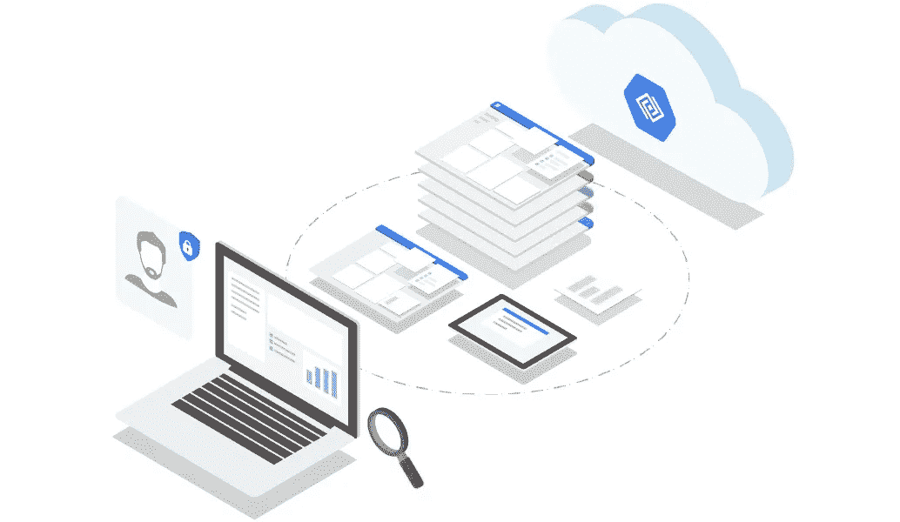
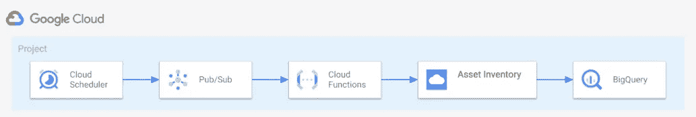
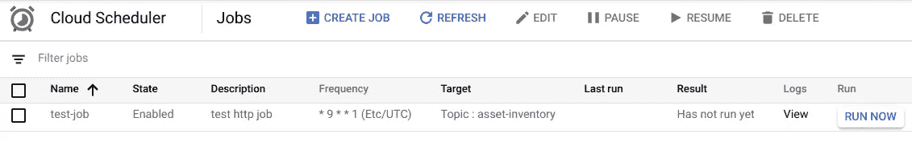
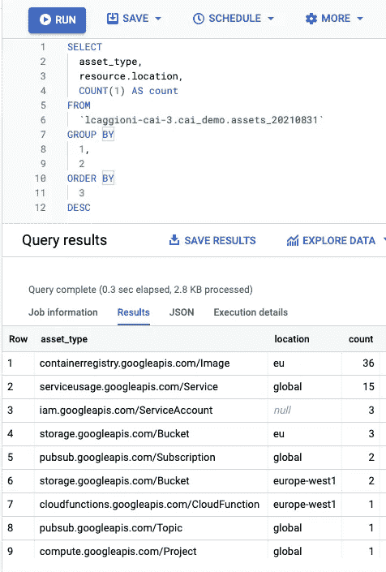

# 使用 GCP 云资产清单导出来随时跟踪您的 GCP 资源

> 原文：<https://medium.com/google-cloud/using-gcp-cloud-asset-inventory-export-to-keep-track-of-your-gcp-resources-over-time-20fb6fa63c68?source=collection_archive---------0----------------------->

谷歌[云资产清单](https://cloud.google.com/asset-inventory)是一项伟大的服务，允许您查看、监控和分析您的 GCP 资产，让您可以选择导出任何时间点(最多 35 天)的整个清单的快照。



云资产清点:在一个地方发现、监控和分析您的所有资产。

有时，您希望更长时间地跟踪您的资产，以便进行仪表盘操作或分析。下面显示的代码描述了一个每周将您的云资产清单导出到 BigQuery 的解决方案。

该示例旨在导出项目级别的资源。这样做是为了保持示例的简单和独立。在实际使用中，当然需要一些改变:

*   界定云功能的导出和 IAM 自定义角色/绑定的范围，以便在组织/文件夹级别导出数据；
*   调整函数的重试和错误处理；
*   将导出与您最喜欢的仪表板工具集成在一起。

这是示例代码将创建的资源的高级概述:



示例创建的架构:云调度器、发布/订阅、云功能、资产库存、BigQuery。

要运行这个例子，首先克隆[Google Foundation Fabric Repository](https://github.com/terraform-google-modules/cloud-foundation-fabric)并移动到[blue prints/cloud-operations/scheduled-asset-inventory-export-bq](https://github.com/GoogleCloudPlatform/cloud-foundation-fabric/tree/master/blueprints/cloud-operations/scheduled-asset-inventory-export-bq)blue prints 文件夹。

```
git clone https://github.com/terraform-google-modules/cloud-foundation-fabric.git
cd blueprints/cloud-foundation-fabric/cloud-operations/scheduled-asset-inventory-export-bq
```

在正确的文件夹中，创建一个`terraform.tfvars`文件，用您选择的文本编辑器打开它，并至少指定以下变量:

```
cai_config     = {
    bq_dataset = "cai"
    bq_table   = "assets"
}
project_id     = "YOUR_PROJECT"
billing_account = "111111-222222-333333"
root_node       = "folders/112233445566"
```

该脚本将部署现有项目中的所有资源，如果您想要创建一个新项目，请查看变量文件并相应地设置您的变量。

运行初始化 Terraform 并应用更改:

```
terraform init
terraform apply
```

Terraform 完成后，计划每周运行一次作业，提取数据并存储在 Bigquery 中。如果您想要运行测试，请打开云功能面板并点击`run now`按钮。



谷歌云调度控制台。

一旦任务结束，您将能够在 Bigquery 上检查数据:



查询导出到 Bigquery 的云资产清单数据的示例语句

# 后续步骤

将云资产清单数据导出到 BigQuery 后，您可以创建管道或仪表板来分析或监控您的 GCP 资产。