# 利用 GitLab 和云构建实现云运行的 CI/CD

> 原文：<https://medium.com/google-cloud/using-gitlab-and-cloud-build-to-achieve-ci-cd-for-cloud-run-4c6db26f04ed?source=collection_archive---------0----------------------->


一个客户找到我，说“我有这个 Python 代码，我想定期运行它，所以我想把它打包到 Cloud Run 中，并使用 Cloud Scheduler 来调用它。这个管用。然而，我不想每次修改程序源代码时都要手动重新构建容器映像。我们能否自动化这些任务以实现 CI/CD？”。

我知道它应该如何工作的理论，但没有机会在实践中使用它。在翻阅书籍并做了一点研究后，我发现它像广告上说的那样有效，但是有很多步骤。本文向我们展示了让它从头开始运行的活动。如果你愿意，你可以跟随或者观看文章结尾的视频。

整体架构如下:

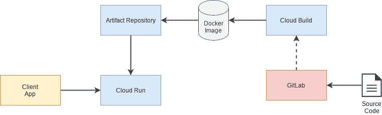

解释该图的方式是，当应用程序发出 REST 请求时，执行 Python 代码的是 Cloud Run。云运行需要一个 Docker 映像来执行，并将向工件存储库请求该映像。工件存储库随后将提供该图像。正是 Docker 映像将*实际上*包含用于执行的 Python 代码。现在让我们来看看 Docker 图像是从哪里来的。我们假设客户端使用 GitLab 作为源代码管理系统。一旦源文件发生变化，可以导出、编辑代码，然后提交回 GitLab 存储库。将更改推回到 GitLab 的行为可以用来触发云构建来完成它的部分。云构建是 CI/CD 故事的核心。它将从 Gitlab 中克隆最新的源代码，并从代码中生成一个新的 Docker 映像。云构建将导致新构建的映像存储在工件存储库中，并最终指示云运行开始使用新构建的映像。所有这些都将是自动化的，这意味着对代码进行更改的开发人员不需要了解导致代码被部署的过程。

在本文中，我们将:

*   创建一个 GCP 项目
*   启用一组 GCP API
*   创建工件注册库
*   创建云构建触发器
*   创建 SSH 密钥
*   创造 GCP 秘密经理的秘密
*   从云市场安装和配置 GitLab
*   将它们连接在一起并进行测试

现在…食谱…

1.  创建项目

我们需要一个在其中工作的 GCP 项目。在这个演示中，我们将假设一个全新的项目，并在这里创建一个。

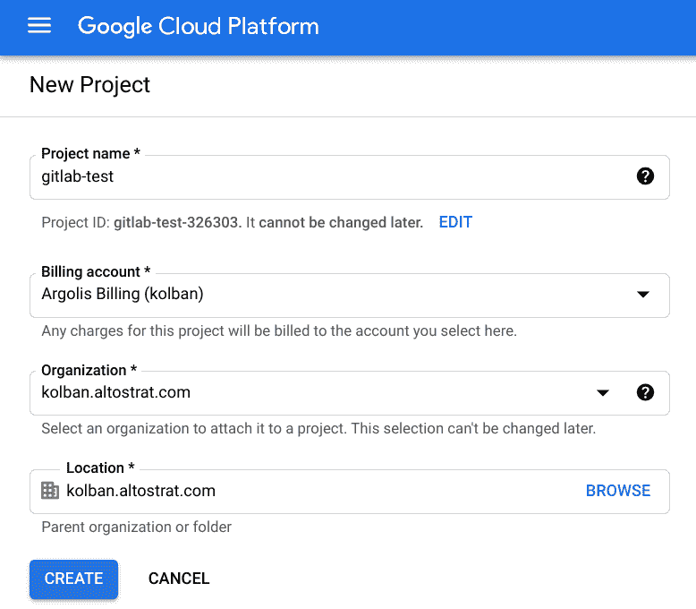

2.创造一个 VPC

遵循谷歌的最佳实践，我们不会假设使用默认的 VPC 网络，而是我们会为自己创建一个。首先，我们启用计算引擎 API:

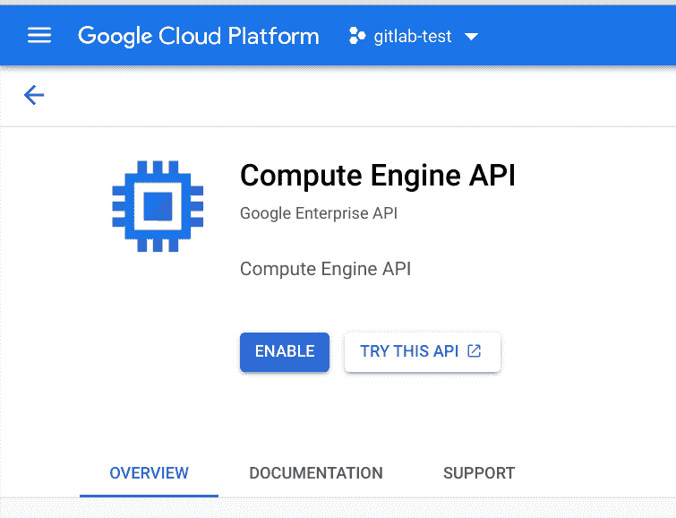

接下来我们创建一个 VPC，我们称之为`my-vpc`。我们在`us-central1`区域工作。

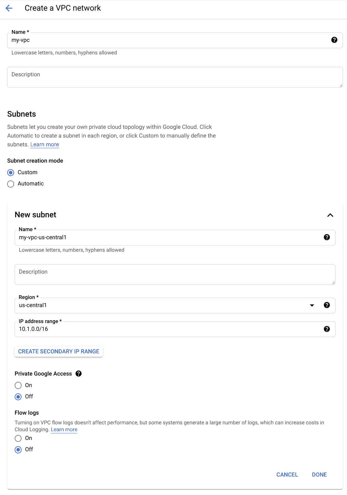

3.创建允许端口 22 (SSH)的防火墙规则

在本练习中，我们需要为新的 VPC 启用一个防火墙设置。这将允许使用 SSH 协议的入口(传入连接)。当我们安装 GitLab 时，我们将使用 SSH 协议与之交互。

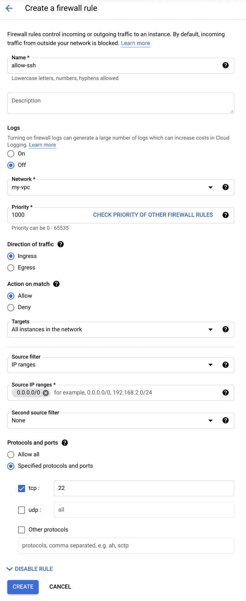

4.从 Bitnami 安装 GitLab CE

虽然我们可以假设客户端已经安装并配置了 GitLab，但在这个练习中，我们想要一个 GitLab 沙箱，可以用来测试代码更改和云构建执行之间的联系。GCP 市场让我们只需点击几下鼠标就可以安装一个完全配置好的 GitLab 社区版。

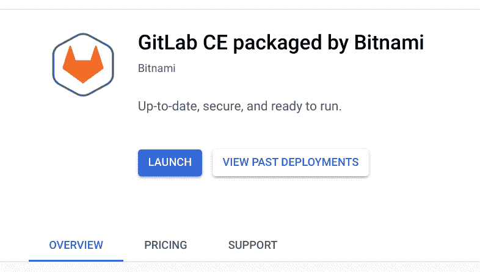

在安装过程中，我们会被要求启用一些 GCP API。

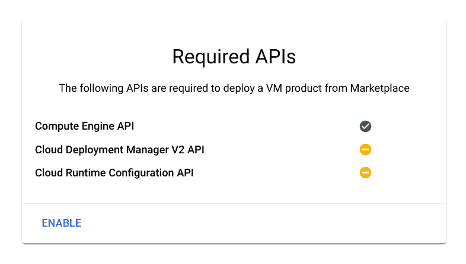

一旦我们同意使用 API，就会为我们将要创建的 GitLab 实例显示一个配置页面。我们将它安装到的区域命名为 GCP 区域(`us-central1-a`)。我们还指定要使用多大的机器来运行它。

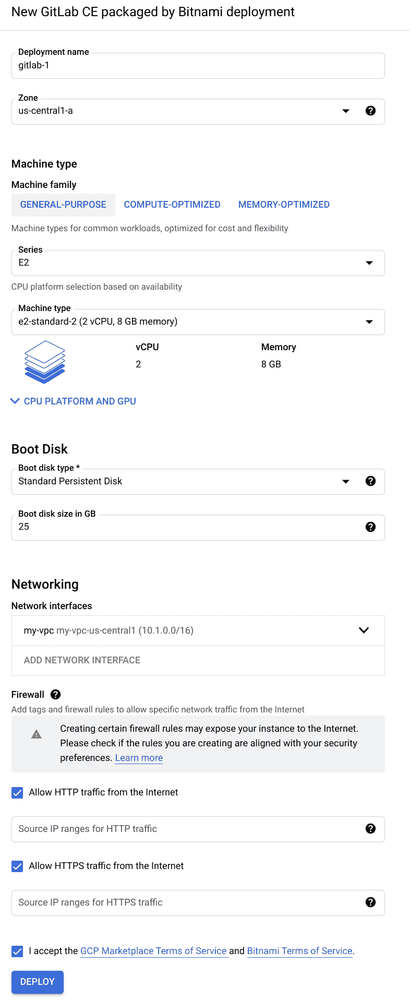

当我们单击“部署”时，GCP 市场环境会创建一个计算引擎实例，并将 GitLab 安装和配置到该虚拟机中。不幸的是，在我的测试中，安装*似乎*停止了…然而，一切都工作正常，我怀疑这是我公司的组织政策非常严格的结果。

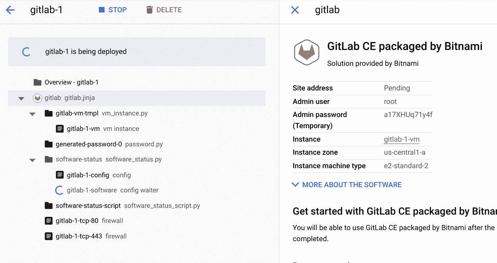

完成安装和配置大约需要 10 分钟。

5.记下 GitLab 机器的 IP 地址(如`34.68.171.109`)

至此，我们已经有了一个 GitLab 实例并正在运行。为了使用它，我们必须确定实例的公共 IP 地址。我们访问云控制台中的计算引擎页面，并查找具有 GitLab 实例名称的虚拟机。记下公共外部 IP 地址。在后续步骤中，我们将多次需要这个值。

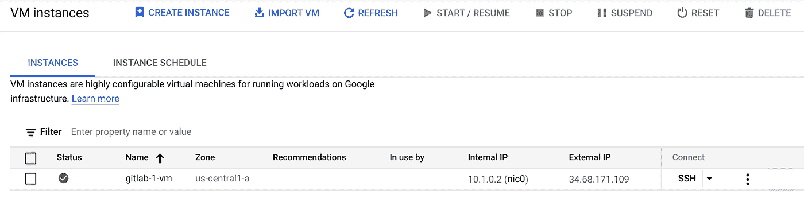

6.使用 root/密码登录

在匿名浏览器窗口中，访问 IP 地址为虚拟机实例的`http://<IP Address>`。您可能会得到一个 SSL 警告，只需接受并继续。使用“T3”的用户 id 和市场安装屏幕中显示的管理员密码登录(例如…如我们的截图所示— `a17XHUq71y4f`)。

7.更改 root 密码

根密码是随机的，这一步让我们把它改成一个容易记忆的值。

选择菜单>管理

然后

概述>用户

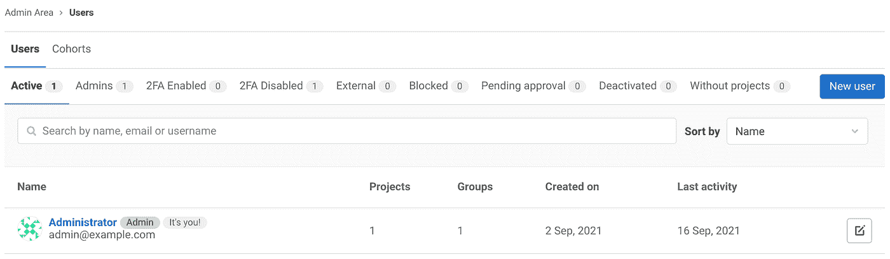

编辑管理员用户并提供新密码:

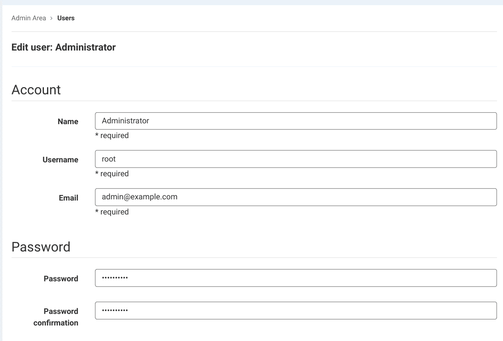

您将立即被注销。使用 root 用户和新密码再次登录。

8.创建一个名为 gcpbuild 的 GitLab 用户

进入菜单>管理

然后

概述>用户

单击“新建用户”按钮:


将用户名设为`gcpbuild`，并为电子邮件字段指定一个垃圾邮件地址。

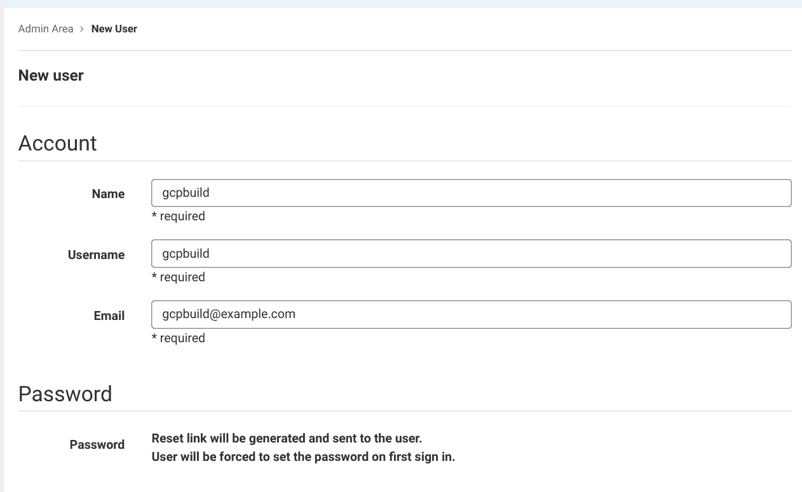

创建后，返回概览>用户并编辑新的“`gcpbuild`”用户。你现在会发现你可以设置一个密码。

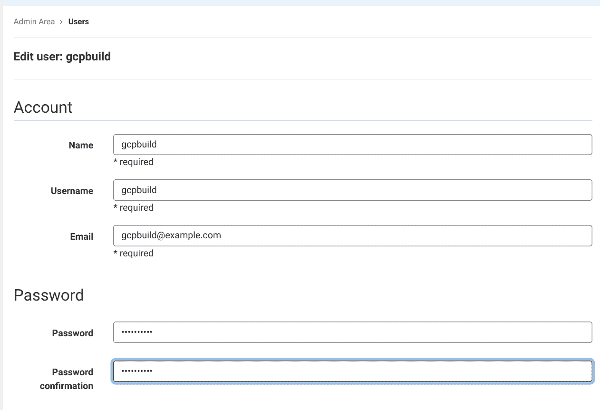

9.变成`gcpbuild`

注销 root 用户，以`gcpbuild`用户身份登录。系统将提示您设置新密码。我发现我可以将密码设置为刚才输入的密码。

10.创建一个名为`myproject`的 gitlab 项目

现在我们已经启动并运行了 GitLab，并且有了一个可以登录的用户，我们可以创建一个项目来托管我们的源文件。在我们的例子中，我们称我们的项目为`myproject`。

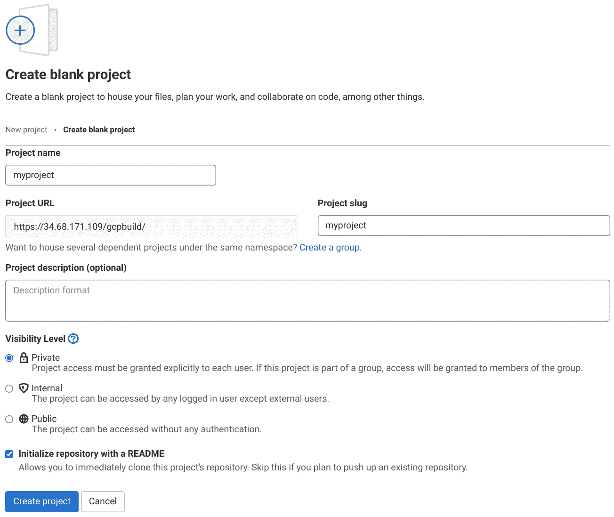

11.打开一个 GCP 云壳

下一步，我们将创建一些 SSH 密钥，并为我们提供一个可以编辑源代码的环境。我建议开一个 GCP 云壳。

12.创建一些 SSH 密钥

GitLab 要求发送给它的请求必须经过认证。实现这一点最简单的方法是使用 SSH 认证。这意味着我们创建一些 SSH 密钥(公共的和私有的)。我们会把公钥交给 GitLab，自己持有私钥。以下命令在`.ssh`目录中创建一个键和一个配置文件。需要编辑配置文件以包含 GitLab IP 地址:

```
cd ~/.ssh
ssh-keygen -t ed25519 -f gitlab_key -q -N ""
cat << EOF >> config
Host [GITLAB_IP]
  IdentityFile ~/.ssh/gitlab_key
EOF
```

编辑配置文件并设置 GitLab 服务器的 IP 地址，替换为“`[GITLAB_IP]`

```
Host [GITLAB_IP]
  IdentityFile ~/.ssh/gitlab_key
```

13.添加 SSH 密钥(公钥)

我们需要将刚刚创建的公钥(文件`gitlab_key.pub`的内容)与`gcpbuild`用户关联起来。回到 GitLab 浏览器窗口，我们会看到一个按钮`Add SSH Key`:

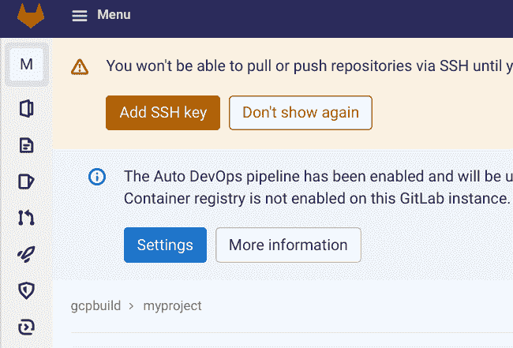

将`gitlab_key.pub`(SSH 密钥对的公共部分)的内容粘贴到密钥文本区域，然后单击`Add key`。

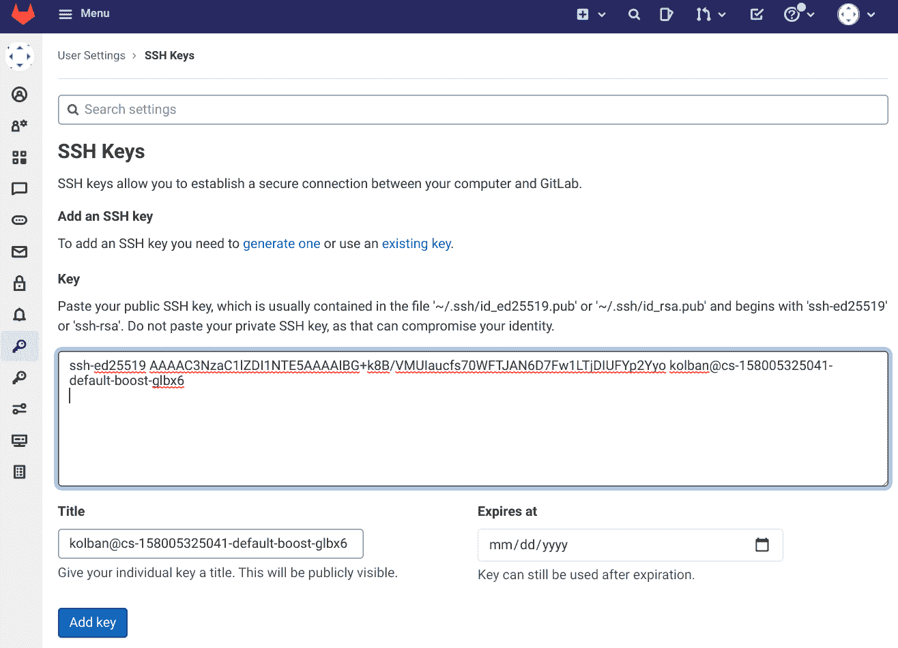

我们可以通过从云 Shell 运行以下命令来测试安全性设置是否正确:

```
ssh -T git@[GITLAB_IP]
```

14.制作工作目录

我们现在开始用文件填充 GitLab 项目。创建一个工作目录，我们将在其中放置工件。

```
cd ~
mkdir gitlab
cd gitlab
```

15.签出项目

我们现在可以克隆我们的项目了。

```
git clone git@[GITLAB_IP]:gcpbuild/myproject.git
```

这将创建一个名为`myproject`的本地文件夹。切换到该文件夹:

```
cd myproject
```

16.将以下文件添加到 GitLab 项目中。

我们将添加一个`Dockerfile`，一个 python 应用(`app.py`)和一个 Python 需求文件(`requirements.txt`)

Dockerfile 文件

```
FROM python:3
WORKDIR /usr/src/app
COPY app.py ./
COPY requirements.txt ./
RUN pip install --no-cache-dir -r requirements.txt
CMD exec gunicorn --bind :$PORT --workers 1 --threads 8 --timeout 0 app:app
```

app.py

```
from google.cloud import logging
import os
from flask import Flaskapp = Flask(__name__)[@app](http://twitter.com/app).route('/')
def runApp():
    print("Starting!")
    logging_client = logging.Client()
    log_name = "my-log"
    logger = logging_client.logger(log_name)
    text = "Hello, world! - said the Python app!"
    logger.log_text(text)
    print("Logged a record to the log called my-log")
    return "All Done"if __name__ == '__main__':
    server_port = os.environ.get('PORT', '8080')
    app.run(debug=False, port=server_port, host='0.0.0.0')
```

requirements.txt

```
google-cloud-logging
Flask
gunicorn
```

示例应用程序在 Google Cloud Logging 中记录一条记录，并向调用者返回一个文本字符串。应用程序做什么远没有我们在 CI/CD 方面展示的重要。

17.提交和推送文件

```
git add .
git commit -m ""
git push
```

18.启用云运行 API

我们现在准备开始充实 CI/CD 任务。其中之一是启用云运行，以便它准备好开始为客户端调用提供应用程序。

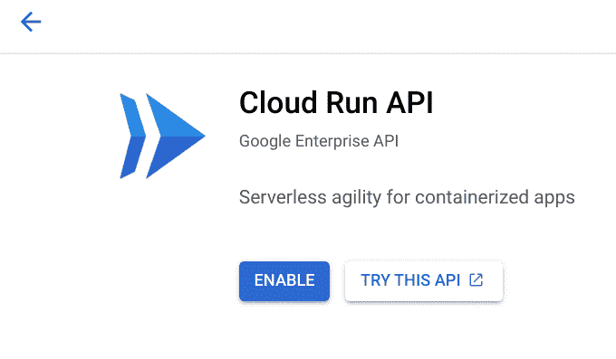

19.启用机密管理器 API

作为我们故事的一部分，我们将创造两个 GCP 的秘密。一个用于验证传入的请求是否有权开始云运行构建。当代码改变时，这将从 GitLab 到达。第二个秘密用于保存名为`gcpbuild`的 gitlab 用户的私钥。云构建将使用它来检索源代码的最新版本。

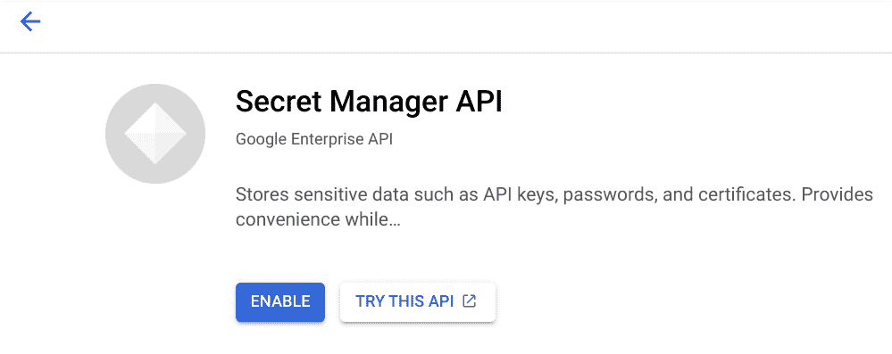

20.创建一个名为`gitlab-key`的秘密

我们创造了第一个秘密。第一个叫做`gitlab-key`。

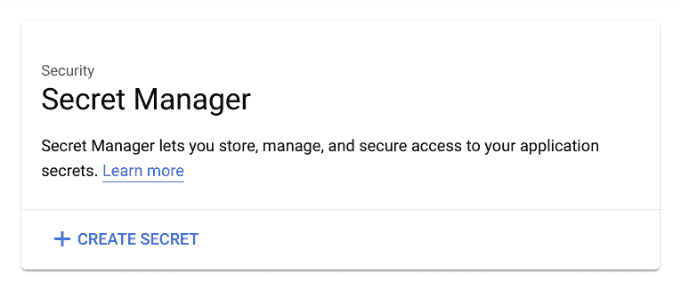

21.上传 gitlab 私钥文件或复制其数据

我们将私钥文件数据复制到秘密的值中。这是 GCP 保密的秘密，供云构建使用。

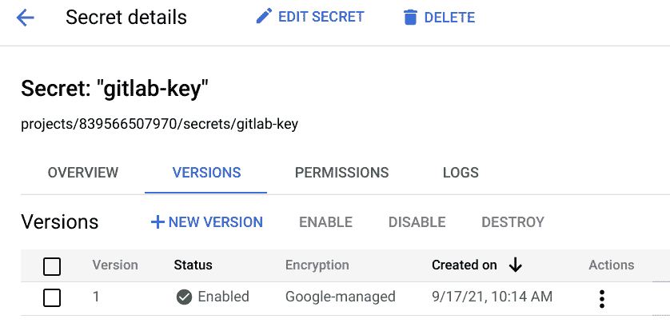

22.启用云构建 API

在使用云构建之前，我们必须启用它的 API。

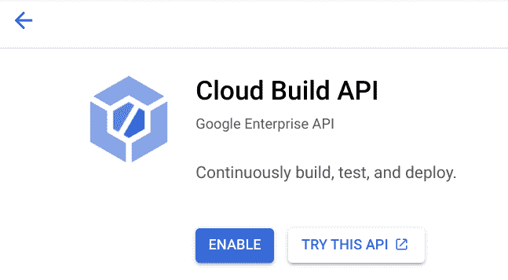

23.更改设置以允许云运行和云机密

云构建可能需要额外的权限才能执行其任务。我们需要启用“云运行”和“秘密管理器”。这为云构建授予了 IAM 权限，以创建/修改云运行定义并从 Secret Manager 中检索值。

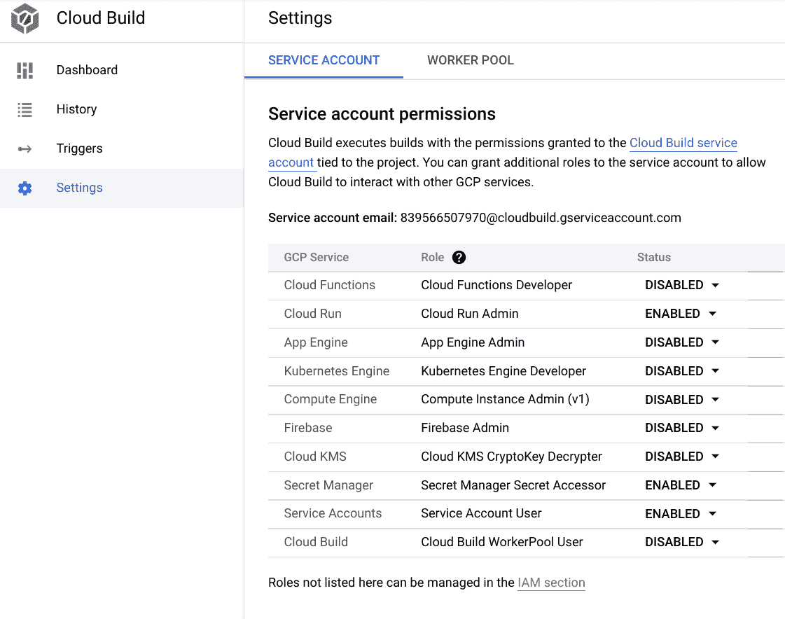

24.启用工件注册 API。

我们将把构建的 Docker 映像存储在工件注册中心的存储库中。我们必须先启用注册表 API，然后才能使用它。

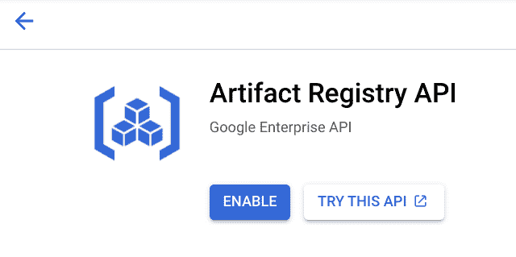

25.创建一个名为 my-repo 的工件存储库。

启用工件注册中心后，我们现在在其中创建一个命名的存储库，可以保存 Docker 图像。

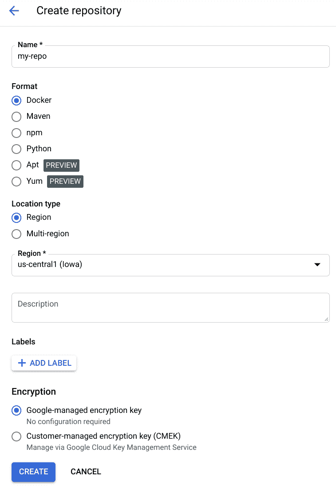

26.在云构建中创建 WebHook 触发器

我们已经接近尾声了。当来自 GitLab 的请求通知我们源代码已经更改时，我们希望 Cloud Build 执行并构建 Docker 映像。GitLab 能够在检测到变化时调用 WebHook。我们在 Cloud Build 中创建一个将与 GitLab 关联的触发器。触发器还指定了我们希望云构建运行的方法。在本文中，我们不打算讨论云构建的细节，但重要的是要理解，您必须修改`_GITLAB_IP`和`_PROJECT_NUMBER`值，以对应您的 GitLab 实例的 IP 地址和您的 GCP 项目编号。

配方中包含的最高级别的步骤是:

*   复制私有密钥，允许 Git 运行在 Cloud Build 许可中来克隆项目。
*   将项目从 GitLab 克隆到本地目录。
*   从 Docker 文件和 GitLab 项目中的工件构建 Docker 映像。
*   将得到的 Docker 图像推送到工件注册中心
*   将新的 Docker 映像部署到我们的云运行环境中

名称:`mytrigger`
事件:`Webhook URL`
秘密:`CREATE SECRET`
配置:内联如下

```
steps:
  - name: gcr.io/cloud-builders/git
    args:
      - '-c'
      - |
        echo "$$SSHKEY" > /root/.ssh/id_rsa
        chmod 400 /root/.ssh/id_rsa
        ssh-keyscan ${_GITLAB_IP} > /root/.ssh/known_hosts
    entrypoint: bash
    secretEnv:
      - SSHKEY
    volumes:
      - name: ssh
        path: /root/.ssh
  - name: gcr.io/cloud-builders/git
    args:
      - clone
      - 'git@${_GITLAB_IP}:${_GITLAB_NAME}.git'
      - .
    volumes:
      - name: ssh
        path: /root/.ssh
  - name: gcr.io/cloud-builders/docker
    args:
      - build
      - '-t'
      - '${_ARTIFACT_REPO}'
      - .
  - name: gcr.io/cloud-builders/docker
    args:
      - push
      - '${_ARTIFACT_REPO}'
  - name: gcr.io/google.com/cloudsdktool/cloud-sdk
    args:
      - run
      - deploy
      - my-service
      - '--image'
      - '${_ARTIFACT_REPO}'
      - '--region'
      - us-central1
      - '--allow-unauthenticated'
    entrypoint: gcloud
substitutions:
  _PROJECT_NUMBER: '689284316634'
  _GITLAB_IP: 34.123.168.233
  _ARTIFACT_REPO: 'us-central1-docker.pkg.dev/${PROJECT_ID}/${_ARTIFACT_REPO_NAME}/myimg'
  _GITLAB_NAME: gcpbuild/myproject
  _ARTIFACT_REPO_NAME: my-repo
availableSecrets:
  secretManager:
    - versionName: 'projects/${_PROJECT_NUMBER}/secrets/gitlab-key/versions/1'
      env: SSHKEY
```

27.授予`[PROJECT_NUMBER]-compute@developer.gserviceaccount.com`日志作者角色

我们希望在云运行中运行的应用程序希望写入云日志。因此，我们必须允许云运行写入云日志。

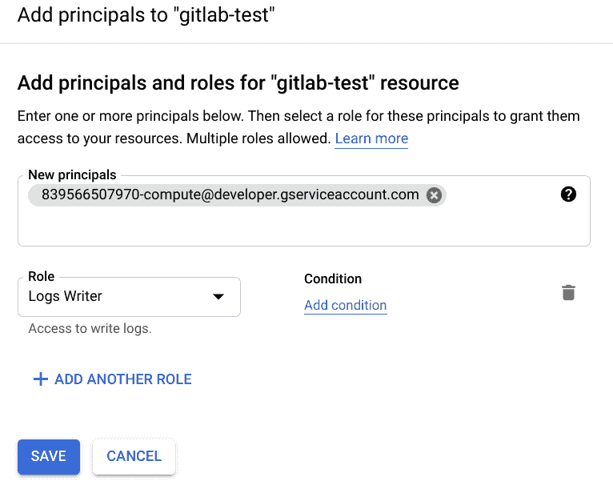

28.在 Gitlab 中创建 WebHook 触发器

我们在云构建中创建了触发器，当被调用时，它将重建映像并部署到云运行。现在我们必须配置 GitLab 来调用 WebHook，从而触发云构建:

在设置> Webhooks 下

从云构建触发器获取 URL:

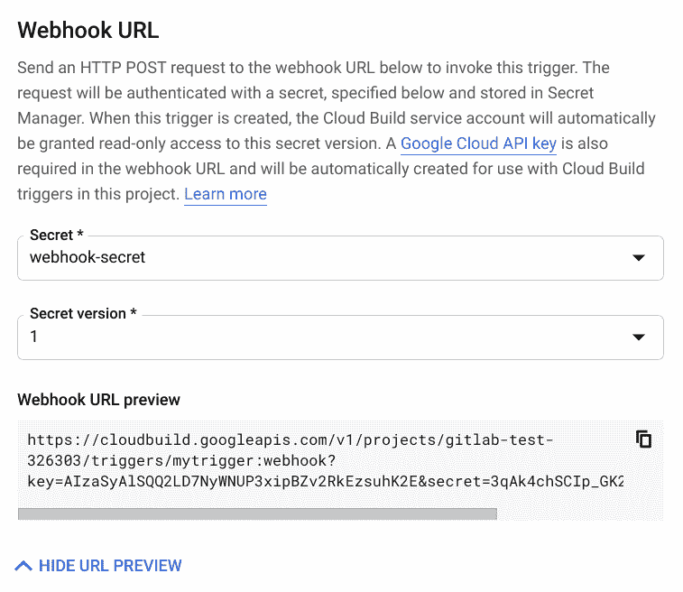

29.在 GitLab 中测试 webhook。

GitLab 有自己的测试环境来对 WebHook 进行单元测试。

30.运行云运行功能，并显示其有效。

当重建完成后，我们可以运行云运行功能，并看到它的工作。

31.更改代码并查看云构建运行和更改发生的情况。

在 GitLab 中，我们现在可以更改源代码，并看到新代码被重新部署到 Cloud Run。

正如我们所看到的，在我们的说明性故事中，许多步骤都有一个重要的目的。作为辅助，这里再次是同一个故事，但这一次作为一个录音走过执行 GCP 与额外的评论。