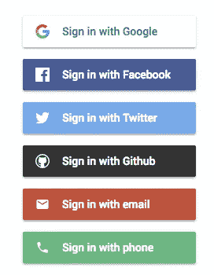
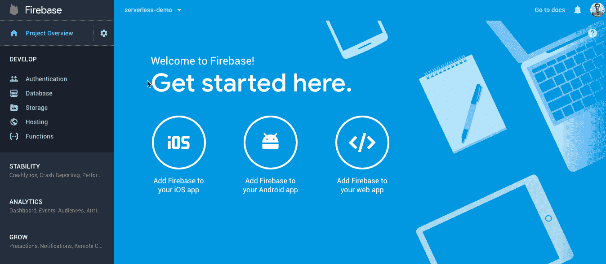
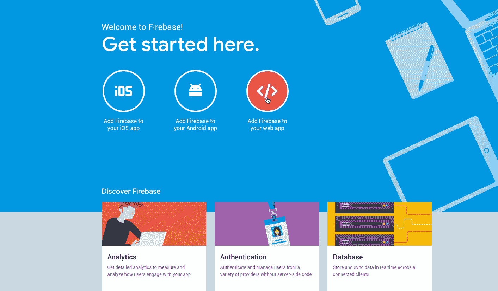
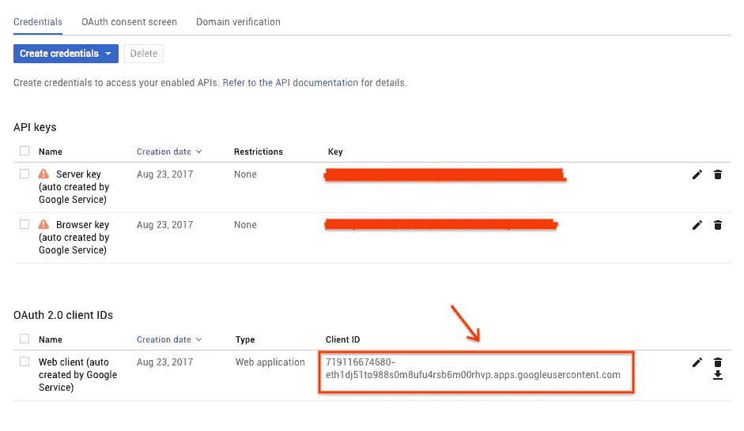
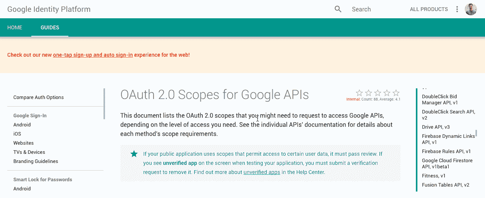
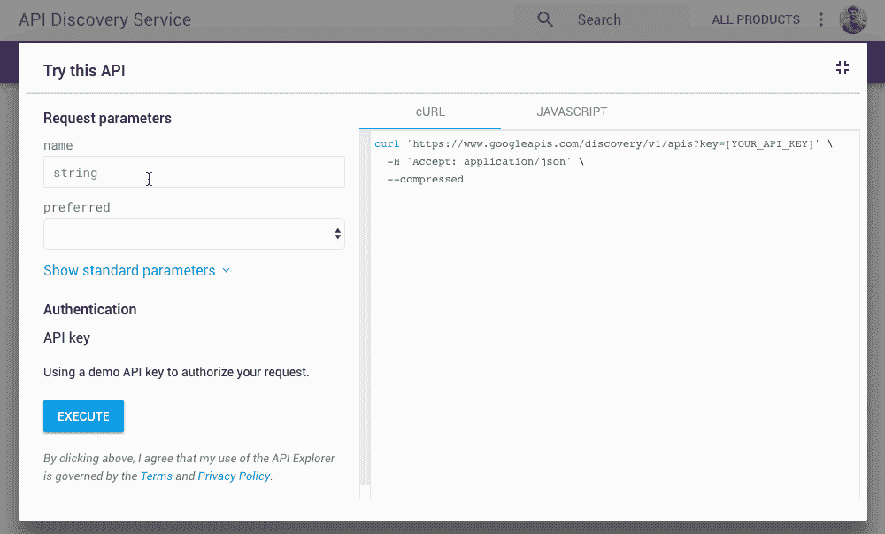

# 在 Web 上使用带有 Firebase Auth 和 Firebase UI 的 Google APIs

> 原文：<https://medium.com/google-cloud/using-google-apis-with-firebase-auth-and-firebase-ui-on-the-web-46e6189cf571?source=collection_archive---------0----------------------->

**2021 更新:我不再推荐这种方法。虽然它在技术上仍然有效，但在最近的一个项目**[](http://kbee.app)****中使用它时，我们遇到了很多陈旧的登录问题。****

****相反，您应该反过来使用 gapi 登录将凭证传递给 Firebase。****

****我在这里推荐按照说明:**[**https://github.com/msukmanowsky/gapi-firebase**](https://github.com/msukmanowsky/gapi-firebase)**

****我也推荐用这个 helper 模块加载 gapi:**[**https://www.npmjs.com/package/gapi-script**](https://www.npmjs.com/package/gapi-script)**

# **原帖:**

**如果你正在构建一个需要与用户的谷歌账户交互的网络应用，你很可能会发现 OAuth 的痛苦。在做任何有用的事情之前，您需要获得一个 OAuth 令牌并将其传递给 Google API 库。**

**谢天谢地，用 Firebase Auth 做所有的登录工作都非常容易，而 [Firebase UI](https://github.com/firebase/firebaseui-web) 让这变得更加容易。**

****

**尼斯 eeeee**

**Firebase UI 基本上是一个简单的库，为你自动完成所有的 UI(按钮等)和重定向逻辑，支持所有的 Firebase OAuth 提供者(谷歌、脸书、GitHub 等)。**

**问题是，当你想做的不仅仅是登录，事情变得模糊不清。假设您想要创建一个管理用户日历的应用程序。如何指定访问其他 Google 服务所需的范围？如何从 Firebase UI 获得 OAuth 令牌，以便在 Google API 客户机中使用？**

**谢天谢地，托德·范德林写了一篇很棒的文章修复了这些问题。以此为基础，让我们看看如何让 Firebase UI 和 Google API 客户端协同工作！**

# **设置库**

**第一步是安装 Firebase 和 Firebase UI。你可以遵循官方的指示，或者跟随这里。**

**将以下内容添加到 HTML 中的部分:**

```
<script src="https://www.gstatic.com/firebasejs/4.8.1/firebase.js"></script>
<script src="https://cdn.firebase.com/libs/firebaseui/2.5.1/firebaseui.js"></script>
<link rel="stylesheet" href="https://cdn.firebase.com/libs/firebaseui/2.5.1/firebaseui.css" />
```

**这将从 Google 的 CDN 中加载所有的依赖项。**

# **设置配置**

**首先，确保在 Firebase 控制台中启用 Google 登录:**

****

**转到 Firebase 控制台，获取应用程序的配置数据。**

****

**复制此配置对象**

**它应该是这样的:**

```
var config = {
    apiKey: "RANDOM_STRING",
    authDomain: "APPNAME.firebaseapp.com",
    databaseURL: "https://APPNAME.firebaseio.com",
    projectId: "APPNAME",
    storageBucket: "APPNAME.appspot.com",
    messagingSenderId: "1234567890"
  };
```

**我们将使用这个配置对象来配置 Google APIs 和 Firebase。为此，您需要向该对象添加更多的字段。**

## **ClientID**

**您需要做的第一件事是获取您的 OAuth 客户端 ID。要做到这一点，你需要去谷歌开发者控制台。**

**[console.developers.google.com/apis/credentials](http://console.developers.google.com/apis/credentials)**

****

**复制完整的 ClientID**

**现在将它添加到您的配置对象中**

```
var config = {
    apiKey: "RANDOM_STRING",
    authDomain: "APPNAME.firebaseapp.com",
    databaseURL: "https://APPNAME.firebaseio.com",
    projectId: "APPNAME",
    storageBucket: "APPNAME.appspot.com",
    messagingSenderId: "1234567890", clientId: "RANDOM_STRING.apps.googleusercontent.com" };
```

## **领域**

**接下来，您需要添加您想要修改的服务的范围。在这个例子中，我想获得用户的个人资料信息(电子邮件，姓名等)，并有能力修改和阅读他们的日历。**

**为了找到正确的范围名称，这里有一个所有可用 Google 范围的列表:**

**[https://developers . Google . com/identity/protocols/Google scopes](https://developers.google.com/identity/protocols/googlescopes)**

**现在搜索你需要的望远镜。一些服务(如 Gmail)有非常具体的范围，给你完成任务所需的最低访问权限。始终确保使用您需要的最少权限！**

****

**因此，在这个示例中，有三个范围要包括:“电子邮件”、“个人资料”和“https://www . Google APIs . com/auth/calendar”**

**用这些值在配置对象中创建一个数组:**

```
var config = {
    apiKey: "RANDOM_STRING",
    authDomain: "APPNAME.firebaseapp.com",
    databaseURL: "https://APPNAME.firebaseio.com",
    projectId: "APPNAME",
    storageBucket: "APPNAME.appspot.com",
    messagingSenderId: "1234567890", clientId: "RANDOM_STRING.apps.googleusercontent.com", scopes: [
             "email",
             "profile",
             "https://www.googleapis.com/auth/calendar"
    ]
};
```

## **发现文档**

**到了最后一步。为了让 Google API 客户端知道要加载哪些库，您需要传入相应的发现文档。电子邮件和个人资料内置在 Firebase 中，但是我们希望能够用 Google API 客户端修改日历，所以我们需要它的 discovery doc。**

**要找到正确的发现文档，您可以使用以下服务:**

**[https://developers . Google . com/discovery/v1/reference/APIs/list？apix =真](https://developers.google.com/discovery/v1/reference/apis/list?apix=true)**

****

**同样，创建一个数组并添加您需要的所有发现文档**

```
var config = {
    apiKey: "RANDOM_STRING",
    authDomain: "APPNAME.firebaseapp.com",
    databaseURL: "https://APPNAME.firebaseio.com",
    projectId: "APPNAME",
    storageBucket: "APPNAME.appspot.com",
    messagingSenderId: "1234567890", clientId: "RANDOM_STRING.apps.googleusercontent.com", scopes: [
             "email",
             "profile",
             "https://www.googleapis.com/auth/calendar"
    ],
    discoveryDocs: [
    "[https://www.googleapis.com/discovery/v1/apis/calendar/v3/rest](https://www.googleapis.com/discovery/v1/apis/calendar/v3/rest)"
    ]
};
```

**终于完成了所有疯狂的配置！**

# **设置 Firebase 用户界面**

***注意:* [*这里可以看到完整的代码*](https://gist.github.com/thesandlord/4740bfaca43d67fe6865c097db2a4016)**

**遵循 Firebase UI 的官方设置。唯一的区别在于“登录选项”字段。将其更改为包含您在配置对象中指定的范围:**

```
var uiConfig = {
 signInSuccessUrl: “<url-to-redirect-to-on-success>”,
 signInOptions: [{
   provider: firebase.auth.GoogleAuthProvider.PROVIDER_ID,
   scopes: config.scopes
 }],
 // Terms of service url.
 tosUrl: “<your-tos-url>”
};
```

# **设置 Google API 客户端**

**Firebase UI 将处理所有的登录流程细节。登录完成后，Firebase 会自动触发一个功能。在这个函数中，我们将加载 Google API 客户端。**

```
// This function will trigger when there is a login event
firebase.auth().onAuthStateChanged(function(user) { // Make sure there is a valid user object
  if(user){
    var script = document.createElement('script');
    script.type = 'text/javascript';
    script.src = '[https://apis.google.com/js/api.js'](https://apis.google.com/js/api.js'); // Once the Google API Client is loaded, you can run your code
    script.onload = function(e){ // Initialize the Google API Client with the config object
     gapi.client.init({
       apiKey: config.apiKey,
       clientId: config.clientID,
       discoveryDocs: config.discoveryDocs,
       scope: config.scopes.join(' '),
     }) // Loading is finished, so start the app
     .then(function() { // Make sure the Google API Client is properly signed in
      if (gapi.auth2.getAuthInstance().isSignedIn.get()) {
        startApp(user);
      } else {
        firebase.auth().signOut(); // Something went wrong, sign out
      } }) } // Add to the document
    document.getElementsByTagName('head')[0].appendChild(script);  
  }
})
```

# **把这一切联系在一起**

**所有的“样板文件”都完成了。您现在可以毫无问题地使用 Google API 客户端了！**

****注意:**在调用之前检查 OAuth 令牌是否仍然有效，或者在调用 API 之前刷新令牌，这一点很重要。这是因为 Firebase 会自动刷新令牌，而 Google API 客户端不会。**

```
// Print out the User and the 10 latest calendar events
function startApp(user) {
  console.log(user);
  firebase.auth().currentUser.getToken()
  .then(function(token) {
    return gapi.client.calendar.events.list({
     calendarId: "primary",
     timeMin: new Date().toISOString(),
     showDeleted: false,
     singleEvents: true,
     maxResults: 10,
     orderBy: "startTime"
    })  
   })
  .then(function(response) {
    console.log(response);  
  });
}
```

# **完整代码:**