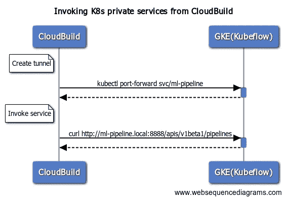

# 使用谷歌云构建 Kubeflow Pipelines CI/CD

> 原文：<https://medium.com/google-cloud/using-google-cloud-build-for-kubeflow-pipelines-ci-cd-b1459b08b158?source=collection_archive---------2----------------------->

# 或者我们如何在 Google Cloud Build 中使用 kubectl port-forward 来集成私有 k8s 服务

在 [Imagr](https://imagr-ai.medium.com/) 这里，我们正在为我们的一些机器学习工作流程试验 [Kubeflow 管道](https://www.kubeflow.org/docs/pipelines/overview/pipelines-overview/)。

为了自动化 Kubeflow 管道部署，我们设置了一个简单的云构建作业，该作业编译管道并上传新版本。

下面的代码片段启动了一个运行`kubectl port-forward`命令的 docker 容器

在 docker 容器内调用 kubectl port-forward，将其作为 cloudbuild 网络中的服务公开

需要注意的两件最重要的事情是:

1.  `--network cloudbuild`
2.  `--address 0.0.0.0`

在下一步中，您应该能够访问公开服务中的端点。在下面的例子中，我使用`curl`来列出现有的 Kubeflow 管道。

在端口 8888 上调用 Kubeflow 管道 API

当然这不是很有用，所以这里是另一个上传新管道版本的例子:

上传新的管道版本

同样的策略可以很容易地适应与其他内部 kubernetes / kubeflow 服务的通信。