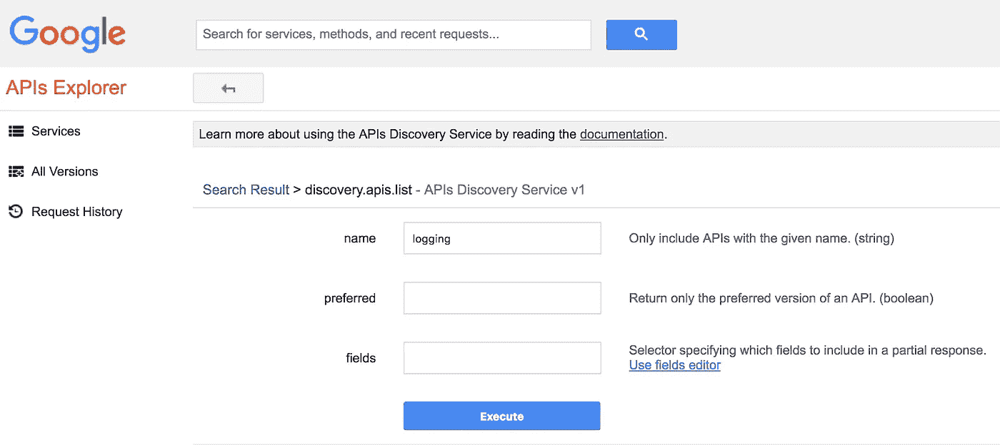
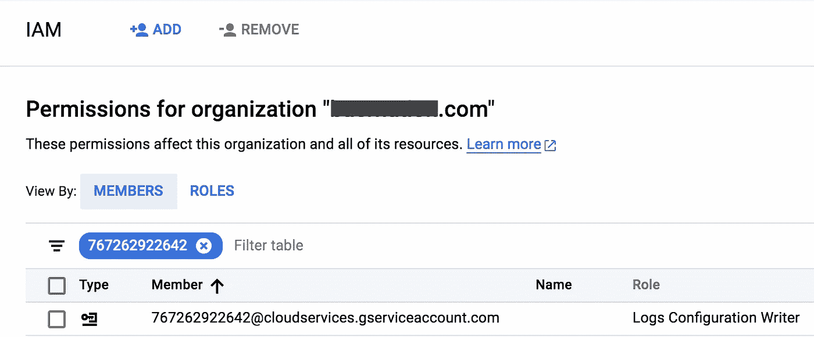

# 使用 Google Cloud 部署管理器共享类型

> 原文：<https://medium.com/google-cloud/using-google-cloud-deployment-manager-shared-types-f5c3609687b0?source=collection_archive---------1----------------------->

Google Cloud Deployment Manager 允许您使用 YAML、python 或 Jinja2 以声明格式自动创建/读取/更新/删除应用程序所需的所有资源。部署管理器模板允许使用构建块来创建通常一起部署的抽象资源或资源集。这种方法允许您将配置视为代码，并自动执行可重复的部署。

默认情况下，部署管理器支持一组[资源类型](https://cloud.google.com/deployment-manager/docs/configuration/supported-resource-types)，并且可以通过类型提供者进行扩展。默认的资源类型涵盖了许多常见的部署场景，比如创建 GCP 项目、设置 VPC 和部署 GCE VM。

部署管理器中一个有用的特性是能够注册第三方 API，然后使用部署管理器通过 API 部署资源。这个概念被称为[类型提供者](https://cloud.google.com/deployment-manager/docs/configuration/type-providers/process-adding-api)，极大地扩展了自动化任意 CRUD 风格 API 的能力。这个功能非常有用，因为它允许您通过部署管理器模板使用任何 GCP API，即使它们没有作为资源类型、处于 alpha 或 beta 版本的 GCP API 甚至您自己的 API 公开。

例如，我最近想在 Stackdriver Logging 中为 GCP 组织的所有项目创建一个日志导出同步。项目同步是部署管理器中的默认资源类型，它使用 [projects.sync.create](https://cloud.google.com/logging/docs/reference/v2/rest/v2/projects.sinks/create) API。但是，创建组织同步使用的是[organizations . sync . create](https://cloud.google.com/logging/docs/reference/v2/rest/v2/organizations.sinks/create)API，它不是默认的资源类型。

这就是类型提供者的亮点！为了通过部署管理器创建组织同步，我使用了类型提供者的概念。下面是我用来通过部署管理器创建组织同步的步骤。

# 第一步。找到 API 发现 URL。

发现 URL 描述了 API 提供的 CRUD 操作。我使用了 [Google API 发现服务](https://developers.google.com/discovery/)来查找相关的发现 API，因为它涵盖了任何 Google API。相应地，发现服务提供了一个 [API](https://developers.google.com/apis-explorer/#search/discovery.apis.list/m/discovery/v1/discovery.apis.list) 本身来为 Google APIs 查找发现 URL。

在这种情况下，我使用[发现服务 API explorer](https://developers.google.com/apis-explorer/#search/discovery.apis.list/m/discovery/v1/discovery.apis.list?name=logging&_h=2&) 来搜索日志服务。



JSON 响应在 *discoveryRestUrl* 字段中列出了发现 URL。

```
{
  "kind": "discovery#directoryList",
  "discoveryVersion": "v1",
  "items": [
   {
    "kind": "discovery#directoryItem",
    "id": "logging:v2",
    "name": "logging",
    "version": "v2",
    "title": "Stackdriver Logging API",
    "description": "Writes log entries and manages your Stackdriver Logging configuration.",
    "discoveryRestUrl": "[https://logging.googleapis.com/$discovery/rest?version=v2](https://logging.googleapis.com/$discovery/rest?version=v2)",
    "icons": {
     "x16": "[https://www.gstatic.com/images/branding/product/1x/googleg_16dp.png](https://www.gstatic.com/images/branding/product/1x/googleg_16dp.png)",
     "x32": "[https://www.gstatic.com/images/branding/product/1x/googleg_32dp.png](https://www.gstatic.com/images/branding/product/1x/googleg_32dp.png)"
    },
    "documentationLink": "[https://cloud.google.com/logging/docs/](https://cloud.google.com/logging/docs/)",
    "preferred": true
   },
   {
    "kind": "discovery#directoryItem",
    "id": "logging:v2beta1",
    "name": "logging",
    "version": "v2beta1",
    "title": "Stackdriver Logging API",
    "description": "Writes log entries and manages your Stackdriver Logging configuration.",
    "discoveryRestUrl": "[https://logging.googleapis.com/$discovery/rest?version=v2beta1](https://logging.googleapis.com/$discovery/rest?version=v2beta1)",
    "icons": {
     "x16": "[https://www.gstatic.com/images/branding/product/1x/googleg_16dp.png](https://www.gstatic.com/images/branding/product/1x/googleg_16dp.png)",
     "x32": "[https://www.gstatic.com/images/branding/product/1x/googleg_32dp.png](https://www.gstatic.com/images/branding/product/1x/googleg_32dp.png)"
    },
    "documentationLink": "[https://cloud.google.com/logging/docs/](https://cloud.google.com/logging/docs/)",
    "preferred": false
   }
  ]
}
```

可以看到 discoveryRestUrl 是[https://logging.googleapis.com/$discovery/rest?版本=v2beta1。](https://logging.googleapis.com/$discovery/rest?version=v2beta1.)

# 第二步。创建 GCP 类型提供程序。

需要创建 GCP 类型提供程序，然后才能在部署管理器脚本中使用该类型。我使用下面的命令使用了 *gcloud* 来创建类型提供者。

```
gcloud beta deployment-manager type-providers create sharedloggingv2type --descriptor-url='https://logging.googleapis.com/$discovery/rest?version=v2'Waiting for insert [operation-1530042902553–56f90dfb2a1a8–5b28e068–54001af8]…done.
Created type_provider [sharedloggingv2type].
```

然后，我检查类型提供者是否被成功创建。

```
gcloud beta deployment-manager type-providers describe sharedloggingv2typedescription: ''
descriptorUrl: [https://logging.googleapis.com/$discovery/rest?version=v2](https://logging.googleapis.com/$discovery/rest?version=v2)
id: '6736148154336355577'
insertTime: '2018-06-26T12:55:02.690-07:00'
name: sharedloggingv2type
operation:
  endTime: '2018-06-26T12:55:04.301-07:00'
  id: '4664553155367740665'
  kind: deploymentmanager#operation
  name: operation-1530042902553-56f90dfb2a1a8-5b28e068-54001af8
  operationType: insert
  progress: 100
  startTime: '2018-06-26T12:55:02.947-07:00'
  status: DONE
  targetId: '6736148154336355577'
  targetLink: [https://www.googleapis.com/deploymentmanager/v2beta/projects/compliance-logging-export/global/typeProviders/sharedloggingv2type](https://www.googleapis.com/deploymentmanager/v2beta/projects/compliance-logging-export/global/typeProviders/sharedloggingv2type)
  user: [charles@baernation.com](mailto:charles@baernation.com)
selfLink: [https://www.googleapis.com/deploymentmanager/v2beta/projects/compliance-logging-export/global/typeProviders/sharedloggingv2type](https://www.googleapis.com/deploymentmanager/v2beta/projects/compliance-logging-export/global/typeProviders/sharedloggingv2type)
```

# 第三步。构建 YAML 和金佳的配置文件。

一旦创建了类型提供者，我就用它来创建部署管理器 YAML 文件。我将配置分成一个 jinja 模板和一个 YAML 文件，这样我就可以在其他 YAML 配置文件中重用 jinja 模板。这种方法允许我构建一个 jinja 模板库，我可以在我的 YAML 文件中使用它。这是我用过的*金佳* YAML 的文件。

*sink _ to _ GCS _ type _ provider . jinja:*

```
resources:
- name:  {{ env["name"] }}
  type: compliance-logging-export/sharedloggingv2type:organizations.sinks
  properties:
    parent: "{{ properties["parent"] }}"
    uniqueWriterIdentity: {{ properties["uniqueWriterIdentity"] }}
    name: {{ env["name"] }}
    includeChildren: {{ properties["includechildren"] }}
    outputVersionFormat: V2
    destination: storage.googleapis.com/{{ properties["destination"] }}
    filter: "{{ properties["filter"] }}"
```

*sink _ type _ provider . YAML:*

```
imports: 
- path: sink_to_gcs_type_provider.jinja
resources:
- name: logging-sink-to-gcs
  type: sink_to_gcs_type_provider.jinja
  properties:
    parent: "organizations/324989851234"
    uniqueWriterIdentity: false
    destination: gcp-org-sync-destination
    filter:  'logName=\"/logs/cloudaudit.googleapis.com\" OR resource.type:\"gce\" OR resource.type=\"gcs_bucket\" OR resource.type=\"cloudsql_database\" OR resource.type=\"bigquery_resource\"' 
    includechildren: true
```

# 第四步。使用部署管理器。

部署管理器使用项目的特定[服务帐户](https://cloud.google.com/deployment-manager/docs/access-control#access_control_for_deployment_manager)代表您执行命令。使用电子邮件可以识别服务帐户:

```
[PROJECT_NUMBER]@cloudservices.gserviceaccount.com
```

Google APIs 服务帐户被自动授予项目的编辑权限，但是我需要在组织级别添加 IAM 权限“*Logs Configuration Writer*”。我在控制台中添加了这个权限，如下图所示。



创建了类型提供者、部署管理器配置就绪并授予了 IAM 权限后，我执行了下面的 gcloud 命令行。

```
gcloud beta deployment-manager deployments create org01 \
  --config sink_type_provider.yamlThe fingerprint of the deployment is glReoqkjVxYCBcUiYkZD0g==
Waiting for create [operation-1530103511980-56f9efc4d17e0-448fe1c7-88c56a9c]...done.                                                                                        
Create operation operation-1530103511980-56f9efc4d17e0-448fe1c7-88c56a9c completed successfully.
NAME                 TYPE                                                               STATE      ERRORS  INTENT
logging-sink-to-gcs  compliance-logging-export/sharedloggingv2type:organizations.sinks  COMPLETED  []
```

我通过查看部署的结果来验证该命令是否成功。

```
gcloud beta deployment-manager deployments describe org01

fingerprint: i1EqFrvhmAA5_fcPbNmABA==
id: '8898993182367169098'
insertTime: '2018-06-27T05:35:49.206-07:00'
manifest: manifest-1530102949238
name: org01
operation:
  endTime: '2018-06-27T05:36:03.363-07:00'
  name: operation-1530102948995-56f9edabe9fb9-210a870a-c006d6af
  operationType: insert
  progress: 100
  startTime: '2018-06-27T05:35:49.786-07:00'
  status: DONE
  user: [c@example.com](mailto:charles@baernation.com)
```

通过列出组织同步，我验证了组织同步已成功创建。

```
I verified that the organizational sync was successfully created by listing the organizational syncs.gcloud logging sinks describe logging-sink-to-gcs \     
    --organization="324989855333"destination: storage.googleapis.com/gcp-org-sync-destination
includeChildren: true
name: logging-sink-to-gcs
outputVersionFormat: V2
writerIdentity: serviceAccount:[o324989855333-777063@gcp-sa-logging.iam.gserviceaccount.com](mailto:o324989855333-777063@gcp-sa-logging.iam.gserviceaccount.com)
```

然后，我使用上面返回的 serviceAccount 向 GCS 中的 gcp-org-sync-destination bucket 授予 IAM 权限“存储对象创建者”,这样 sink 就有适当的权限将日志写入目标。

就是这样！这是一种强大的方法，可以将任何没有作为默认类型提供的 GCP API、处于 alpha 或 beta 版本的 GCP API，甚至您自己的 API 集成到 deployment manager 中。

参考资料:

*   [谷歌云部署管理器](https://cloud.google.com/deployment-manager/docs/fundamentals)
*   [部署管理器资源类型](https://cloud.google.com/deployment-manager/docs/configuration/supported-resource-types)
*   [部署管理器类型提供者](https://cloud.google.com/deployment-manager/docs/configuration/type-providers/process-adding-api)
*   [部署管理器类型提供者需求](https://cloud.google.com/deployment-manager/docs/configuration/type-providers/api-requirements)
*   [谷歌 API 发现服务](https://developers.google.com/discovery/)
*   [导出堆栈驱动日志的设计模式](https://cloud.google.com/solutions/design-patterns-for-exporting-stackdriver-logging)
*   [谷歌云日志 API](https://cloud.google.com/logging/docs/reference/v2/rest/)