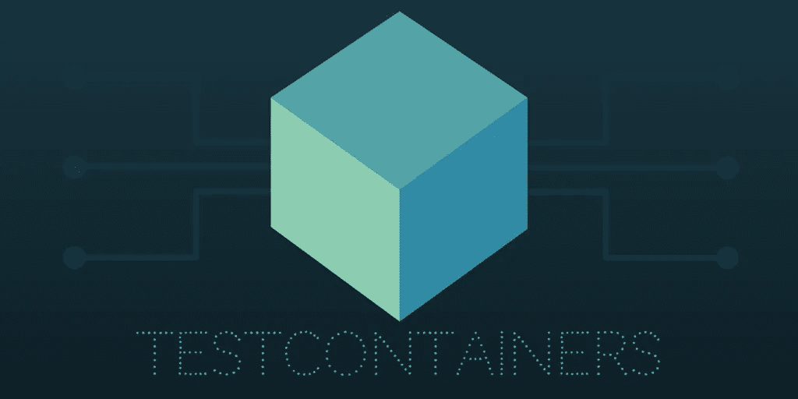

# 在集成测试中使用 Google Cloud 模拟器

> 原文：<https://medium.com/google-cloud/using-google-cloud-emulators-for-integration-tests-7812890ebe0d?source=collection_archive---------0----------------------->

这篇文章更像是关于如何使用 Google Datastore 模拟器和 Google Pub/Sub 模拟器进行测试的教程。以及如何通过为每个仿真器使用 Docker 容器来并行运行多个测试。

**TLDR:完整的工作代码片段可以在** [**这里**](https://github.com/fkorotkov/snippets/blob/master/testcontainers/gcloud/datastore/src/test/kotlin/com/fkorotkov/snippets/testcontainers/gcloud/TestDatastore.kt) **找到。**


运行集成测试时的“docker ps”

## 动机

我不太喜欢嘲笑周围的事物。或者在单元测试和生产中有不同的实现。对于在最关键的时刻会有一些不同行为的单元测试，使用内存中的 DB 有什么意义呢！？再加上维护测试和生产两个实现的开销。我个人无法对我在这样的测试后部署的代码有 100%的信心。我想在尽可能类似于生产的环境中测试我的应用程序。

最近我真的很喜欢谷歌云平台。目前，我正在构建由大量用 [Kotlin](https://kotlinlang.org/) 编写的微服务组成的东西，这些微服务使用 [GRPC](http://www.grpc.io/) 进行通信。所有内部服务都位于 Kubernetes 内部，唯一的外部服务是一些 GCP 产品，如数据存储和发布/订阅。

如果测试内部服务之间的通信，我可以使用 GRPC 的进程内通道，这是另一个帖子的好主题。在我的测试中，我遇到了一个为数据存储、发布/订阅和 Blobstore 等服务使用什么的问题。

## 履行

一开始，我只是在终端标签中运行模拟器，命令如下:

```
gcloud beta emulators datastore start --no-legacy \
  --project unit-testing-project-name \
  --consistency=1
```

我甚至发现没有很好地记录将仿真器重置为干净状态的`http://localhost:<port>/reset`端点。我在每次测试之前都调用它，以确保在运行测试之前模拟器是干净的。它对于数据存储模拟器工作得很好，但是发布/订阅模拟器并不可靠，有时会出现错误。随着测试数量的增加，情况变得越来越糟。运行测试时，发布/订阅模拟器出错越来越频繁。另一个问题是我受限于顺序运行测试。没有办法在测试之间共享模拟器！唯一的方法是用不同的`--host-port`标志运行模拟器的多个实例。

大约在那个时候，我了解到一个叫做[测试容器](https://github.com/testcontainers/testcontainers-java)的令人敬畏的项目。想法很简单:提供干净的 API 在测试中使用 Docker 容器。



我想为什么不使用它，只是开始新的容器，为每个测试提供必要的模拟器！？是的，它会慢一些，但是它被证明是更可靠的，尤其是对于发布/订阅模拟器。我相信从长远来看，它会扩展得更好。我还把这个项目分成了 60 多个分项目。通过并行执行和梯度缓存`test`任务，它不会对本地工作流产生太大影响。

为了开始在测试中使用模拟器，我们首先需要一个包含 Google Cloud SDK 的容器:

```
class GoogleCloudContainer : 
  GenericContainer<GoogleCloudContainer>("google/cloud-sdk:latest")
```

现在我们简单地在一个伴生对象上定义一个字段(根据 Kotlin 基本上是一个静态字段),用于我们想要在其中使用容器的测试类:

```
val projectName = "testing"
val emulatorPort = 8888@ClassRule @JvmField
public val datastoreContainer: GoogleCloudContainer =
  GoogleCloudContainer()
    .withExposedPorts(emulatorPort)
    .withCommand("/bin/sh", "-c",
      """
      gcloud beta emulators datastore start --no-legacy \
        --project $projectName \
        --host-port=0.0.0.0:$emulatorPort \
        --consistency=1
    """)
```

**注意:**使用`localhost`代替`--host-port`不起作用。

仅此而已！现在可以构建数据存储服务来使用正在运行容器:

```
val datastoreService: Datastore by *lazy* **{** val host = datastoreContainer.*containerIpAddress* val port = datastoreContainer.getMappedPort(emulatorPort)

  DatastoreOptions.newBuilder()
    .setProjectId(projectName)
    .setHost("$host:$port")
    .setCredentials(NoCredentials.getInstance())
    .build()
    .*service* **}**
```

就这么简单！数据存储的完整代码片段可以在[这里](https://github.com/fkorotkov/snippets/blob/master/testcontainers/gcloud/datastore/src/test/kotlin/com/fkorotkov/snippets/testcontainers/gcloud/TestDatastore.kt)找到。发布/订阅片段也可在[这里](https://github.com/fkorotkov/snippets/blob/master/testcontainers/gcloud/pubsub/src/test/kotlin/com/fkorotkov/snippets/testcontainers/gcloud/TestPubSub.kt)获得。

## 自动杀死过期容器

使用测试容器需要注意的一点是，如果你调试了一个测试并终止了一个 JVM，那么容器就不会被清理。谢天谢地，测试容器用`org.testcontainers=true`标记所有容器。我简单地向 Gradle 添加了一个清理任务，以便在运行测试之前删除任何容器:

```
task stopTestContainers(type: Exec) {
  executable "sh"
  args "-c", 'docker ps -q -f "label=org.testcontainers=true" ' +
    '| xargs docker rm -f'
}

test.dependsOn stopTestContainers
```

## 结论

测试容器对于在测试中进行生产非常有用。事实证明他们非常可靠。试试看！