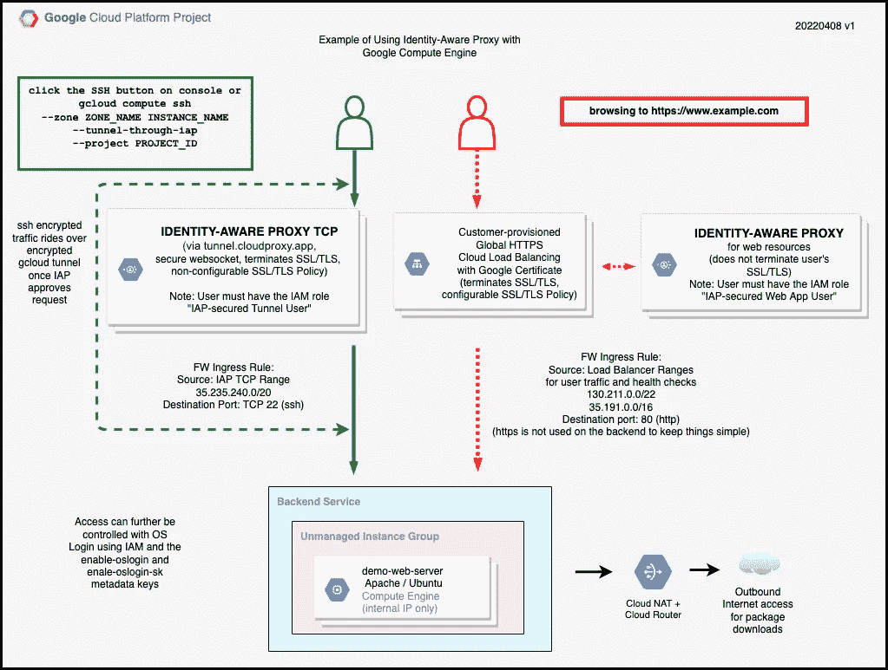

# 将谷歌云身份感知代理与计算引擎结合使用

> 原文：<https://medium.com/google-cloud/using-google-cloud-identity-aware-proxy-with-compute-engine-cf2b7dc9136b?source=collection_archive---------2----------------------->

我喜欢为谷歌云工作的很大一部分原因是有机会帮助我的客户应对现实世界的挑战。我的一个客户想要一种更好的方法来管理对其 web 平台的访问，包括终端用户流量和管理流量。进入谷歌云的[身份感知代理](https://cloud.google.com/iap)(“IAP”)服务。

IAP 服务使您能够控制对基于云的应用程序和本地应用程序的访问。您可以使用 IAP 来保护 web 资源，例如运行 web 应用程序和 Google App Engine 的 Google Compute Engine 实例。浏览受保护资源的用户必须通过身份验证才能获得访问权限。还可以使用 [IAP TCP 转发](https://cloud.google.com/iap/docs/using-tcp-forwarding)来保护 SSH 等 TCP 资源。试图打开 TCP 会话的用户也必须先通过身份验证，然后才能被授予访问权限。您可以同时使用这两种功能。例如，您可能希望限制对 web 应用程序的访问，同时限制对 web 服务器的 SSH 访问。

我创建了一个演示来展示 IAP 如何处理 web 和 TCP 流。您将使用 Terraform 构建一个环境，并运行一些测试。然后，您将使用 Google Cloud 控制台检查资源的配置。

以下是您将构建的内容。

图 1 —演示环境

听起来有趣吗？前往[仓库](https://github.com/google/iap-compute-engine-demo)了解更多信息。快乐大厦！