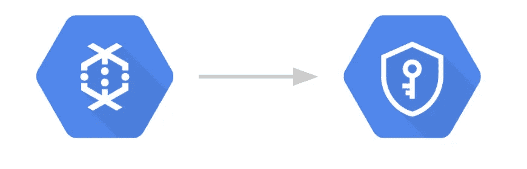
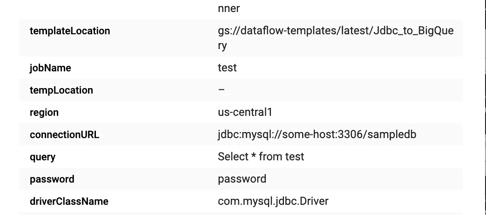
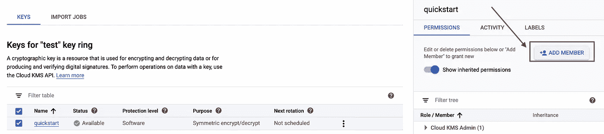
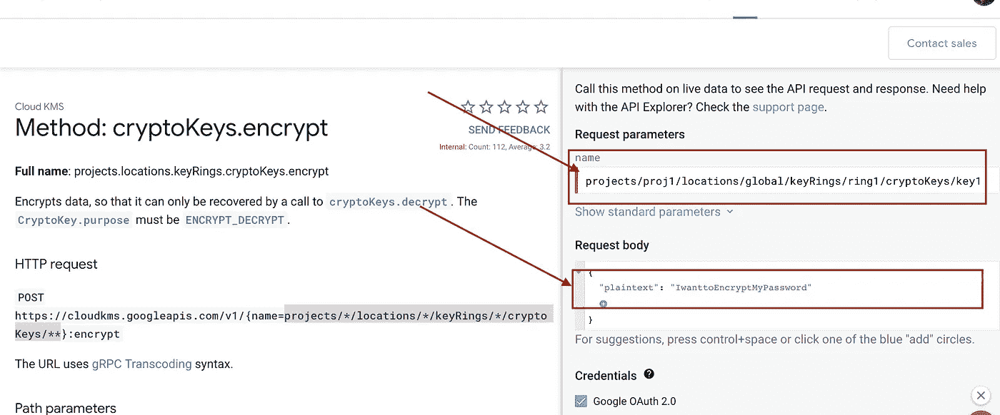

# 通过数据流模板使用谷歌云密钥管理服务

> 原文：<https://medium.com/google-cloud/using-google-cloud-key-management-service-with-dataflow-templates-71924f0f841f?source=collection_archive---------0----------------------->

**作者:** [萧万长，](/@theodoresiu7) [萨梅尔·阿比扬卡](/@saabhyankar)



数据流接受并显示运行时参数，而不区分参数是否敏感。我们依靠 GCP 密钥管理服务(KMS)来加密/解密这些字段，以增加额外的安全层。

我们注意到，对于 Google 提供的数据流模板，即 JDBCToBigQuery 模板，传入的一些运行时参数是敏感字段。因此，这些字段可以在 Dataflow Jobs UI 页面上使用，也可以通过 Dataflow.jobs.get API 调用使用。请参见图 1 中 UI 中公开字段的示例。不幸的是，在这个时候，数据流没有一个内置的方法来隐藏秘密(密码等)。)通过管道选项传递。



将敏感参数和秘密作为数据流选项传入会在 UI 上公开它们

此问题的快速解决方法包括:

1.  将敏感字段嵌入模板本身。不幸的是，在编译模板时，尽管没有显示为参数，但仍然可以在模板文件中找到这些字段。此外，硬编码值会使模板失去通用性。
2.  使用位于 GCS 中的配置 blob 文件来存储和读取敏感字段。这需要对代码进行一些调整，敏感字段仍然存在于 GCP 的其他地方。

我们最终同意的最后一个变通方法是使用 Google Cloud Key Management 服务来加密我们的字段，并在数据流作业期间传递加密的字段进行解密。以这种方式，我们没有四处传递秘密，而秘密在另一个 GCP 资源中是不可获得的。我们在模板中加入了向后兼容性，以方便那些希望继续使用原始模板的用户(尽管我们强烈反对这样做！).

# 入门指南

**先决条件:**在开始工作之前，请确保谷歌云密钥管理服务(KMS) API 已经在您的项目中启用。还要确保您作为用户拥有 cloudkms.admin IAM 角色或至少拥有 cloudkms.editor 角色，以便创建您自己的密钥/密钥环。请注意，cloudkms.encrypter/decrypter 角色与密钥创建是分开的，也需要添加。我们将在下面这样做。

为了在 JDBCToBigQuery 模板中使用 GCP KMS，首先必须创建一个 KMS 密匙环和对称密匙。这可以在 GCP 控制台的安全>>加密密钥选项卡下完成。确保创建一个环和一个属于该环的对称密钥！创建密钥后:



图 2:向您的数据流服务帐户和您自己添加 cryptoKeyEncrypterDecrypter 角色。请注意，云 KMS 管理员没有加密器/解密器权限

1.  确保您拥有正确的 IAM 角色来加密和解密密钥。要更新的两个帐户包括您自己和运行数据流作业的服务帐户。将角色 roles/cloud kms . cryptokeyencrypter 添加到这两个帐户中。这也可以在 UI 中完成。请参见图 2，了解如何在 GCP KMS 用户界面上做到这一点。
2.  为了让 KMS 加密你的敏感参数，它们必须首先被转换成 base64 编码的字符串。要转换字符串，打开 Python3 并运行以下命令

```
import base64
base64.b64encode(b'mystringthatIwanttoencode')
```

如果使用 Python2，可以运行下面的命令。

```
'mystringthatIwanttoencode'.encode('base64').rstrip('\n')
```

注意 Python2 代码中的右边一条`\n`或新行字符。新的一行被自动追加到编码中，不需要，所以我们把它去掉。

3.使用 KMS API 来加密你的敏感参数。输入您的密钥名，其格式应为`projects/*/locations/*/keyRings/*/cryptoKeys/*`，并在明文字段下输入您希望加密的参数**，该参数已经转换为 base64 编码的字符串(参见步骤 2)** 。对于 JDBCToBigQuery 模板，您需要加密`username`、`password`和`connectionURL`。加密值作为 base64 编码的字符串返回。有关 API 的更多细节，请参见图 3。请注意，如果不希望使用 API UI，也可以运行以下形式的 CURL 命令:

```
curl -s -X POST "https://cloudkms.googleapis.com/v1/projects/myproj/locations/mylocation/keyRings/keyring1/cryptoKeys/mykey:encrypt"  -d "{\"plaintext\":\"PasteBase64EncodedString\"}"  -H "Authorization:Bearer $(gcloud auth application-default print-access-token)"  -H "Content-Type:application/json"
```

4.当运行 JDBCToBigQueryTemplate 时，将您的`KMSEncryptionKey`设置为与您用于加密的形式`projects/*/locations/*/keyRings/*/cryptoKeys/*`相同的对称密钥。对于`username`、`password`和`connectionURL`，不用正常输入，而是使用你的加密值。运行您的数据流作业！



图 3:使用 GCP KMS API 来加密您的敏感参数。在 name 参数下传入您的密钥名，在请求体的 plaintext 参数下传入 to be encrypted string 参数。

# 它如何工作和未来的工作

我们创建了一个[KMSEncryptedNestedValueProvider](https://github.com/GoogleCloudPlatform/DataflowTemplates/blob/master/src/main/java/com/google/cloud/teleport/util/KMSEncryptedNestedValueProvider.java)，它接受两个参数——普通字段，如`username` ValueProvider 和 KMS 加密密钥 ValueProvider。如果 KMS 加密密钥为空，则正常字段被认为是未加密的，并被用作实际值。如果 KMS 加密密钥存在，我们使用该密钥来解密普通字段，并使用 KMS 解密的值。该逻辑应用于 [JDBCToBigQuery 模板](https://github.com/GoogleCloudPlatform/DataflowTemplates/blob/master/src/main/java/com/google/cloud/teleport/templates/JdbcToBigQuery.java)中的`username`、`password`和`connectionURL`字段。

在数据流中使用敏感参数时，牢记安全性非常重要。使用 GCP KMS 增加了一层额外的保护，从无意中的目光，导致意外暴露凭证。请随意将相同的逻辑添加到您的其他数据流模板和光束作业中！